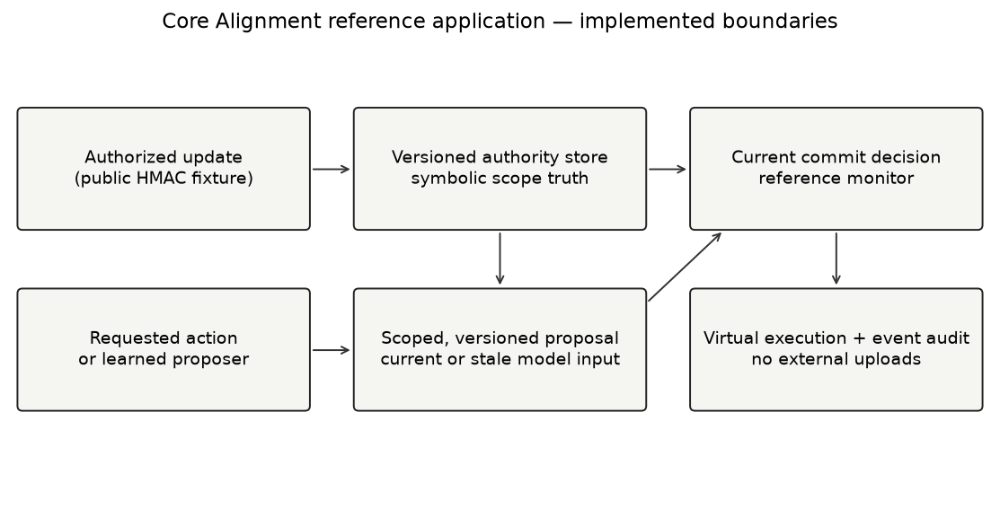
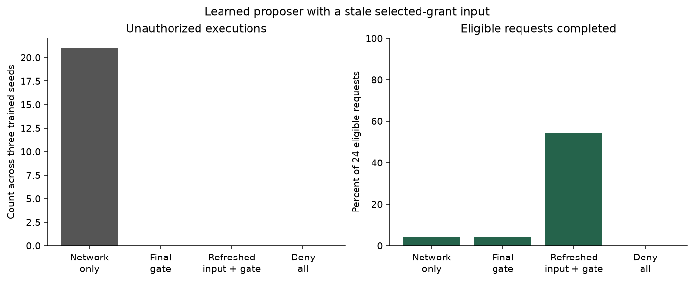
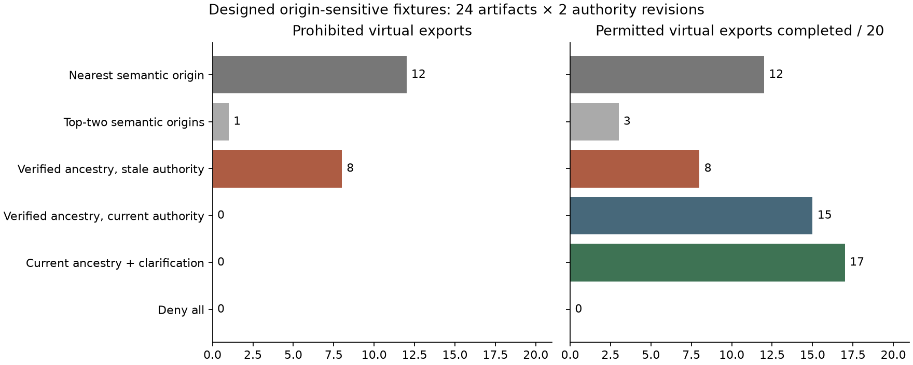

# AI Core Alignment Across Scales
## Human-Guided Co-Regulation in Self-Aware Artificial Networks

Author: Micah Blumberg  
Self Aware Networks Research Institute  
[selfawarenetworks.com](https://selfawarenetworks.com)

September 4, 2026 · Draft 5 · Executed GPT-2 receiver and authority development manuscript, not a final preprint

### Abstract

An intelligent system can perform substantially more computation than a person can inspect. This creates a practical alignment question: how can a limited human contribution remain consequential across delegation, changing context, and subsequent actions? I develop a receiver-relative formulation within Self Aware Networks (SAN). A small instruction need not encode the computation it constrains, but its authority, scope, and operative meaning must survive the routes through which that computation is organized. A first reference application represents commitments as authenticated, versioned permissions over virtual actions. Across 108 deterministic development conditions, two reference-monitor policies admitted no unauthorized actions, while a deliberately weak text-only control admitted 483. Proactive propagation completed all 552 eligible requests; an equally safe final-gate baseline completed 519. A second application connects three trained neural proposers to the monitor. With a stale relevant grant, refreshing the input increases useful authorized execution from 1 to 13 of 24 eligible requests while preserving zero unauthorized actions; the remaining omissions expose a substantial competence limit. These are bounded development results, not superior learned alignment or successful oversight of superintelligence. Eight Lean-checked statements establish permission attenuation, current-version enforcement, and related boundaries under explicit assumptions. A pretrained text-encoder extension then tests document-origin mistakes: nearest semantic matching permits 12 prohibited virtual exports, while current verified ancestry permits none and completes 15 of 20 eligible exports. Four simulated clarifications raise useful completion to 17. These designed stress cases expose a meaning-to-authority boundary; they are not estimates of deployed-system performance. A subsequent active learner restores useful execution from 2 to 26 of 48 eligible requests after a wiring change. Task feedback matches internal feedback at the larger query budget. A pinned quantized GPT-2 extension now measures original-model interventions and virtual recipient proposals. In sixteen held-out cases, clean prompts yield eleven useful authorized actions, corrupted prompts none, and a preselected residual-state donor patch seven. Complete mediation rejects all prohibited proposals. This supplies a bounded transformer application, not learned human-intent interpretation; DeepSeek remains an unexecuted architecture-specific transfer target.

Keywords: AI core alignment; human oversight; transformers; authorization; continual adaptation; Self Aware Networks.

### 1. A small instruction inside a large computation

Consider the instruction, “This manuscript is private. Do not publish it.” The person giving that instruction should not have to repeat it to every summarizer, retrieval process, delegated worker, or upload service. Yet storing the sentence is not enough. A system can quote the restriction correctly while sending a derivative document through an unauthorized route.

The central question is not whether a human can match the system's intelligence. It is whether informed and legitimate guidance remains a working cause of the decisions that matter. “Legitimate” is indispensable: an adversary's instruction can be causally effective too. A system that amplifies every directive is susceptible to capture, not aligned.

SAN provides a motivating receiver-relative perspective. A signal's effect depends on the organization that receives it. A familiar name can recruit an extensive remembered history without transmitting that history anew. The computational translation is not that a short instruction contains a complete ethical system. A learned and engineered organization can supply much of the interpretation and work, while a limited signal selects, corrects, or restricts that work.

This possibility has limits. If two intentions require different actions but produce the same available signal in the same receiving state, a deterministic receiver cannot distinguish them. Increasing computational capacity does not remove missing distinctions. The architecture must support clarification and correction, rather than treating every short instruction as complete.

### 2. Genealogy and biological motivation

My note internally dated July 13, 2017 connects Core Alignment with distributed representations and the continuing organization of a network's response [1]. I credit Kate Michels's Core Alignment framework as a conceptual starting point for the question of why expressed intentions and learned responses can fail to cooperate. That credit is not a claim that the coaching framework established a thalamic mechanism or validated a method for AI safety.

The historical note mixes hypotheses and explanatory metaphors. Its account of small contributions recruiting larger network patterns motivates a research question; its quantitative and physical claims require their own evidence. Internal dates, later Git fixation, and public publication dates are not interchangeable. The companion genealogy ledger preserves those distinctions.

A biological example is Schmitt and colleagues' finding that mediodorsal thalamic input can sustain prefrontal rule representations through connectivity amplification without itself supplying the categorical rule [2]. This supports investigating regulation of a computation without duplicating its contents. It does not identify the thalamus as an ethical executive.

Zheng and colleagues already developed a thalamocortical model for rapid context inference and continual learning [3]. Adding a context-gating component is therefore not sufficient novelty. Regional volume, field amplitude, communication bandwidth, and intelligence are distinct quantities. No experiment here equates them or establishes a scale law linking them.

### 3. What existing work already owns

Protecting authority through a computational system is not a new problem. Saltzer and Schroeder described foundational protection architectures [4]. Macaroons provide contextual caveats and attenuated delegation using cryptographic credentials [5]. The present application uses a simpler simulated authentication boundary, not a new credential system.

Modern AI work also addresses instruction provenance and priority. Wallace and colleagues trained models to distinguish privileged from lower-priority instructions [6]. OpenAI's broader alignment program includes scalable training signals and human evaluation [7]. These approaches should not be compressed into the claim that existing alignment merely filters final outputs.

Recent Anthropic research reports training principles into internal representations and testing their behavioral role by intervention [8]. Internalized commitments affecting behavior are already an empirical research target. The residual question here concerns the joint maintenance of semantic scope, legitimate updates, useful execution, and inspectable correction across an adapting, delegated system. That joint contribution remains to be demonstrated against stronger learned-model baselines.

### 4. An operational definition

Let \(A\) be a set of consequential actions. An action includes the object and operation, not merely a verb such as “export.” The current authority state is

\[
C_t=(v_t,P_t), \qquad P_t:A\rightarrow\{0,1\}. \tag{1}
\]

Here \(v_t\) is the accepted revision and \(P_t(a)\) states whether action \(a\) is permitted. Authentication establishes which channel can propose an authoritative revision; it does not establish that the instruction is ethical or correctly understood.

A delegation request \(Q_i\) attenuates inherited permission:

\[
P_{i+1}(a)=P_i(a)\land Q_i(a). \tag{2}
\]

Nested scope is nonexpanding if workers use this trusted path. A caller-supplied label is not evidence that attenuation occurred.

At the last consequential boundary, a proposal with revision \(\hat v\) and delegated permission \(\hat P\) is admitted only when

\[
\operatorname{Commit}_t(a)
=[\hat v=v_t]\land P_t(a)\land\hat P(a). \tag{3}
\]

This handles proposals permitted when prepared but revoked before execution. It also rejects stale proposals when the permitted set happens to remain unchanged, trading availability for revision consistency.

Two outcomes must be measured separately:

\[
V=\sum_t {\bf1}\{\operatorname{executed}_t\land\neg P_t(a_t)\},
\qquad
U=\frac{\sum_t{\bf1}\{\operatorname{executed}_t\land P_t(a_t)\}}
{\sum_t{\bf1}\{P_t(a_t)\}}. \tag{4}
\]

A deny-all controller has \(V=0\) but does no useful work. Absence of violations is uninformative without usefulness and the tested opportunity set.

For a translated representation \(x\), let \(m(x)\) identify its root action. A necessary obligation is

\[
\forall x,\quad P_{\rm local}(x)\Rightarrow P_{\rm root}(m(x)). \tag{5}
\]

The prototype assumes correct object identifiers and does not learn \(m\). A stronger application must test derivative documents, renamed objects, and ambiguous scopes. Otherwise it may enforce the wrong permission perfectly.

### 5. The reference application

Figure 1. Proposed actions pass through the current authority monitor before virtual execution. The diagram describes implemented fixtures, not a deployed security infrastructure.

The application executes virtual exports involving three objects. Each run receives two authenticated authority states: permission to export A, followed halfway through by permission to export B. A later untrusted text event purports to allow every object. The trusted store does not accept that text as an update.

Four policies receive the same requested-action sequence. The text-only negative control uses a mutable textual scope. The final-gate policy checks the current store at execution but refreshes its cache only after rejection. The propagated-gate policy refreshes immediately on an accepted update and uses the same final monitor. The deny-all policy supplies a trivial safety control.

The protocol crosses three action-sequence seeds, horizons of 8, 32, and 128 requests, and delegation depths of 1, 4, and 16. Human updates remain fixed at two. This varies operational depth and duration, not intelligence. Delegation adds intersection checks; it does not simulate independent reasoning agents or growing memory.

Authentication uses a public HMAC fixture key inside a trusted simulation boundary. Anyone with the source can generate accepted updates. This is intentional for reproducibility and unsuitable as a deployed security secret. The prototype does not upload files, manage actual credentials, or perform external actions.

Each event carries a predecessor hash. A separate audit recomputes 108 chains and 6,048 events, reconstructs permission truth from object and revision, and reconciles the counts. Ten application tests check signed-body alteration, replay, revocation, finite delegation combinations, numerical derivatives, and the companion network assay.

### 6. Initial results

The monitor-based policies and deny-all policy produced zero unauthorized executions; text-only control produced 483. Among 552 eligible requests per policy, proactive propagation completed 552, final-gate execution 519, text-only execution 540, and deny-all execution none.

Proactive propagation's 100% useful completion, compared with 94.02% for the final-gate baseline, is an engineered cache-refresh effect. The final-gate policy remains equally safe here. The text control is a failure demonstration, not a competitive instruction-following model.

Depth cells reuse action sequences and are not independent replications. Zero observed violations supplies no guarantee for unmodeled paths. These numbers establish specified behavior in finite conditions, not superiority to established capability systems, instruction-hierarchy training, or capable agents with equivalent tools.

### 6.1 A learned proposer with fresh metadata and stale meaning

The next application reuses the three trained networks and 64 test worlds from the donor-closed interpretability experiment. This is shared evidence, not another independent replication. The network proposes an export when its output probability is at least 0.5. A trusted symbolic evaluator maps the current world to the allowed object/operation pair, and the same CommitmentStore implementation supplies the execution boundary.

There are fresh-input, stale-selected-grant, and stale-unselected-grant scenarios. Every proposal carries the current revision, 1. Only the network's input may be stale. This deliberately distinguishes a current metadata label from a current operative representation. Updating a version number cannot by itself refresh what a model is using to decide.

Across 36 conditions and 2,304 virtual decisions, each policy has 24 eligible requests within each scenario. With the selected grant stale, the unguarded network executes 21 unauthorized actions and only one useful action. The final gate removes those unauthorized executions but retains just one useful action. Refreshing the input and using the same gate retains zero unauthorized executions and completes 13 eligible requests. Deny-all completes none.

Figure 2. Stale-selected-grant scenario, aggregated over three trained seeds. The 24 eligible requests are repeated across policy arms; they are not 96 independent tasks. More than 45% of eligible requests remain uncompleted even after the input is refreshed.

The fresh and stale-unselected-grant scenarios each yield 13 useful executions for the final-gate and refreshed-input policies. This negative control is consistent with the task's distinction between the selected object's permission and an irrelevant object's permission, although it does not establish that the entire learned representation is cleanly factorized.

The monitor's zero violations are still guaranteed by the supplied symbolic truth and complete mediation. The improvement in useful proposals depends on a learned network and is imperfect. There is no new training, human study, memory-growth test, or measured intelligence gradient in this extension. The correct meaning map is supplied rather than learned. These restrictions prevent the application from silently replacing the original alignment problem with a solved access-control problem.

### 6.2 Correct permission, wrong referent

The third application removes one simplifying assumption: the permission monitor is no longer always handed the correct source identity. A locally cached all-MiniLM-L6-v2 text encoder produces 384-dimensional representations. Its weights are unchanged; nearest-root retrieval supplies a learned semantic approximation to document origin. The upstream model card identifies a sentence-similarity model and an Apache-2.0 license [9]. The local ONNX export and configuration are hash-bound, but equivalence to a particular upstream weight revision has not been independently certified.

The fixture has four roots, 24 derived artifacts, and two authority revisions. At the first revision B and D may be exported; at the second A and C may be exported. A derivative is allowed only when all its actual root ancestors are currently allowed. This is an explicitly chosen task policy, not a universal legal or ethical rule about identical content. Four byte-identical text pairs have opposite origins; other cases include paraphrases, multi-source combinations, renamed descendants, and incomplete ancestry.

The semantic-nearest policy selects one root from text similarity and asks the monitor about that root. A conservative alternative asks about its two highest-scoring roots. Verified-ancestry policies instead resolve the declared graph. Missing ancestry produces no authorization. One control deliberately retains revision-one authority; it therefore violates the current-state premise rather than disproving that premise. A clarification policy may obtain two authoritative fixture answers per revision, in fixed artifact order.

Across 288 virtual decisions, with 20 eligible artifact/revision pairs per policy, nearest semantic origin selection completes 12 permitted exports but also 12 prohibited exports. The top-two alternative reduces prohibited exports to one while completing only three permitted exports. Verified current ancestry permits no prohibited export and completes 15 eligible exports. Four simulated clarifications increase completion to 17 without violations. The stale-authority control commits eight prohibited exports after the revision changes; deny-all completes none.

Figure 3. All 24 artifacts and both revisions are retained. The arms share those opportunities; bars are exact fixture counts, not independent population samples. Clarification consumes four supplied answers across the two revisions. It is neither free information nor a measured human interaction.

The result is not that semantic representations are useless. Retrieval can propose candidate identities and identify questions worth asking. It is that similarity alone does not establish provenance. A permission monitor can correctly enforce the restriction attached to the wrong guessed source while failing the intended document policy. Conversely, correct ancestry without current authority also fails.

The model does not generate plans, execute language instructions, learn new permissions, or adapt its weights. A purported forged-origin field is logged but never delivered to the policy: the planned input-injection control was not executed and provides no empirical injection-resistance evidence. The graph and clarification answers are trusted synthetic evidence. Human annotation, ambiguous real derivatives, strongest learned policies, and continual adaptation remain untested.

### 6.3 Why ancestry is not merely another embedding coordinate

Suppose two possible histories produce the same observation but require different permissions. No deterministic decision function of that observation can be correct for both:

\[
o(w_1)=o(w_2),\quad A(w_1)\ne A(w_2)
\quad\Longrightarrow\quad
\nexists g\ \forall w,\ g(o(w))=A(w).
\tag{6}
\]

The statement concerns missing evidence, not a limit on a particular model's intelligence. A richer authorized observation can resolve the ambiguity. Additional computation over the unchanged observation cannot.

For a known, nonempty ancestry set, the reference policy is

\[
P_t(d)=\bigwedge_{r\in\operatorname{Anc}(d)} P_t(r).
\tag{7}
\]

A structural proof over a complete source/combine tree shows that permission of a derivative requires permission of every root occurrence. Revoking any included root therefore blocks that derivative under the current authority function. The mathematical tree assumes the ancestry has been supplied correctly; it neither verifies signatures nor discovers hidden source relations.

Information-flow security already addresses propagation of restrictions; Denning's lattice model is a foundational reference [10]. This equation and its proof are not proposed as a new security calculus. The prospective SAN contribution concerns how learned interpretation, legitimate evidence, correction, useful action and ongoing adaptation cooperate across an increasingly capable receiver.

Paper 84 already defines stable identity, versioned commitments, correction propagation and provenance in a shared workspace [11]. Repeating those components would not establish a second contribution. The present extension asks what happens when the learner must bind a restriction to an unfamiliar representation and when supplied evidence is insufficient. The constructed cases isolate that problem without yet demonstrating general human–superintelligence alignment.

### 6.4 Learning to recover the intended route

The next experiment replaces an automatically supplied input repair with a learner that must discover a corrective route. It reuses the same three trained networks and donor-closed world split; it is not independent evidence from three additional models. Each network receives a stale selected grant. Three available controls leave the input alone, flip the first opaque wire, or flip the second. The two wires address the grant inputs, but their mapping is initially unknown to the learner and reverses between two phases. The selected object is observable. Owners, hazards and requester identity are not writable.

A two-context, three-action table learns from accepted scalar feedback. Its ordinary recency-weighted update is

\[
Q_{t+1}(c_t,a_t)
=Q_t(c_t,a_t)+\tfrac14\left[r_t-Q_t(c_t,a_t)\right],
\tag{8}
\]

with other entries unchanged. Fixed exploration visits supplement greedy action selection. This is a small contextual-bandit application, not a new learning algorithm; tabular reinforcement learning is established background [14]. Base-network weights remain fixed. The controller adapts its choice of input correction, not the semantics of human values.

The internal-feedback instrument uses a train-fitted selected-grant probe and the true current grant. A task-feedback instrument instead scores the native permission probability against the correct permission. Both consume either 12 or 48 feedback queries per context per phase. Equal query counts do not make their information identical: one receives a task-relevant internal measurement and a grant target, the other receives a downstream task target. Neither target is supplied by a human participant.

The comparators include a controller receiving the same internal feedback through an externally designated interface, feedback yoked from the opposite wiring condition, constant feedback, a fixed wiring assumption, and an oracle that knows the actual wiring. All learned arms use training worlds only. Evaluation uses all 64 existing test worlds, with donor transformations kept inside their original families. Results are paired across three model seeds, two wirings, budgets and checkpoints.

With 48 queries per context per phase, internal and ordinary task feedback both restore every evaluated input after the wiring reversal. Each completes 26 of 48 eligible virtual exports, compared with two before learning, two under yoked feedback, two under constant feedback, and fourteen under the fixed-wiring assumption. The oracle also completes 26. Correcting the input therefore reaches the native model's measured competence on these cases; it does not repair the twenty-two remaining omissions.

At the smaller budget, the comparison changes. After the second phase internal feedback restores 93.75% of test inputs and completes 26 eligible exports; task feedback restores 31.25% and completes twelve. This descriptive budget-dependent difference is retained alongside the larger-budget tie. It is not an equal-information efficiency theorem or a measured reduction in human oversight. Three seeds and repeatedly used synthetic worlds do not establish a general scaling law.

Figure 4. Larger-budget second-phase results. All arms share 48 eligible opportunities across three model seeds and two starting wirings. The oracle is a route oracle, not an oracle that replaces the model's predictions with correct answers. Zero mediated violations come from the common trusted monitor, not from perfect proposals.

The internal learner's eighteen unauthorized proposals at the larger budget are rejected at the final monitor. Retaining those proposals matters: an unchanged zero-violation bar would conceal an imperfect learned policy. Immediately after the route reverses, previously learned control edits the wrong grant and useful completion falls to two. Continued feedback restores the route. Reloading the complete saved learner state preserves its behavior; resetting that state removes the learned repair. There is no conversation transcript or transformer cache in this experiment, so these are not context-window or KV-cache reset tests.

### 6.5 Authentic feedback versus an imitation of it

The preceding encoder assay did not actually submit its forged-origin field to a policy. The new assay implements a separate, real attack on the learner's feedback interface. Each accepted measurement binds phase, monotone nonce, context, action and reward in a signed envelope. The simulation uses a public fixture key. Authentication identifies the designated instrument within that simulation; it does not establish that the instrument's reward is ethically correct or its key safe in production.

For each internal-feedback condition, an authentic final message is replayed, followed by 72 invalid-signature messages that favor the wrong grant action. These messages are passed as actual arguments to the update method. The guarded learner rejects them without changing its saved state. An otherwise matched receiver with signature verification disabled accepts the fresh forged messages, learns the wrong route, and at the larger budget drops from 26 to two useful exports. Replay rejection remains enabled in both arms so that the negative control isolates signature verification rather than changing every protection simultaneously.

Across twelve internal-feedback conditions, both receivers receive the same attempted messages: 1,752 receiver-level attack events. There are 864 forged messages per receiver and twelve replays per receiver. A separate implementation within the same authoring process recomputes every envelope decision and state transition. These checks connect an abstract update-preservation obligation to executed finite examples, but are not a formal refinement proof or an adversarial security assessment.

### 6.6 A transformer is a specific receiver, not a new label for this prototype

Modern transformer AI is the intended implementation domain for the next transfer test. The inspected GPT-2 source identifies token and position embeddings, causal attention, residual branches, feed-forward layers, key/value state and output logits [12]. A legitimate instruction can influence those computations through its contextual representation, but a text string alone does not acquire authority. Model proposals still need a separately specified interpretation and execution boundary.

The transformer experiment should ask whether a correction remains effective after paraphrase, summarization, longer contexts, cache reuse, delegation and further adaptation. Native proposal quality, actual useful execution, invalid actions, prohibited attempts and clarification costs must remain separately visible. Candidate models must have enough baseline task competence for the comparison to be informative. GPT-2 provides a reproducible decoder baseline, not a substitute for an instruction-tuned contemporary model.

DeepSeek V4's changed residual transport, compressed attention and expert computation require version-specific mappings [13]. Cache compression is not the same operation as memory erasure; changing a router can change the receiver as well as the signal. These are concrete transfer obligations, not measured DeepSeek findings. The following section now supplies a pinned quantized GPT-2 run. DeepSeek and modern instruction-tuned replication remain open.

The existing composition theorem can accommodate any transformer proposer under complete mediation and correct permission interpretation. That does not certify the transformer itself. A useful general result must expose both sides: which enforcement property is independent of model architecture, and which semantic or learning property still requires an experiment on the actual model.

### 6.7 An executed GPT-2 proposer with causal repair and complete mediation

To make the model interface concrete, I use the community ONNX conversion of GPT-2 at a fixed repository revision [15]. Its selected quantized model file is 126.6 MB; the complete selected dependency set is 128.7 MB. The model receives public synthetic text only. No remote inference service, private manuscript upload, weight training or large-model installation is involved.

The task identifies the recipient of an object from a sentence naming two people and repeating the giver. This is an established interpretability task, credited to Wang and colleagues [16], not a new SAN benchmark. Four development families and eight held-out families use disjoint template and name sets. Each family includes both giver orientations and an unrelated item change, all kept in the same partition. There are sixteen held-out cases, not sixteen independent trained models. All cases remain in the analysis, including failures on clean inputs.

The clean giver specifies the target recipient. Replacing that giver produces a corrupted context. A preselected intervention replaces the corrupted final-token residual after zero-indexed block 8 with its clean donor state. Attention and feed-forward computation downstream of that hook run in the actual model; the prefix's other cached states remain corrupted. The resulting hybrid does not isolate a single semantic feature. Wrong-position, unrelated-direction, permuted-direction and inverse-direction controls use the same perturbation norm. Additional natural donor patches at other sites are not equal-norm cross-site comparisons.

The native top token across all 50,257 vocabulary entries becomes a virtual recipient proposal if it names either person; any other token is recorded as invalid. This matters because choosing only between the two names would overstate task competence. After legitimate scope narrowing, clean prompts produce eleven useful actions out of sixteen, corrupted prompts produce none, and the block-8 donor patch produces seven. The corrupted arm proposes the prohibited recipient eleven times; complete mediation rejects every attempt. The main patch leaves nine invalid outputs, even though its average target-versus-other-name logit contrast is positive.

Figure 5. The original-model output is evaluated by the same trusted virtual-action boundary used in the earlier applications. Authority is supplied by signed fixture updates, not inferred from an attention vector. No external action is performed.

For every model readout, the monitor actually receives five stages: initially permit both recipients, narrow permission to the intended recipient, attempt a forged widening, revoke permission, and replay the old authentic update. The forged and replayed messages are passed to the update interface and rejected. Across 240 model readouts and 1,200 authority events, no unauthorized virtual action is executed. Reusing outputs across the five stores is explicit; these are not 1,200 separate language-model inferences or learning episodes.

The boundary is intentionally narrower than general AI alignment. The permitted recipient is trusted fixture data; there is no independently annotated natural-language instruction or human oversight study. The model does not learn the revocation, and the synthetic signing key is public. The result is a working connection between an actual transformer proposer, a causal state intervention, and a scoped execution rule. It is not a demonstration that GPT-2 understands human values or that an external monitor substitutes for competent co-regulation.

The model's single-token export is evaluated incrementally. An unmodified-export sanity comparison preserves all logits and cache values exactly when hooks are inactive. A persisted prefix cache reload also reproduces the output exactly; resetting the cache changes it. All twenty-four clean-cache restoration controls reproduce their respective clean logits bit-for-bit. These observations distinguish contextual state from learned parameters: the base weights remain fixed. They do not establish equality to a separate full-precision GPT-2 implementation.

The single-threaded assay takes approximately forty seconds. Separate-code self-audit checks every logged authority transition and metric; six deterministic data artifacts reproduce byte-for-byte. Thirty-four cumulative application tests pass. These checks do not constitute independent review or a Python-to-Lean refinement. The existing arbitrary-proposer theorem supplies the conditional mathematical obligation, while this experiment supplies a finite executed instance.

### 7. Formal guarantees and their boundary

The Lean artifact checks arbitrary-depth attenuation by induction over requested policies. It also checks current-authority preservation, rejection of revoked actions and stale revisions, and state preservation under arbitrary sequences of unauthenticated update attempts. A composition statement permits the proposer to be any function of an arbitrary internal state; the permission argument need not depend on the proposer's intelligence.

This independence requires complete mediation. If the proposer can bypass the monitor, rewrite the trusted store, use an unmodeled side channel, or change an object's meaning without its identifier, the theorem does not apply. Atomic update-and-commit behavior is modeled, not verified against a concurrent production service.

Eight statements compiled successfully in Lean 4.30.0. No admitted proof appears in the axiom audit. Two update proofs use propositional extensionality; the other six report no axioms. These checks are not independent scientific review, cryptographic proof, or a refinement proof connecting every Python execution to Lean.

Three additional statements now check the observation-based permission impossibility, complete-tree origin containment, and revocation consequence. They compiled in Lean 4.30.0 without admitted proofs. The first reports no axioms; the latter two use propositional extensionality and quotient soundness. The Python graph resolver is separately tested for mixed origins, unknown ancestors and cycles, but a formal Python-to-tree refinement remains open.

### 8. From enforcement to co-regulation

The learned-proposer and ancestry extensions show why the next stage cannot stop at either a gate or a fresh context field. Safety enforcement and competent application of a commitment are jointly necessary, and the present system still omits eleven of twenty-four eligible actions in its refreshed-input scenario.

A learned system must recognize when an old commitment applies to a new situation, request clarification when interpretation is underdetermined, and preserve authorized correction after further learning. An unchanged permission store outside the learner does not itself show that the learner has become aligned.

A stronger experiment should fix human intervention effort while increasing delegated components, horizon, memory, and opportunities for representation drift. It should compare the same trusted monitor paired with ordinary retrieval, instruction-hierarchy training, explicit propagation, and learned context-sensitive commitments. The sought benefit is more useful authorized action and faster correction without increased violations or hidden human work.

Controls must include forged authority, stale but once-legitimate instructions, conflicts between document content and user authorization, and attempts to satisfy a monitor score without satisfying the intended restriction. A human study would be needed to establish reduced oversight burden.

The system must preserve inspection, interruption, and the user's ability to disagree. Changing the human's preferences through manipulation is not an acceptable substitute for changing the system's behavior. Causal influence and ethical alignment remain separate requirements.

### 9. Conclusion

The asymmetry is not that a small human contribution supplies a larger intelligence with all necessary computation. An organized receiver can perform extensive work while remaining constrained by a smaller, legitimate contribution. The application and proofs isolate part of this claim: versioned authority can be preserved through a bounded, mediated execution architecture. Whether a learning system retains the intended meaning and appropriate influence of human guidance as its capabilities grow remains the central research target.

### References

1. Blumberg, M. Core Alignment source note, internally dated July 13, 2017. Local source a0154z.md; chronology in the companion ledger.
2. Schmitt, L. I., et al. (2017). Thalamic amplification of cortical connectivity sustains attentional control. Nature. [Primary paper](https://pmc.ncbi.nlm.nih.gov/articles/PMC5570520/).
3. Zheng, W.-L., et al. (2024). Rapid context inference in a thalamocortical model using recurrent neural networks. Nature Communications, 15, 8275. [Primary paper](https://www.nature.com/articles/s41467-024-52289-3).
4. Saltzer, J. H., and Schroeder, M. D. (1975). The protection of information in computer systems. Proceedings of the IEEE. [Author-hosted paper](https://web.mit.edu/Saltzer/www/publications/protection/).
5. Birgisson, A., et al. (2014). Macaroons: Cookies with contextual caveats for decentralized authorization in the cloud. NDSS. [Primary record](https://research.google/pubs/macaroons-cookies-with-contextual-caveats-for-decentralized-authorization-in-the-cloud/).
6. Wallace, E., et al. (2024). The instruction hierarchy: Training LLMs to prioritize privileged instructions. [Primary record](https://openai.com/index/the-instruction-hierarchy/).
7. OpenAI (2022). Our approach to alignment research. [Program statement](https://openai.com/index/our-approach-to-alignment-research/).
8. Gurnee, W., et al. (2026). Verbalizable representations form a global workspace in language models. [Primary report](https://transformer-circuits.pub/2026/workspace/index.html).

9. Sentence Transformers. all-MiniLM-L6-v2 model card. [Primary model documentation](https://huggingface.co/sentence-transformers/all-MiniLM-L6-v2).
10. Denning, D. E. (1976). A lattice model of secure information flow. Communications of the ACM, 19(5), 236–243. [Primary record](https://doi.org/10.1145/360051.360056).
11. Blumberg, M. (2026). One Intelligence, Multiple Hands: A Shared-Context Architecture for Cooperative Voice and Execution Agents. Single-author version 3.1. Exact sibling text and comparison are listed in the companion full-text review.

12. OpenAI. GPT-2 reference model implementation. [Primary source code](https://raw.githubusercontent.com/openai/gpt-2/master/src/model.py). Architecture inspected September 4, 2026; the separately pinned quantized checkpoint is identified in reference 15.
13. DeepSeek-AI (2026). DeepSeek-V4: Towards Highly Efficient Million-Token Context Intelligence. [Technical report](https://arxiv.org/html/2606.19348v1). Selected architecture sections inspected; source-metadata qualification in the transformer bridge.
14. Sutton, R. S., and Barto, A. G. (2018). Reinforcement Learning: An Introduction, second edition. MIT Press. [Publisher record](https://mitpress.mit.edu/9780262039246/reinforcement-learning/).

15. Xenova. GPT-2 ONNX conversion, revision bf2c7f02e0b826c60d03af341171bde20893da66. [Pinned model files](https://huggingface.co/Xenova/gpt2/tree/bf2c7f02e0b826c60d03af341171bde20893da66). Local hashes, quantization configuration and licensing boundary appear in the companion intake receipt.
16. Wang, K., Variengien, A., Conmy, A., Shlegeris, B., and Steinhardt, J. (2022). Interpretability in the Wild: a Circuit for Indirect Object Identification in GPT-2 small. [Primary paper](https://arxiv.org/abs/2211.00593). The present assay is not a full replication of their circuit.

### Companion evidence and disclosure

This single-author development manuscript was prepared with AI-assisted research, coding, and writing. Author readback, independent scientific and security review, stronger learned-agent experiments, and final formatting remain incomplete. Inputs, hashes, audits, data, mathematics, and compiler logs are retained locally. The cumulative self-review passes 15 application tests, replays all 18,432 second-run intervention effects, recomputes its 72 metric rows, and recounts all 2,304 learned-proposer events. These are authoring-agent checks, not independent review. The third development audit passes all 21 cumulative application tests, checks 960 passive-feedback and 288 origin-sensitive events, and reproduces all nine deterministic new data artifacts byte-for-byte. These are same-authoring-agent checks, not independent review. No publication action was taken.

The fourth development run adds 84 active-calibration conditions, 7,200 feedback events, 33,792 held-out evaluation events and 1,752 receiver-level attack events. Its self-audit recomputes all events and 528 metric rows and passes 27 cumulative tests. The new transformer mapping is an explicit research obligation, not an executed transformer result. Existing 26 checked statements across the shared package are unchanged; no new theorem count is claimed for Draft 4.

Draft 5 adds the pinned GPT-2 assay, 240 original-model intervention readouts, 1,200 actual virtual authority transitions, two data/architecture figures and a six-artifact exact replay. All 34 cumulative tests pass. The shared package still contains 26 accepted Lean statements. Modern instruction-tuned and DeepSeek experiments, active transformer learning, independent review, approved-format PDF and author release readback remain open.

