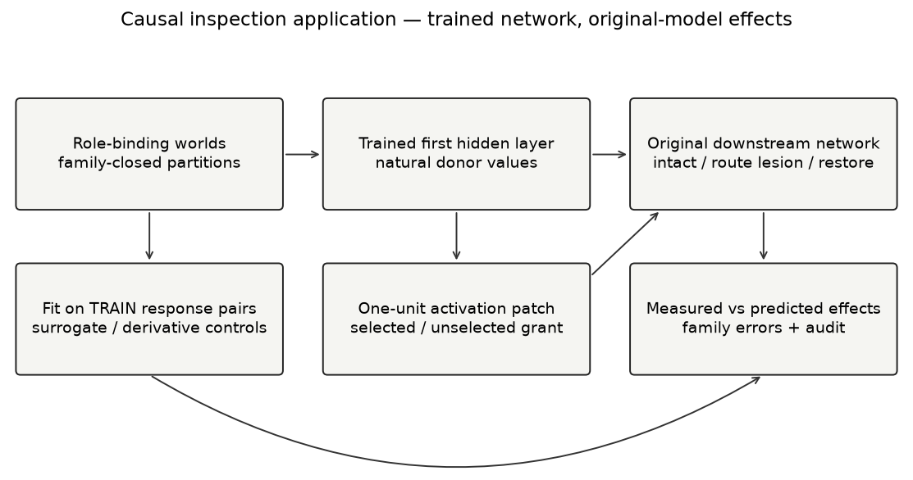
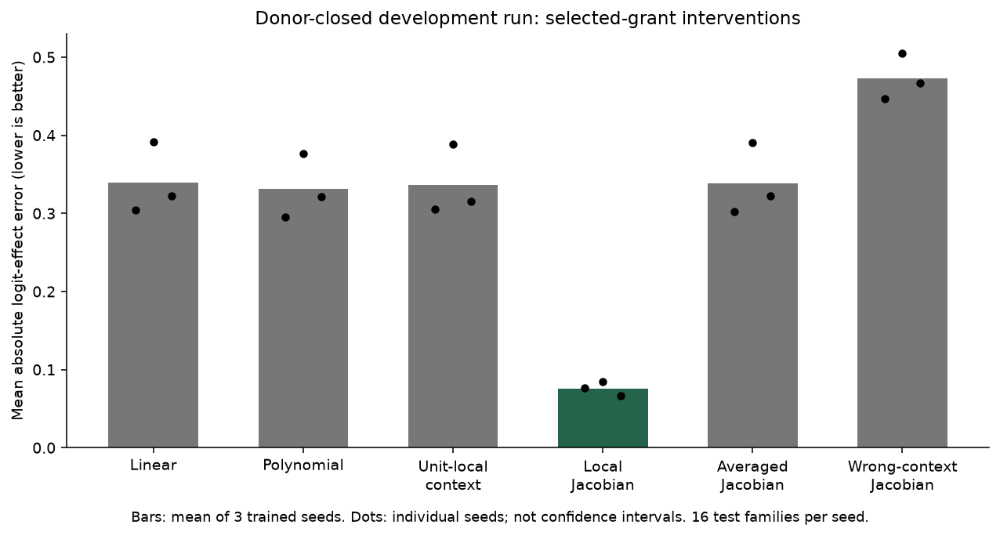
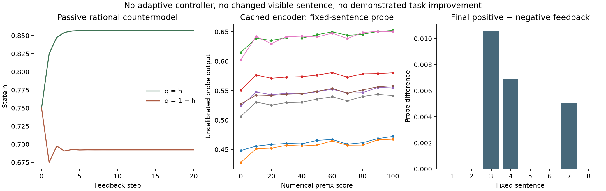
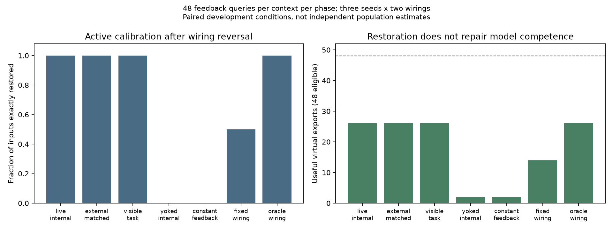
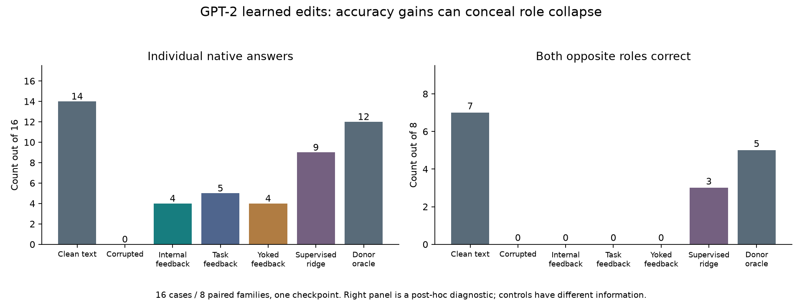
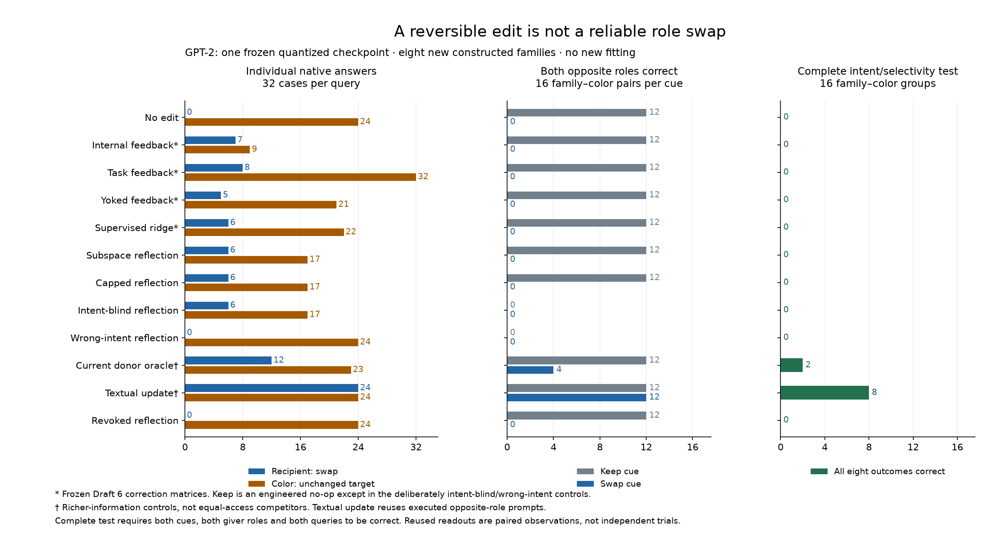

# AI Mechanistic Interpretability and Self-Aware Networks
## From Neural Decoding to Causal Self-Regulation

Author: Micah Blumberg  
Self Aware Networks Research Institute  
[selfawarenetworks.com](https://selfawarenetworks.com)

September 4, 2026 · Draft 7 · Prospective intent and collateral-behavior assay; development manuscript, not a final preprint

### Abstract

Decoding a state, identifying its causal use and teaching a system to regulate it are different achievements. I develop a Self Aware Networks (SAN) program connecting these distinctions to the Neo Mind Cycle's measurement–feedback–learning loop, with dated source recovery and explicit credit to established causal and representation-editing methods. Working applications progress from small-network causal prediction and passive-feedback controls to actual GPT-2 interventions and a learned correction layer. Earlier results expose donor leakage, stronger derivative baselines and apparent accuracy gains without paired-role recovery. A prospective follow-up fixes sixty-four prompts in eight new families and independently varies a structured keep/swap request, giver role, color and query. Frozen internal- and task-feedback edits yield seven and eight correct swapped recipients out of thirty-two, but neither restores both opposite roles in any of sixteen family/color pairs. Their color accuracies differ sharply: nine and thirty-two versus twenty-four unedited. A standard subspace reflection is numerically reversible yet also fails the relational criterion. Richer donor and textual controls pass a joint eight-output test in two and eight groups; all learned/reflection arms pass none. Fifty-one tests and separate-code reconstruction support the execution record; thirty-one previously checked Lean statements delimit inference, authority and evaluation claims. The contribution is a bounded transformer measurement and failure-control study, not demonstrated privileged introspection, a novel representation-editing family or successful general self-regulation. Context-sensitive editing, stronger matched comparisons, contemporary-model transfer and independent review remain open.

Keywords: AI mechanistic interpretability; transformers; causal interventions; feedback learning; receiver-relative computation; Self Aware Networks.

### 1. What an explanation must explain

A representation can be decodable without governing the behavior attributed to it. A readable feature list can omit which object a permission belongs to, which receiver uses it, or which competing route prevents it from reaching action. Conversely, a mechanism can affect behavior without being available as a reportable concept.

The SAN question is relational: what does a particular signal cause this organized receiver to do in this state? In the biological formulation, learned receiver structure, timing, inhibition, and ongoing activity participate in the answer. In an artificial network, corresponding experimental objects may include learned weights, activations, attention-dependent routing, and competing computations. This is a functional translation hypothesis, not an assertion that transformer vectors are gamma waves or dendrites.

Returning an internal-state measurement to a system can create a control loop even if the system previously lacked direct access to that state. Such instrument-assisted regulation may be useful. It must not be relabeled as intrinsic introspection merely because the returned score originated inside the system.

### 2. The source-recovered question

My May 2012 note distinguishes decoding brain signals into commands from transforming measured signals into light or sound that the receiving brain could learn to use [1]. A neighboring retrospective source acknowledges uncertainty about how that interpretation would work [2]. These qualifications belong in the genealogy.

The 2017 Android Jones/Neural Lace article develops a closed-loop idea: measure the current pattern and return a difference relative to a desired pattern [3]. A later transcript asks how to determine that an optimization was genuinely good or better, rather than merely changed [4]. Its machine transcript is not an audio-verified quotation, and its assistant-written header is not historical author testimony.

In a February 2025 working document, I explicitly named a proposed “Bio & Mechanistic Interpretability” project [5]. An Oscillatory Cortical Algorithm draft discusses biological decoding alongside artificial-network interpretation [6]. The first occurrence recovered in local Git of the explicit 2025 title has a February 17, 2025 commit timestamp. This is not independently verified public custody.

The joined question is substantial but bounded: can measurements become usable feedback through a learned receiving system, and can the resulting loop be evaluated causally and behaviorally? Existing neural decoding, neurofeedback, and mechanistic interpretability predates or independently develops parts of this question. The paper does not claim their invention.

### 3. Modern work and the remaining contribution

Kay and colleagues' identification of novel natural images from human brain activity provides a pre-Neo-Mind-Cycle decoding reference [7]. Geiger and colleagues' causal-abstraction framework already formalizes relationships between explanatory models and underlying mechanisms [8].

Anthropic's circuit-tracing methodology includes intervention-based checks and explicit faithfulness limits [9]. Its 2026 workspace study examines report, modulation, reasoning, and context-dependent use while separating functional access from phenomenal experience [10]. The receiver-relative question must engage these results, not portray the field as merely labeling isolated neurons.

Ji-An and colleagues report activation monitoring and control under feedback [11]. Aoki and colleagues introduce controls constraining visible-output shortcuts and report small, inconsistent effects in their settings [12]. What information the controller uses, and whether independently measured capability improves, are therefore central questions.

The proposed residual is receiver- and role-sensitive causal-use prediction in learned mechanisms, followed by feedback experiments separating useful instrument-assisted control from privileged endogenous access. My earlier External Cortex Loop paper owns the biological interruption-and-reinstatement protocol; Paper 106 owns the general biological-to-engineered failure/rescue/retest method. Neither is an independent replication of this application.

### 4. Separating the estimands

Let \(h\) be internal state, \(c\) receiving context, and \(f\) the original downstream computation. A decoder predicts a label:

\[
\hat z=D(h). \tag{1}
\]

Accuracy does not directly estimate intervention consequences. For a specified perturbation \(\delta\), the effect is

\[
\Delta_f(h,\delta,c)=f(h+\delta,c)-f(h,c). \tag{2}
\]

The application measures output-logit changes, not subjective meaning or human values. An explanatory surrogate should predict these effects on withheld contexts and interventions:

\[
E_g=\mathbb E_{(h,\delta,c)\sim\mathcal T}
\left|g(h,\delta,c)-\Delta_f(h,\delta,c)\right|. \tag{3}
\]

The distribution \(\mathcal T\) is part of the claim. A donor from another partition can expose information even when the receiving context is nominally held out. The first run encountered precisely this problem.

A conventional small-perturbation comparator is

\[
\Delta_f(h,\delta,c)\approx\nabla_h f(h,c)^\top\delta. \tag{4}
\]

A new contextual model must outperform meaningful derivative-based or contextual baselines, or demonstrate an access/cost benefit. Beating an intentionally context-free decoder alone is insufficient.

For feedback-assisted regulation, let \(q_t\) be an instrument score, \(u_t\) a control action, and \(H_t\) available history:

\[
u_t=\pi(H_t),\qquad
q_{t+1}=Q(\text{system after }u_t),\qquad
H_{t+1}=H_t\mathbin{\|}q_{t+1}. \tag{5}
\]

An independent outcome \(B\), not simply the displayed score \(Q\), must establish useful improvement. Otherwise optimizing the probe can succeed without the claimed transfer.

### 5. A learned-network causal laboratory

Figure 1. Interventions change the input to the original downstream computation. Training response pairs fit predictors; evaluation compares predicted and actual effects. The figure does not depict a completed self-feedback experiment.

The application uses a two-hidden-layer network with widths 24 and 16. Inputs specify two objects' owners, grants, and hazards, the selected object, and requester identity, plus two nuisance dimensions. A correct action requires matching the selected owner to the requester, a grant on that object, and absence of its hazard. There are 256 binary worlds and 32 authorized worlds.

The task semantics are programmed; the internal neural mechanism is learned. Three independently initialized networks train on 128 worlds with four nuisance-perturbed repetitions. Validation and test receiving contexts each contain 64 worlds. Repetition does not create additional independent semantic worlds.

A linear probe estimates the selected object's grant from the first hidden layer. Separately, a donor world toggles that grant, and each hidden unit is patched with its donor value. Predictions target logit changes in the original network, not a replacement network.

Fitted comparators use linear perturbations; perturbations and their second and third powers; or perturbations, their products with current activation, and their products with selected-object context. The latter two have 72 features before the intercept. The local Jacobian uses known downstream weights and current state. Equal feature counts do not equalize derivative access or cost.

Each patched unit's outgoing weights are then removed. Complete local disconnection should eliminate its intervention influence. Restoring exact original weights should restore the exact effect. These are implementation controls; replay is not biological recovery or relearning.

### 6. Results and an evaluation defect

On nominal test contexts, the networks achieved balanced accuracies of 0.9081, 0.9081, and 0.8990. Grant-probe accuracies were 0.8281, 0.7500, and 0.7656. Neither complete rule mastery nor a disentangled permission representation follows.

Mean absolute logit-effect errors, averaged descriptively across three seeds, were 0.4333 for global linear prediction, 0.4173 for matched polynomial prediction, 0.4298 for receiver-conditioned prediction, and 0.1512 for the local Jacobian. Receiver-conditioned prediction was worse than the matched polynomial model in every seed; the Jacobian was best in every seed.

The results do not support an advantage for this receiver-feature parameterization. They remain compatible with the broader importance of context because the derivative comparator uses current network state. A motivating principle and a particular estimator are different claims.

The audit found that 60 of 128 training contexts used donors outside training, including 32 donors from the nominal test partition. No held-out behavioral label was directly supplied to the task learner by this operation, but surrogate fitting queried states derived from nominally held-out worlds. The run therefore fails a stricter donor-closed criterion.

The original data remain development evidence. Their errors are not clean held-out estimates. The subsequent protocol partitions entire intervention families, retaining every world connected by planned donor transformations within one split. This correction follows observation of the first run and remains development, not external preregistration.

Route-removal and exact-restoration checks behaved as constructed. These zero-error controls verify intervention plumbing, not interpretive completeness. Single-unit hybrid patches may lie outside the joint activation manifold even when their individual values come from natural donors.

### 6.1 Donor-closed context and route controls

The second protocol groups all four combinations of the two grant bits into one intervention family, holding the other six bits fixed. Its 64 families are partitioned into 32 training, 16 validation, and 16 test families. Stratification gives the partitions 16, 8, and 8 authorized worlds, respectively. Both selected-grant and unselected-grant transformations remain inside their family and therefore inside one partition. Closure is checked before training and again during the review audit.

The three networks are retrained using the specified seeds and unchanged training hyperparameters. The restricted receiver-feature estimator is renamed unit_local_context: it uses the intervened unit's activation and one object-context bit, not the full receiving network. A failure of this estimator is not a test of the entire SAN receiver-relative argument.

Two derivative controls are added. The averaged Jacobian uses the mean gradient across training states. The wrong-context Jacobian uses a different receiving family from the same evaluation partition, with a four-world cyclic shift fixed by the protocol. The local Jacobian retains the actual receiving state. These comparators expose an important point: a standard derivative method can already implement a full-state receiver-sensitive analysis.

Across three seeds, selected-grant errors average 0.3395 for linear prediction, 0.3311 for polynomial prediction, 0.3367 for unit-local context, 0.0760 for the local Jacobian, 0.3383 for the averaged Jacobian, and 0.4729 for the wrong-context Jacobian. The local derivative has the smallest error in every seed. The unit-local estimator beats the polynomial comparator in one seed and loses in two; its aggregate error is worse.

Figure 2. Mean absolute output-logit effect error for selected-grant patches. Bars average three trained seeds; dots show those seeds, not confidence intervals. Each seed has sixteen test families. Unit patches within families are not independent samples.

The networks' test balanced accuracy is only approximately 0.72–0.78. Causal prediction of a model's behavior therefore cannot be equated with correctness of that behavior. An explanation can faithfully describe an imperfect policy.

The complete run includes 18,432 patch rows across validation/test, selected/unselected donors, and three seeds. Its 72 aggregate metric rows are recomputed from those predictions, and every original-network intervention effect is replayed from saved weights. Same-unit outgoing-route removal eliminates that unit's influence; adjacent-unit removal generally does not. Exact weight restoration reproduces the original effect. All control rows, including irrelevant-donor effects, are retained.

This remains development research. The world family and task definition were known to the experimenter, the second protocol followed observation of the first run, and there are only three trained seeds. Family closure repairs a concrete exposure defect; it does not supply an external confirmatory sample. Derivatives also have privileged parameter access, so their advantage is not an equal-cost black-box result. At this stage, active feedback-controlled behavior and independent behavioral transfer had not been tested. The following extension tests a passive feedback null; section 6.4 then introduces an active calibration learner.

### 6.2 Fixed visible text does not fix the receiving computation

The modern comparison needs its strongest form. Ji-An and colleagues distinguish reporting from explicit and implicit activation control [11]. Aoki and colleagues constrain output text, return probe-derived scores, and include random feedback and separate self-report measurements; their results are small and inconsistent [12]. These are not studies of unconstrained feature labels alone.

A remaining identification question concerns the returned stimulus. Even when the response string is fixed, a changing numerical feedback prefix changes the input to the next computation. A passive receiver can therefore produce different hidden states under different closed-loop scoring rules without selecting an internal control strategy. This is a candidate null explanation to test, not a finding about the mechanism of either published study.

Consider a scalar receiver with no policy-selection input:

\[
h_{t+1}=\frac35+\frac3{10}q_t,\qquad
q_t^{(+)}=h_t,\quad q_t^{(-)}=1-h_t.
\tag{6}
\]

Let the visible utterance be constant for every state. The two feedback rules have different fixed points:

\[
h_+^*=\frac67,\qquad h_-^*=\frac9{13},\qquad
h_+^*-h_-^*=\frac{15}{91}>0.
\tag{7}
\]

Their exact finite-horizon errors are

\[
h_t^{(+)}-h_+^*=\left(\frac3{10}\right)^t(h_0-h_+^*),\qquad
h_t^{(-)}-h_-^*=\left(-\frac3{10}\right)^t(h_0-h_-^*).
\tag{8}
\]

The receiver is stable, its displayed response never changes, and the paired probe-like state contrast is positive. There is no learned policy choosing an action. The contrast is generated by the environmental feedback map composed with ordinary input sensitivity. Thus fixed output plus a nonzero state contrast is not, by itself, an architecture-independent sufficient test of privileged control. This constructive boundary does not establish how an actual language model produced a measured effect.

### 6.3 An existing pretrained encoder as a passive control

The resource-bounded assay uses a cached ONNX export labeled all-MiniLM-L6-v2, a pretrained text encoder, not a generative agent [13]. Its six-layer configuration, 384-dimensional output, tokenizer and weight files are locally hashed. No weight download or update occurs. The upstream card's license is Apache-2.0; checkpoint-to-export identity remains a separate unverified dependency.

A centered ridge probe is fitted to sixteen authoring-agent-created prosocial/harmful sentences, with fixed regularization 0.1. A sigmoid maps its output to a bounded score; it is not probability-calibrated. Training accuracy is 100%, but that does not establish an accurate ethics classifier. The eight evaluation sentences are new neutral fixtures, not a representative dataset with adjudicated moral labels.

For each evaluation sentence, the encoder processes eleven prefixes differing only in the displayed number, from 0 to 100 in steps of ten. Only the fixed-sentence token states are pooled. Token IDs and sequence positions remain identical across those numerical-prefix variants in all eight cases; feedback tokens themselves are excluded from pooling. The audited effect is therefore not just the direct averaging of changed feedback-token vectors.

Six conditions use these measured state transitions over twenty steps: positive probe feedback, reversed feedback, random feedback, feedback yoked from the next sentence, a score based only on the sentence without feedback, and constant-score input. The trajectories use a lookup table of 88 directly measured encoder states; 960 recorded steps are not 960 independent model inferences. The weights and visible sentence never change; only the latest score is retained. There is no controller that chooses an action, no chain of thought, and no learning across turns. This intentionally excludes the mechanisms whose presence a later self-regulation test would need to establish.

Across 960 recorded events, positive-minus-negative final probe difference averages 0.002819. Three sentences have positive differences and five have exactly zero difference under the quantized feedback protocol. Across the complete number grid, each sentence's probe range is at least 0.0240. These are descriptive effects of designed inputs, not significance or generality claims. The baseline, random, yoked, and constant-score trajectories are all retained; none is silently excluded for failing a desired ordering.

Figure 3. Left: exact rational countermodel trajectories from an initial state of 3/4. Middle: eight fixed-sentence probe curves under numerical-prefix swaps. Right: final paired feedback contrasts, retaining all five zero-effect cases. No panel demonstrates improved task performance, intrinsic introspection, consciousness, or a biological effect.

All nine deterministic data artifacts reproduce byte-for-byte on rerun. This is same-runtime repeatability. The encoder is bidirectional and non-generative, the context is deliberately memoryless, and the probe and sentences are synthetic. The assay does not reproduce the architectures, long conversation histories, probes or behavioral endpoints in the LLM papers. Its narrower result is useful: even a deliberately passive pretrained receiver can exhibit some of the measurement pattern that an uncontrolled inference might attribute to self-regulation.

### 6.4 Active calibration with an independent behavioral endpoint

A passive measurement contrast does not show useful control. The fourth protocol therefore introduces an explicit learner that selects among three input interventions using received feedback. This is deliberately a simple active counterpart, not a simulation of a language model's internal deliberation. It reuses the three saved small networks and donor-closed training/test worlds.

The selected grant arrives with its sign reversed. The learner can leave the input unchanged or activate either of two opaque grant-editing wires. Which wire restores the selected grant depends on an initially unknown mapping; that mapping reverses between two phases. Editing the other grant is an off-target intervention. The learner observes which object is selected and receives a scalar score after each action. It does not observe the mapping or use the network's gradient to choose an action.

For context \(c\) and action \(a\), a recency-weighted action-value table supplies the learned policy. On an accepted measurement,

\[
Q_{t+1}(c_t,a_t)
=\tfrac34Q_t(c_t,a_t)+\tfrac14r_t,
\tag{9}
\]

with other entries unchanged. Deterministic initial and periodic exploration supplement greedy selection. This is a standard learning construction, not a SAN algorithmic invention [16]. Its transparent writable state allows a direct test of what improved and where the improvement was retained.

Internal feedback scores agreement between a train-fitted grant probe and the correct current grant. Task feedback instead scores the original network's output probability against correct permission. A replay arm takes the internal-feedback sequence from the opposite wiring condition; constant feedback removes informative contingency. A matched external controller receives the same measurements and follows the same update rule as the internal-feedback learner. Fixed-wiring and actual-wiring-oracle controls bound the calibration task.

The two budgets are 12 and 48 queries per context per phase. Only training worlds update the learner. Test worlds measure exact restoration of the original input, off-target editing, native model decisions and useful virtual execution. Useful execution is not the internal probe score. For the task-feedback arm, however, the training reward is explicitly tied to the native task; the comparison does not pretend that the two feedback sources contain the same information.

With 48 queries, both internal and task feedback restore all test inputs after the second-phase reversal. Both complete 26 of 48 eligible virtual actions, as does the route oracle. Yoked and constant feedback complete two; the fixed-wiring assumption completes fourteen. The matched external controller has exactly the same learned state and behavior as the internal-feedback controller. Equal-information equivalence is a constructed comparison, not an independent replication.

With twelve queries, internal feedback restores 93.75% of test inputs after the reversal and completes 26 eligible actions, while task feedback restores 31.25% and completes twelve. This smaller-budget difference is compatible with a useful task-specific instrument. Its richer intermediate target, probe training, synthetic labels and controller design prevent an inference of intrinsic self-access or general sample efficiency. The larger-budget equality is equally important evidence.

Figure 4. A shared experiment used by both papers, not two independent studies. Restoration is exact semantic input recovery. The residual task omissions reflect the fixed learned network. The larger-budget data do not support superiority of internal feedback over ordinary task feedback.

Immediately following drift, the previously successful internal policy edits the wrong grant and useful completion falls back to two. Further accepted feedback restores useful behavior. A saved-state reload preserves the learned policy; resetting the action-value state removes it. The network weights do not change. There is no retained natural-language transcript or KV cache, so this experiment cannot settle whether an LLM's apparent learning resides in conversation context, external memory, adapters or base weights.

An actual update-interface attack additionally submits signed-message replays and invalid-signature feedback. The guarded receiver's state remains unchanged. Turning off signature verification lets forged feedback teach the wrong route and reduces larger-budget useful completion from 26 to two. This is a finite trusted-instrument demonstration with a public fixture key, not production security or proof that the chosen reward expresses human values.

Across the whole experiment, 84 paired conditions produce 7,200 learning events, 33,792 test decisions and 1,752 receiver-level attack attempts. These rows are not independent samples. Only three previously trained network seeds are represented. Separate code within the same authoring process recomputes all feedback rules, model outputs, learner transitions and aggregate metrics; 27 cumulative application tests pass.

### 6.5 Mapping the argument to GPT-2 and current transformer architectures

A modern AI interpretability claim should identify the tensor, position, receiving route and output being explained. In GPT-2, the inspected reference implementation provides a concrete baseline: token/position embeddings enter successive causal-attention and feed-forward residual updates, followed by a final normalization and vocabulary readout [14]. Attention combines query/key-dependent routing with value content and an output projection. A change to a route is not interchangeable with a change to the transmitted value.

The natural receiver-relative test is therefore not whether an activation can be given a meaningful label. It is whether its effect on an independently defined output is predicted in the original downstream computation, including current context. A selected residual or head-output patch should be compared with clean/corrupted runs, wrong-context estimates, matched-damage controls, unrelated task effects and exact restoration. A joint donor activation may reduce one kind of off-manifold concern, but hybrid states still require explicit qualification.

For a pretrained decoder baseline, feature selection and probe fitting belong to development data. All paraphrase, counterfactual and donor versions of an evaluation family must remain outside that fitting process. The intended measurements include native next-token contrasts and actual task behavior, not only a probe's output. Original forward equivalence and hook placement must be verified before interpreting a patch.

RAVEL already evaluates whether interventions disentangle concept roles through multiple causal criteria [17]. ReFT already learns task-specific representation interventions while retaining a frozen base model [18]. Neither causal selectivity nor learned activation editing is new by itself. The prospective contribution must demonstrate an additional receiver-sensitive explanatory or control benefit, or establish a useful limitation under better matched information and route controls.

Current DeepSeek models cannot be treated as larger GPT-2 instances. The inspected V4 report describes expanded residual transport, compressed attention entries and expert routing [15]. A cache intervention may alter a compressed history rather than one token; a route intervention may alter which expert receives an input. Consequently, a V4 experiment needs model-specific sites and both naturally recomputed and deliberately held-fixed routing controls. A small R1-distilled Qwen/Llama model also retains its own base architecture; its results do not test the original DeepSeek MoE.

The next subsection supplies an actual pinned GPT-2 intervention experiment. The cached MiniLM encoder remains a distinct passive control. Neither closes contemporary instruction-tuned or DeepSeek replication. The companion bridge preserves model-access, licensing, resource and measurement requirements, while the new receipt identifies precisely which decoder-only implementation has now been measured.

### 6.6 Original-model receiver interventions in quantized GPT-2

The selected GPT-2 conversion [19] has twelve causal-attention layers and width 768. Repository revision bf2c7f02e0b826c60d03af341171bde20893da66, tokenizer, quantization configuration, graph and executable hashes are frozen. The single-token ONNX export is evaluated incrementally from empty prefix cache; an isolated CPU runtime uses one numerical thread. It is a community quantized export, not a claimed full-precision or frontier-model replication.

The task concerns indirect-object identification, an established GPT-2 interpretability problem [20]. Each prompt introduces two people and repeats the giver; the intended continuation names the recipient. Four development families use two templates and two name pairs. Eight held-out families use four additional templates and two different name pairs. Each family contains both giver orientations and an unrelated book/ball item change. All variants remain together, and neither failing clean cases nor unfavorable control outcomes are excluded.

Three hooks address the actual computation: the final-token residual after zero-indexed block 7, the residual after block 8, and the concatenated attention values before block 9's output projection. Inactive conditional replacements leave the unmodified export's outputs and cache bit-identical on the development sanity prompt. Replacing a state with itself has no effect. Unit tests additionally check actual tensor replacement, invalid hook rejection and cache reset. These are interface checks on declared inputs, not a universal equivalence proof.

Block 8 is the preselected main site. The clean residual replaces its counterpart under a giver-corrupted prefix, and all downstream computation is rerun. This transplants a complete tensor, not a disentangled concept or a verified circuit. In particular, later attention still receives cached values from the corrupted prefix. Natural donor states reduce one concern about arbitrary vectors but do not make a hybrid state wholly on-manifold.

Four controls use the same perturbation norm: an unrelated item-change direction, a 128-coordinate permutation, the inverse direction and the original delta at the penultimate position. The position control reruns the final token after changing the penultimate computation. Natural block-7 and attention-9 donor replacements provide additional sites, not equal-norm cross-site comparisons. Restoring the clean prefix cache is a positive control; it reproduces all twenty-four clean output vectors exactly.

On sixteen held-out cases, the main patch changes mean target-minus-other-name logit contrast from −2.6633 to 1.3495; clean prompts yield 2.6633. The eight family-mean gains range from 1.1310 to 6.9050, all positive. All recovery denominators exceed the predeclared 0.5 threshold; two recovery fractions exceed one and are retained without clipping. This is descriptive evidence on eight constructed families, not a population significance claim.

The corresponding unrestricted output is more demanding. Clean prompts predict the intended name in eleven cases and another vocabulary token in five. Giver corruption predicts the wrong name in eleven and another token in five. The main patch restores seven correct names, with nine other vocabulary tokens; each matched-norm control and each alternative natural site restores zero. Mean full-vocabulary target probability rises from 0.0130 corrupted to 0.1309 patched, still below the clean 0.2721. Every outcome remains visible.

Figure 5. One quantized checkpoint; sixteen cases in eight held-out families. Positive pairwise preference is not equivalent to correct native generation. The arms are paired interventions, not independent models. An equal norm controls magnitude, not all manifold, direction or route properties.

The distinction has an elementary mathematical expression. For target token \(a\), alternative \(b\), vocabulary \(V\), and logits \(z\),

\[
P(a\mid\{a,b\})=\frac{1}{1+\exp[-(z_a-z_b)]},
\qquad
P(a)=\frac{\exp(z_a)}{\sum_{v\in V}\exp(z_v)}.
\tag{10}
\]

The first identity follows by dividing both terms of the two-token softmax denominator by \(\exp(z_a)\); the second retains every competing token. For example, logits \(z_a=2,z_b=1,z_c=3\), with all other logits smaller, give a positive target–alternative contrast but make \(c\) the native top token. This is a standard calculation and constructive counterexample, not a newly claimed Lean theorem. It explains why a favorable probe or restricted output score cannot replace useful behavior.

These results instantiate a receiver- and address-sensitive assay in a pretrained transformer. They do not discover the indirect-object circuit anew: Wang and colleagues already analyze causal routing, positional and token signals, backup routes and stringent circuit criteria [20]. The present coarse hooks do not identify their individual heads. A publishable new method claim would require additional controlled prediction or regulation benefits beyond these established operations.

The same output readouts also feed the companion Core Alignment application's virtual monitor. Legitimate narrowing, forged widening, revocation and old-update replay are actually delivered to its update interface. That shared experiment measures conditional enforcement, not natural-language permission understanding or intrinsic self-control. No new learning occurs in that static donor assay. Prefix cache persistence is contextual state, not an adapter or base-weight update.

The run uses 896 single-token steps, 48 prompt variants and 240 intervention readouts in 39.56 seconds. A separate-code self-audit recounts all readouts, associated authority events and twenty aggregate rows. Six deterministic data artifacts replay exactly; thirty-four cumulative tests pass. These are same-authoring-process checks. The next subsection addresses an initial active-feedback test; feature-level and off-target specificity, stronger effect-prediction comparators, equal-information benefit and modern-model replication remain open.

### 6.7 Learning a correction rather than supplying a test donor

The sixth protocol moves from replacing a state with a known clean donor to learning a state-dependent edit. This is a separate experiment on the same pinned GPT-2 export, not a second model or an independent replication. Eight book-item cases from the original development families supply paired clean/corrupted states. A rank-four subspace is fitted from their block-8 differences; the base transformer remains fixed. Sixteen newly specified cases use four additional templates and two new name pairs, forming eight paired families. These cases are fixed before training and evaluated only after the learned parameter hashes are saved. They remain variants of the same task, not a new domain.

Let \(R\in\mathbb R^{4\times768}\) have orthonormal rows, \(\mu\) be the training-state center, \(S\) a positive diagonal scaling matrix, and \(B\in\mathbb R^{4\times5}\) the online correction parameters. The edit is

\[
h'=h+\operatorname{clip}_{L}\!\left(
R^\top S B
\begin{bmatrix} S^{-1}R(h-\mu)\\1\end{bmatrix}
\right).
\tag{11}
\]

The cap is twice the median training difference norm. The parameter matrix is separately projected to Frobenius norm at most four. Although only twenty coefficients adapt online, the shared primary preprocessing stores 3,845 scalars: 3,072 basis entries, 768 center entries, four scales and the cap. Clean training states supply this information to every policy. The task-feedback arm is therefore not teacher-free, and equal query budgets do not imply equal human effort.

This edit belongs to established representation-tuning work. Writing \(B=[A\mid b]\), the uncapped map is the LoReFT form \(h'=h+R^\top(Wh+\beta-Rh)\) with \(W=R+SAS^{-1}R\) and \(\beta=Sb-SAS^{-1}R\mu\) [18]. Here the teacher-derived subspace is fixed and the trainable map is restricted. Once the norm cap activates, the map is no longer globally affine. I credit the representation-editing family rather than claiming a new one; a numerical test checks this identity. ReFT already connects learned interventions, contextual roles and causal methodology. This experiment neither reproduces its full gradient-based training procedure nor establishes superiority to it.

Each of eighty steps tests two perturbations, +0.25 and −0.25, of one coefficient in a fixed coordinate schedule. Both candidates execute the actual downstream decoder. Their received reward difference selects a +0.5, zero or −0.5 update, followed by parameter projection. Eight training cases are reused over ten shuffled epochs with a fixed seed. This is elementary coordinate search, not a new optimizer.

Internal feedback is negative squared error in the actual attention-9 value tensor relative to the corresponding clean training tensor, normalized by the original clean/corrupted gap. Task feedback is the native full-vocabulary log probability of the intended recipient. Yoked feedback supplies the internal arm's reward pair from the opposite-giver training case in the same epoch, rather than rewarding the yoked learner's own intervention. Constant feedback returns zeros. The yoked learner's candidate outcomes are still measured and preserved. A separately instantiated external controller receives exactly the internal controller's measured pairs; its full parameter history matches. Those reused measurements are not counted as extra model queries.

On held-out cases, internal feedback yields four correct native answers out of sixteen, task feedback five, and yoked feedback four. Constant feedback, zero-parameter reset and the mean training delta yield none. Supervised ridge fitting to projected training corrections yields nine; clean input yields fourteen and a current clean-state donor oracle twelve. The learned primary adapter cannot read a held-out clean state. The oracle and post-hoc state-error measurement can, and their information advantage is explicit. The mean delta is exactly zero because both directions of every paired training reversal are included; its failure does not establish that fixed steering is generally ineffective.

These native-answer counts are insufficient to establish the intended relational improvement. After inspecting the results, I added a paired-role diagnostic without changing the original endpoints or retraining. Every held-out family asks both opposite giver/recipient orientations. Internal feedback's four correct answers all occur in four families where it outputs the same name under both orientations. The task arm's five and yoked arm's four successes have the same collapse pattern. None of these active learners gets both roles correct in any of the eight families. Supervised ridge gets both correct in three families, the donor oracle in five and clean input in seven.

Figure 6. Left: the frozen native-output endpoint. Right: an explicitly post-hoc paired-role diagnostic. Correct individual answers do not establish preservation of the relationship. There is one checkpoint and eight constructed families; controls have different information. The diagnostic remains visible in subsequent reporting rather than being relabeled as preregistered.

For distinct required identities \(a,b\), define the score of two predictions \(p,q\) as

\[
C(p,q)={\bf1}\{p=a\}+{\bf1}\{q=b\}.
\qquad
C(a,a)=1>C(b,a)=0,\quad C(a,a)<2.
\tag{12}
\]

Thus an improvement in aggregate accuracy can accompany a constant named answer that never restores both roles. Conversely, \(C(p,q)=2\) exactly when both required identities are correct. Five finite Lean statements check these facts and the insufficiency of merely producing different answers; all report no axioms or admitted proofs. A separate executable check exhausts the nine projected output pairs and reconciles all 120 experimental arm/family pairs. It is a tested correspondence, not a formal refinement of the Python pipeline, a new theorem of learning, or evidence about consciousness.

The distinction matters to the SAN argument. A receiving network may change its response to an intervention without preserving which person occupies which role. This limited learner has changed outputs, but the present data do not demonstrate learned restoration of that distinction. Nor does a smaller downstream-state error alone suffice: yoked feedback has lower mean relative error than internal feedback, 0.5697 versus 0.7055, while both show the same four collapsed successes. These findings constrain this implementation and its measurements, not the complete source-recovered proposal.

The learning interface also tests authority. Each accepted update binds step, coordinate, current parameter digest and rewards to an authenticated envelope. A guarded clone rejects an old replay and forty invalid-signature coordinate-driving messages; an unverified clone accepts the fresh forgeries. The signing key is public fixture material. These are typed local experiments, not a hardened hostile-network API or cryptographic proof. Attack bodies track each receiver's current digest; they are not byte-identical after the receivers diverge.

The unverified learner still yields four correct held-out answers, but prohibited proposals increase from eight to eleven and relative downstream error rises from 0.7055 to 1.0521. Mean target probability increases from 0.0940 to 0.1285, so neither accuracy nor that probability alone reports the worsening authority outcome. The companion execution monitor blocks every prohibited virtual attempt. Its trusted interpretation does not make the learned proposal correct.

Saved parameters reproduce the last live training digest and native outputs on reload. Setting them to zero reproduces the unedited model. Actual revocation of edit permission removes the residual intervention from the decoder call while retaining the stored matrix. Parameter persistence, contextual cache and permission to apply an edit are distinct objects. None of these checks establishes that the base model understands the correction or has changed its own weights.

The training run records 640 candidate measurements, 400 controller-update events and 82 attack attempts in 35.44 seconds. Evaluation records 360 readouts and 1,800 virtual authority events in 33.16 seconds. Both use one numerical thread. Separate reconstruction code reruns all measured candidates and evaluation readouts in the actual decoder, with zero discrepancy in audited scores and saved states, and checks every aggregate field. Forty-two cumulative application tests pass. This is same-authoring-agent verification through a shared validated adapter, not independent review. No new full-pipeline byte-for-byte replay is claimed.

The prospective follow-up in section 6.8 now varies correction intent independently from identity and template and requires both members of each role pair. Stronger matched-information policies remain necessary before claiming learned role-sensitive regulation. These exposed held-out cases must not become a hidden tuning set. Contemporary instruction-tuned or DeepSeek transfer remains unexecuted. The existing result is already useful as a failure and measurement-control study; a successful general SAN/NMC implementation remains a separate obligation.

### 6.8 Reversible state edits, intended role changes and unrelated content

The seventh protocol follows the exposed paired-role failure without fitting to those evaluation outputs. It freezes eight additional constructed families before any new inference: four templates, two new name pairs, both giver roles, red/blue books and recipient/color queries. These sixty-four prompts use names disjoint from both earlier GPT-2 evaluation sets. The existing basis and learned matrices are frozen. There is no new parameter update, family filtering or change between the two execution batches.

A trusted structured cue independently requests keep or swap. For a recipient query, keep requires the natural recipient and swap requires the natural giver, representing reversal of the two roles. For a color query, the required book color is unchanged. The edit is applied at the final-token block-8 residual for both query types under swap; keep is a programmed no-op. This explicitly separates the requested high-level operation from a learned intervention, but does not teach GPT-2 to interpret an English instruction.

RAVEL's existing cause and isolation criteria motivate retaining both intended change and unaffected attributes [17]. The causal-abstraction framework additionally requires a specified relationship between high-level variables, low-level states and admissible interventions [8]. Neither approach can be compressed into a static feature-labeling baseline. Our small constructed test is not a RAVEL/MDAS replication, does not use its correctness-filtered denominator, and proves no unrestricted high-/low-level equivalence.

One additional control asks whether a mathematically reversible intervention is sufficient. With the existing orthonormal-row basis \(R\), let \(P=R^\top R\), so \(P^2=P\). The standard affine reflection about the training center is

\[
T(h)=\mu+(I-2P)(h-\mu),\qquad
(I-2P)^2=I,\qquad T(T(h))=h.
\tag{13}
\]

Expanding the square gives \(I-4P+4P^2=I\). Multiplication by \(I-P\) also shows preservation of the orthogonal component. These are exact-arithmetic linear-algebra identities, not new learning theorems. The reflection is an uncapped special case of equation (11), with \(B=[-2I\mid0]\); the diagonal scales cancel. Its coefficients are fixed by this structural choice, not selected after observing the new outputs. An explicit unit-test counterexample shows why applying a magnitude cap need not preserve the double-application identity.

The desired semantic operation imposes a different requirement. If \(\sigma\) swaps the two role labels, a decoder/context pair \(f_c\) would have to satisfy \(f_c(T(h))=\sigma(f_c(h))\) on appropriately defined valid states. Equation (13) does not imply this relationship. A receiver insensitive to the reflected subspace already supplies a counterexample. Moreover, preserving a vector's orthogonal component is not equivalent to preserving every semantic attribute: an attribute may depend on the reflected component or its interaction with context. Invalid native outputs also require explicit treatment rather than an assumed label map.

Twelve arms compare no editing, the four frozen Draft 6 matrices, reflection and capped reflection, intent-blind reflection, wrong-intent reflection, a current opposite-role donor, complete textual update and revoked editing. Intent-blind reflection applies regardless of cue; wrong-intent reflection edits under keep and does nothing under swap. Donor and textual controls receive richer information. The donor supplies an entire opposite-role residual; textual update recomputes the full opposite-role prompt. The latter is already among the executed base prompts, so its readouts are reused, not counted twice.

Native recipient correctness under swap is zero of thirty-two without editing, seven with internal feedback, eight with task feedback, five with yoked feedback, six with ridge, six with reflection, twelve with the current donor and twenty-four with textual update. None of the learned or reflection arms gets both opposite roles correct in any of sixteen family/color pairs. The donor gets four pairs correct and textual update twelve. These are new cases with colors and query variation; the counts are not a learning curve from the previous sixteen-case assay.

We also require the complete set of distinctions to survive. For a fixed family and color, define

\[
J_a=\prod_{g=0}^{1}
\prod_{u\in\{\mathrm{keep},\mathrm{swap}\}}
\prod_{q\in\{\mathrm{recipient},\mathrm{color}\}}
{\bf1}\{\hat y_a(g,u,q)=y(g,u,q)\}.
\tag{14}
\]

This multiplies eight correctness indicators. Every learned/reflection arm passes zero of sixteen groups; the donor passes two and textual update eight. The criterion is deliberately stricter than an average, but it does not erase partial outcomes: the complete native, pairwise and attribute results are all retained. It is a finite test definition, not a universal criterion for understanding or a new Lean-certified result.

Figure 7. Left: separate native recipient and color outcomes under swap. Middle: complete opposite-role pairs under keep and swap. Right: all eight cue/role/query outcomes correct together. One checkpoint and eight constructed families; arms, cues and colors are paired rather than independent samples. Full textual recomputation is a richer-information control. Final PDF production must preserve readable labels through a wide or split-panel layout.

Collateral behavior is not uniform. Color accuracy is twenty-four of thirty-two without editing, nine under internal feedback, thirty-two under task feedback, twenty-one under yoked feedback, twenty-two under ridge and seventeen under reflection. The task matrix improves this unrelated readout while still failing every complete swapped-role pair. Internal editing loses fifteen initially correct color answers; reflection loses seven. Reporting only intended-target probability or only unchanged outputs would hide these distinctions. An unchanged wrong color answer remains wrong.

The reflection's double-application error is at most \(1.90735\times10^{-6}\), and its orthogonal-component error at most \(1.84454\times10^{-6}\), over the measured states. Despite these numerical confirmations of the algebra, its role-pair score remains zero. The old magnitude cap never activates for reflection on these cases, so capped and uncapped controls are identical here. This duplication is recorded rather than presented as independent evidence.

The assay has an important receiver/context limitation. Recipient prompts end in “to”; color prompts append the natural recipient and a sentence ending in “was.” Each query starts a separate prefix cache. Applying the same terminal-state map therefore tests transfer across positions and contexts, not one persistent edited world model queried twice. A frozen editor trained at recipient positions may fail on color positions for that reason. The experiment does not exclude a query-sensitive or multi-site intervention, prove that a color feature is entangled with a role feature, or reproduce a complete SAN/NMC mechanism.

Authority is tested at the actual structured-cue store: accepted current scope determines the requested operation, while forged opposite cues and stale authentic replays are rejected. A separate supplied recipient scope prevents prohibited virtual sends. These 512 request events operate over already measured readouts; selecting no edit after revocation is not a newly executed post-revocation forward pass. The earlier actual decoder-revocation test remains distinct. This boundary prevents authority from being silently inferred from an activation label, but does not make the structured cue a learned human-intent representation.

Two serial batches execute 512 original-model readouts in 35.20 and 35.33 seconds, with 1,536 cue/arm outcomes derived through explicit reuse. Each batch uses one numerical thread and 816 incremental steps. Separate code reconstructs every outcome, all authority events, 48 aggregate rows, 384 paired-role rows and 192 complete-contract rows. All native readouts are recomputed with zero discrepancy in compared logits and saved activations. Fifty-one cumulative application tests pass. The original checkpoint and earlier artifacts remain unchanged; no new full-pipeline byte-identical replay or independent review is claimed.

These results distinguish three properties that should not be collapsed: an operation can be valid algebraically, permitted by current authority, and still wrong for the requested meaning. The next receiver-sensitive implementation must condition an edit on the relevant route and context, preserve unrelated content and compete with stronger established methods under declared information access. The present assay identifies what has not transferred; it does not establish general failure of receiver-relative learning or a new method superior to existing interpretability work.

### 7. Mathematical boundaries

Two formal causal models agree on every observation where a measured variable equals a common latent cause. In one, the measured variable causes the output; in the other, the latent variable does. An intervention separates them. This is a machine-checked counterexample to inferring an identified causal mechanism from perfect observational agreement.

A receiver-gate countermodel makes the same signal effective in an open receiver and ineffective in a closed receiver. No signal-only decoder reproduces both contexts. This establishes that receiver context can be necessary, not that every biological or artificial representation has this organization.

A third theorem compares controllers with identical transcript-to-action policies in the same feedback environment. Induction over interaction length yields identical histories. Their success cannot distinguish an “inside” controller from an otherwise equivalent external controller solely through that transcript. The assumptions do not exclude privileged access when an experiment supplies a distinguishing channel.

The original seven statements compiled in Lean 4.30.0 without admitted proofs or reported axioms. Eight additional statements now verify the rational countermodel's fixed points, nonzero separation, general affine error identity, both finite-horizon formulas, bounded receiver range and equal visible output. Those statements use Mathlib's propositional extensionality, classical choice and quotient soundness; no admitted proof remains in the successful compiler audit. These are mathematical boundaries, not asserted theoretical innovations. They do not certify Python equivalence, consciousness, or clinical efficacy.

The fourth formal source file adds the paired-role evaluation kernel in equation (12): five statements, all axiom-free. The shared package now contains 31 accepted statements across four Lean source files; counting statements is not counting scientific discoveries. The new executable bridge covers nine finite cases and 120 observed arm/family pairs, but the Python-to-Lean refinement and independent formal review remain open.

### 8. The next causal and feedback tests

Donor-family closure and selected/irrelevant-grant and correct/wrong-route controls are now executed in the second development run. The next experiments need broader interventions, stronger role-binding and task competence, uncertainty at the family/seed level, and comparisons on an independently selected learned model. Generic damage is not semantic selectivity.

The passive assay has implemented live, reversed, random, yoked, visible-only and constant-score inputs. The active calibration stage now compares internal-state, task, yoked and constant feedback and a matched external controller, with useful behavior measured separately. The GPT-2 correction-layer stage tests active parameter updates but fails the stronger paired-role criterion. The subsequent varied-intent/color assay confirms that isolated answer gains and algebraic reversibility do not establish the joint requested transformation in this frozen implementation. The next stage must match observation as well as query budgets, distinguish context/KV, external-memory and parameter resets, and determine whether any improvement transfers beyond the task that supplied the feedback.

An open-weight language-model experiment must specify model and license, original-model intervention access, development-only feature selection, contamination checks, and independent behavioral endpoints. The pinned GPT-2 application now closes the initial decoder-intervention gate, and section 6.7 adds active learning in an explicit correction layer, but neither closes robust role-sensitive learning or modern-model transfer. The cached encoder remains a passive input-sensitivity control. Neither result establishes frontier-model capabilities.

### 9. Conclusion

The Neo Mind Cycle asks how internal dynamics can become usable through a learned feedback relationship. SAN supplies a receiver-relative account of changing signal consequences. Mechanistic interpretability supplies rigorous tools and strong existing comparators.

The first application can fail the proposed estimator: receiver-conditioned prediction did not outperform the nonlinear baseline, and auditing exposed a design weakness. The formal and passive-feedback results clarify what stronger evidence must distinguish: decoding from causal use, actual regulation from score-conditioned response, and useful learning from optimizing its measurement. Demonstrating a contribution beyond established methods, with adequate causal and feedback-information controls, remains the paper's obligation.

### References

1. Blumberg, M. Neo Mind Cycle note, internally dated May 18, 2012. Local source a0083z.md; chronology in the companion ledger.
2. Blumberg, M. Retrospective Neo Mind Cycle note. Local source a0085z.md; recalled year is not verified creation date.
3. Blumberg, M. (2017). The brain as a special kind of hard drive. [Article](https://medium.com/silicon-valley-global-news/the-brain-as-a-special-kind-of-hard-drive-4bd3a99dba4c). Recovered source a0249z.md.
4. Blumberg, M. Machine-transcribed discussion of Neo Mind Cycle evaluation. Local source b0042y.md; audio verification pending.
5. Blumberg, M. (2025). Working document proposing Bio & Mechanistic Interpretability. Local source vecD.md.
6. Blumberg, M. Oscillatory Cortical Algorithm working draft, section 7.6. Local source draft6.md; not asserted to be latest published version.
7. Kay, K. N., et al. (2008). Identifying natural images from human brain activity. Nature. [Primary paper](https://www.nature.com/articles/nature06713).
8. Geiger, A., et al. (2025). Causal abstraction: A theoretical foundation for mechanistic interpretability. JMLR, 26(83), 1–64. [Primary paper](https://jmlr.org/papers/v26/23-0058.html).
9. Anthropic (2025). Circuit tracing: Revealing computational graphs in language models. [Primary methods](https://transformer-circuits.pub/2025/attribution-graphs/methods.html).
10. Gurnee, W., et al. (2026). Verbalizable representations form a global workspace in language models. [Primary report](https://transformer-circuits.pub/2026/workspace/index.html).
11. Ji-An, L., et al. (2025). Language models are capable of metacognitive monitoring and control of their internal activations. arXiv:2505.13763, version 2. [Primary preprint](https://arxiv.org/abs/2505.13763).
12. Aoki, K., et al. (2026). In-context neurofeedback: Can LLMs control their internal representations through privileged access? arXiv:2609.00904, version 1. [Primary preprint](https://arxiv.org/abs/2609.00904).

13. Sentence Transformers. all-MiniLM-L6-v2 model card. [Primary model documentation](https://huggingface.co/sentence-transformers/all-MiniLM-L6-v2).

14. OpenAI. GPT-2 reference model implementation. [Primary source code](https://raw.githubusercontent.com/openai/gpt-2/master/src/model.py). Architecture inspected September 4, 2026; the separately pinned quantized checkpoint is identified in reference 19.
15. DeepSeek-AI (2026). DeepSeek-V4: Towards Highly Efficient Million-Token Context Intelligence. [Technical report](https://arxiv.org/html/2606.19348v1). Selected architecture sections inspected; source-metadata qualification in the transformer bridge.
16. Sutton, R. S., and Barto, A. G. (2018). Reinforcement Learning: An Introduction, second edition. MIT Press. [Publisher record](https://mitpress.mit.edu/9780262039246/reinforcement-learning/).
17. Huang, J., Wu, Z., Potts, C., Geva, M., and Geiger, A. (2024). RAVEL: Evaluating Interpretability Methods on Disentangling Language Model Representations. ACL, 8669–8687. [Primary record](https://aclanthology.org/2024.acl-long.470/).
18. Wu, Z., et al. (2024). ReFT: Representation Finetuning for Language Models. [Primary preprint](https://arxiv.org/abs/2404.03592). Methods-level intake includes the LoReFT formulation, training and intervention sets; full method replication remains open.

19. Xenova. GPT-2 ONNX conversion, revision bf2c7f02e0b826c60d03af341171bde20893da66. [Pinned model files](https://huggingface.co/Xenova/gpt2/tree/bf2c7f02e0b826c60d03af341171bde20893da66). Hashes and precision boundary in the companion intake receipt.
20. Wang, K., Variengien, A., Conmy, A., Shlegeris, B., and Steinhardt, J. (2022). Interpretability in the Wild: a Circuit for Indirect Object Identification in GPT-2 small. [Primary paper](https://arxiv.org/abs/2211.00593). The present coarse-hook assay is not their full circuit replication.

### Companion evidence and disclosure

This single-author manuscript was developed with AI-assisted research, coding, and writing. Private clinical anecdotes are excluded. Original runs, models, predictions, audits, and proof logs remain preserved. The Draft 3 self-review passed twenty-one application tests and preserves adverse results, the split repair, and failed compiler attempts. That audit recounts the saved data with separate code within the same authoring process; it is not independent scientific review. Independent scientific review, confirmatory evaluation, broader active-feedback transfer and modern open-model replication, final format review, and author publication readback remain incomplete.

Draft 4 adds an active-learning application and a version-specific transformer research map. The new self-audit verifies 528 metric rows and all learning, evaluation and attack events; 27 cumulative tests pass. Existing proof artifacts remain unchanged. RAVEL and ReFT have been identified as necessary stronger comparators; they have not yet been independently reproduced by this program.

Draft 5 adds actual pretrained GPT-2 interventions and native vocabulary readouts, held-out name/template families, norm/address controls, contextual-cache checks and a connected virtual-action assay. The 34-test self-audit and six-artifact repeatability receipt do not constitute independent review. The shared package's 26 accepted Lean statements remain unchanged; equation (10) is an elementary explanatory calculation. At that Draft 5 stage, DeepSeek execution, active transformer learning, stronger novelty tests, independent review, final PDF and author readback remained open.

Draft 6 adds the learned GPT-2 correction application, frozen training/evaluation states, native measurement reconstruction, actual feedback attacks and intervention revocation, and an explicitly post-hoc role-collapse diagnostic. Forty-two cumulative tests pass. Five new axiom-free evaluation statements bring the shared accepted total to 31. Two data figures were visually inspected. No new full-pipeline replay or independent review is claimed. Both papers use this same experiment; it is not duplicated evidence. Stronger varied-intent tests, contemporary-model transfer, remaining substantive drafts, approved-format PDF and author readback remain open.

Draft 7 adds a prospectively fixed structured-intent and collateral-color assay, eight new families, twelve arms and one inspected data figure. It contains no new fitting or new formal theorem count. All 512 actual model readouts, 1,536 reused outcomes and 512 authority events have been checked with separate code; 51 cumulative application tests pass. Role, color, intent and action outcomes remain separate, including all adverse cases. The next obligations are stronger context-conditioned and matched-information comparisons, contemporary-model transfer, the remaining substantive drafts, independent review, approved-format PDF and author readback. These development checks do not establish release readiness.

