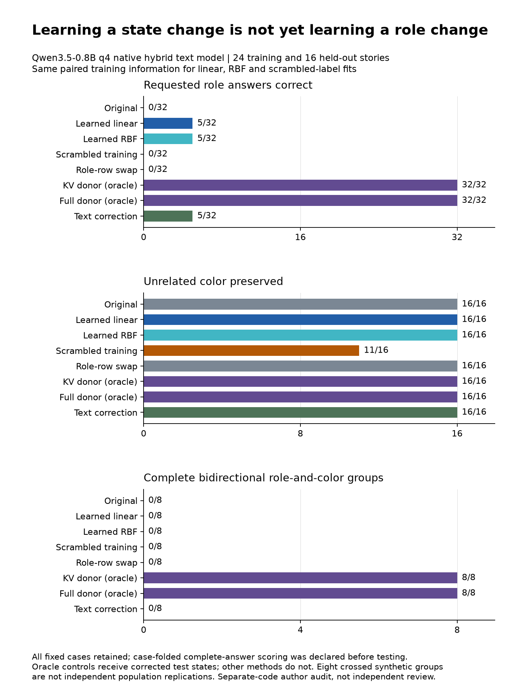

# Learning a correction is not yet preserving its meaning

Micah Blumberg  
Self Aware Networks Research Institute  
selfawarenetworks.com

Shared research supplement for **AI Core Alignment Across Scales** and **AI Mechanistic Interpretability and Self-Aware Networks**. This is material for the tenth manuscript revision, not a declaration that either final manuscript, independent review, or publication package is complete. The two complete Draft 9 manuscripts and their source-context arguments remain unchanged.

## The question carried forward

My receiver-relative account asks how a signal acquires its consequence through the organization that receives it. For an artificial system, this requires distinguishing a requested change, the machinery that interprets or implements it, and the resulting behavior. A correction does not become successful merely because it is authorized, changes an activation, or reduces a numerical training loss. Its meaning has to survive the transformation into action.

The previous Qwen3.5 experiment established a useful but privileged case: a complete counterfactual model state could be obtained by processing the corrected story and then transferred to the receiving computation. That demonstrates an effect of state interchange. It does not show that a system can learn a correction and apply it when the corrected test state is unavailable. I therefore tested that narrower learning problem explicitly.

The experiment compares standard linear and nonlinear kernel-ridge predictors of a native attention-state change. Both use the same paired training data. They operate on the actual pinned Qwen3.5-0.8B quantized hybrid text decoder rather than a substitute network trained to imitate its behavior. The model's learned weights and graphs are unchanged. This is a small contemporary open-weight-model study, not original DeepSeek execution, a frontier-model benchmark, or evidence about consciousness.

## Design and information boundaries

Twenty-four training prefixes describe one person giving a colored book to another. Six training name/context families include both directions and two colors. The opposite-role prefix in the same family supplies a counterfactual target. Names, settings and colors in the sixteen test prefixes are excluded from this fit. One test context retains the training syntax, while the other jointly changes the opening and verb. The four test families and eight direction-paired groups are deliberately small and crossed; they are not independent population replications.

The available representation is a nine-token story window in the twelve key/value tensors belonging to the six full-attention layers. Its flattened dimension is 55,296. The model also has eighteen convolution-state tensors and eighteen recurrent-state tensors. Those states, and earlier attention positions, remain unchanged by the learned edits. Exact positions are supplied by the synthetic grammar. The application has not learned to discover arbitrary linguistic spans or human intent.

Training-only means and one scale per key/value tensor normalize the representation. The linear kernel is a dimension-normalized dot product; the nonlinear kernel is a Gaussian RBF with a training-distance median bandwidth. Both use the same predeclared ridge coefficient, 0.001. A fixed permutation of training target changes produces a scrambled-supervision control. No output-score optimization or hyperparameter search follows the held-out outcomes.

Each policy reads only its fitted parameters and the receiving prefix's attention window. It is applied before the question is supplied. The same resulting state is then forked into giver, recipient and color queries. Policy-state hashes are written before the test counterfactual state is computed, and the predictor has no donor, query or expected-answer argument. This is an inspectable experimental information boundary, not a malicious-code sandbox or a formally verified hardware separation.

Additional controls are an unchanged state, swapping the two known role-token cache rows, a counterfactual attention state, a complete counterfactual state, and a fixed textual instruction to reverse the roles while keeping color unchanged. The donor controls have privileged test information. The text control does not receive the corrected story but uses additional input tokens. The row-swap control does not compensate stored positional coding. These are distinct comparisons, not identically informed or equally expensive algorithms.

The learned predictors are ordinary supervised representation interventions. [ReFT](https://arxiv.org/html/2404.03592v1) already provides methods for learning interventions on frozen language-model representations; this experiment is not a replication or superiority test of its full training procedure. [RAVEL](https://arxiv.org/html/2402.17700v1) already makes intended changes, unrelated-attribute isolation and generalization central to evaluation. My contribution here is the bounded hybrid-state and authorization experiment, not invention of those evaluation principles.

## Fitting and native behavior

All 72 ordinary training answers were correct. Both learned maps reduced standardized training-state reconstruction error: the linear RMSE was 0.014477 and the RBF RMSE 0.003966. The scrambled-target linear predictor's error against the true changes was 1.882500. These numbers describe training-state prediction, not semantic accuracy. The stored shared preprocessing and three dual solutions contain 5,363,726 float64 values; this is not a twenty-parameter method or a negligible-storage intervention.

All 48 ordinary test answers were also correct. This passes the prospectively declared requirement of at least 14/16 correct answers in every query type. Scoring uses the complete generated answer after trimming and case folding, with exact-case results separately retained. Case folding was declared before this test, following the explicitly preserved capitalization issue in earlier development. Neither erroneous outputs nor difficult cases were removed.

| Condition | Reversed giver / 16 | Reversed recipient / 16 | Color preserved / 16 | Complete groups / 8 |
| --- | ---: | ---: | ---: | ---: |
| Original, no correction | 0 | 0 | 16 | 0 |
| Learned linear correction | 1 | 4 | 16 | 0 |
| Learned nonlinear RBF correction | 2 | 3 | 16 | 0 |
| Scrambled-training correction | 0 | 0 | 11 | 0 |
| Role-token cache-row swap | 0 | 0 | 16 | 0 |
| Counterfactual attention state | 16 | 16 | 16 | 8 |
| Complete counterfactual state | 16 | 16 | 16 | 8 |
| Fixed textual correction | 5 | 0 | 16 | 0 |

A complete group requires correct giver, recipient and color answers for both directions of a story pair: six correct answers, not a favorable average. The unchanged condition's zero is its failure to perform the requested reversal, not failure to understand the original story. Its ordinary answers were all correct.

The learned methods each obtained five of thirty-two requested role answers, but neither completed a bidirectional group. For example, after the story in which George gives a purple book to Diana, both learned methods answered George to both role questions. That is not a restored relationship between two distinct roles. A lower RBF training error did not provide an advantage on the predeclared complete-group endpoint. The result concerns these fitted maps and this distribution; it does not establish that all representation-learning methods must fail.

Every non-original condition changed all forty-eight first-step full-logit hashes relative to the unchanged computation. Even the cache-row swap, which retained every original answer, changed these internal outputs. Conversely, preserving all sixteen colors in the two correctly paired fits did not repair role binding. Numerical effect, isolation of one tested attribute, and the requested relational operation are therefore separately visible in the data.

The complete individual-story audit also finds zero stories with both roles correctly reversed for either learner; their five successful role answers each occur in five same-name collapsed stories. A descriptive, non-gating comparison gives mean partial-state error of 0.37880 before correction, 0.36211 after the linear edit, 0.35175 after the RBF edit and 0.26553 after simple row swapping. The lower row-swap error does not translate into a single requested role change. The cap never activates in either correctly paired learner but activates in all sixteen scrambled-supervision cases, so the scrambled control is not a realized-norm-matched label ablation.

The direct textual correction is also unsuccessful under this fixed prompt. That does not establish a general inability to follow corrections, or that latent editing is preferable to better prompting. No instruction search was conducted on the test cases. The two oracle controls succeed in this new sample, but their supplied corrected states remain unavailable to the learned methods. Their success must not be counted as a learned repair.

## Core Alignment: an accepted update can still be a bad correction

One held-out prefix also drives a real versioned update sequence: authorized learned correction, authorized stop, rejected forged restoration, authorized complete restoration, and rejected replay. The three accepted stages produce nine fresh model answers. Stopping future edits retains the already changed state. Complete restoration selects the known original hybrid state and recovers the corresponding unchanged outputs. This distinction matters whenever a commitment is expected to persist through later computation.

The first accepted correction is behaviorally defective despite its valid authority. Authentication and semantic competence therefore remain separate requirements. The example does not require that the model be an adversary: an inadequately learned edit is enough to break the intended operation. The present log checks the scripted sequence, selected state and actual outputs; it does not store raw signature envelopes for a standalone arbitrary-message audit. The frozen reference monitor and prior cryptographic-fixture tests provide separate, narrower evidence.

For the alignment paper, the useful claim is a decomposition of obligations: preserve legitimate authority, represent the intended transformation, implement it in the receiving system, measure the consequences, and retain a justified recovery path. I have not measured reduced human oversight effort, an intelligence gradient, or autonomous learning of the instruction's meaning. Those remain the larger research questions, not results silently inferred from this prototype.

## Interpretability: the missing certificate

The learned transformation is mathematically defined, but low reconstruction loss alone is not a semantic certificate. Balanced opposite-direction pairs have an exactly zero mean change: their nonzero individual corrections cancel. A constant steering vector therefore fails to describe the sampled transformation. Kernel ridge fitting is well-defined under positive regularization, but this says nothing by itself about new names, new contexts, full hybrid-state compatibility, or output meaning.

A relevant sufficient condition can be stated at the output boundary. If the desired state's unique winning token has logit margin m, and every proposed-state logit differs from its desired-state value by less than m/2, the winning token is preserved. Applying this condition at each generation step, including termination, preserves the answer under a matching preceding token history. Training-average error in a partial state supplies neither this full-vocabulary bound nor a justified downstream Lipschitz constant. The [mathematical obligations](../formal/LEARNED-CACHE-REPAIR-OBLIGATIONS-10.md) give the explicit arguments and assumptions; they are not new compiled Lean results.

This moves the interpretability claim toward a concrete certification problem: which explanation or learned correction predicts the intended operation in the original receiving computation, across all required queries and relevant retained state? A positive logit change or reconstructed feature is evidence about part of that process. It should not replace the process itself.

## Evidence and remaining acceptance

The frozen test produced 384 primary answers and nine fresh workflow answers in 920 native decoder calls. Separate training collection used 176 calls. Test model processes totaled 311.39 seconds; the largest measured process commitment was 694,616,064 bytes. Jobs were serial and single-threaded, with no further model download. Full recurrent-cache histories were not persisted.

The [review front door](../reviews/qwen35-learning-10/REVIEW.md) owns exact source receipts, all strata, test results and limitations. All 465 training, test and workflow answers, their first-step full logits, training windows and learned test-state identities reconstruct through twenty-two separate-code native checks. The [protocol](../applications/PROTOCOL-QWEN35-LEARNING-10.json), [fitting receipt](../results/qwen35-learning-10-fit/RECEIPT.json), [trace audit](../reviews/qwen35-learning-10/TRACE-AUDIT.json), and [84-test receipt](../reviews/qwen35-learning-10/TEST-RECEIPT.json) separate construction, fitting, execution and evaluation evidence. Separate code by the same authoring agent is self-review, not independent review; a fresh full-pipeline replay is not claimed.

The present findings justify retaining failed correction methods and narrowing any claim of successful modern-model learning. They do not justify a new claim that SAN's full receiver-relative mechanism is exhausted by these kernel maps. Final integrated manuscript prose, the approved scholarly PDF, independent source/science/code/proof review and author readback remain required. No paper was uploaded, renumbered or represented as final by this supplement.
