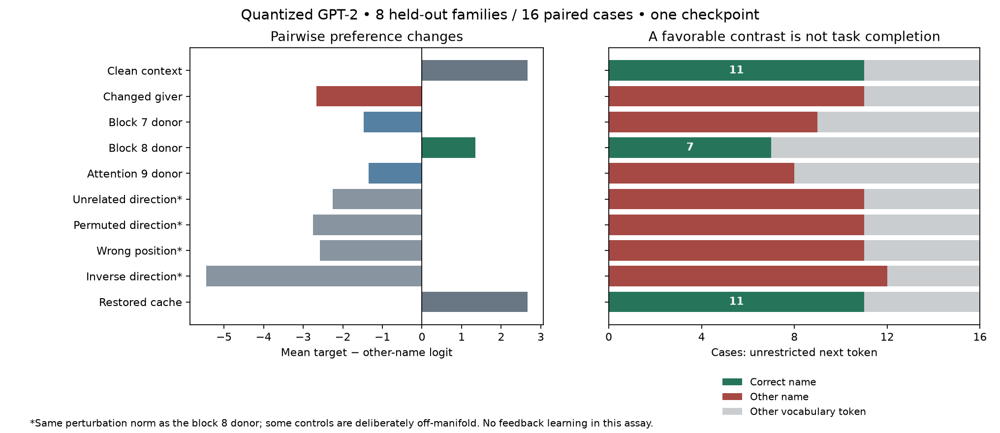
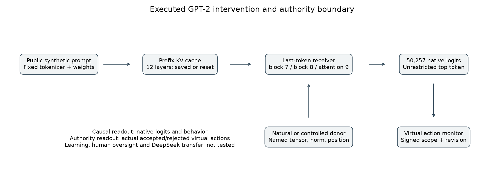

# Draft 5: executed GPT-2 receiver and authority experiment

## What changed

Both papers now have an actual decoder-only transformer experiment, not an MLP or bidirectional encoder renamed as one. The pinned community GPT-2 export supplies pretrained weights, a tokenizer, incremental attention cache, original downstream computations and native vocabulary logits. It is quantized GPT-2, not a contemporary frontier model. The experiment is a shared application with separate interpretability and authority readouts, not two independent studies.

## Model, resource and interface receipt

Repository `Xenova/gpt2`, immutable revision `bf2c7f02e0b826c60d03af341171bde20893da66`; selected model `onnx/decoder_with_past_model_quantized.onnx`, SHA-256 `f65bfa5c0d033ca3db23ece03d34c12d87ea2e7b3007b8944e4a9122ee64e029`. The [intake receipt](../../model-dependencies/gpt2-xenova-bf2c7f02/LOCAL-INTAKE-RECEIPT.json) binds seven exact files totaling 128,678,749 bytes. The download took about 23 seconds. Only this model was downloaded, to D:, without external inference or private inputs. An isolated D: dependency installs ONNX 1.19.1 and ml_dtypes 0.5.3 from hash-pinned wheels; no Torch installation, global runtime replacement or weight training occurred.

ONNX Runtime 1.20.1 uses one numerical thread and CPU execution. The [first assay](../../results/gpt2-receiver-05/EXECUTION-RECEIPT.json) takes 39.56 seconds: 896 single-token steps, 48 prompt variants, 240 intervention readouts and 1,200 virtual authority events. These are repeated computations on one checkpoint. No peak-memory measurement was collected; no hardware benchmark is claimed.

The export explicitly declares input sequence length one. Prefixes are evaluated incrementally from empty KV state; position information is derived from cache length. This is not a comparison between independent full-sequence and cached implementations. The [adapter receipt](../../results/gpt2-adapter-05/RECEIPT.json) checks one development prompt against the unmodified export: inactive hooks leave all logits and cache entries bit-identical; self replacement is identical; persisted cache reload is identical. Resetting that cache changes logits. This verifies a bounded interface, not FP32 upstream equivalence or every possible input.

Three graph-level hooks replace a full 768-component last-token tensor: residual after zero-indexed blocks 7 or 8, and concatenated attention values before block 9's output projection. Each uses a conditional replacement at the actual producer/consumer boundary; downstream computation is rerun. The modified graph hash is recorded. No altered model binary is duplicated on disk. Full donor replacement does not isolate one semantic feature, and a donor residual in a corrupted prefix cache is still a hybrid state.

## Frozen design and strongest-form comparator

[Protocol](../../applications/PROTOCOL-GPT2-05.json) and executable inputs were frozen before the assay. Four development families use two templates and two name pairs; eight held-out families use four different templates and two different name pairs. Every giver and object variant remains in its family. Both giver orientations are measured; no case is removed because the baseline fails. The adapter's initial sanity sentence belongs to development. The preselected main hook is block 8, not a site chosen after inspecting held-out effects.

The indirect-object task and activation-patching approach are established prior work, credited to [Wang and colleagues](https://arxiv.org/html/2211.00593v1). Their analysis already uses causal routing, positional information and demanding circuit criteria. The present assay does not reproduce their full head circuit or claim those methods as SAN innovations. The current primary intake covers the introduction, task, knockout definitions and the displayed early circuit methods through the duplicate/induction discussion; later validation and appendices still need complete technical review for a full replication claim.

Changing the repeated giver changes the expected recipient. Clean, corrupted and item-changed prompts supply natural states. The main intervention replaces the corrupted final block-8 residual with its clean counterpart. Unrelated item-change, 128-coordinate permutation, inverse direction and wrong-position controls use the same perturbation norm. The wrong-position arm applies the delta at the penultimate token and then recomputes the last step. Some norm-matched controls deliberately depart from natural activation distributions. Natural block-7/attention-9 replacements are additional sites, not equal-norm cross-site comparisons. Restoring the clean prefix cache provides an exact positive control.

## Held-out results, all sixteen cases

| Arm | Mean target-minus-other-name logit | Correct unrestricted token | Other name | Other vocabulary token |
| --- | ---: | ---: | ---: | ---: |
| Clean | 2.6633 | 11 | 0 | 5 |
| Corrupted giver | −2.6633 | 0 | 11 | 5 |
| Block 7 donor | −1.4772 | 0 | 9 | 7 |
| **Block 8 donor** | **1.3495** | **7** | **0** | **9** |
| Attention 9 donor | −1.3499 | 0 | 8 | 8 |
| Unrelated equal-norm direction | −2.2599 | 0 | 11 | 5 |
| Permuted equal-norm direction | −2.7549 | 0 | 11 | 5 |
| Wrong position | −2.5786 | 0 | 11 | 5 |
| Inverse direction | −5.4517 | 0 | 12 | 4 |
| Clean-cache restoration | 2.6633 | 11 | 0 | 5 |

The main paired mean logit gain is 4.0128. All eight held-out family-mean gains are positive, ranging from 1.1310 to 6.9050. Recovery denominators exceed the prespecified 0.5 magnitude threshold in all cases; two fractions exceed one and remain unclipped. No significance claim is drawn from these eight constructed families. The mean target probability is 0.2721 clean, 0.0130 corrupted, and 0.1309 after the main patch. A positive name contrast is not sufficient for top-1 success across 50,257 tokens; the nine residual invalid outputs are not hidden by restricting the answer vocabulary. All 24 clean-cache restorations are bit-identical to their clean logits.

## Core Alignment use and boundary

The native top token becomes a virtual `(recipient, send)` proposal only if it names one of the two people. The same pre-existing reference monitor actually receives five update stages per readout: permit both, legitimately narrow to the clean recipient, reject a forged widening, revoke all, and reject the old authentic update. The event log includes the submitted envelope, resulting store, proposal, decision and usefulness. The current scope is trusted fixture data; the model is not being asked to infer natural-language authority.

After narrowing, clean prompts yield eleven useful held-out actions, corrupted prompts none, and the block-8 patch seven. The corrupted arm makes eleven prohibited proposals, all rejected. No tested arm executes an unauthorized virtual action. The same model outputs are evaluated under successive stores, not claimed to be 1,200 independent model inferences or learning episodes. The synthetic signature is a public fixture, not production security; adversarial language was not used to elicit these updates. This connects the arbitrary-proposer theorem to an executed GPT-2 interface but does not formally refine Python to Lean or demonstrate ethical alignment.

## Recount, replay, and what remains

The [separate-code self-audit](AUDIT.json) checks every intervention row, all 1,200 actual authority transitions, all twenty metric rows, split closure and perturbation norms. [Thirty-four cumulative application tests](APPLICATION-TESTS.log) pass. A [six-artifact replay](../../results/gpt2-receiver-05-replay-01/REPLAY-RECEIPT.json) reproduces the frozen data byte-for-byte on the same machine/runtime. The earlier 26 accepted Lean statements are unchanged; no new formal count is manufactured. The two new figures are generated from actual data and the named executed interface.

These are authoring-agent checks and a same-code replay, not independent scientific review. Active transformer feedback learning, equal-information control, feature-level specificity, broader role binding, modern instruction-tuned replication, actual DeepSeek intervention, human oversight, independent reviews, final PDFs and release remain open. GPT-2 narrows one concrete experimental gap; it does not close the paper's central generalization or novelty obligations.

The base GPT-2 model card lists MIT. The community conversion is separately identified; redistributing its weights is not yet cleared. Authored release manifests must reference the local dependency receipt and retrieval instructions, not silently include the checkpoint or its runtime installation. Historical drafts, source originals and old receipts remain untouched.
