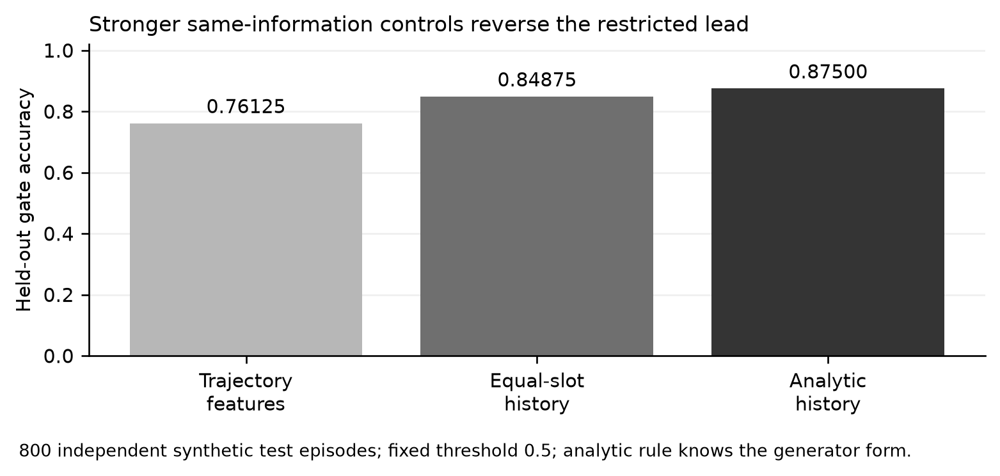
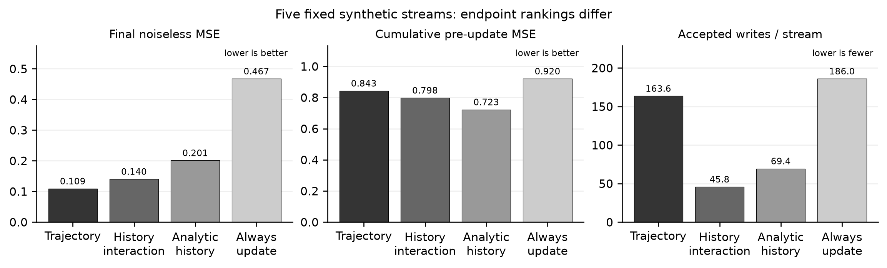
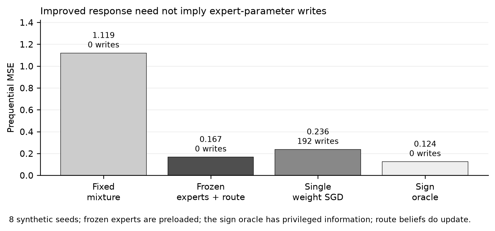

# Selective Dissipation for Continual Learning: Receiver-Relative Residual Trajectories and Self-Regulated Plasticity

Micah Blumberg  
Self Aware Networks Research Institute  
23 September 2026. **Paper 111 · Preprint version 1.0 · Not peer reviewed.** Theory and critical synthetic pilots, including a trained recurrent receiver and protected transactions. Earlier drafts, code and application results remain preserved. The public companion distinguishes reproducible constructed results from biological interpretation and incomplete historical source recovery.

## Abstract

A deployed learner should resolve familiar encounters without unnecessary rewriting, correct familiar errors, and remain able to acquire new relationships. I propose selective dissipation: diagnosis in a history-shaped receiver with durable weights held fixed, followed by a separate proposal and verified plasticity transaction. The hypothesis concerns whether measured residual trajectories help a finite controller allocate useful retained changes, not whether decay deletes knowledge or creates information. Conditional-information results show that deterministic trajectories add no Shannon information beyond their complete generating state; fixed-set inequalities bound measured retention, not generalization or future plasticity. Earlier synthetic studies found a restricted trajectory lead that reversed against stronger history controls, endpoint tradeoffs under persistent writes, and improved expression without stored expert changes. I now construct a trained recurrent receiver with learned proposal gates, bounded protected transactions, and later-task evaluation. Eight frozen methods receive the same 220-event streams in four new polynomial and four shifted-rule cases. Ordered-trajectory pre-feedback mean squared error is 0.40837 versus 0.41427 for a complete-history gate on polynomial streams, but 0.49686 versus 0.49426 under shift. An A-GEM-style protected control performs better on average in both families, at 0.39361 and 0.47014. Permuting trajectory order does not consistently impair performance. State removal and restoration locate a modest retained parameter contribution, while direct recent-context effects are small and prior learning slightly worsens the trajectory arm's later-acquisition endpoint. Thus the proposed operations are now joined in a bounded synthetic construction, but a general advantage of trajectory control, strong carried-state use, and preserved future learning are not demonstrated. Learned update location/timescale, broader architectures, original SAN-Cycle source recovery and biological interpretation remain open.

**Keywords:** continual learning; selective plasticity; receiver-relative computation; residual trajectory; Self-Aware Networks; test-time adaptation.

## 1. The problem and its SAN lineage

The central problem is *selective change*, not maximal suppression or maximal plasticity. A familiar encounter can be correctly resolved by retained competence and need no write. A familiar cue can also carry a verified new consequence, requiring correction. New associations among old features need not look novel at the input layer. Persistent mismatch can instead be noise, corrupted evidence or a wrong context. A useful learner should distinguish these cases prospectively and remain able to learn later.

In Self-Aware Networks (SAN), receiving organization, prior context and recurrent activity shape the effect of an incoming event. The inspected concept note dated 14 September 2026 proposes that the course of discrepancy resolution might help regulate further learning. It is an AI-assisted research-program document supplied by the author, not independently validated biology or evidence of an earlier public date. It expressly reports no new training experiment. Its reference to an earlier SAN-Cycle proposal is a **secondary attribution**: the underlying proposal and its validation record were not available for direct inspection. I do not treat that reference as a recovered quotation, verified historical priority or evidence of prior performance. This paper investigates **trajectory-conditioned allocation of proposed changes** within the program, without claiming to be the first SAN formulation of self-regulating continual learning. The source note, its hash, this attribution boundary and the unsuccessful bounded recovery routes are documented in the public companion. Earlier SAN-Cycle and adverse PWD originals would be required before any stronger genealogy or novelty verdict.

The proposal must also stand against strong external precedents. EATA already excludes uninformative adaptation examples and protects important weights [1]. Gradient Projection Memory protects retained directions [2]. SEAL explores model-generated updates and adaptation feedback [3]. Loss of plasticity can emerge separately from forgetting [4]. Earlier Adaptive Resonance Theory addresses stable category learning under mismatch and reset [7]; Equilibrium Propagation separates prediction and target-influenced phases in an energy-based learning system [8]. More recent Test-Time Training layers update an internal model on test sequences [9], Titans uses a neural long-term memory module [10], Gated DeltaNet combines memory erasure and targeted updates [11], and Nested Learning explicitly proposes multi-level optimization and memory [12]. These methods do not all solve the same task; none is numerically matched to this small application. They remove any claim that receiver dynamics, gated writing, multi-timescale memory or self-modification are novel *as such*. The narrower unestablished contribution is whether a measured receiver-conditioned trajectory improves **which** bounded update is proposed and accepted beyond an equally informed controller. A gain over naive finetuning alone would not isolate that contribution.

## 2. Declared state, evidence and time

At encounter \(t\), let \(x_t\) denote presently permitted evidence; \(y_t\) an independently checked consequence, available only after its actual observation; \(H_t\) the permitted prior history; \(C_t\) a declared task/source context; \(W_t\) retained model and controller state; and \(z_{t,k}\) transient receiving state at diagnostic step \(k\). During the diagnostic interval,

\[
z_{t,k+1}=F_R(z_{t,k},x_t,C_t,H_t;W_t),\qquad W_{t,k}=W_t.\tag{1}
\]

The fixed-\(W\) condition separates attempted resolution from durable learning. If verified \(y_t\) has arrived, define an outcome residual \(r^o_{t,k}=d(y_t,\hat y_R(z_{t,k}))\). A representation residual \(r^x_{t,k}=d_x(x_t,\hat x_R(z_{t,k}))\) instead compares a constrained reconstruction with present input. A low representation residual can coexist with an incorrect predicted outcome. Neither residual is a valid pre-feedback signal if it uses a future label. Protocols must timestamp prediction, observation, diagnostic computation and update separately.

An ordered trajectory \(T_t\) may record residual levels and differences, initial amplitude, normalized relaxation, later reactivation and actual computation cost. Lower amplitude is not necessarily faster normalized relaxation. A component driven toward zero without retaining predictive competence is not evidence that the system has explained the encounter. Withheld consequences and constrained reconstruction test whether competent behavior remains.

After diagnosis, the controller may continue inference, request another observation, change a temporary route, propose a bounded retained update, or decline unreliable evidence. These are different operations and must have distinct logs. In the initial engineered design, all durable changes are reversible and scoped; neither this paper nor the controller authorizes rewriting external objectives or publication permissions.

## 3. Proposal, verification and retention

A candidate receiving-module update can be written

\[
W'_R=W_R-\eta g_R(T_t,H_t)\{M_R(T_t,H_t)\odot\nabla_{W_R}L_{\rm verified}\}.\tag{2}
\]

The gradient, mask and gate are established algorithmic components; Eq. (2) is a specification, not a novelty proof. The outcome objective must depend on authorized independent evidence, not on the model's own unsupported assertion. The proposed gate and mask may use diagnostic trajectory, allowed history, independently measured uncertainty, route identity and expected interference. A proposal is not a committed change.

For a fixed protected set \(A\), new-evidence set \(N\), predeclared loss \(L\), retention allowance \(\delta_t\) and cost budget \(B\), one local acceptance rule requires

\[
L_A(W')-L_A(W_t)\leq\delta_t,\quad L_N(W')<L_N(W_t),\quad C(W')\leq B.\tag{3}
\]

Rejected candidates roll back parameters, adapters and any relevant optimizer state. Successful candidates carry a version and source provenance. Reusing the same acceptance examples can overfit them, so a held-out stream remains untouched by candidate decisions.

**Proposition 1 (finite empirical retention).** If every accepted transaction is tested against the *same fixed* \(A\), and each accepted step obeys \(L_A(W_{t+1})-L_A(W_t)\leq\delta_t\), then \(L_A(W_T)-L_A(W_0)\leq\sum_{t=0}^{T-1}\delta_t\). **Proof:** sum the inequalities and cancel each intermediate term. This is a bound on the measured protected set, not a generalization, future-plasticity or safety guarantee. Positive per-step allowances can accumulate substantially.

## 4. Two information boundaries

The first reference application uses \(z_0=0\) and fixed \(0<\alpha<1\) in \(z_{k+1}=z_k+\alpha(p-z_k)\), where \(p\) is the current prediction. Once \(y\) is verified, \(r_k=y-z_k\) gives

\[
r_k=y-[1-(1-\alpha)^k]p.\tag{4}
\]

**Proposition 2 (fixed-rate obstruction).** Its residual levels and differences are deterministic functions of \((p,y,\alpha,K)\). Thus they cannot provide additional conditional information about update benefit beyond those variables. This proposition does **not** automatically include an independently varying computation-cost coordinate. The application's fixed step count happens to make cost fixed. The current 14-check protocol validates transaction behavior and sample residual reconstruction, not a special trajectory effect.

History-conditioned dynamics remove this *particular* obstruction but not a deeper one. Let \(T=F(H,X,W,Y,K)\) be any deterministic full trajectory computed from the complete permitted prior history, current evidence, fixed model, verified outcome when available and declared diagnostic budget.

**Proposition 3 (full-history boundary).** For any later benefit variable \(B\), \(I(B;T\mid H,X,W,Y,K)=0\), wherever the conditional mutual information is defined. **Proof:** conditional on those generating variables, \(T\) is fixed; its conditional distribution is the same point mass whether or not \(B\) is also supplied. The conditional independence follows. This does not say \(T\) is useless: it may compress, organize or make accessible a useful function of history to a limited controller. It says a claim of *new Shannon information beyond the complete history* would be false under the deterministic premises. If new observations are acquired during diagnosis or randomness is used, they must be modeled and made fair in comparison.

The second, deliberately synthetic [history-conditioned preflight](../application/history_conditioned_preflight.py) stipulates two relaxation rates. With the same scalar \(p=0,y=1\), the two histories produce different residual time courses. A residual threshold recovers a stipulated label \(B=H\); a full-history baseline recovers it equally well. Six finite checks pass. The result demonstrates why a scalar-only comparison can exaggerate the apparent novelty of a trajectory. It is not a trained controller, biological observation or positive continual-learning result.

The defensible research question is therefore operational: under a matched evidence horizon, memory, model capacity, training budget and measured computation cost, does an ordered receiving trajectory provide a useful inductive bias or efficient control representation beyond comparators that can process the same permitted history? A scalar-only ablation still measures the cost of compression; it is not the final opponent.

## 5. Learned-gate preflight and its stronger negative control

The [frozen pre-run protocol](../application/LEARNED-GATE-PREFLIGHT-PROTOCOL-20260922.md) defines a small synthetic question before fitting: can a gate trained on development episodes recognize when a proposed update would improve a hidden relation under a declared generator? Each episode has four past noisy observations of one latent coefficient \(\beta\), a current verified noisy outcome \(y\) for feature sign \(x\), and a candidate scalar update \(c=0.5yx\). The simulator, but not the deployed gate, knows \(\beta\). It evaluates noiseless future squared-loss improvement as

\[
B=\beta^2-(\beta-c)^2.\tag{5}
\]

The gate's binary target is \(B>0\). This is a synthetic oracle training/evaluation label, **not** an independently measured future biological or deployed-system outcome. A diagnostic rate is engineered as \(a=0.2+0.5\sigma(\bar h)\), where \(\bar h\) is the mean of four permitted past observations. The signed current residual \(s=yx\) yields the ordered feature vector

\[
T_k=s(1-a)^k,\qquad k=0,1,2,3,4.\tag{6}
\]

Three five-slot logistic gates use identical optimization: current scalar with zero-filled extra slots, scalar plus four raw historical observations, or scalar plus four trajectory entries. The 2,400 development episodes are generated and the gates are fit before the separate 800-episode held-out stream and its labels are generated. No training hyperparameter search or persistent model update occurs. The recorded [application and result](../application/learned_gate_preflight.py) passes nine internal checks. The trajectory gate attains accuracy **0.76125**, Brier score **0.15370**, and cross-entropy **0.47344**; the raw-history linear gate attains **0.6725**, **0.22022**, and **0.63229**; the scalar gate attains **0.6725**, **0.22059**, and **0.63317**. A development-prevalence constant scores **0.22048** Brier on the same test. The trajectory gate proposes on 0.89375 of episodes; the two original linear comparators propose on every episode at the fixed 0.5 threshold. The test's positive-label frequency is 0.6725.

The critical control reconstructs every \(T_k\) directly from the complete permitted history and \(s\) by Eq. (6). Passing that reconstruction into the *same fitted trajectory gate* produces exactly the trajectory route's held-out metrics. The apparent gain over a raw-history *linear* gate is therefore a feature-map or capacity-of-use result; it is **not** evidence for information beyond history. Draft 4 had not yet run a stronger trained history rival; Section 6 now does. The old majority-only comparator is not a meaningful predictive-probability benchmark because its constant 0/1 probabilities incur extreme cross-entropy; the prevalence baseline is reported instead for probabilistic calibration.

The figure and exact-reconstruction/prevalence diagnostics were added after the first execution; they did not change the three original fits, the held-out episodes, or their three recorded metrics. They must not be described as outcomes of an entirely unmodified preregistration. The generator changes its latent relation afresh each episode and does not perform durable updates. This is a learned *proposal classifier*, not the requested self-regulating continual learner. Positive gate classification does not prove that a transaction should be committed under retention, future-plasticity or authority constraints.

## 6. Stronger same-information history controls: adverse result

The [sequential follow-up protocol](../application/STRONG-HISTORY-FOLLOWUP-PROTOCOL-20260922.md) was frozen **after** Draft 4's result was known but before this follow-up was executed. It reuses the same development and held-out generator, seeds, counts and fixed 0.5 decision threshold. The [follow-up code](../application/strong_history_followup.py) first refits the original trajectory route and verifies that its held-out metrics exactly reproduce the earlier result. It then tests two routes using the same permitted four-item history and current verified scalar: (i) a logistic gate with five features \([s,h,sh,s^2,h^2]\), where \(h\) is the history mean; and (ii) a fixed, model-informed analytic rule using estimated improvement \(m=2h(0.5s)-(0.5s)^2\). The first has the same five fitted slots, development-only standardization and optimizer settings as the trajectory gate. The second has no fitted parameters but knows the synthetic candidate-benefit form. Neither receives hidden \(\beta\), the benefit label or future observations at decision time. Perturbing those forbidden fields leaves all three feature/rule outputs unchanged in a finite no-leakage check.

On the same 800 held-out episodes, the original trajectory gate remains at **0.76125** accuracy, Brier **0.15370**, and cross-entropy **0.47344**, proposing an update on **0.89375** of cases. The equal-slot history-interaction gate reaches **0.84875** accuracy, Brier **0.12950**, cross-entropy **0.40873**, and proposal fraction **0.63875**. The fixed analytic history rule reaches **0.875** accuracy, Brier **0.11918**, cross-entropy **0.37797**, and proposal fraction **0.6875**. On paired binary decisions the interaction gate is right while the trajectory gate is wrong in **139** cases, whereas the trajectory gate alone is right in **69**; the analytic rule's corresponding counts are **128** and **37**. The follow-up passed 5/5 declared finite checks, and an immediate exact rerun produced byte-identical [result JSON](../application/results/STRONG-HISTORY-FOLLOWUP.json) (SHA-256 `4746100A3F6049507A895A4119D2FA352A1423A5BA8BB58B844D7B3FD961AAF6`).

This is an adverse result for the *special trajectory-feature* claim under the constructed generator, not a finding that real receiving trajectories never help. The analytic rule benefits from knowing the simulator's quadratic benefit form, while the equal-slot trained control shows that even without that explicit rule a simple history interaction is better here. The original Draft 4 scalar/raw-history comparison remains a valid record of its restricted test, but it cannot support a general trajectory advantage. All episodes reset the latent relation; none tests retained writes, catastrophic forgetting, future plasticity or physiological PWDs. A new generator, a learned receiver and an actual continual-learning task must be specified prospectively rather than tuning this test until the preferred route wins.

## 7. Persistent shared-weight pilot: endpoint tradeoffs

The risk estimand must be stated before interpreting its ranking. For retained weights \(w\), let \(R_6(w)=\frac{1}{6}\sum_{j=1}^{6}(\langle\theta,c_j\rangle-\langle w,c_j\rangle)^2\), using the six fixed context vectors and the simulator's hidden target only for evaluation. The reported cumulative pre-update endpoint is \(T^{-1}\sum_{t=1}^{T}R_6(w_{t-1})\): **time-averaged pre-update noiseless risk over all six contexts**, including contexts not yet encountered in the early phase. It is not the noisy prediction loss on just the examples encountered in sequence. The separate frozen-routing control in Section 8 uses encountered-stream prequential loss; those endpoints must not be compared as the same measurement.

To cross the earlier implementation boundary without claiming a decisive test, I froze a [sequential pilot protocol](../application/PERSISTENT-STREAM-PILOT-PROTOCOL-20260922.md) after the Draft 5 result but before running a small shared-weight learner. Six unit context vectors are generated by three base directions and three pairwise combinations. One retained three-coordinate weight vector learns a fixed linearly realizable target from noisy observations. Each of seven routes sees identical exogenous observations and four prior observations per context before any permitted write. A proposed step changes the persistent weight vector by half the current signed residual along that context vector. The route either commits or declines it. Phases present two old contexts, then four previously unseen contexts, then revisit all six. The four logistic gates are fitted on the prior independent-episode development generator and *not* retrained on the pilot. Thus transfer to sequential streams is itself an adverse distribution-shift probe.

Across five fixed 210-event test streams, the no-update route remains at mean final noiseless six-context MSE **2.3333**. Always-update, scalar and raw-history linear routes make all 186 eligible writes and end at **0.4675**. The trajectory route makes **163.6** writes on average and ends at **0.1091**; the history-interaction route makes **45.8** writes and ends at **0.1403**; the fixed analytic history rule makes **69.4** writes and ends at **0.2012**. A different predeclared endpoint reverses the ordering: mean cumulative pre-update MSE through the stream is **0.8428** for trajectory, **0.7978** for history-interaction and **0.7226** for the analytic rule. The [full readback](../reviews/PERSISTENT-STREAM-PILOT-READBACK-20260922.md) preserves phase, old/new and seed-level values. The [application](../application/persistent_stream_pilot.py) passes 247/247 finite checks and reruns to byte-identical [result JSON](../application/results/PERSISTENT-STREAM-PILOT.json).

This is now an application with **retained model updates**, but not the complete proposed architecture. It has no learned recurrent receiver, phase-qualified differential, protected-set acceptance transaction, strong published continual-learning rival, independent environment family or later unrelated-task plasticity test. Final error and cumulative error differ; neither may be substituted for the other after viewing outcomes. The five seeds are not an independent scientific replication of this hand-built generator. Moreover, the original gates were trained on independent episodes, whereas the pilot changes weights over time; scalar and raw-history linear gates propose on every eligible visit under this shift. A lower mean final error for the trajectory route in this pilot cannot erase its prior loss to stronger history controls on gate classification or establish a general trajectory advantage.

## 8. Frozen-parameter expression control: changed performance without a stored write

A later improvement in response can arise from changed *expression* of an existing repertoire, not only from a new durable weight. Heald, Lengyel and Wolpert separated memory creation/updating from context-dependent expression in a sensorimotor account and experiments [6]. Their result is a comparator about interpretation, not evidence that SAN selective dissipation is occurring. I therefore froze a [small adversarial control protocol](../application/FROZEN-ROUTING-CONTROL-PROTOCOL-20260922.md) before running the [application](../application/frozen_routing_control.py).

The control has two preloaded and immutable scalar experts, +1 and -1. In each of eight 24-event phases, one hidden expert generates noisy signed outcomes; phase boundaries, inputs and feedback are shared across methods, but identity is hidden. A frozen route begins each phase with equal expert belief and uses only prior feedback to update its posterior. The fixed-mixture route never updates its belief. A phase-reset single-coefficient SGD route does make a parameter write after each feedback; an oracle with the true hidden sign supplies an information-advantaged lower bound, not a fair comparator. With known Gaussian noise scale \(\sigma\), the exact log posterior-odds increment from observed input \(x\) and outcome \(y\) is \(2xy/\sigma^2\), while the *next* prediction is \(x\tanh(\ell/2)\). Neither expression changes either expert coefficient.

Across eight fixed streams, the frozen route's mean prequential MSE was **0.16655** versus **1.11893** for the fixed mixture, improving in all eight seeds. Its mean first-event error was exactly the same as the fixed mixture's (1.08422), because neither route had yet seen within-phase feedback; later-event MSE was **0.12665** versus **1.12044**. The frozen route made **zero expert-parameter writes** and 192 belief updates per stream. Phase-reset SGD scored **0.23608** with 192 writes; the sign oracle scored **0.12395** but knew the answer. The [full result and critical readback](../reviews/FROZEN-ROUTING-EXPRESSION-CONTROL-20260922.md) retain all seeds, the 96/96 local code checks and a byte-identical replay.

This is a constructive counterexample to inferring stored plasticity from improved behavior. It is **not** a selective-dissipation success: the correct experts and noise scale were supplied in advance; SGD was not equally pretrained; posterior state itself changed; and no prolonged task-family, protected retention or future-plasticity challenge occurred. A decisive application must reset transient inference state, separately audit actual accepted writes, and compare routing of pre-existing knowledge with new stored competence under matched information. If a claimed retained benefit disappears after that reset or is matched by frozen-parameter routing, it cannot be credited to selective plasticity merely because immediate behavior improved.

**Proposition 4 (observable equivalence of routing and a parameter write).** In the declared two-expert Gaussian model with fixed expert coefficients +1 and -1, let \(\ell_t\) be the log posterior odds after earlier feedback, initialized at zero, and let \(w_t\) be a separate mutable scalar model parameter, also initialized at zero. For the same finite sequence of signed inputs \(x_t\in\{-1,+1\}\) and real feedback \(y_t\), define the two pre-feedback predictions and post-feedback updates by

\[
\widehat y^{R}_t=x_t\tanh(\ell_t/2),\quad \ell_{t+1}=\ell_t+2x_ty_t/\sigma^2;
\qquad
\widehat y^{W}_t=x_tw_t,\quad w_{t+1}=\tanh\!\left(\operatorname{atanh}(w_t)+x_ty_t/\sigma^2\right).\tag{7}
\]

For every finite \(t\) and positive finite \(\sigma\), \(w_t=\tanh(\ell_t/2)\), so the two implementations produce **identical observable predictions** on every shared input/feedback sequence. **Proof:** the initialization agrees. If the identity holds at \(t\), then \(\operatorname{atanh}(w_t)=\ell_t/2\); substitution into the update gives

\[
w_{t+1}=\tanh\!\left((\ell_t+2x_ty_t/\sigma^2)/2\right)=\tanh(\ell_{t+1}/2).\tag{8}
\]

Finite \(\ell_t\) keeps \(w_t\) strictly between -1 and +1, so \(\operatorname{atanh}\) is defined. The route implementation changes posterior state but never the two expert coefficients; the write implementation changes its stored scalar parameter whenever the update is nonzero. Thus passive input/output agreement cannot identify whether the hidden implementation made a durable expert write or changed a routing state. This is an exact **countermodel within the declared one-dimensional likelihood**, not an equivalence of all biological, neural or continual-learning systems. Direct state logs, selective resets, parameter freezes and causal interventions can distinguish the implementations.

The [original protocol](../application/EXPRESSION-WRITE-EQUIVALENCE-PROTOCOL-20260922.md), [producer](../application/expression_write_equivalence.py) and [result](../application/results/EXPRESSION-WRITE-EQUIVALENCE-20260922.json) remain as historical evidence, including their 35 passing equivalence assertions. The higher-tier review found a separate generator defect: the producer drew the returned input independently from the input used to generate the outcome. Those draws differed in 52 of 96 events. The equivalence assertions could still pass because Proposition 4 holds for arbitrary shared input/feedback sequences; they did not test the stated Gaussian data-generating contract.

The [version-2 correction protocol](../application/expression-write-v02/PROTOCOL.md) and [corrected diagnostic](../application/expression-write-v02/replay.py) draw each input once while retaining the original seeds, noise levels, sign sequence, evaluator and tolerance. They add independently replayed generator checks, a deterministic zero-noise input contract, and a mutation test that detects the historical double draw. All **48/48 checks pass** on the corrected 96 events and separate noiseless examples, with a maximum prediction/state difference of \(1.6543\times10^{-14}\), below the unchanged \(10^{-12}\) tolerance. Two runs yield byte-identical [version-2 results](../application/expression-write-v02/RESULT.json). This repairs the finite likelihood fixture, not the real-arithmetic proof, and does not change the separately generated persistent-learning or frozen-routing results. It is not an independent model-family test or evidence of selective-dissipation superiority.

## 9. Decisive application and evaluation

The next application must have a real history-dependent receiving state rather than stipulated fast/slow rates. Its controller must learn from development streams to propose whether and where a bounded update would improve *future* outcomes. The controller should not be given experimenter labels such as “known,” “novel,” or “worth updating.” Verified feedback may arrive only at its declared time. Proposal decisions, candidate tests and final independent evaluation must be separately logged.

The evaluation stream should include mastered relations; new combinations of familiar primitives; correction of an old but now wrong prediction; recurring contexts; irrelevant random variation; repeated *independent* observations; and a later acquisition phase that measures remaining plasticity. Pre-update predictions and post-update revisits are both needed. Outcome measures include prospective error at a declared retention constraint, backward interference, acquisition of later tasks, calibration, compute and wall-clock cost, retained/temporary memory and parameter growth.

At least four controllers should share the same backbone, feedback, replay and candidate substrate: (i) the trajectory controller; (ii) an instantaneous-loss or surprise gate; (iii) a flexible controller given the same full permitted history but no precomputed trajectory; and (iv) a strong published continual-learning comparator implemented under a justified adaptation interface. Add ablations that scramble trajectory order, remove carried receiver state and equalize actual computation. No paper should present superiority if a matched full-history controller ties, if the gain uses extra labels or compute, or if protection of old tasks destroys the ability to learn the next one. An adverse tie may still establish that history matters while rejecting the special trajectory claim.

Retained changes should survive reset of transient state. Selective removal of an accepted adapter or update should remove its predicted benefit under matched conditions. Otherwise a short-lived working-state or context-inference effect may be mislabeled as learned knowledge. The fixed-capacity first phase prevents unlimited parameter growth from masquerading as a solution. Log belief updates, changed routing, proposed writes and accepted durable writes separately, and include a matched frozen-parameter expression control.

### 9.1 A learned receiver, protected transactions and later acquisition

The [new version-1 protocol](../application/learned-receiver-v01/PROTOCOL.md) was written before this experiment's development and final streams were generated. The [application](../application/learned-receiver-v01/experiment.py) replaces the stipulated decay by an eight-unit tanh receiver whose 273 parameters are fitted through four recurrent steps. Its initial state is a learned function of the last four verified input/outcome events. Four observable input coordinates describe two continuous primitives and two visible context cues; the learner receives no hidden task/rule identity or change-boundary label. The transient predictions are computed with retained weights fixed, before current outcome feedback. Outcome residuals become available only afterward. Actual recurrent computation is learned, but monotonic dissipation is not assumed.

A fixed sixteen-example protected base and a sixteen-event recent buffer are shared across controllers. The ordered-trajectory controller and the flexible history controller receive the same generating information: receiver parameters, current permitted observation/feedback, protected examples and bounded recent history. Only the precomputed intermediate residual coordinates differ. The history input therefore remains sufficient to reconstruct a deterministic trajectory; Proposition 3 still applies. The fitted MLP gates each have 11,209 parameters plus standardization statistics, much larger than the receiver. Matching their stored dimensions does not make their effective feature access identical.

A candidate is one clipped-gradient SGD step. It is committed only if it improves the current verified-example loss, increases empirical protected loss by at most 0.0002, stays within a total increase of 0.02 from the initial trained receiver, and satisfies finite-value, norm and fixed-capacity checks. Rejected proposals retain the exact old vector and version; SGD has no persistent optimizer moments to conceal an additional change. The current example is used both to propose and accept, so held-out queries and later observations—not that improvement alone—test generalization.

For \(m\) accepted writes, the two protected-set checks strengthen Proposition 1 to

\[
L_A(W_T)-L_A(W_0)\leq\min(m\delta,\varepsilon).\tag{9}
\]

The result follows by telescoping the incremental inequalities and separately applying the absolute cap. The [mathematical note](../application/learned-receiver-v01/MATHEMATICAL-BOUNDARY.md) states the numerical-tolerance version and a finite-step counterexample to treating gradient alignment as an exact retention guarantee. Eq. (9) protects only the repeatedly measured set. It does not guarantee generalization, preserve every later-acquired relation, or ensure that the learner can continue acquiring new tasks.

Twelve polynomial development streams supply 2,640 candidate-effect labels; four separate development-validation streams supply 880 further labels. Those labels use synthetic future-rule consequences during development supervision only, with fixed 0.8/0.2 weights for current-rule/base benefit and a 0.0001 write cost. They are not information available to a deployed unlabelled learner. The four gates share forty fitting epochs and a fixed 0.5 threshold: ordered trajectory, complete history without intermediate residuals, permuted trajectory, and a restricted instantaneous-prediction/loss ablation. No final stream selects a threshold or training epoch.

After fitting is sealed, four new polynomial and four sinusoidal-shift streams are opened. Each has 220 encounters spanning known competence, a new relation among familiar primitives, correction of that relation, irreducible noise, revisits, a later relationship, and final revisits. Every method receives identical observations and verified outcomes. Other controls always propose, mix current and protected replay gradients, apply an A-GEM-style projection, or freeze receiver parameters while updating only temporary history. The projection uses the published halfspace operation [13], but this fixed-base regression adaptation and extra acceptance rule are not a reproduction of A-GEM's original benchmark or memory management.

| Method | Polynomial pre-feedback MSE | Shifted-rule pre-feedback MSE | Mean accepted writes: polynomial / shifted |
|---|---:|---:|---:|
| Ordered trajectory | 0.40837 | 0.49686 | 19.00 / 14.00 |
| Complete-history gate | 0.41427 | 0.49426 | 19.00 / 13.75 |
| Permuted trajectory | 0.40388 | 0.49780 | 20.50 / 18.00 |
| Scalar gate | 0.40795 | 0.48782 | 0 / 0 |
| Always propose with protection | 0.40365 | 0.49071 | 66.50 / 61.25 |
| Replay with protection | 0.40161 | 0.49195 | 101.75 / 98.25 |
| A-GEM-style projection with protection | 0.39361 | 0.47014 | 113.00 / 104.50 |
| Frozen receiver | 0.40795 | 0.48782 | 0 / 0 |

The [full results](../application/learned-receiver-v01/evaluation/RESULT.json) preserve every seed and stage. Ordered trajectory minus complete history is -0.00590 on polynomial streams, with lower error on 4/4 seeds, but +0.00260 under shift, with lower error on 2/4. The projected control has lower average error in both families. Permutation does not consistently damage the trajectory result. The scalar gate's apparently strong development-validation accuracy arises with no proposals, and its final predictions equal the frozen control. These findings do not demonstrate a general trajectory advantage or an essential contribution of residual order. Neither do eight synthetic streams settle whether a different learned receiver could use trajectories productively.

Later acquisition is not silently replaced by old-task retention. For the trajectory arm, later-phase MSE is 0.27365 after earlier learning versus 0.25994 from the same warmup state without the intervening stream; shifted-rule values are 0.46114 and 0.44893. Thus the preceding stream is slightly adverse on this endpoint. Because learned parameters, temporary context and consumed protection allowance differ, this comparison does not uniquely identify intrinsic loss of plasticity.

Clearing temporary context nevertheless leaves a bounded parameter-mediated improvement: mean later-query loss changes from 0.27298 initially to 0.25536 finally in the polynomial family, and from 0.34629 to 0.32568 under shift. Exact retained vectors, last-write removal and restoration are supplied in the [state-intervention record](../application/learned-receiver-v01/state-interventions/RESULT.json). These are software interventions, not biological lesions. Replacing carried recent context by zeros changes final later-query predictions by mean RMS only 0.00061 and 0.00092. A learned history input exists, but the fitted model relies weakly on that transient route; the wiring diagram alone cannot establish the stronger carried-state claim.

The [independent ledger audit](../application/learned-receiver-v01/AUDIT.json) verifies the numerical and transaction records, and the full result plus all 64 event ledgers replay byte-for-byte. A post-run review corrected only a logical forward-work counter: input projection is computed once rather than at each recurrent step, yielding 488 rather than 584 receiver forward multiply-accumulates per example. The [separate accounting correction](../application/learned-receiver-v01/COST-ACCOUNTING-CORRECTION.json) preserves the original run and adds the gate's 11,184 forward products per invocation. Backward, normalization, nonlinear and data-movement costs are not included; these counts do not establish equal-FLOP or speed superiority.

This construction closes the absence of any learned recurrent receiver joined to protected writes and a later-acquisition test. It does not close the stronger proposal. Update location and timescale are not learned, the gate is frozen during final deployment, direct recent-history effects are small, and the synthetic meta-training utility is privileged. A next study must make context-dependent inference genuinely necessary, retain equally informed controls, and use new evaluation streams after any redesign. The previously opened streams cannot become fresh confirmation.

## 10. Relation to biological SAN and governance

This is an artificial-learning paper. Digital relaxation should not be called physical electromagnetic dissipation, and a scalar residual is not automatically a SAN Phase Wave Differential. A biological claim would require a declared oscillatory reference, receiver, measured phase-qualified departure and causal consequence. The separate *Selective Dissipation and Gated Plasticity* paper investigates those empirical links; its synthetic BTSP calibrations and published summaries do not validate this AI controller. Conversely, a successful AI experiment would not establish NAPOT rendering or conscious experience.

For deployment, the controller must preserve authority boundaries. A user-local adaptation may not silently become a global model update; untrusted documents may not modify source permissions; a favorable local score may not rewrite the acceptance criterion. Reversibility, provenance, deletion obligations and authorized promotion are part of the engineered system, not optional metadata.

## 11. Current result and release boundary

This preprint is a theory-and-critical-pilot paper. It specifies the architecture, gives four conditional propositions and a cumulative-cap refinement, carries eight bounded application families and retains adverse controls. The stronger same-history follow-up **reverses the restricted trajectory lead** in independent-episode classification. The persistent pilot makes actual retained writes, but its lower trajectory-route final error is paired with worse time-averaged six-context risk and many more writes than history-based rivals. Frozen routing and Proposition 4 show that better immediate performance and even identical passive behavior need not identify the hidden storage route; they do not rank learning methods fairly. Earlier receipts retain fourteen transaction checks, six history-conditioned preflight checks, nine learned-gate checks, five strong-history follow-up checks, 247 persistent-pilot checks and 96 frozen-routing checks. The corrected likelihood fixture now passes 48 checks; the historical 35-check result remains preserved with its generator defect explicitly recorded. Counts are implementation evidence, not scientific effect sizes. Section 9.1 now adds a learned recurrent construction, new synthetic stream partitions, a transparent published-rule adaptation, later-acquisition measurements and exact state interventions. It does not report a broad lifelong benchmark, a full published-method reproduction, improved future plasticity, or raw biological validation. Its adverse shifted-family and projected-control comparisons remain primary results. The source genealogy remains incomplete until the earlier SAN-Cycle proposal and adverse PWD benchmarks are recovered and read in context. The higher-tier review has occurred. Its missing learned-receiver/transaction test is partially addressed by Section 9.1, while stronger mechanism questions and external specialist review remain open. The author has authorized preprint publication of the curated manuscript and companion; this is not independent scientific acceptance. Third-party raw material with unresolved redistribution rights is excluded.

## References

1. Niu S, et al. Efficient Test-Time Model Adaptation without Forgetting. *PMLR* 162 (2022):16888–16905. [Primary source](https://proceedings.mlr.press/v162/niu22a.html).
2. Saha G, Garg I, Roy K. Gradient Projection Memory for Continual Learning. ICLR (2021). [Primary source](https://arxiv.org/abs/2103.09762).
3. Zweiger A, et al. Self-Adapting Language Models. arXiv:2506.10943 (2025). [Primary source](https://arxiv.org/abs/2506.10943).
4. Dohare S, et al. Loss of plasticity in deep continual learning. *Nature* 632 (2024):768–774. [Primary source](https://doi.org/10.1038/s41586-024-07711-7).
5. Blumberg M. *Selective Dissipation for Continual Learning: Receiver-Relative Residuals and Self-Regulated Plasticity in Self-Aware Networks*. Author-program working note, 14 September 2026. Exact path and hash in the accompanying source ledger.
6. Heald JB, Lengyel M, Wolpert DM. Contextual inference underlies the learning of sensorimotor repertoires. *Nature* 600 (2021):489–493. [Primary source](https://doi.org/10.1038/s41586-021-04129-3).
7. Carpenter GA, Grossberg S. ART 2: self-organization of stable category recognition codes for analog input patterns. *Applied Optics* 26 (1987):4919–4930. [Primary source](https://doi.org/10.1364/AO.26.004919).
8. Scellier B, Bengio Y. Equilibrium Propagation: Bridging the Gap between Energy-Based Models and Backpropagation. *Frontiers in Computational Neuroscience* 11 (2017):24. [Primary source](https://doi.org/10.3389/fncom.2017.00024).
9. Sun Y, et al. Learning to (Learn at Test Time): RNNs with Expressive Hidden States. arXiv:2407.04620, v4 (2025). [Primary source](https://arxiv.org/abs/2407.04620).
10. Behrouz A, Zhong P, Mirrokni V. Titans: Learning to Memorize at Test Time. arXiv:2501.00663 (2024). [Primary source](https://arxiv.org/abs/2501.00663).
11. Yang S, Kautz J, Hatamizadeh A. Gated Delta Networks: Improving Mamba2 with Delta Rule. ICLR (2025). [Primary source](https://arxiv.org/abs/2412.06464).
12. Behrouz A, Razaviyayn M, Zhong P, Mirrokni V. Nested Learning: The Illusion of Deep Learning Architectures. NeurIPS (2025); arXiv:2512.24695. [Primary source](https://arxiv.org/abs/2512.24695).
13. Chaudhry A, Ranzato MA, Rohrbach M, Elhoseiny M. Efficient Lifelong Learning with A-GEM. ICLR (2019); arXiv:1812.00420v2. [Primary method and proof](https://arxiv.org/html/1812.00420v2).
