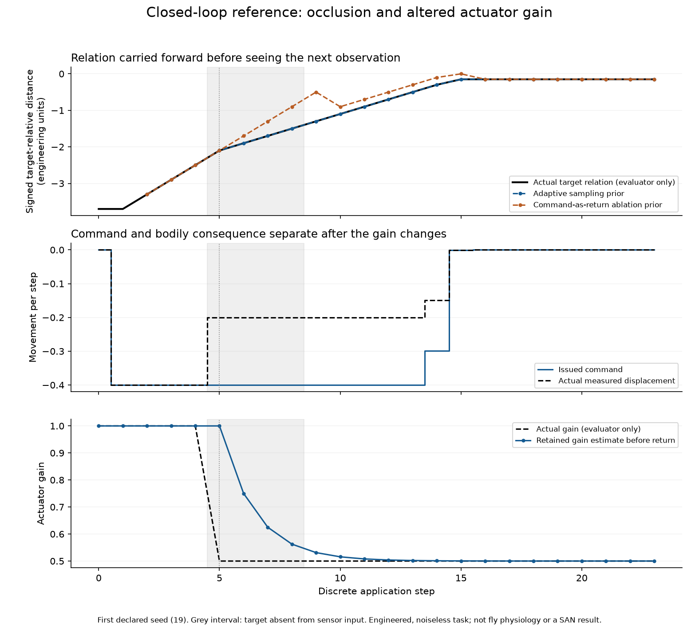
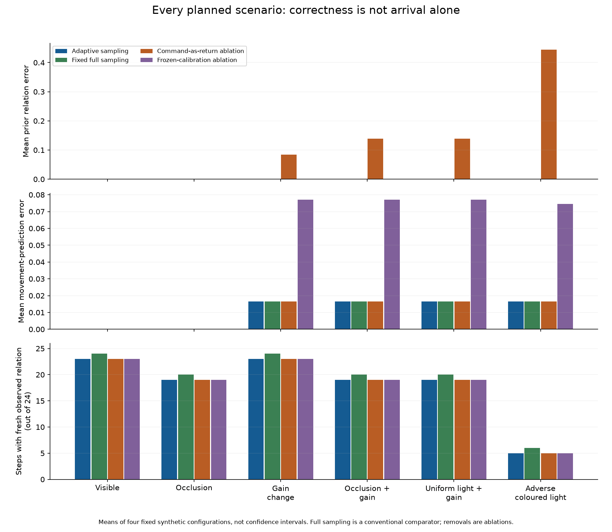
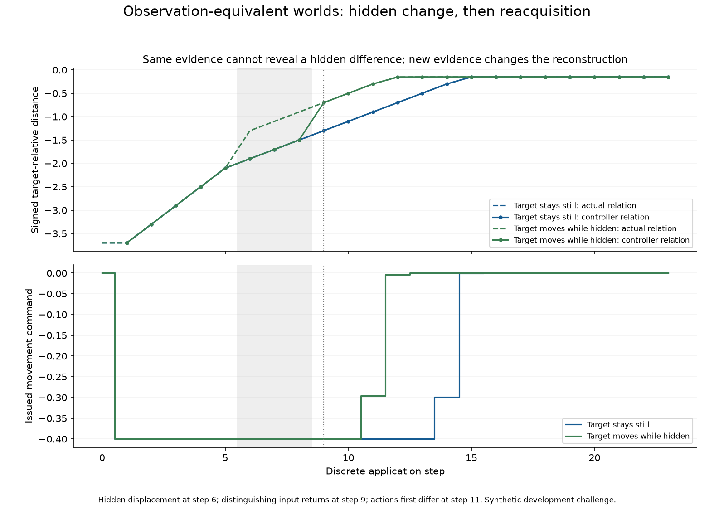

# Connected embodied reference: the comparison task, not the SAN model

19 September 2026. **96 synthetic closed-loop episodes, 2,304 saved events, 205 initial checks and 588 separate event-audit checks.** A further two-world intervention passed 46 checks. The numerical episode run took 0.130 seconds on one CPU thread. These are engineering development results, not animal experiments, held-out tests, or a completed phase/PWD/NAPOT implementation.

## What works together

An engineered body receives partial four-band spectral measurements and a signed-range measurement. A conventional controller forms a target-relative relation, chooses a sampling mode and a movement, receives the actual displacement, updates the current relation and revises a retained actuator calibration. An external evaluator scores the result without sending ground truth back to the controller. Occlusion and illumination changes occur without explanatory flags.

The two object templates have identical first-three-band signatures. Initially, the controller must leave their identity unresolved and request the fourth band. Once identity is established, it can associate subsequent coarse measurements with the previously acquired spatial relation. During absence it labels continuation inferred, not observed. This is a point-state and ambiguity-gating comparator, **not** a calibrated probabilistic uncertainty model.

The published Huang–Luo memory component and the hue diagnostic remain separate, unchanged evidence packets. They are **not wired into this reference controller**. Its template matcher and exponential actuator calibration are ordinary engineering mechanisms. The value of this application is a reproducible whole-episode environment, input contract and competent nonoscillatory reference against which the proposed SAN joining can later be tested.

## Read and inspect

- [Frozen development plan and complete parameter disclosure](ANALYSIS-PLAN.json)
- [Pre-run design review](PRE-RUN-REVIEW.md)
- [Architecture, state ownership and native/engineered boundary](ARCHITECTURE-AND-INTERFACES.md)
- [Accepted execution receipt](results-02/EXECUTION.json)
- [All 96 complete episodes](results-02/EPISODES.json)
- [All per-episode measures](results-02/METRICS.json) and [all scenario/policy summaries](results-02/GROUP-SUMMARY.json)
- [Interventions and retention probes](results-02/CONTROLS.json)
- [Separate arithmetic, state-continuity and interface checks](results-02/SEPARATE-CHECKS.json)
- [Preserved first-run interface defect and repair](attempt-01/INTERFACE-AUDIT-AND-REPAIR.md)
- [Two-world challenge plan](OBSERVATION-TWIN-PLAN.json), [complete traces](observation-twins-01/EPISODES.json) and [result receipt](observation-twins-01/EXECUTION.json)
- [Closed-loop observational-equivalence proof and scope](../../MATHEMATICAL-SUPPLEMENT-04.md)

## Results, including the limitations

The 96 planned episodes cross six scenarios, four fixed configurations and four policies. The fixed-full-sampling controller is a conventional comparator, while command-as-return and frozen-calibration variants are mechanism removals, not optimized competitor models. All policies have the same permitted sensor capabilities and task templates. Actual acquisitions differ according to their chosen sampling policy.

With occlusion and a gain change together, the adaptive reference's mean error in the target relation *before* receiving the next observation is approximately numerical zero. Substituting the issued command for measured displacement produces mean error 0.13864 engineering units. Both controllers can eventually correct their position once the target is visible, so final arrival alone would miss this transient reconstruction failure. The near-zero reference error depends on a stationary target and a noiseless signed-range/body-return instrument; it is not evidence of general-world robustness.

The retained-calibration control starts with gain estimate 1 and receives eight command/return pairs generated at gain 0.5. After clearing transient state, its next displacement-prediction error is 0.00078125, versus 0.2 after reverting calibration to the prior. The independently specified correct rescue has zero error and the incorrect rescue has error 0.4. These values test the location of adaptation in the engineered controller, not a biological synaptic or metaplastic mechanism.

The coloured-light case deliberately remains adverse. After time 10, **no policy freshly recognizes the target again**. It is carried only as an inferred stationary relation; the controller eventually stops using it for movement when it is too old. Some variants still reach approximately the intended position. That does not establish successful color constancy, fresh reconstruction or reliable recognition. This exposes why task score, evidence freshness and internal relation must be audited separately.

Adaptive acquisition uses fewer scalar captures in these cases—for example 139 versus 176 under occlusion plus altered gain—but this is not a claim of lower total computational or metabolic cost. No operation-level cost comparison or SAN superiority has been established. The four configurations are deterministic development cases, not independent animals or a statistical sample supporting confidence intervals.

The first declared seed (19) illustrates how command and actual body return separate at time 5. Grey marks the target's absence from the sensory channel. The figure displays the evaluator's truth for comparison; that curve is not an input to the controller.

All six scenarios and all four policies are retained. Means summarize four fixed synthetic configurations. The final panel exposes loss of fresh target observations even when arrival remains successful.

## Hidden-world intervention: a causal evidence boundary

In a separately declared post-benchmark development challenge, the target moves by 0.6 units at time 6 in one of two otherwise identical worlds, while it is hidden. The permitted sensory histories, measured body returns, controller states and actions remain identical through time 8. They cannot identify the hidden difference. The displaced world's inferred relation is wrong by 0.6 units during this interval.

At time 9, the target reappears. The new observation changes the controller's internal relation; the selected actions first differ at time 11. This tests that the relation is actually used for later action, rather than merely decoded for an investigator. It also supplies a numerical witness for the elementary observational-equivalence bound: identical information cannot guarantee an estimate within half the separation of two distinct compatible states. The challenge was designed after the first benchmark and is not described as an untouched final test.

## Preservation, implementation and replay

The first run's constructor received a settings dictionary containing unused environment-only constants. That failed the strict interface specification even though the implemented policy did not read those constants. The original source and results are preserved. The accepted `results-02` controller receives only nine allowlisted public settings, rejects extras and produces byte-identical episode data to the first run. This is a software data-flow check, not a security sandbox.

The runner and checker are create-only: to rerun, use a copied packet with new result destinations; do not delete prior evidence merely to make the scripts run again. The implementation, run, check, twin and plotting scripts are in the paper's `tools` folder. No installation, GPU, background worker, raw-recording download or sealed PWD session was used.

Next: connect source-registered receiving/circuit states and the proposed tonic/PWD/NAPOT transformation to this kind of observation/action contract, preserving all existing successful and adverse reference results. The current signed-range instrument, fixed templates, stationary objects and one-dimensional noiseless world must remain explicit simplifications, not be mistaken for native fly anatomy or an adequate final test of the complete SAN theory.
