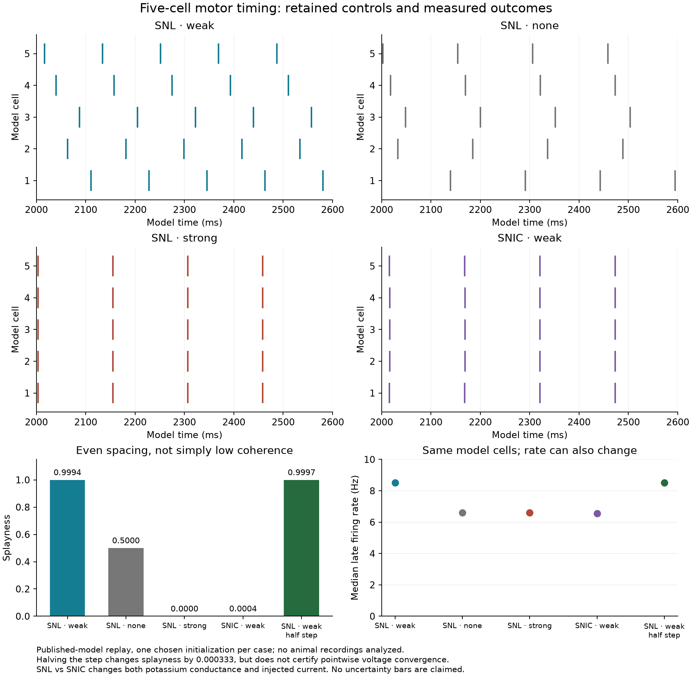
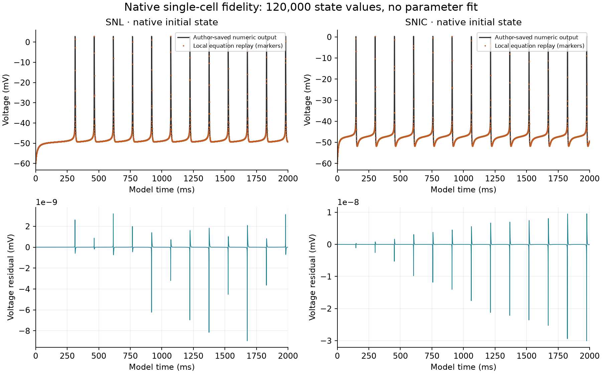

# Published fly motor timing: executable component and evidence

19 September 2026. Local development reproduction of Hürkey et al. (2023), **not a completed SAN model or new analysis of animal recordings**.

## What now works

The local voltage-and-channel implementation reproduces two author-saved single-cell trajectories: 20,000 samples of three variables per regime, or **120,000 compared state values**. Maximum voltage differences are 8.96 × 10⁻⁹ mV for SNL and 3.01 × 10⁻⁸ mV for SNIC. All 25 saved spikes match within 2.28 × 10⁻¹³ ms. These are model-output fidelity results, not biological precision estimates.

Five predeclared, five-cell network cases then exercise weak coupling, no coupling, strong coupling, a different intrinsic regime, and a halved time step. Every case is retained. Each process used one numerical thread, verified below-normal Windows priority and 6.1–12.4 seconds. No package installation, Brian execution, GPU, full-connectome simulation or background worker was used.

| Case | Gap conductance per pair (nS) | Step (ms) | Splayness | Mean first-harmonic order | Median late rate (Hz, each cell) |
|---|---:|---:|---:|---:|---:|
| SNL, weak | 0.043499999686 | 0.10 | 0.999390 | 0.000643 | 8.5034 |
| SNL, none | 0 | 0.10 | 0.500029 | 0.646933 | 6.5920 |
| SNL, strong | 3 | 0.10 | 0 | 1 | 6.5920 |
| SNIC, weak | 0.043499999686 | 0.10 | 0.000405 | 0.999999 | 6.5617 |
| SNL, weak, half step | 0.043499999686 | 0.05 | 0.999723 | 0.000083 | 8.5106 |

Splayness is one for equal circular spacing and zero for synchrony. The first-harmonic order is a separate statistic: low first-harmonic coherence alone does not establish a splay state. With no coupling, identical cells largely retain the chosen initial phase spacing; that control is not random firing. The SNL/SNIC comparison changes both Shab conductance and injected current, so it is not a channel-only causal intervention.

## Evidence to inspect

- [Frozen local development plan](ANALYSIS-PLAN.json): conditions, clocks, tolerances and limits, specified before these calculations; not an external preregistration.
- [Native single-cell audit](native-audit-01/EXECUTION.json): exact parameter values, candidate-step defects, native output hashes and free-running comparison.
- [Separate same-agent check](network-run-01/SEPARATE-CHECKS.json): **181/181 checks**, five preserved cases and ten explicit in-memory corruption detections.
- Individual receipts: [weak SNL](network-run-01/snl_weak/EXECUTION.json), [uncoupled SNL](network-run-01/snl_none/EXECUTION.json), [strong SNL](network-run-01/snl_strong/EXECUTION.json), [weak SNIC](network-run-01/snic_weak/EXECUTION.json), [half-step SNL](network-run-01/snl_weak_halfstep/EXECUTION.json). Each folder has complete spike times and the saved state/phase arrays.
- [Source audit, equations and provenance](../../research/FLIGHT-TIMING-SOURCE-AND-REPRODUCTION-20260919.md).
- [Figure manifest](figures-01/MANIFEST.json) and [visual readback](figures-01/VISUAL-READBACK.md).
- Local implementation: [equations and simulator](../../tools/flight_timing_model.py), [native-reference test](../../tools/check_flight_native_reference.py), [one-case runner](../../tools/run_flight_timing_case.py), [separate checker](../../tools/check_flight_timing_cases.py), [measured-plot generator](../../tools/plot_flight_timing_component.py).

## Numerical limits that stay attached to the result

The source initial-state files are numeric model outputs, not recorded animal voltages. The successful local replay uses their actual first state (−60 mV, h = b = 0), not the unused nominal gate initialization in the source JSON. Its integration step is 0.01 ms and its recording step 0.1 ms. Four candidate one-step sizes are reported; physiological parameters were not optimized.

The network implementation uses the source Figure 3B phase selection, five seconds of dynamics, the published parameter sets, and the saved homogeneous coupling value. It holds the separately evaluated gap current fixed during each intrinsic RK4 step. That is an explicit interpretation of the source's separately summed synaptic variable. **No native coupled Brian trace has been compared**, so native single-cell fidelity does not certify the complete network scheduling translation.

The network stores voltage and two gates every 1 ms; threshold detection occurs at each integration step. Phase is interpolated only between spikes that actually bracket the sample in all five cells. The requested 2–5 s analysis window is therefore shortened to the common valid final spike time in each case. There is no extrapolation of the last phase interval.

Halving the step changes splayness by 0.000333, within the predeclared 0.025 tolerance. **This is convergence of that pattern statistic only.** Ordinal spike times differ by up to 3.1 ms, one cell has one additional boundary spike, and the maximum voltage difference at the same recording clock is 44.65 mV. Full waveform convergence is not established. These phase-sensitive differences must remain visible if a later application claims millisecond prediction accuracy.

The separate checker reconstructs phase and summary measures from saved spikes without importing the simulator, checks state bounds and input/output hashes, and tests pairwise current conservation and the voltage quadratic identity. It does not independently recompute every integration step, verify every threshold against a 1 ms trace, or provide independent expert review.

## Reuse and next integration boundary

The application is a **motor-circuit timing reference**. It makes a documented stateful receiving mechanism executable and shows why coordination need not mean simultaneous firing. It supplies neither a hue-circuit time constant nor a perceptual PWD reference. It is not connected to the conventional target/distractor task, mushroom-body memory model or a SAN rendering mechanism.

Before a proposed adapter uses it, declare the biological versus engineering interface, current units, state ownership, initial conditions and independent clocks. A motor phase is not a retinal/hue phase, and no default connector may silently treat them as one. Further numerical work should first resolve source scheduling and interval accuracy, not enlarge the network. A sensory receiving candidate needs its own temporal justification.

The source article is CC BY 4.0. Redistribution terms for the archived code and saved arrays have not yet been established from the inspected files. Public availability is not a verified redistribution license; keep third-party source files local pending that check. The intact acquisition receipts and precise retrieval paths allow continued research without a wholesale archive download.

The runner refuses to overwrite a completed case. Do not erase evidence simply to repeat it; create a versioned run directory and a declared amendment for changed settings. The preserved native and network receipts bind the accepted implementation hashes. No publication, Git, Book 2 or wiki change is part of this component.
