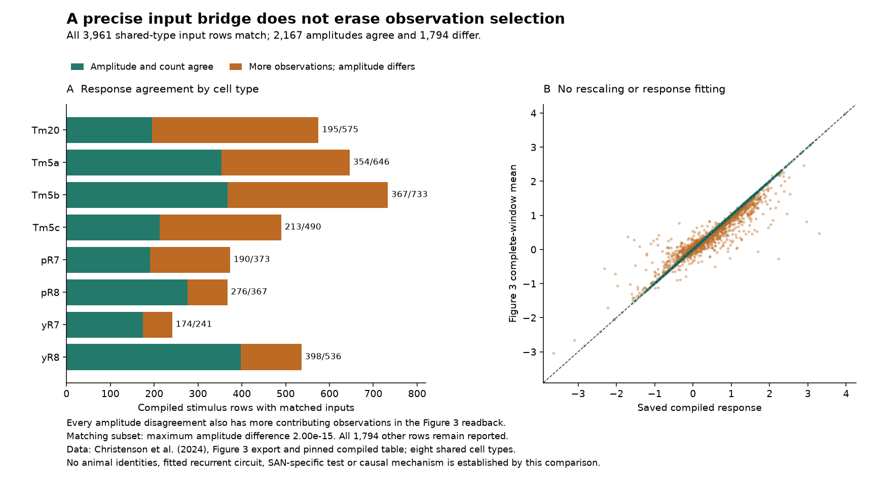

# Hue inputs and response-export bridge

19 September 2026. Checked secondary-data/source reconciliation for the SAN
fly manuscript, not a fitted recurrent circuit or a new biological experiment.

The four predeclared reconstructions identify a precise bridge: the pinned
`govardoskii` curves, minimum integer-grid-compatible background
`[10,61,102,255,327,245]` nE, and the article's log-capture function reproduce
**all 3,961 compiled input rows for the eight cell types present in Figure 3**.
The separate scalar calculation's largest same-type coordinate difference is
1.60 × 10⁻¹⁴. The rounded published background and the other sensitivity set
do not produce tolerance matches. Exact recording metadata remains unavailable;
the recovered numerical fingerprint is not the original export command.

A response-only follow-on finds **2,167 matching amplitudes and counts**, with
maximum amplitude difference 2.00 × 10⁻¹⁵, and **1,794 differences**. Every
disagreement has more complete-window observations in the Figure 3 readback
than in the compiled export. No rescaling, response fitting, post-hoc candidate
choice or mutant relabeling was used. The exact observation selector remains
unrecovered. None of these rows is declared an independent animal.

## Review order

- [Source audit, full interpretation and score distinctions](../../research/HUE-INPUT-RECONSTRUCTION-AND-SCORE-CONTRACT-20260919.md)
- [Input-only plan, frozen before comparison](PLAN.md)
- [Six-file sensitivity acquisition](../../../access/652b5b9f049f2ddf.md)
- [Input report: all four cases in both coordinate domains](results-01/INPUT-CONTRACT.json)
- [Complete numerical arrays and match indices](../../../access/06412804a7348990.md)
- [Separate input check: 219 assertions, all row comparisons, six rejected corruptions](checks-01/CHECKS.json)
- [Follow-on response plan, frozen before response comparison](RESPONSE-BRIDGE-PLAN.md)
- [Response results by type](response-01/RESPONSE-BRIDGE.json)
- [All 6,205 compiled rows, including the 2,244 without a same-type Figure 3 source](response-01/ROW-COMPARISONS.csv)
- [Separate response check, including five rejected corruptions](response-checks-01/CHECKS.json)
- [Seven synthetic score-contract cases and exact source-function comparisons](score-checks-01/SCORE-CONTRACT.json)
- [Recovered equation 7 XML](../../../access/5bbde953b54784e6.md)
- [Figure receipt](figures-01/FIGURE-RECEIPT.json) and [visual readback](VISUAL-READBACK.md)

## Execution and limits

The input reconstruction took 1.344 seconds; its separate scalar/array check
took 2.578 seconds. The response bridge took 2.313 seconds and its separate
scalar/bisect check 0.500 seconds. These are local execution timings, not model
performance benchmarks. Each numerical process used one thread, below-normal
priority and only the named inputs. No large time-series rescan was needed for
these comparisons. The [startup dependency receipt](STARTUP-RECEIPT.md) preserves
an import failure before any results; no package was installed.

Reviewed implementations: [input reconstruction](../../tools/reconstruct_hue_input_contract.py),
[separate input checks](../../tools/check_hue_input_contract.py),
[response bridge](../../tools/bridge_hue_response_exports.py),
[separate response checks](../../tools/check_hue_response_bridge.py), and
[isolated score checks](../../tools/check_hue_score_contract.py).
Each refuses to overwrite its existing result directory. To rerun, a distinct
reviewed output destination is required; do not delete accepted results.

The score exercise executes five previously read pure function definitions in
isolation, not the author project or its database initialization. Its seven
artificial vectors are unit tests, not additional neural data, application
episodes or scientific evidence for SAN. The mathematical inventory is
unchanged: thirteen analytic result families and seven earlier compiled
supporting lemmas. Independent scientific review and biological fidelity of
the complete SAN/PWD/NAPOT construction remain open.
