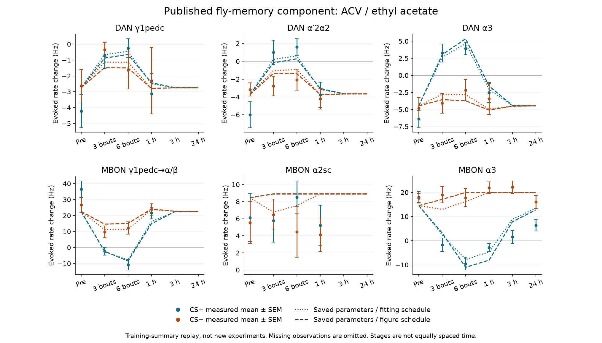
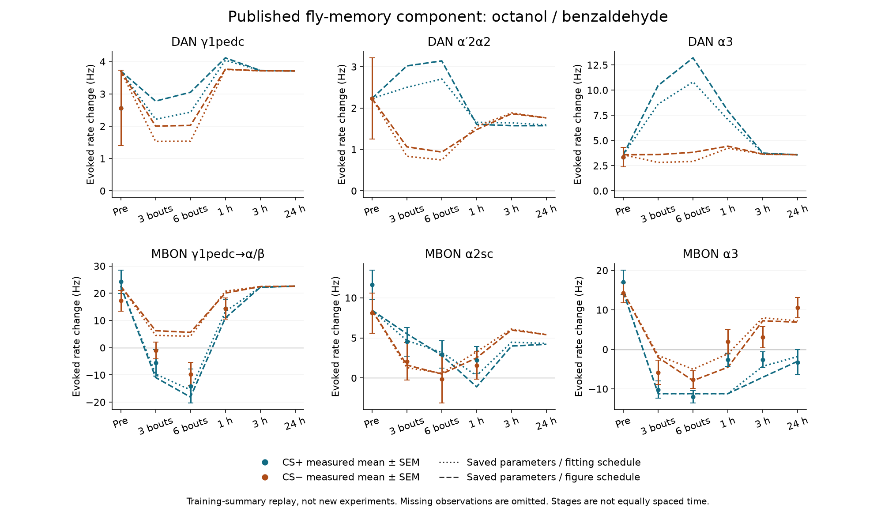
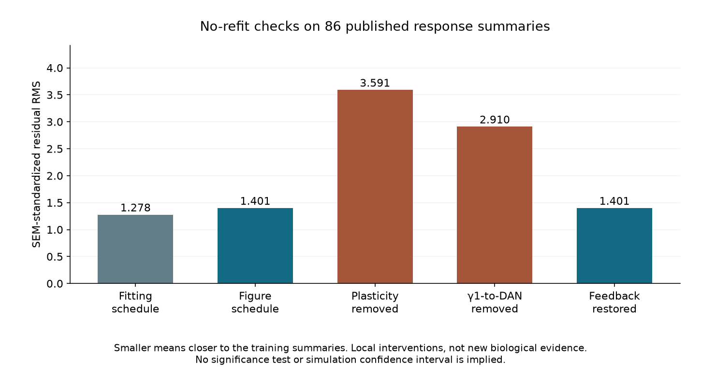

# Fly-memory component: checked saved-parameter replay

19 September 2026. Local, no-refit adaptation of the published Huang–Luo circuit. **Not yet full published-figure reproduction, an independent biological replication, or the connected SAN application.**

Start with the [source and result audit](../../research/MEMORY-COMPONENT-SOURCE-AUDIT-20260919.md), the [frozen analysis plan](ANALYSIS-PLAN.json), and [attribution/license boundary](ATTRIBUTION.md).

## Reviewable evidence

- [Original-data cell map](../../../access/ed0d45d98e01f949.md): 86 measured summary means/SEMs, 58 missing entries; original workbook preserved.
- [Saved parameters and MATLAB allocation map](../../../access/c94a8bb1ac5f0d02.md): two- and three-module models, no fitting.
- [Execution receipt](results-01/EXECUTION.json): fourteen context-specific runs, 0.097 seconds of numerical replay, one thread.
- [All predictions, observations, cells and residuals](results-01/PREDICTIONS.csv).
- [Full protocol timestamps](results-01/PROTOCOLS.json) and [state trajectories](results-01/RUNS.json).
- [Scores](results-01/METRICS.json), [44 initial checks](results-01/CHECKS.json), and [42 separate XML/scalar-replay/score checks](results-01/SEPARATE-CHECKS.json).
- [Finite-settling proof and scope](../../MATHEMATICAL-SUPPLEMENT-03.md).

## Measured plots

Points and bars are the source workbook's measured means and SEMs. Dotted and dashed lines are local point-parameter replays under the two different source schedules. Missing observations are not interpolated. A curve at an unmeasured stage is only a model output. [Vector versions and exact hashes](figures-01/FIGURE-MANIFEST.json).

The score is \(\sqrt{n^{-1}\sum_i((\hat y_i-y_i)/s_i)^2}\), where \(s_i\) is the source SEM. It is not a probability, significance test or out-of-sample accuracy. The two-module score uses fewer observations and is not directly ranked against the three-module score. Removal tests retain original fitted parameters; restoring the original connections also resets the run, and does not claim in-place biological recovery.

## Reproduction boundaries

The published figure averages neither these two schedules nor these two model sizes. Its median/intervals come from a separate 10,000-parameter-sample procedure. That procedure and native MATLAB comparison are still open. The workbook was used for original model fitting and cannot be relabeled held-out validation. All uncertainties about the source configuration remain visible in the audit.

The model implementation is [run_memory_component.py](../../tools/run_memory_component.py), with a [separate scalar checker](../../tools/check_memory_component.py) and [saved-result plotter](../../tools/plot_memory_component.py). Each result destination is create-only. Exact source blobs, data hashes and commit provenance are preserved in the bounded source intakes. The files are local only.
