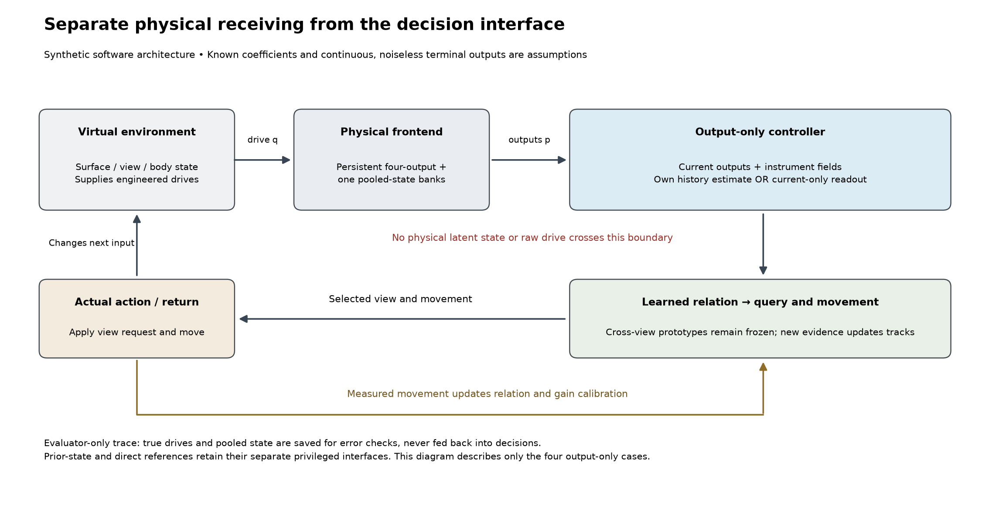

# Physical receiver outside the decision controller

This extension isolates downstream access. The unchanged virtual world supplies the physical frontend with four engineered input drives. Each of two receiving banks persists across samples. The frontend emits only four current terminal outputs plus permitted instrument addresses, presence, range, view and public task. It supplies no physical pooled state or input drive to the output-only controller. Evaluator-only records retain those quantities so reconstruction error can be measured without routing the answers into decisions.

The output-only controller owns learned cross-view prototypes, the current candidate relation, a selected query, movement calibration and either a current-output readout or its own output-history state estimate. It never owns a physical frontend or world instance. The relation, finite-catalog query calculation, action selection and measured-return methods are reused unchanged from the prior application. Current terminal outputs update the reconstruction; the reconstruction requests a view; the actual next observation tests that request. Actual measured movement updates retained calibration and relative positions. Predicted movement is never substituted for returned evidence.

## Conditions and learning

The two preserved references keep their declared privileged interfaces: the old learned readout uses current terminal output plus true previous internal state; the direct learned reference uses the engineered input drives. They replay the earlier accepted event sequences exactly. They must not be mislabeled output-only.

The current-only readout learns a five-feature linear ridge map (four current outputs and a constant) from exactly the same 512 public calibration transitions. The observer instead uses known engineered coefficients to reconstruct input from current/previous terminal outputs and its own scalar pooled-state estimate. This observer is model-based, not learned physiology. Both acquire cross-view prototypes from the same 36 public type/view/intensity presentations; the prototype table remains frozen throughout evaluation. The last two conditions use those same matched-training prototypes without reacquisition: one starts the physical hidden state at +0.25 while the observer starts at zero; the other uses an observer time constant 1.5 times the unchanged physical value.

The changed time constant is an **assumed-model error**, not a biological intervention or a change to the physical receiver. The initial offset is a physical initial-condition change unknown to the observer. These are different tests. No condition is removed because it produces an unexpectedly favorable or unchanged score.

## Deliberately generous assumptions

- Four linear rate-deviation outputs are available without noise or a calcium observation transform, at every sample, including zero-drive absence.
- Presence, signed range, view and retinal address come from the instrument. This remains a one-dimensional virtual body with three synthetic surface views, not a natural fly scene.
- The observer is given proposed coefficients and the sample period, not independently identified biology. Its initial estimate is zero; that is correct only in the matched and time-constant-mismatch conditions.
- The physical receiving signs are source-motivated; their magnitudes, pooling and time remain engineered. Heath's log-capture, fitted-gain steady-state model is not being reproduced by this linear-drive system.
- Output history is computational state. It is not automatically a tonic oscillatory reference, learned dendritic memory, NAPOT, a multimodal experienced episode or biological access to a hidden state.

The current-only condition is a targeted temporal-access ablation, not an equally capable conventional competitor. The ordinary model-based observer itself offers a conventional explanation of the recovered performance. Therefore these results do not establish a SAN-specific advantage.

## Audit and interface scope

The scalar checker recomputes 2,304 output-only steps, including physical input, receiver state, decoded input, observer updates, matching, query, action and return. The 1,152 reference steps are exactly equal to the corresponding previously accepted event records. Separately, all 96 output-only episodes are replayed with the decision controller receiving only saved permitted packets and body returns; reversing sample order leaves every state and action unchanged. These replays are verification of existing episodes, not 96 additional experiments.

Eleven malformed/forbidden packets and a repeated clock are rejected. Eight deliberately corrupted result records are caught. Object-field checks and public-packet replay establish the scoped implementation boundary, not a security sandbox or a general information-flow theorem for arbitrary Python code. Decoder/model/prototype hashes stay fixed; actuator gain is intentionally updated from actual movement and is reported separately from the frozen learned repertoire.

All six cases ran sequentially, on one numerical thread at verified below-normal priority, in less than 0.53 seconds per case. The source/figure/check tools are also bounded foreground work. No sealed PWD sessions, new raw recordings, large downloads, background workers or independent reviewers are involved.
