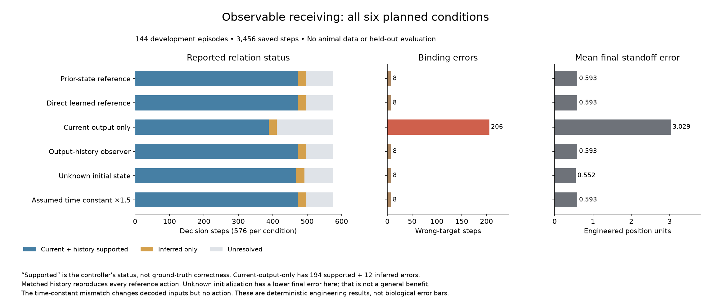

# Observable receiving: complete development application

An output-history controller now reconstructs the engineered input without reading the physical receiver's hidden state. This closes a software-access limitation of the earlier prototype. Known coefficients, noiseless continuous outputs and initialization remain explicit assumptions; native sensory dynamics and the full SAN construction remain open.

Start with the [architecture and assumptions](ARCHITECTURE-AND-ASSUMPTIONS.md), [frozen plan](ANALYSIS-PLAN.json), [complete separately recomputed summaries](checks-01/RESULTS.json), [scalar checks](checks-01/CHECKS.json), [public-packet replay and interface controls](controls-01/CONTROLS.json), and [M13 extension](../../MATHEMATICAL-SUPPLEMENT-10.md). The scalar audit is by the same authoring agent, not an independent scientific reviewer.

## All six planned conditions

Each condition contains six scenarios × four seeds × 24 steps: 24 episodes and 576 steps. Total: 144 development episodes, 3,456 saved steps. No held-out session was opened. Positions, time and drive magnitudes are engineered units.

| Condition | Current/history supported | Inferred | Unresolved | Queries | Wrong bindings: supported / inferred | Mean final standoff error |
|---|---:|---:|---:|---:|---:|---:|
| Prior-state reference | 473 | 24 | 79 | 53 | 0 / 8 | 0.593333 |
| Direct learned reference | 473 | 24 | 79 | 53 | 0 / 8 | 0.593333 |
| Current output only | 388 | 24 | 164 | 160 | 194 / 12 | 3.029167 |
| Output-history observer | 473 | 24 | 79 | 53 | 0 / 8 | 0.593333 |
| Observer, unknown initial state | 468 | 24 | 84 | 58 | 0 / 8 | 0.551667 |
| Observer, assumed time constant ×1.5 | 473 | 24 | 79 | 53 | 0 / 8 | 0.593333 |

The program's `observed` status means current evidence plus retained history support the inferred relation. It is not an assertion that the relation is true. The current-only result makes that distinction concrete: 194 of its supported steps select the wrong target. The history observer and both references retain eight wrong inferred bindings during unseen object swaps.

The matched history observer produces the same 576 actions as both references, with maximum reconstructed-input error below 4×10⁻¹⁶. The current-only linear readout differs on 406 actions and has input RMSE 0.0637153. Unknown physical initialization differs on 36 actions, with input RMSE 0.0406113. Its lower final-position error is preserved; it is not evidence that hidden-state mismatch generally helps. Its latent error contracts by 0.7430473 per observation under matched coefficients and falls from 0.25 initially to 0.000200602 after 24 observations.

The mismatched assumed time constant produces input RMSE 0.00266593 but zero action differences. Thus this task does not identify that parameter even though the reconstructed drives are measurably different. No general invariance to kinetic error is claimed. Thirty-two separate algebra checks address output-noise sensitivity; they are not noisy behavioral trials or animal data.

## Exact reproducibility

The existing [public teaching inputs](../multiview-query-v0/familiarization-01/intact.json), [base plan](../multiview-query-v0/ANALYSIS-PLAN.json) and base code are byte-pinned by the frozen plan. [Prepared readout/prototypes](familiarization-01/LESSON.json) and its [execution receipt](familiarization-01/EXECUTION.json) record the actual training. Calibration readout RMSE for the current-only map is 0.102266; the proposal does not hide that approximation error.

Code: [output interface and observer](../../tools/observable_receiver.py), [one-case runner](../../tools/run_observable_receiver.py), [separate scalar checker](../../tools/check_observable_receiver.py), [interface/replay controls](../../tools/test_observable_interface.py), and [accepted figure builder](../../tools/figure_observable_receiver_v2.py). The runner is create-only. With the configured Python runtime, run `run_observable_receiver.py` with one of the six exact condition names and a new `--run` label. Do not overwrite the accepted run or its lesson. `prepare` is for a fresh package without the existing `familiarization-01` directory, not an instruction to delete it. Validators likewise preserve their original output directories.

Each condition's `run-01/<condition>/` folder contains `EPISODES.json`, `SUMMARY.json` and `EXECUTION.json`. All six are named in the scalar-check receipt; no recursive search or selection by favorable outcome is needed. The scalar and interface checks took approximately 1.66 and 0.93 seconds respectively at verified below-normal priority. Assertion calls and repeated public replay are verification bookkeeping, not independent experimental sample sizes.

## Source and publication boundary

The [recovered Heath primary-source audit](../../research/HEATH-PRIMARY-RECOVERY-AND-TEMPORAL-BOUNDARY-20260919.md) now separates its steady-state calcium/modeling evidence from a native kinetic model. Main-text mathematics was recovered, but the numerical supplementary connection table and requested raw/model data remain unavailable. This does not reverse or erase earlier access-failure receipts.

No new raw biological reanalysis, measured sensory time constant, full PWD/NAPOT mechanism, phenomenal-experience result, independent review, final-format PDF or publication action is supplied by this application. The manuscript's remaining research and release obligations stay open.
