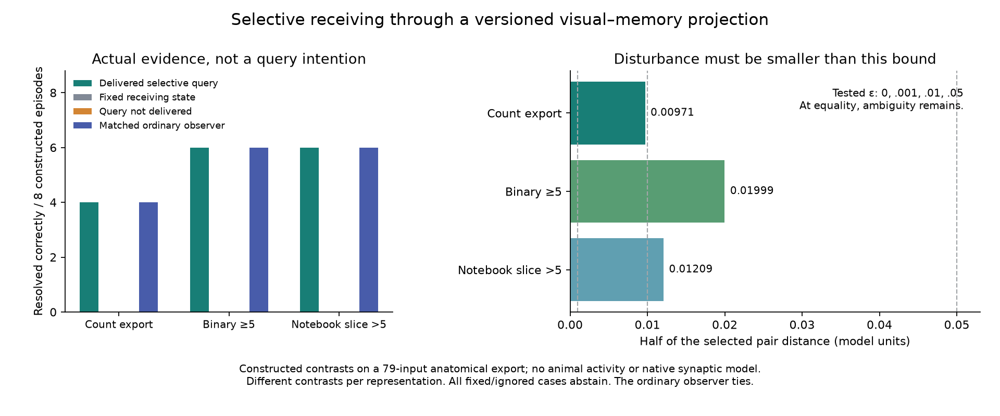

# Selective receiving through a visual-memory projection

19 September 2026. A completed, checked development test: **96 constructed
episodes**, not a full fly simulation or animal confirmation of SAN.

Start with the [source and mechanism audit](../../research/VISUAL-MEMORY-RECEIVING-AND-VERSION-BOUNDARY-20260919.md)
and [M15 proof and limits](../../MATHEMATICAL-SUPPLEMENT-12.md).

## Result

The same incoming contrast can be invisible after fixed mixing but become
distinguishable after a selected pre-mixing receiving change. The actual
sample must return: merely issuing the query does not resolve the relation.
In the declared trials, delivered queries resolve **16/24** cases; a matched
ordinary active observer gives identical choices and commands. Fixed receiving
and undelivered queries each abstain in **24/24** cases. The other eight
delivered-query cases remain ambiguous at their tested disturbance levels.
These are deliberately constructed stress pairs, not accuracy estimates.

| Representation | Native export dimensions | Exact linear rank | Resolved with query |
|---|---:|---:|---:|
| Count export | 79 × 147 | 78 | 4/8 |
| Binary >=5 | 79 × 147 | 78 | 6/8 |
| Literal notebook slice >5 | 79 × 146 | 75 | 6/8 |

The 79-input export is not silently identified with the article's 74-input
population. Its first two representations have an exact pair of equal source
routes. The third loses three source ports entirely; no proposed gain state
can recover a port with no retained route. Different representations use
different constructed contrasts; their counts are not a matched-stimulus
biological comparison. Synaptic signs, time, molecular mechanisms, full PWD/
NAPOT dynamics and broad multimodal learning are not supplied by this test.

## Reviewable evidence

- [Pre-result numerical plan](../../../access/df463653cbe0ec3d.md)
- [Complete results and all aggregate outcomes](../../../access/f62716fcd043f25e.md)
- [Every episode and actual return](../../../access/8d65e74a1f6603a3.md)
- [Exact mixing models, constructed patterns and paired lessons](../../../access/6528bafd5ed2ba5f.md)
- [Separate scalar checks and exact rank certificates](../../../access/d9deaa54860a9fa1.md)
- [Source selection and resource bounds](../../../access/8389544ba12a1d22.md)
- [Matrix schema and ID-match boundaries](../../../access/953a36f7bdaa89c4.md)
- [Sanitized notebook analysis text](../../../access/4fc5e369f95b8c34.md)
- [Figure readback and rejected first layout](../../../access/308288fc6b0be8bd.md)

The checker verifies all **11,613** native matrix values and **70,400** scalar
response values (maximum discrepancy 4.45e-16), all 96 episodes, 24 matched
ordinary-observer pairs, six semantic corruptions and seven malformed packet
cases. Its exact modular rank lower bounds meet explicit integer null-vector
upper bounds. These are separate same-agent checks, not independent review.

The producer's first launch stopped before producing results because its
Windows process-handle declaration did not set the requested priority. The
declaration was fixed before the successful run, whose receipt confirms
below-normal priority. Producer work took 0.093 seconds; the separate scalar
checker took 23.297 seconds. No background worker remains.

## Scope and continuation

The controller receives only actual response, actual receiving-state
acknowledgement and clock. Its installed paired lessons are generous public
familiarization, not a newly trained plasticity network. Returned movement
does update persistent actuator gain and subsequent commands. The imagined
sample is never substituted for an actual observation.

Next: implement the selective receiving change through justified cellular
state and connect an identified visual projection to the existing sensory
frontend; then join the native memory and multimodal/action loop. The native
attention-recording route is currently inaccessible, not replaced by a guessed
clock. Existing comparison equality and hue-export discrepancies stay visible.

Executable sources: [producer](../../../access/ca18e7e244bd9ccd.md),
[separate checker](../../../access/623f2de4086a8519.md), and
[figure generator](../../../access/ccead8c935c7ca57.md). These run from
the frozen inputs into non-overwriting output locations. Do not rerun over an
accepted output folder; choose a separately reviewed replay destination.

The original third-party notebook/utilities contain credential strings. They
were not executed or used and remain private source snapshots, **excluded from
any future public bundle**. A redacted/licensed release derivative is still
required. No Book, wiki, public record, Git or deployment was changed.
