# Self-Aware Networks in a Connectome-Constrained Fly Brain

## Molecular Dynamics, Oscillatory Neural Rendering, and Continual Embodied Learning

Micah Blumberg  
Self Aware Networks Research Institute  
https://selfawarenetworks.com

23 September 2026. **Paper 109 · Preprint version 1.0 · Not peer reviewed.** A connectome-constrained theory, component-reproduction and source-data methods paper. This release preserves the earlier findings and adds a frozen receiving-to-action diagnostic with different decision rules and actuator-return updates. It is not a completed biological SAN fly, a consciousness demonstration or an independent replication. The primary title states the research program; the bounded contribution and unresolved joins are stated in the abstract, Section 9.21 and conclusion. Earlier drafts and results are preserved in the development history.

## Abstract

A connectome constrains possible routes without fully specifying how history-shaped receiving cells transform evidence, reconstruct relations and learn from action. I propose a species-grounded Self-Aware Networks (SAN) construction joining cellular reception, tonic organization, receiver-relative Phase Wave Differentials throughout Neural Array Projection Oscillation Tomography, multimodal content, action-return and several roles of memory. Functional construction, physiological fidelity, comparative advantage and phenomenal experience have separate evidential requirements.

This source-bound theory-and-methods paper combines exact SAN source recovery, anatomical observations, published physiological data, reproductions of model outputs, conditional mathematics and instrumented applications. Earlier receiving-to-query tests retain cross-view relations and actual movement feedback; a conventional output-history observer matches their reference actions without privileged latent-state access. The receiver coefficients, clock and virtual body remain engineering assumptions. Hue-response recovery preserves both successful calibration and unresolved export differences, rather than identifying an original model by fitting convenient settings.

The visual-memory test constrains a linear receiving proposal with a published projection export: 79 inputs to 147 receiving cells, distinct from the article's stated 74-input population. An exact route dependency makes a constructed difference invisible after fixed mixing. Selective pre-mixing changes can reveal it without increasing the operator's Frobenius norm; common post-mixing gain cannot. Paired familiarization guides a query, but only an actual returned sample can resolve the relation used for action. Of 24 historical constructed query episodes, 16 resolve and eight abstain for the now explicitly frozen contrast vectors. The condition called ordinary observer is an algebraically equivalent squared-distance implementation of the same learner; its equality is an implementation check, not an independent benchmark contest. A new exact-witness diagnostic distinguishes recoverable equal-route differences from three permanently invisible zero-route directions in the notebook projection. Fixed receiving and undelivered queries remain ambiguous. Elementary kernel/noise analysis and exact rank certificates explain these outcomes. An additional exact-witness receiving/action diagnostic compares conservative support-based and likelihood-weighted observers. The latter acts more often but makes errors under its declared loss, and returned movement changes the next actuator command. This is a distinct decision-rule comparison, not the historical algebraic tie. Counts are not signed conductances, prototypes are not native plasticity, and the noise grid is not a biological estimate.

A descriptive reanalysis of Amin and colleagues' published fly calcium data retains ten spatial pairs in each of two conditions. Nine and ten records, respectively, show the reported direction of local inhibitory-response difference. Unknown fly identity is handled by explicit assignment sensitivity, not independent-animal inference. Four additionally acquired Prisco/Dryad files permit a checksum-verified summary-level redraw of calyx APL response ratios. Their Figure 5C workbook reports `n=8` per plane, while the published caption says `n=7`; that conflict is unresolved, and the workbook lacks animal identities or native traces. The Figure 4 supplement's twenty APL ON/OFF delta cells are calculations from the Figure 4B/4D workbook, not independent observations; their numeric direction is Oct minus Mch despite headers that read Mch-Oct. These results constrain a local inhibitory component but do not identify independently controllable input ports. All earlier results remain preserved. Native timing, full PWD/NAPOT and multimodal joining, broader learning, held-out evaluation and independent review remain open; neither component fidelity nor these reanalyses establish a SAN-specific advantage or experience.

## 1. The research object is the whole continuing loop

The earlier revision made selective receiving and actual returned evidence executable in a versioned visual-memory projection. The next question is physiological: what could implement that receiving change? Draft 20 examined local APL inhibition and a complementary pre-Kenyon-cell-integration route, then reanalyzed a fixed set of published spatial response pairs. Draft 21 added custody-verified Prisco/Dryad summary tables and a descriptive redraw while exposing a sample-count discrepancy that cannot be resolved from those files. The higher-tier-review draft audited the dependency and numeric sign of the Figure 4B/4D and inter-odour supplement values. This successor adds exact-input reproducibility and a specific receiving-operation prediction without treating local calcium modulation as proof of arbitrary input-port control. Earlier models, anatomical and source-version findings, the algebraically equivalent observer's matching result, adverse cases and seven compiled supporting lemmas remain intact.

My aim is not to attach SAN names to an existing controller. It is to make explicit how a network's present receiving organization transforms incoming evidence, constructs a usable relation, acts on that relation, and changes through what returns. The fly provides an unusually tractable anatomical constraint for this project. Its value is not that insect anatomy duplicates a small human cortex. Its value is that many relevant operations can be assigned to identified cells, pathways and experimentally investigated interactions.

The supplied research discussion developed this objective in stages. It began with digital fly demonstrations, considered adaptation and navigation memory, and then explicitly expanded to the full molecular-to-network architecture and the question of experience. That final expansion governs the present manuscript. Fast synaptic navigation is a subsystem, not the paper's central object. A successful first construction need not beat another model at Doom; it must show the declared operations actually occurring inside the modeled network. Comparative claims require comparative evidence later.

SAN's books are theory sources for this account, not independent experiments establishing it. I have now bound the Book 1 author review copy and the September 12, 2026 Book 2 T14 edition to exact PDF bytes and checked 42 selected pages [19,20]. Their relevant passages join stateful reception, multimodal reconstruction, internally selected observation, action and returned evidence. This is selected-passage recovery, not a complete reading of both books or proof that every current sentence was publicly fixed in an earlier year. The supplied 2026 discussion is also a mixed human/AI research record. These source types cannot silently acquire an original date or independent experimental status.

Two original notes now provide a more exact bridge. The repository version of “Quantum Physics & LTD,” carrying an August 2022 commit date, connects departures relative to expected tonic firing with multimodal object relations and continuing proprioceptive correction [14]. Its examples include sound, appearance, touch, orientation, location and motion. This is not a vision-only proposal later enlarged by the current fly project. The note also contains speculative physical mechanisms; preserving its full context does not make every such proposal a measured parameter of the present biological model. The particular source passages motivate the reconstruction and action-return questions without supplying a fitted fly implementation.

A separate June-2022-dated repository note, “Shardless architecture?”, describes locally reconstructed activity from sparse, viewpoint-dependent updates and distinguishes historical state from real-time events [15]. It is an engineering analogy, not neurophysiological evidence. Both current notes are byte-identical to the preserved Git objects cited here. Their recorded commit dates are not newly verified public-publication dates or claims of earliest invention. The selected book-passage recovery is now complete for the declared page set; wider genealogy, exact historical public fixation and the remaining book passages remain open.

The fly paper is provisionally distinct from the general NAPOT, tonic-canvas, embodied-rendering, morphology/PWD and learning-loop papers. Those papers own broad architectural arguments. This manuscript owns a species-grounded construction, identified biological constraints, reduction contracts and tests through which the architecture could become executable. Full-text ownership review remains required before a new public identity is assigned.

## 2. Anatomy constrains an implementation; it does not finish one

An anatomical connection identifies a possible route, not a universal transformation. A practical model also needs appropriate receiving receptors, channels, membrane dynamics, release behavior, adaptation, delays, modulation and learning conditions. These do not all need molecular-resolution simulation. They do need explicit state variables or justified reductions when they affect the operation being claimed.

This distinction should not erase the achievements of simpler models. Shiu and colleagues obtained experimentally tested sensorimotor predictions from a connectome-based leaky integrate-and-fire model. Their paper also identifies limitations associated with its zero baseline firing and omitted basal inhibition or modulatory influences [1]. A relevant extension would preserve successful predictions while investigating specific missing receiving conditions; adding indiscriminate background activity would be a weaker test.

Connectome-constrained modeling is already an established research program. Lappalainen and colleagues combined anatomical constraints with task optimization to predict responses in the fly visual system [2]. Accordingly, neither using a connectome nor fitting unknown cellular parameters is the proposed novelty here. The additional question concerns the specified joining of stateful reception, differentiated reconstruction, action-return and continued learning.

The implementation must register specimen, sex, release, cell identifiers, included compartments, anatomical contacts and aggregated edges. FlyWire, MaleCNS and reduced circuit reconstructions are not interchangeable labels. Connections from different specimens may inform a modeling assumption, but they must not silently become one measured specimen. Engineering additions—another sensor channel, an artificial action gate, new long-range edges or a drone body—belong in a separate provenance category.

For the selected hue component, that registration is now concrete. The source describes the adult female brain EM dataset of Zheng and colleagues; its repository identifies eight sampled Tm neurons and two Dm8 neurons [7,16]. The inspected files do not establish a FlyWire materialization release, so the registered identifiers are not silently reconciled to a newer release. These ten sampled cells and their reported partners are an anatomical neighborhood, not the twelve population units used in the authors' model. Combining the two requires a declared population-aggregation and effective-route map, including disynaptic contributions and separately sourced photoreceptor circuitry.

A repository demonstration is also distinct from a physiological result. The inspected FlyBrain Robot Bridge README identifies a small hand-designed demonstration backend and describes full MaleCNS integration as unfinished [3]. It can supply an interface idea; it does not supply the complete SAN implementation. Other projects mentioned in the discussion require their own commit-pinned audits. Their historical status is not silently asserted to remain current.

### 2.1 Embodied-fly precedents and reusable construction routes

NeuroMechFly v2 [30] already combines vision, olfaction, ascending motor feedback and complex terrain. Its demonstrations include multimodal learned navigation and a connectome-constrained visual component. Thus, putting a neural controller in a sensing, moving fly is not the novelty proposed here. FlyGym is a concrete candidate body/sensor interface for a later SAN construction, but it has not been integrated or run in this study.

Vaxenburg and colleagues [31] supply a complementary whole-body physics model with realistic walking and flight, learned low-level control and visually guided hierarchical behavior. The controllers are not exact reconstructions of the ventral nerve cord. Their framework could constrain movement and sensory return without validating SAN's receiving dynamics or memory rules. A future comparison should hold the body, sensors, opportunities for action and evaluation episodes fixed while changing the neural controller; this manuscript has not performed that comparison.

Bates and colleagues' brain-and-cord connectome [32] supplies a closer anatomical reference for distributed control than a brain-only graph. It identifies local sensory–effector loops linked by ascending and descending, behavior-related circuits. This supports investigating coordinated distributed control, but does not measure this paper's phase-qualified differentials, learning equations or experience. The BANC specimen and release must be registered separately from the current visual export rather than silently merging their cell identifiers.

These studies offer complementary anatomy, body mechanics and sensorimotor interfaces. Their presence strengthens the construction pathway while narrowing the contribution that remains to be established here: a specified, observable joining of learned reception, differentiated reconstruction, action-return and continued learning under those constraints. No new simulator installation, connectome download, full-system reproduction or physiological equivalence is claimed by this literature integration.

## 3. Stateful receiving machinery and the Metatron contract

At each modeled boundary, the Metatron contract specifies arrival, transformation by current state, emitted consequences, the receivers those consequences can affect, and returning evidence. The boundary can be a synapse, compartment, cell or assembly. It is not a claim that every boundary uses an identical equation.

A candidate local record separates voltage, channel availability, receptor state, intracellular signaling, terminal calcium, available release resources, eligibility and retained efficacy. Some cells use graded signaling; others require distinct spike-generating modes. Unmeasured variables must remain unknown or explicitly modeled assumptions. Sodium/potassium channel dynamics and ionotropic/metabotropic receptor action are not synonymous classifications.

Ishida and colleagues provide a concrete example of why the electrical mode matters: their PFNa study links hyperpolarization-elicited, T-type calcium spikes to a roughly opposite alignment of an encoded vector relative to the compass [4]. This motivates mode-sensitive transformations. It does not authorize transferring that physiology to all fly neurons or identifying compass angle with temporal oscillatory phase.

The model should therefore expose three compatible descriptions: a voltage-resolving component, an event/synaptic component and a reduced population component. The reduced version earns substitution by preserving declared observables under a specified input range. Matching a final task score is insufficient when the claimed operation concerns timing, compartmental susceptibility or retained state.

Dm9 provides a concrete sensory example of this distinction [9]. Histamine-dependent Ort input inhibits Dm9, while a parallel R7-associated excitatory contribution is not thereby removed. The authors interpret Dm9 output as excitatory support to photoreceptor terminals, whose withdrawal can produce net feedback inhibition. Removing the inhibitory receiving path, suppressing the cell and disconnecting that output consequently ask different questions. The experiments record ratiometric calcium at eight frames per second, not an eight-hertz endogenous rhythm; their stimulus/scanning onset offsets likewise do not identify membrane time constants. A faithful adapter must preserve the observation transform, baseline, other receiving routes and intervention timing. Section 9.11 gives a limited executable check of this design requirement.

The earlier Heath study now supplies an additional exact constraint [22]. Its GCaMP6f imaging and recurrent circuit model must be read together: responses were sampled at 15–30 frames per second, while the fitted model used steady-state relations rather than measured temporal dynamics. Indicator kinetics were an explicit reason for excluding temporal-response modeling. Its log-capture input and fitted gains are not the same as this application's linear ERG-shaped input kernel. The earlier and later R8 intervention/rescue results remain condition-specific and unresolved by the present work. The recovered main equations therefore sharpen the observation and timing requirements; they do not authorize inventing native constants or treating the source's steady-state fit as a reproduction of this controller.

## 4. Tonic context, temporary assemblies and typed differentials

Three organizational descriptions must remain separate. Anatomical arrays describe location and available connections. Functional assemblies describe the cells and routes currently consequential for an operation. Dynamical modes describe how those states evolve. An anatomical column is not automatically one oscillator, and a functional group need not be confined to a single column.

The tonic canvas includes ongoing dynamics and the history-shaped conditions that govern later reception. It is not merely a scalar baseline or an analyst's low-dimensional plot. Schematically,

\[
\dot X=F(X,A,u,b;\theta),
\tag{1}
\]

where \(A\) records anatomy, \(u\) permitted sensory input, \(b\) actual body-related return and \(\theta\) retained model parameters. The construction task is to specify \(F\), not to treat its name as a completed mechanism.

A PWD is a typed, receiver-relative departure from a declared tonic oscillatory reference. Excitation, inhibition, delay and a missing expected event cannot be collapsed to one response sign. In a model that lacks an identifiable oscillatory reference, an ordinary prediction residual is a reduced comparator, not automatically a full PWD implementation. PWD relations participate throughout receiving, transforming, projecting and returning; they are not appended after reconstruction.

Effective influence can be examined through a small controlled perturbation:

\[
K_{R\leftarrow S}(t,\tau\mid X_t)
=\left.\frac{\partial y_R(t+\tau;\epsilon)}{\partial\epsilon}\right|_{\epsilon=0}.
\tag{2}
\]

The perturbation's source, type, units and magnitude must be declared. This finite-lag response is not a correlation graph. A changed response after learning may involve several state variables; identifying one requires interventions and controls, not merely naming a stored weight.

Oscillatory implementation should follow the chosen preparation. Grabowska and colleagues associated attended visual features with 20–30 Hz central-brain activity [5]. That result does not establish mammalian cortical gamma assignments in flies. Hürkey and colleagues showed that weak electrical coupling and particular intrinsic dynamics can produce splayed firing in a small flight motor circuit [6]. This is an especially useful timing-component reference: coordination need not mean simultaneous spikes. It does not, by itself, establish perceptual binding or the complete SAN architecture.

The Gamma Consideration Sandwich remains a cortical hypothesis with its own laminar and spectral commitments. The fly construction may investigate an operation-level intake–consideration–action–return analogue, without relabeling mushroom-body lobes as brainwave bands or insect neuropils as cortical layers.

## 5. A color relation is constructed, not supplied as an answer

The first sensory branch should receive a declared spectrum rather than a simulator-provided color category. Let

\[
q_p(v,t)=\int S_p(\lambda)L(\lambda,v,t)\,d\lambda,
\tag{3}
\]

where \(S_p\) is an effective sensitivity and \(L\) is incident spectral radiance under explicit optical and unit conventions. A virtual environment can assign spectra; it cannot recover ultraviolet information uniquely from an arbitrary RGB image. Native-fly and augmented-sensor branches need separate claims.

Christenson and colleagues identified hue-selective neurons and tested a recurrence-dependent explanation using genetic perturbations [7]. This offers a constrained sensory component whose selectivity depends on circuit participation, rather than an unexplained hidden label. Their fitted recurrent model is a reproduction target, not a result already obtained by this project. The roughly 2.2 GB recording archive has now been inspected through bounded partial requests, without downloading it whole [8]. Its directory contains 409 eight-file recording bundles; no filename identifies a fitted-model checkpoint. Six metadata files from the first three lexical recording IDs show different subjects and both sexes, but do not map individual ROIs to the registered anatomical specimen. Their approximately 29.4 Hz acquisition rate is not a neuronal oscillation frequency. Fitted parameters, cohort filtering and cell-level joins remain unresolved.

The source audit now makes that target more precise. The published circuit fits equilibrium activity in twelve units; its fit therefore cannot identify temporal phase or relaxation constants. Its output-blocking intervention preserves the recorded neuron's inputs and response while removing its influence on other units. Deleting the recorded neuron would test a different mechanism. Contact counts, measured sign constraints and fitted effective recurrence signs must remain separately identified. The generic code is available, but a complete fitted parameter and intervention configuration is still required before I claim its reproduction.

Two observation details further constrain that reconstruction. The published pooled Tm20 response weights the modeled pale and yellow populations by one-third and two-thirds, rather than taking an unweighted average. For each perturbed Tm population in the TeNT comparison, the authors refit two parameters, offset and gain [7, Fig. 4]. This is a restricted-refit intervention comparison, not a prediction with every parameter frozen. The 29 continuous fitted parameters, selected effective recurrence signs, exact input transformation and final normalized matrix have not yet been recovered here. Anatomical counts alone determine none of the missing temporal constants.

Dm9 experiments additionally connect early chromatic processing with state-dependent sensitivity [9]. They motivate testing whether some receiving conditions shape both readiness and content differentiation. They do not establish that one separate generator produces an entire SAN canvas or that every modulation is resolution tuning.

The complete task goes beyond hue response. Two objects may share a color while moving differently; one object's spectrum may change with illumination. The network must keep feature ownership, body-relative location, observed evidence and predicted continuation distinct. A general observation contract is

\[
o_k=h_k(z,c_k)+\eta_k,
\tag{4}
\]

where the hidden relation \(z\) is available to the evaluator, not directly to the controller. Partial observations should constrain an internal relation used to predict a withheld observation or select a revealing action. Good external decoding alone does not demonstrate that the network uses that relation.

This also connects to composition and granularity tuning. A task can alter which object relations, time intervals and sensory distinctions are assembled without simply sharpening an image. The existing rendering paper should receive this as a proposed cellular and embodied test route, not as retrospective success for its prior neural experiments.

The recovered Book 2 passage supplies a stronger construction requirement [20, PDF pp. 720–721]. A learned partial connector cue can support candidate orientations while leaving a keyway unseen. The reconstructed relation should determine which additional view would distinguish the candidates, without treating its prediction as already observed. Section 9.12 now implements a finite-repertoire version of this operation, interrupts the reconstruction-to-query route, changes and restores learned cross-view associations, and compares a direct learned active-sensing system. It does not yet reproduce full connector geometry, matched biological state access or the larger multimodal mechanism. Information-directed sampling has substantial prior experimental support: Horan and colleagues studied prospective information-gain signals in parietal neurons during information-gathering saccades [21]. The new application does not claim invention of active sensing.

## 6. Embodiment, fast memory and durable learning

The initial body may be a planar or walking virtual agent. Its sensory and actuator interfaces must be explicit. Issued commands, their internal copies and measured consequences are different records. A drone can be a later engineering branch; its actuators are not fly muscles, and hardware is unnecessary for the initial construction.

The task begins with a target and a distractor. The network samples, constructs candidate relations, selects an action, experiences an occlusion and predicts reacquisition. The environment then changes one relationship: illumination, object correspondence, sensory reliability or motor gain. These changes should not automatically cause the same weight update.

Four state roles matter: present activity, episode-specific relational state, reusable learned organization, and conditions regulating further learning. These need not occupy disjoint cells. Their distinction is established by what writes them, what they affect and which reset removes which capability.

Familiar steps expose a critical constraint. If the network takes ten predicted steps east, current displacement must still change ten times. Avoiding redundant relearning cannot mean discarding predictable evidence needed to update the present situation. Likewise, a predictable approaching obstacle can still require avoidance. Action relevance, reconstruction error and justification for durable learning are not one quantity.

The selective-dissipation proposal asks whether history-conditioned settling helps allocate learning beyond instantaneous loss, novelty or uncertainty. During a diagnostic settling interval, retained parameters should be fixed. Report initial discrepancy and normalized relaxation separately. Do not prescribe a longer decay to examples labeled new by the experimenter and then claim the duration was discovered.

Huang, Luo and colleagues experimentally connected short-term learning, altered inhibitory feedback onto dopamine neurons and later long-term memory formation [10]. This is a direct reference for learning that changes subsequent learning conditions. It is not experimental confirmation of an added selective-PWD-persistence mechanism. I now use their public fitted circuit as a complementary implementation reference [13], with numerical results in Section 9.2. The large associated recording archive has not been analyzed here [11].

The distinction between state and learning is concrete in that model. Odour presentations alter sensory adaptation and KC→MBON efficacy; those altered responses change later dopamine-mediated plasticity. Short- and long-lived changes follow different fitted decay parameters. A familiar presentation can therefore have a different consequence because of the receiving circuit's history. Those operations belong to the published model, not to a newly invented SAN mechanism. A SAN extension must preserve them and then test its additional claim about tonic context, differentiated content and reconstructed relations; it must not rename the existing learning rule and count that as a new demonstration.

Content-sensitive plasticity is a proposed joining: an unresolved event's object, source, action and consequence can help determine where revision is justified. Local learning need not wait for a perfect scene reconstruction. Later evidence may stabilize, redirect or reverse a bounded candidate change. Retention should be tested after transient activity is cleared; restoring the prior learned state should selectively remove the predicted new benefit.

The recent electric-fish study by Perks and colleagues is a strong comparison because it combines distributed plasticity, inhibition/disinhibition and structured recurrence in sensory prediction [12]. It is a different species and mechanism, not a fly component to copy without qualification. Its relevance strengthens the comparison requirements rather than supplying an automatic SAN confirmation.

## 7. Mathematical discipline before empirical inference

The first four elementary results in the mathematical supplement guide the implementation.

First, multiplying an autonomous vector field by a positive constant preserves equilibria while changing the clock. An equilibrium fit therefore cannot identify relaxation time or an oscillation period. Timing claims need temporal measurements.

Second, if different spectra lie in the same sensor equivalence class, the initial observation cannot distinguish them. A reconstruction must preserve uncertainty unless context or a further observation actually separates the alternatives. More elaborate recurrent computation cannot manufacture missing evidence.

Third, novelty-gating state updates creates a calculable integration error when familiar events remain relevant. This is a design constraint on the relation between current-state updating and selective durable learning, not a theorem about a particular fly synapse.

Fourth, removing a component in the nullspace of a declared linear decoder preserves that decoder's result but need not preserve all future nonlinear or state-dependent readouts. Cancellation is not deletion, and selective retention must declare what is preserved.

These are ordinary mathematical tools, not claims of new general theorems. Exact-arithmetic examples test their implementation consequences. Those four results and the next two remain analytic; the newly compiled scope is the sequential observation-state and reset contract described below. Numerical reduction error bounds and broader intervention proofs remain open. No formal proof can substitute for demonstrating that the modeled variables correspond to the claimed biological mechanism.

A fifth elementary control applies directly to the hue diagnostic. An invertible change of coordinates cannot improve unregularized weighted linear predictions when the full predictor space, weights, observations and evaluation partition are preserved. The change of variables is a bijection between the two least-squares problems. With a full-column-rank design and positive weights, their unique coefficients map through that inverse, giving the same predictions on any correspondingly transformed test design. The additional mathematical supplement proves this statement and tests its numerical implementation. Across the fourteen supplied condition labels, the maximum full-data prediction difference under an orthonormal coordinate change was 1.24345e-14. This checks numerical equivalence, not a biological theory. Removing directions, changing receiver constraints or adding nonlinearities changes the problem and is not covered by that equivalence.

A sixth check concerns the memory component. For a fixed-input activity map whose dependencies form a directed acyclic graph, topological evaluation determines a unique fixed point. Synchronous updates reach it in at most one more step than the longest directed path: source vertices settle on the first update, and each succeeding layer settles after its parents. The imported model's within-event activity graph has paths of at most two edges, so three such updates suffice in exact arithmetic. The original code performs ten, which I preserve and check against direct evaluation. The model's plasticity and adaptation still carry state between events; this lemma does not make the whole learning process nonrecurrent or prove a biological settling time. Its full assumptions and proof are in the third mathematical supplement.

The connected application motivates a seventh, sequential form of the observation limit. Write a deterministic controller as post-observation update \(p_t=U(s_t,o_t)\), action \(a_t=\pi(p_t)\), and returned-evidence update \(s_{t+1}=V(p_t,a_t,b_t)\). Identical initial controller states, sensory histories and measured body returns imply identical internal states and actions by induction, provided hidden environmental variables do not enter through another route. If two compatible physical relations are separated by distance \(\Delta\), a common point reconstruction must have error at least \(\Delta/2\) in one of them, by the triangle inequality. The fourth supplement gives the proof and its interface assumptions. It does not assert that active sensing is powerless: a newly informative observation breaks the premise. The two-world test below exercises this boundary, without constituting a formal verification of the whole Python program or a biological result.

An eighth result family makes reset semantics explicit. Write declared memory as retained state and temporary episode state, \(m=(\ell,e)\), and define

\[
R_{e_0}(\ell,e)=(\ell,e_0),\qquad
C_{u,b}(\ell,e)=(u(\ell,b),e).
\tag{6}
\]

The reset preserves retained state, is idempotent, and preserves any readout depending only on that retained state and a fixed command. It also obeys

\[
R_{e_0}(C_{u,b}(m))=C_{u,b}(R_{e_0}(m)).
\tag{7}
\]

The commutation statement requires the same supplied return \(b\) and an update that does not read episode state. It does not apply to arbitrary learning, to a whole body-feedback operation that also changes odometry, or to future returns acquired after reset changes behavior. The fifth supplement proves these substitution identities and supplies explicit counterexamples when the assumptions are dropped. Their purpose is to make storage ownership testable, not to identify biological memory by definition.

Lean 4.30.0 verifies seven lemmas covering the finite-horizon state/action induction, decoded-state equality and four reset/readout identities. The compiler reports no axiom dependencies for any of them. This is not seven independent scientific discoveries: they are elementary supporting lemmas for M7a and M8. M7b's metric proof remains analytic because the separate compilation attempts did not finish within the 45-second, one-CPU budget. None of these results is a machine-checked refinement of the complete Python application. Section 9.6 tests the correspondence and its limits explicitly.

## 8. Interpretability, alignment and experience

An interpretation should predict an intervention: which receiver changed, which projection it altered, which object relation became available and why that changed action. A trace with familiar labels is not sufficient. Instrumentation should remain outside the controller unless a self-monitoring branch is explicitly included.

Self-registration is a further functional requirement. A sensed change in an actuator, input reliability or accessible memory may alter later predictions about the system itself. Such changes must be acquired and causally useful, not added as annotations to a dashboard.

Representational alignment concerns compatible object identities, coordinates and times. Authorized-task alignment concerns what the system may do. In the engineered branch, imagined actions must not become executed commands merely because they are represented. Tests should verify that a legitimate changed constraint affects selection while untrusted observations cannot acquire its authority. This would be bounded architecture evidence, not a solution to general AI alignment.

The experience question remains central. My proposed account identifies the participating network, not a separate viewer, as the system producing, receiving and re-registering its differentiated activity. The construction asks what organization could make a body-world relation experienced. Neither a correct color label nor a human-facing image measures a fly's redness. Comparable behavior in software also does not settle which physical properties are sufficient for experience. Functional and physiological tests can constrain this hypothesis while leaving its constitutive claim explicit and unresolved.

The experience question also creates a welfare obligation for later stages. A functional simulation result neither establishes nor rules out morally relevant experience. Experiments deliberately constructing persistent aversive states would require a separate justification, bounded exposure and stopping criteria; increased behavioral competence should not silently authorize increasingly adverse protocols. The present work replays a published rate/plasticity model; its numerical punishment input is not an established measure of subjective distress. Any future experience-directed extension requires the foregoing review.

## 9. Evaluation and present status

The application protocol specifies component reproduction, a connected spectral/receiver route, embodied reconstruction, scoped learning and frozen evaluation. Baselines include the same circuit with conventional plasticity, an equally informed scalar-error or history-sensitive controller, decoder-only adaptation and an anatomically altered control with matched inputs and resources. A construction result is assessed by correct causal operation and replay, not merely by outperforming a weaker model.

Biological analysis requires actual observations at the relevant temporal and experimental level. Animal/cell/session identities, sensor kinetics, independent outcomes, preprocessing and measurement error must be preserved. In particular, the supplied BTSP second-pass package reports synthetic calibrations and arithmetic on published group summaries, not new analysis of biological recordings. Those checks clarify analysis design; they are not newly measured experimental confirmation.

### 9.1 An executed interface diagnostic, not the recurrent-model result

The authors' pinned repository includes a 339,350-byte response export. It contains 6,205 pooled rows, with ten nominal cell types and four additional output-blocking conditions. The fourteen labels are not fourteen independent biological experiments. Animal, session and trial identifiers are absent from this export.

The first local run assumed raw capture ratios and stopped before fitting because 2,231 rows contain a negative value in at least one receptor-named predictor. The authors' code provides a logarithmic transform, but the exact export-generation step has not yet been recovered. I therefore did not clip those values or apply a second logarithm. An amended plan, fixed before inspecting response scores, evaluates the supplied coordinates unchanged. It compares a four-coordinate linear fit with a one-dimensional equal-coordinate-sum control. Neither has an intercept. The control is not yet identified as physical luminance, and the fitted coefficients are not assigned physical units.

The analysis uses the supplied positive observation counts as weights. Four fixed hash partitions each have four folds, and identical declared coordinate groups cannot occur in both training and evaluation for a given partition. Nearby stimuli can, and pooling/normalization already occurred in the public export. This is a within-table interpolation diagnostic, not an untouched experimental holdout or an independent-animal replication. All rows were retained. The implementation checked 224 condition–repetition–fold partitions and preserved 49,640 out-of-fold predictions.

The mean ordinary count-weighted R² ranges from 0.2521 to 0.7655 across conditions for the four-coordinate fit, and from -0.1713 to 0.0129 for the equal-sum control. These are not the published noise-corrected R² values. The fourteen numerical/interface checks concern implementation, including input guards, weight handling, coordinate equivalence and intervention-axis conventions. They are not biological confirmations. The analyzed data and protocol remain visible even where performance is limited.

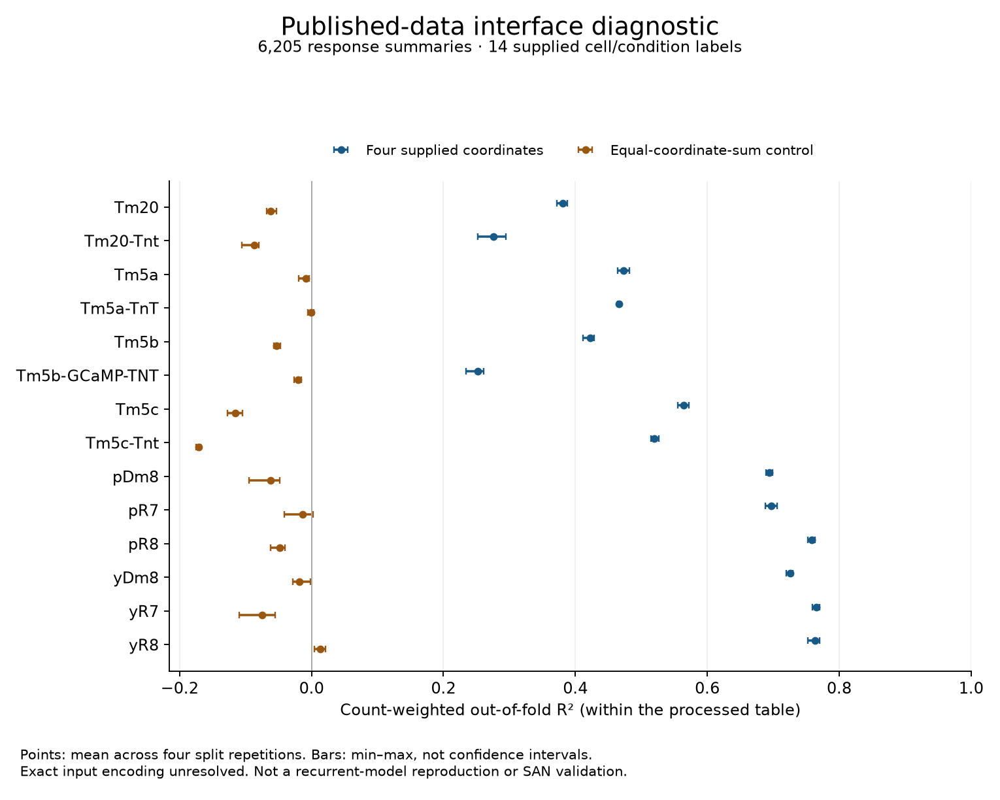

*Figure 1.* Every supplied condition is shown. Points are mean ordinary count-weighted out-of-fold R² over four predetermined split repetitions; bars show their min–max, not confidence intervals. Signed coordinates were used unchanged because the precise export transformation is not yet verified. This is neither a reproduced recurrent circuit nor a SAN-versus-conventional-model comparison.

The second diagnostic figure shows observed versus out-of-fold predicted responses for all conditions under the first fixed split repetition. It is included in the application evidence packet rather than selecting only the most favorable cell type. Output-blocking conditions were fitted separately; their scores do not constitute causal predictions of blocking.

The diagnostic establishes a traceable data-to-model-to-score interface and gives later implementations an explicit reference to improve on. It does not establish that recurrence is necessary, that SAN predicts the observations better, or that the receiving network experiences a color. The exact transform, fitted recurrent configuration, observation mapping and intervention normalization remain prerequisites for a faithful published-component reproduction. Competent nonlinear and recurrent comparators remain necessary before any claim of a SAN-specific advantage.

### 9.2 A saved-parameter replay of the published memory component

The complementary memory route has a clearer parameter/data contract. I retrieved the authors' two- and three-module fitted parameter files and their small experimental-summary workbook from a pinned repository version [13]. The two-module model has 16 free parameters, and the three-module model has 23. I used the saved optimized vector directly, without a new fit. Six populations, two stimulus roles, six stages and two odour contexts produce 144 possible observation entries; 86 have both a mean and a SEM. Missing measurements remain missing, with every retained value mapped to its exact spreadsheet cell. The two-module score excludes the α2 populations and therefore uses only 60 entries.

The implementation preserves the source's parameter ordering, adaptation update, clipped MBON responses, anti-Hebbian update and change in decay regime after three hours. It also preserves two distinct source protocols. The fitting script and Figure 5c script differ in selected ISIs and resting intervals. Both are evaluated, without choosing the better score after the fact. They can change corresponding point predictions by as much as 4.285 Hz in the two-module model and 4.142 Hz in the three-module model. The new native-output check below identifies agreement with the saved fitting figures, not agreement between the two schedules or with every published figure.

For each finite observation, let \(y_i\) be its mean, \(s_i\) its reported SEM and \(\hat y_i\) the replayed point prediction. I report

\[
E_{\mathrm{SEM}}=\sqrt{\frac{1}{n}\sum_i
\left(\frac{\hat y_i-y_i}{s_i}\right)^2}.
\tag{5}
\]

This is a descriptive standardized residual on the original fitting summaries, not a new likelihood test, a biological effect size or held-out prediction accuracy. Its values for the two-module model are 1.3691 under the fitting schedule and 1.5059 under the figure schedule; corresponding three-module values are 1.2780 and 1.4007. Because the model sizes use different observation sets, those numbers do not establish that one model is better than the other.

Three local controls use the three-module figure schedule. Setting both plasticity coefficients to zero leaves learned efficacy changes exactly zero but retains sensory adaptation; the standardized residual rises to 3.5913. Removing γ1-MBON→DAN feedback, without refitting the other parameters, gives 2.9099. Restoring the original connections and resetting the run returns exactly the original local output and score, 1.4007. This reset-and-replay is a software restoration check, not evidence of in-place biological recovery. The removal conditions are sensitivities of an already fitted model; they are not optimized competitor models or new experimental interventions.

*Figure 2.* All five declared three-module conditions are shown. The observed means and SEMs come from the public fitting workbook. Parameters are not refitted. No uncertainty interval or significance claim is attached to these point-model scores. The γ1 label identifies a mushroom-body compartment, not a gamma brainwave band. Complete population-response plots for both odour contexts, including missing-data boundaries and both timing schedules, accompany the application packet.

The fourteen context-specific runs took 0.097 seconds of numerical replay on one thread and saved 714 event states. A separate scalar implementation recalculated adaptation, activity and learning without importing the first model implementation. Its maximum state difference was 2.8422 × 10⁻¹⁴ in the variables' respective native units; the declared tolerance was 10⁻¹⁰. A separate workbook-XML readback and residual recomputation also passed. These are implementation checks, not independent scientific review.

There are important remaining limits. The original figure uses medians and roughly 16–84% intervals from 10,000 parameter samples; evaluating the optimized vector is not generally equivalent to that median. I have not run that uncertainty sweep, executed native MATLAB, reproduced the full membrane ODE model, or analyzed the underlying raw recordings. The point-reference result below strengthens implementation fidelity without closing those separate limits.

### 9.3 Agreement with author-saved native model outputs

Two independently written local calculations can still share an interpretation error. I therefore retrieved four author-saved MATLAB figure files from the pinned source repository. They contain the original fitting curves numerically, alongside observation means and error bars. Exact axis titles identify populations, the source's red/blue convention identifies stimulus roles, and graphics-object types distinguish model lines from experimental error bars. Correspondence was not chosen by numerical similarity. No embedded callback or MATLAB code was executed while reading the data structures.

Under the fitting schedule, all 96 two-module point predictions match within 9.7700 × 10⁻¹⁵ Hz, and all 144 three-module points match within 1.7764 × 10⁻¹⁵ Hz. The corresponding RMS differences are 1.3597 × 10⁻¹⁵ and 1.4803 × 10⁻¹⁶ Hz. The local comparison plan specified a 10⁻⁸ Hz tolerance before curve values were read. The saved observations and SEMs match the source workbook, including missing values. These results reproduce the saved native point curves to numerical precision; they do not newly measure firing in an animal.

The apparently newer April-labelled parameter files contain exactly the same optimized vectors and expanded model cells as the March-labelled files used in the first replay. They therefore supply no second independent fit. Sixteen runs preserve every combination of file label, model size, timing schedule and odour context; numerical replay took 0.112 seconds on one thread. The fitting schedule agrees with the native fitting curves, while the Figure 5c schedule retains the previously reported point differences. No optimization or Monte Carlo parameter sweep was used.

A separate raw-file/output readback passed 1,428 checks: exact hashes, curve identities, every saved point, trajectory linkage and aggregate statistics. This is a software verification path created in the same authoring workflow, not independent scientific review. The earlier replay code and all results are unchanged. The stronger conclusion is now implementation agreement with an external author-generated numerical reference, rather than agreement only between local implementations. It remains distinct from reproducing Figure 5c's sampled medians and uncertainty bands or establishing a SAN-specific mechanism.

### 9.4 A connected conventional reference for the full-episode test

The next implementation separates the shared test environment from the proposed SAN mechanism. It is a conventional, nonoscillatory controller in an engineered one-dimensional environment. Four ideal spectral bands and a signed-range instrument provide partial object observations. The range channel is an explicit engineering simplification, not a claimed native fly depth signal. Two supplied task templates share their first three components; the fourth component distinguishes them. Initial coarse observations therefore leave identity unresolved. Full sampling establishes a relation that can subsequently be carried through motion-associated coarse observations and inferred continuation during occlusion.

The controller's temporary state contains target-relative position, observation age, observed/inferred/unresolved status and integrated body displacement. Movement commands and actual measured displacement are separate. A retained exponential calibration estimates the displacement-to-command ratio. Clearing temporary state preserves that calibration, and separate revert/rescue controls test its causal role. This is an ordinary engineering learning rule, not the Huang–Luo mechanism or biological metaplasticity. The published memory component, hue diagnostic and present comparator remain separate implementations; no unverified adapter is hidden between them.

All 96 development episodes were retained: six scenarios, four fixed configurations and four policies, each lasting 24 steps. The adaptive-sampling and fixed-full-sampling policies are conventional references with the same sensor capabilities and task cues. Actual acquisitions differ because of their sampling choices. Command-as-return and frozen-calibration variants are ablations, not optimized competing theories. Scenarios include occlusion, actuator-gain change, their combination, uniform illumination change and an adverse coloured illuminant. The 2,304 event records expose observations, internal state summaries before and after receipt, actions, measured return and evaluator-only truth. The summaries are not the entire controller state; the complete-state audit in Section 9.6 addresses that distinction.

Under combined occlusion and gain change, the adaptive reference's mean pre-observation relation error is approximately numerical zero, while treating the issued command as actual return gives 0.13864 engineering units averaged over four fixed configurations. This near-zero reference result relies on stationary targets and noiseless range/body measurements. It does not establish robustness in a natural environment. Both variants can eventually arrive correctly after observations resume, so final task score alone misses the transient reconstruction error. Freezing actuator calibration increases mean movement-prediction error from 0.01664 to 0.07708 in this condition. The fixed-full comparator performs similarly to the adaptive reference; no SAN-specific advantage is being claimed.

*Figure 3.* Every planned scenario and policy is displayed. Means are over four deterministic engineering configurations, not animal uncertainty estimates. The first two panels distinguish current-relation error from command-to-return prediction error. The third counts steps with a fresh observed target relation. No condition or adverse result was omitted.

The coloured-light case exposes a distinct failure. After time 10, no policy freshly recognizes the target. The reference continues an inferred stationary relation and later stops using it for movement when it is too old. Some variants nevertheless reach approximately the correct location. That outcome is not successful color constancy or continued object recognition. A reconstruction and evidence-freshness audit prevents endpoint performance from hiding this limitation. The current observed/inferred flag is also not a calibrated probability distribution or an adequate uncertainty model for arbitrary hidden motion.

In the separate retention control, eight command/return pairs generated at gain 0.5 change an initial gain estimate of 1. Clearing temporary state leaves next-step displacement-prediction error 0.00078125, compared with 0.2 after reverting retained calibration. The independently specified correct rescue gives zero error and the incorrect rescue gives 0.4. These checks locate learned change in the stated engineering variable; they do not establish biological fast/durable/metaplastic partitions or a learned object repertoire.

The accepted 96-episode run took 0.130 seconds on one numerical thread and passed 205 checks. A separate saved-event/source audit recomputed state continuity, motion, calibration and all reported measures, passing 588 checks across the 2,304 events. The first run had an overbroad constructor settings dictionary containing unused environment constants. I preserved it, restricted the interface to nine public settings, added rejection tests and repeated the complete run. Episode outputs remained byte-identical. This repairs the declared data-flow boundary; it is not a security sandbox or a machine-checked refinement of Python into the mathematical model.

### 9.5 New evidence changes an internally used relation

A further two-world development intervention tests the distinction between internally used reconstruction and an investigator's decoder. In one world, the hidden target moves by 0.6 units at time 6; in the other it stays still. No change flag reaches the controller. Because the target is occluded, sensory inputs, measured body returns, internal relations and actions remain identical through time 8. The shifted world's inferred relation is wrong by 0.6 units. The half-separation bound in Section 7 predicts that one common reconstruction must be wrong by at least 0.3 units in one of the two worlds.

The first distinguishing observation arrives at time 9. It changes the internal relation; the selected actions first differ at time 11. All 46 declared challenge checks pass. This shows the permitted new evidence affecting a relation that is used by the movement policy, rather than only an external readout. It is still an elementary engineered comparator, not evidence that the full SAN rendering mechanism or phenomenal experience has been implemented. The challenge was designed after the benchmark as a development test and is not mislabelled a held-out evaluation.

*Figure 4.* The two controllers cannot react differently to a hidden displacement while their entire permitted input histories and initial states are identical. New sensory information changes the relation, then the action. Dashed truth curves are evaluator-only; no such curve is fed back to the controller. This causal test supplements, rather than replaces, the component-fidelity results.

### 9.6 Formal contracts and the complete-state interface

The observation-history theorem assumes equal complete states, not equal investigator summaries. In the accepted reference implementation, the object has eighteen fields: ten fixed settings, one retained gain and seven temporary fields. Its `state()` method exposes only five fields. Two constructed objects can therefore have identical status summaries yet different sampling modes and different action dictionaries. This is a test of summary noninjectivity, not a claim that such a pair occurred in the original run. The complete post-observation object, rather than the summary returned by `observe`, is the candidate mathematical state.

I replayed the two saved 24-step input histories through the unchanged controller, recording all fields before observation, after observation and after body return. All saved relation, action and adaptation outputs reproduce exactly. Complete states remain equal through time 8, first differ after the new evidence at time 9, and lead to different actions at time 11. The policy leaves the object unchanged during action selection in these replays. No new world simulation, parameter fit or result replacement is involved.

Twelve reset controls span four policies and three gain values. They verify retention of settings and learned gain, clearance of the seven temporary fields, reset idempotence and unchanged immediate prediction from retained gain. For the same returned command/displacement pair, resetting commutes with the retained gain update. It does not commute with the whole body-feedback method, which also changes temporary odometry. Thus the formal `updateLearned` corresponds only to that retained projection; substituting the whole method would misstate the theorem's premise.

All 394 source/interface checks pass, and the 48-event replay took 0.019 seconds. A separate 45-check proof audit validates source/log hashes, exact theorem inventory, seven empty axiom-dependency reports, assumption challenges and finite witnesses. The successful Lean check took 19.390 seconds with the child process tree restricted to one CPU. Access-denied and timeout attempts remain in the package; no metric-compilation success is inferred from its passing finite examples. These checks were produced in the same authoring workflow and are not independent expert review.

The result is a precise contract plus bounded evidence that this implementation respects the tested part of it. It does not verify all Python executions, floating-point refinement to real arithmetic, absence of every possible side channel, native fly physiology or SAN's missing circuit operations. Those boundaries are important because a formal result can be correct while an overly compressed mapping from the application to the theorem is wrong.

### 9.7 A source-registered anatomical neighborhood

I recovered two seed-summary tables and twenty input/output tables from the authors' pinned repository [16], totaling 17,053 bytes. The register preserves all 538 row-level observations, including two rows without partner identifiers. Grouping only identified ordered pairs yields 528 routes and 347 distinct identified nodes. These are different counting units, not 538 independent synapses, 528 fitted connections, or 347 measured response traces. Input tables describe partner-to-seed observations; output tables describe seed-to-partner observations. Each record retains its raw row, headings, compartment-labelled count columns and exact source location.

Eight routes occur in both views. Six have the same reported count; two do not. The yDm8-to-Tm5a pair with identifiers 720575940638424895 → 720575940639473998 is reported as 13 in the input view and 22 in the output view. The pDm8-to-Tm5b pair 720575940638634960 → 720575940627282584 is reported as 16 and 34. Their observations remain separate; neither summing duplicate views nor silently choosing one is justified by this audit.

There are also localized source-version or counting questions. Detailed pDm8 input rows sum to 221 versus 217 identified sites in its repository summary; yDm8 output rows sum to 369 versus 375. The article reports 2,132 identified output sites and 270 output partners across the seeds, whereas the repository summary reports 2,155 sites and partner-count text `274 (243)`. The article's yDm8 input-site statement is 487, compared with a repository total of 462. Those are not the same as its 379 identified input sites. These differences are recorded without determining their cause or asserting that a published biological conclusion changes.

Twenty identifiers have more than one recorded type label, including case/specificity variants and some distinct type names. One output table reverses its identifier/type header labels relative to the row values. The register preserves the labels and explicitly handles the header exception. It does not merge unknown endpoints, turn an unreported route into an anatomical zero, or infer transmitter sign, fitted strength, delay or time constant from a count. Source ambiguities must remain visible when constructing a numerical circuit.

The builder passes 1,767 checks in 0.071 seconds. A separate implementation rereads the original CSVs without importing the builder, passes 1,224 checks in 0.038 seconds, and rejects eight deliberately corrupted in-memory records. The corruption cases test direction, identifier precision, invented sign/timing, unknown-endpoint collapse, hidden header exceptions and duplicate-count handling. These are same-workflow software/provenance checks, not independent scientific review or new physiological observations.

This register advances the source-constrained implementation but does not reproduce the authors' fitted circuit. The model combines this anatomy with other published photoreceptor circuitry, population aggregation, direct and disynaptic recurrence, optimized effective signs and two fitted Dm8 interactions. Its equilibrium fit and the available pooled calcium amplitudes do not identify an oscillatory temporal reference. A proposed stateful SAN extension must therefore declare its additional receiving and timing assumptions, test their consequences, and connect them to the internal-use/action-return task without relabelling the anatomical census as that completed construction.

### 9.8 A source-constrained motor timing component

Hürkey and colleagues' five-motoneuron model supplies a distinct temporal reference [6,17]. Unlike the equilibrium-fitted hue circuit, it explicitly evolves membrane voltage and sodium/potassium gates under tonic input and electrical coupling. I recovered its two parameter configurations, author-saved single-cell trajectories, spike times and homogeneous coupling value through named archive-member reads. No downloaded program was executed, and no biological recording was analyzed. The equations were translated into a small local implementation in declared mV, ms, nS, pA and pF units.

Each single-cell regime has 20,000 stored time samples and three states, giving 120,000 compared values across the two regimes. The actual native initial gates are zero rather than the nominal values listed in the source JSON. With a 0.01 ms integration step, a free-running scalar calculation reproduces voltage within 8.96 × 10⁻⁹ mV for the SNL configuration and 3.01 × 10⁻⁸ mV for SNIC. The largest gate discrepancy is 4.13 × 10⁻¹⁰. All 25 saved spikes match within 2.28 × 10⁻¹³ ms. The declared tolerances were 10⁻⁶ mV and 10⁻⁷ for gates. This is agreement with author-generated model output, not a claim of biological measurement accuracy.

The five-cell test uses the source Figure 3B's chosen initial phase fractions and five seconds of dynamics. Four cases use a 0.1 ms step: SNL with the saved weak conductance of approximately 0.0435 nS, SNL with zero coupling, SNL with 3 nS coupling, and SNIC with weak coupling. A fifth repeats weak SNL at 0.05 ms. These are deterministic development cases, not the source's randomized multi-start sweep or an independent experimental sample. The SNL/SNIC comparison changes both Shab conductance and injected current; it does not isolate a channel-only effect.

Phase is interpolated between observed consecutive model spikes, only where all five phases exist. Splayness is one minus the square root of mean normalized variance in the ordered circular phase gaps. Equal spacing gives one and exact synchrony gives zero. Late-window scores are 0.999390 for weak SNL, 0.500029 without coupling, zero for strong SNL and 0.000405 for weak SNIC. The uncoupled identical cells retain their selected initial spacing rather than becoming random. The corresponding per-cell median late rates are approximately 8.503, 6.592, 6.592 and 6.562 Hz. Rate and phase therefore both matter when interpreting this comparison.

*Figure 5.* Four raster examples and all five summary conditions. These are model outputs, not animal data. The phases are organized by intrinsic dynamics and electrical coupling; no information-content or perception score is measured. A low first-harmonic order alone is not sufficient to establish a splay state. No uncertainty interval is claimed from a single chosen initialization.

*Figure 6.* The author-saved SNL and SNIC model voltages overlay the local equation replay; lower panels show nanovolt-scale numerical residuals for these declared initial conditions. This checks a published model-output component, not native animal timing, an independently fitted parameter set or the missing join to sensory-memory processing.

The half-step result has splayness 0.999723, differing by 0.000333 from the coarser run and passing the predeclared 0.025 statistic tolerance. That result must not be described as full trajectory convergence: ordinal spikes differ by up to 3.1 ms, one cell gains a boundary spike, and narrow spikes shifting in time produce a maximum same-clock voltage difference of 44.65 mV. Exact millisecond prediction would require a stronger numerical check. Native coupled Brian output has not been compared, so the separately held gap-current scheduling remains an explicit implementation assumption.

Each network run took 6.1–12.4 seconds on one numerical thread at verified below-normal process priority. A separate saved-output checker reconstructs phases and measures without importing the simulator, checks provenance and state bounds, and verifies the symmetric gap-current conservation and voltage-quadratic identities. All 181 checks pass, including ten in-memory corruption detections. This is same-agent software checking, not independent scientific review. All outputs, parameters, sources, the native overlay/residual plot and the adverse convergence details accompany the application.

The scientific contribution of this tranche is implementation fidelity and a concrete receiving-dynamics constraint. Nonnegative electrical conductance can coexist with phase repulsion when nonlinear intrinsic dynamics are included; simply calling the coupling negative or inhibitory would obscure the mechanism. The published motor result does not provide the missing hue-circuit time constants, prove a perceptual PWD, or establish the joined SAN account. No adapter currently connects this component to the spectral-object task or the separate learned-memory model. Those links require explicit clocks, permitted inputs, biological versus proposed parameter identities, and causal tests of internal use.

### 9.9 A connected receiver bridge and its identification limit

The fitted hue configuration remains unavailable from the exact inspected sources. I therefore identify the new construction separately rather than filling the missing published parameters with guesses. Fifteen reported directed routes connect the ten sampled anatomical seed cells. They constrain adjacency in this exploratory reduction, with both disputed count choices retained. The receiving dynamics, mixed-sign input projection, normalized weights, most effective signs and dimensionless exposure are declared hypotheses. The two inherited Dm8 model-sign constraints do not turn the remaining signs into measurements. External and unreported routes are excluded, not established absent. The native motor constants are not transferred to this visual branch.

Normalized spectral capture relative to a uniform reference drives a bounded directed phase-coordinate system. Each patch bank starts at zero relative phase and integrates for four dimensionless units. A common carrier is formed algebraically; it is not another integrated voltage state or a measured endogenous oscillation. A receiving readout learns population vectors from three intensities of each publicly cued task exemplar, separately for the three-band and four-band masks. The task exemplars are permitted teaching information, not current-world labels. The candidate's observation method uses the learned weights rather than ordinary raw-template distances; the audit still preserves the presented examples.

The resulting acceptance and ambiguity signals update the target-relative relation, which determines action. Actual measured displacement changes that relation and retained actuator calibration. The range tracker, action rule and calibration remain conventional. This is an implemented partial receiver-to-action bridge, not PWD throughout NAPOT, native phototransduction, the full four-role learning hierarchy or a multimodal experiential construction. In particular, independent patch initialization removes continuous spatial-array history; a single contracting phase coordinate is not durable learned structure.

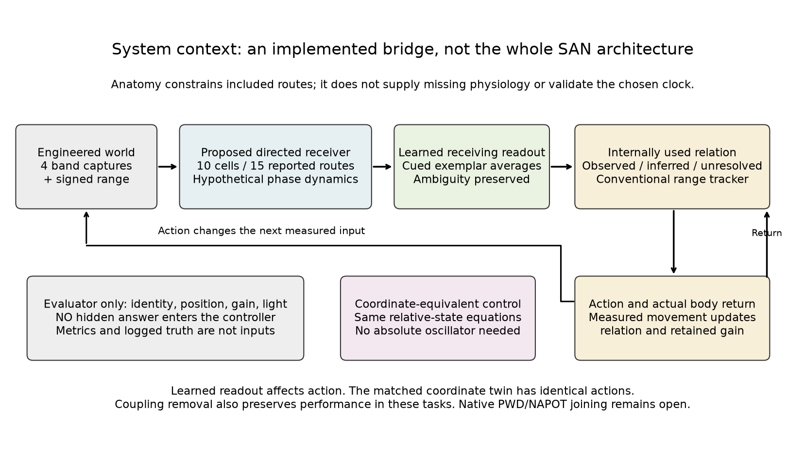

*Figure 7.* The new receiver and learned readout supply a causal input to an existing embodied reference. Evaluator truth remains outside the controller. Anatomical constraints, hypothetical dynamics and conventional tracking are visibly separated. The coordinate-equivalent control is an alternative description of the same relative dynamics, not a deliberately weakened baseline.

Nine cases cover 216 episodes and 5,184 saved events: both anatomical count settings crossed with two hypothetical unknown-sign settings, no coupling, a half step, a coordinate twin, and conventional adaptive/full-sampling references. All are the previously used deterministic development tasks; they are not held-out animal or agent experiments. The candidate cases have zero observed target-binding error and final standoff error below 10⁻¹⁵ in the declared world units. Colored illumination nevertheless leaves 11 inferred steps and only 12 observed steps in each adverse episode. Correct final position therefore does not establish uninterrupted recognition.

Five post-familiarization one-observation interventions distinguish learning from an unused annotation. Intact receiving weights select +0.4 movement; erasure gives zero; swapping the two learned associations selects -0.4; restoration of the actual learned weights restores +0.4. Flattening the relative difference before the readout gives zero. A full flattened episode remains unresolved for all 24 steps and ends 3.55 units from the desired standoff. Clearing temporary state preserves the learned readout and a body-return-learned gain of 0.625. These are implementation-specific causal results, not biological memory findings.

The strongest comparison is an identification limit. The coordinate twin integrates the same relative equations and emits their sine/cosine representation without constructing an absolute oscillator. All 576 paired actions are identical; the largest signal difference is 1.366 × 10⁻¹⁴. A common carrier cancels in the receiving operation and in familiarization. Analytic result M10 states that equivalence explicitly. Relative representation and its learned interpretation can matter causally while an added absolute carrier contributes nothing identifiable to this task. This does not reduce the broader SAN mechanism to the present quotient model or claim that biological oscillations never matter.

Removing coupling also preserves the candidate's task performance, although individual receiver coordinates change. That case receives its own matched cued familiarization; it is not a frozen-readout, zero-refit intervention. The result shows that these engineered tasks can be solved without recurrence under the same teaching information. It does not test away Christenson and colleagues' experimentally investigated recurrence-dependent hue mechanism. The candidate's greater number of fresh observations under the adverse illuminant than the legacy template references is confounded by different feature metrics and acceptance rules; both the coordinate twin and the no-coupling model reproduce it. No specifically oscillatory advantage follows.

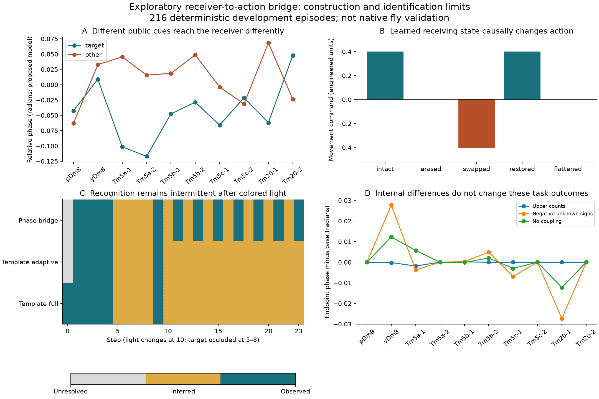

*Figure 8.* Panel A shows model-generated endpoint coordinates for the two public cues, not physiological recordings from the named cell types. Panel B tests learned readout content after familiarization. Panel C preserves intermittent recognition under changed illumination instead of using final navigation alone as success. Panel D shows changes in internal coordinates under altered counts, unknown signs and coupling; these changes do not establish corresponding task-performance differences. Every planned case remains available.

Analytic result M9 gives a forward-invariant phase box and a contraction bound under explicit absolute-row, drive and anchor assumptions. With the declared parameters, its inward margin is 0.12147 and its contraction-rate lower bound is 0.30030 per model-time unit. This is a conditional mathematical property, not a biological relaxation measurement or a formal proof of the numerical solver. Halving the integration step changes endpoint phase by at most 1.1052 × 10⁻¹¹ radians on the paired cases. A separately coded scalar Euler calculation differs by at most 2.2073 × 10⁻⁶ for two declared full-band observations. The earlier seven Lean lemmas remain the compiled inventory; M9–M10 are analytic additions.

Separate same-agent recomputation passes 8,912 checks, including eight deliberate in-memory corruption detections, exact source/output hashes, metric recomputation, interface rejection, learned-weight averaging and state ownership. Two extra complete episodes test hidden-label/sample-order invariance and flattened reception. This is not independent review or whole-program formal verification. Candidate cases take 1.93–3.96 seconds each, the coordinate twin 2.09 seconds, and template cases about 0.05 seconds on one numerical thread at verified below-normal priority. These times include familiarization and different-sized evidence logging, so they are not a controlled compute-efficiency comparison. The initial context figure's crossed arrow was preserved and corrected in a second figure version without changing results.

### 9.10 Source-shaped spectral input and the meaning of relative timing

The preceding input used independent synthetic bands. Real photoreceptor channels overlap, and the receiving apparatus affects their spectral response. Sharkey and colleagues measured selectively rescued photoreceptor responses with whole-eye electroretinograms under wide-field illumination [18]. Their preparation, pigment filters and recording geometry are part of the measurement. These curves cannot be treated as isolated opsin absorption, native terminal signals, or simultaneously recorded voltages from the identified downstream neurons.

Supplementary Data 1 supplies seven separate response curves: Rh1, Rh3, Rh4, Rh5 and Rh6 over 315–550 nm, and additional Rh1 and Rh6 curves over 450–700 nm. I preserve all 342 mean/SD pairs with exact workbook-cell provenance. The voltage unit is mV, and the source reports six animals per curve. The two overlapping windows remain separate. The workbook does not provide individual animal trajectories, cross-wavelength covariance or raw temporal records. In particular, it cannot reproduce the authors' normalize-per-individual-then-average analysis from group means alone.

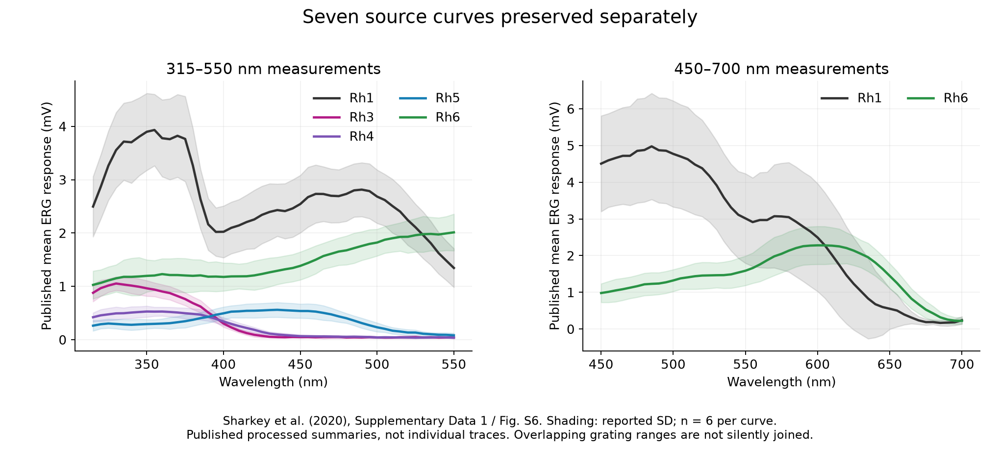

*Figure 9.* Redrawn from Sharkey et al. [18], Supplementary Data 1 and Figure S6, with attribution under CC BY 4.0. The shaded quantity is the reported standard deviation, not a confidence interval for our model. The panels preserve distinct grating-window measurements; no unreported joining or animal-level resampling is performed. These physiological source summaries are separate from the synthetic application outcomes below.

The engineering transfer uses four channels, Rh3–Rh6, only within their common 315–550 nm measurement window. Each aggregate curve is divided by its maximum in that window. Values at 330, 355, 435 and 520 nm form a nonnegative matrix S. These selected, exact-grid coefficients describe relative response shapes. They do not establish cross-receptor absolute gain: source animals and receptor classes were tested at separately selected intensities near half-response. Linear spectral mixing, the four-component illumination and the normalization are declared surrogate assumptions, not native physiological parameters.

For a synthetic reflectance r and illuminant E, the input is q = S diag(E)r/4. Illumination acts on spectral components before receptor mixing. Using the same four numbers as post-mixing receptor gains is generally a different operation. The saved adverse-light example gives a maximum difference of 0.09377 in the model's normalized response coordinates. Only the correctly ordered operation supplies the live application. Analytic result M11 states the operation-order condition and its limits.

To retain a controlled ambiguity, I construct two bounded reflectances from a direction in the nullspace of S's first three rows. They are indistinguishable through the three-channel access mask under the reference illuminant but distinguishable through all four channels. The scalar-recomputed null residual is below 4.08 × 10⁻¹⁷, and the full-response difference norm is approximately 0.09931. This is a deliberately constructed development task, not a newly discovered natural metamer or an unseen prediction. The coarse equality need not survive changed illumination. Nor can a deterministic phase recoding recover a distinction absent from equal observations and equal prior state. A further permitted observation or retained relation must provide the additional constraint.

The new application changes the sensory transform and familiarization examples without changing the earlier receiver dynamics, learned-readout rule, tracker, action policy or actual-return calibration. Its five cases use the same six scenarios, four seeds and 24-step episodes: the candidate, its coordinate twin, a no-coupling version with its own matched familiarization, and adaptive/full conventional references. Thus it adds 120 development episodes and 2,880 saved events. Every controller receives the same public exemplars and permitted observation fields; scene identity and gain remain evaluator-only.

The candidate has 460 fresh-observation steps, 92 inferred steps and 24 unresolved steps across its 576 steps. Its coordinate twin and relearned no-coupling version have the same counts and sampling totals. The adaptive conventional reference instead obtains 488 fresh observations with 3,392 exposed channel values, compared with 3,448 for the candidate. The full reference obtains 456 fresh observations with 4,352 values. Observed target-binding error is zero in all five cases; maximum final standoff error is below 10⁻¹⁵ for the first four and 8.82 × 10⁻⁹ for the full reference. Unequal metrics and acceptance rules remain, and final position does not certify continuous recognition. This extension provides no candidate performance advantage over the adaptive conventional reference.

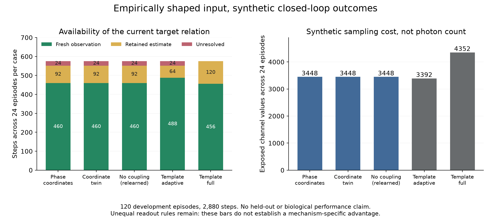

*Figure 10.* Every planned development case is retained. Left: the status of the internally used target relation. Right: exposed channel-value count, an engineered access-cost measure rather than photon count or calibrated biological computation. The no-coupling case includes its own familiarization; it is not an acute frozen-readout intervention. These are synthetic outcomes, not responses of the source animals.

The coordinate twin again produces identical actions, with maximum signal difference 1.411 × 10⁻¹⁴. This equality needs careful interpretation. The twin is the same relative dynamics written without the added common carrier, not a different independently specified biological process. Common-reference invariance is compatible with a receiver-relative account. The next model need not be mathematically incapable of a coordinate transformation. It must instead identify a physical receiving operation and ask whether an input–receiver timing relationship changes its consequences under a discriminating intervention.

This preserves the full source argument: current and learned receiving conditions transform departures throughout array-to-array reconstruction; reconstructed relations affect sampling, action and later readiness. The September contextual source review explicitly retains that relationship and the distinction between pattern classification and multi-view reconstruction. Neither this source-shaped front end nor a single phase-coordinate readout completes it. The remaining temporal requirement is a justified sensory reference and receiver process, not an arbitrary absolute phase origin. Motor-circuit time constants and end-of-flash spectral summaries cannot substitute for that measurement.

A separate same-agent audit checks source values directly against Excel XML and recomputes every saved spectral observation, action, measured return and reported metric through scalar calculations. Six deliberately corrupted source/event/metric cases are rejected. The audit is not independent scientific review. Each numerical case runs on one thread at verified below-normal priority; receiver cases take 2.71–2.79 seconds and references approximately 0.058 seconds, including unequal evidence logging. M11 adds conditional linear-algebra results, not new general mathematics or additional compiled Lean lemmas. Eleven analytic result families and the original seven compiled supporting lemmas remain different inventories.

### 9.11 Exact source context and a receiver-intervention witness

The source audit now fixes the Book 1 author review PDF and the September 12 Book 2 T14 PDF to exact hashes, reads 42 declared pages and visually checks two selected pages [19,20]. The bounded Book 2 routing pass verifies 51 canonical HTML files; its 127 candidate blocks are retrieval results, not 127 reviewed claims. The checked passages preserve a multimodal and recurrent construction whose internal relation guides action and further evidence acquisition. They do not license a voltage model from an analogy, a cortical band assignment in a fly, or an investigator's visualization in place of the system's own receiving operation. Complete historical custody, all cited book passages and full-corpus nonduplication remain open.

The Dm9 primary methods clarify a separate implementation dependency [9]. Ort-path removal, whole-cell suppression and output disconnection change different variables. Baseline selection, calcium-ratio processing and intervention onset also affect what the experiment can distinguish. The source article and its six figure legends were read; supplementary sample tables, raw recordings and pixel-level figure extraction were not. A reported difference from an earlier R8 rescue result remains unresolved because the earlier full methods were not newly accessible. Neither that difference nor the present audit supplies numerical receptor or temporal parameters for our construction.

I therefore added a deliberately limited two-state witness. Let p and d be deviations from declared operating points, and let all quantities be dimensionless engineering choices:

\[
\tau_p\dot p=-p+u+c d,\qquad
\tau_d\dot d=-d+(e-h)p.
\tag{8}
\]

The inhibitory receiving contribution h, parallel excitation e and emitted route c are separately manipulable. For h>e≥0, c≥0 and positive time constants, the intact linear system is stable and has p*=u/[1+c(h−e)]. Setting h=0 instead gives p*=u/(1−ce), provided ce<1; disconnecting output c=0 gives p*=u. An established clamp d=−δ gives p*=u−cδ. These elementary calculations specify intervention identities; they are not a fitted Dm9 circuit or a new general theorem.

One useful distinction survives at every time, not just equilibrium. When the established-clamp and output-cut initial p states differ by −cδ, their absolute P trajectories remain separated by cδ, yet their own-initial-baseline-subtracted P trajectories coincide. For c=0.6 and δ=0.25 the separation is 0.15. A ratio-normalized calcium indicator is not automatically this subtractive observation map. The witness does not imply that the actual published recordings fail to distinguish these conditions.

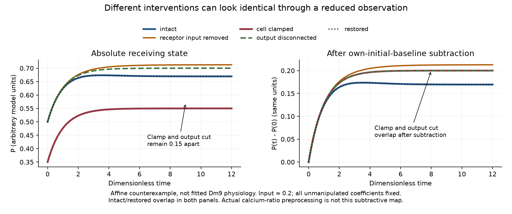

*Figure 11.* Five declared conditions at drive 0.2. Left: absolute receiving state. Right: the same state after its own initial baseline is subtracted. Intact/restored coincide; the cell-clamped and output-disconnected cases remain separated by 0.15 in absolute state but overlap after subtraction. The clamp is established before input, not acutely applied during the trace. All coefficients and time units are engineering choices; the plot is not empirical calcium data or native fly physiology.

The complete witness preserves three drives and five conditions, giving 15 trajectories with 1,201 saved points each. Matrix-exponential and separately written scalar RK4 paths agree within 1.72×10⁻¹¹, using time steps 0.01 and 0.005. Seventy same-agent checks include rejection of one deliberately corrupted point. The original run takes 0.126 seconds on one numerical thread at verified below-normal priority. No learning/refitting occurs, no new embodied episode is counted, and neither implementation is independent scientific review. M12 supplies the full proof and limitations. This makes twelve analytic result families; the Lean-compiled inventory remains the seven M7a/M8 supporting lemmas.

The immediate implementation consequence is to freeze the learned readout for an acute receptor/route intervention and record baseline, latent model state, observation transform, reconstructed relation and actual return separately. A separately learned post-intervention model tests reacquisition. Both are useful, but they answer different questions. The native temporal and molecular constraints still need to be supplied before this mathematical witness can become a physiological receiver.

### 9.12 Persistent receiving and a learned reconstruction-to-query loop

The next engineering extension joins two persistent receiving banks to a learned cross-view repertoire and the action-return task. Each bank has four rate-deviation coordinates and one pooled state. Direct paired inhibition, opposing input contributions and a separately removable positive output retain roles motivated by the sensory-source audit. Their numerical coefficients, pooling, input access and clock remain engineering choices. This is not the registered ten-cell hue anatomy or a fitted Dm9 circuit. The four source-shaped input coordinates likewise remain the declared ERG-derived surrogate, not simultaneous native receptor recordings.

Public calibration presents 512 input/state transitions and learns a linear readout of current output plus the receiver's own previous internal state. Thirty-six cued type/view/intensity presentations acquire a four-type, three-view repertoire. The running controller does not receive object labels or access the teaching environment. A partial view supports a candidate relation; predicted view partitions determine which additional sample could resolve its action-relevant key. The next actual view, not its prediction, revises that relation. Retained gain calibration uses measured movement. Receiving state persists between views and during the declared zero-drive absence convention rather than resetting for each patch.

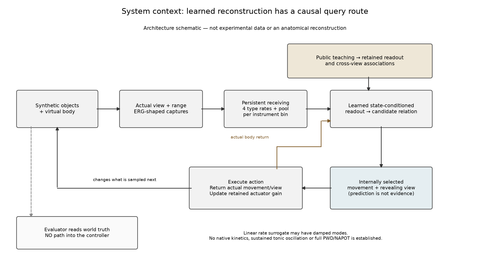

*Figure 12.* Implemented software boundaries, not an anatomical reconstruction. Learned receiving and cross-view state affect the internally used relation; the relation selects movement and additional evidence; actual action and return change later inputs and state. Evaluator truth has no return route into the controller. The surface sampler and one-dimensional body are engineered interfaces, not a full visual world or a fly's natural motor plant.

The frozen grid contains eleven conditions, six scenarios and four seeds: 264 deterministic development episodes and 6,336 saved steps. It includes ordinary observation, occlusion, altered motor gain, unseen object-position exchange, a changed public task and adverse illumination. No final or sealed evaluation session is used. The candidate, direct comparator and fixed survey have the same public teaching, observation opportunities and action limits. They have different internal processing costs; exact compute/memory equality and biological efficiency are not established.

The intact candidate requests 53 additional views and chooses the model-informative first view in 24/24 episodes. It has 473 steps with a relation supported by a current sample and retained history, 24 inferred-only steps and 79 unresolved steps. The saved `observed` label is not a claim that each current view independently discriminates the hidden key. Separate fresh-key sample counts are reported. There are no current-sample-supported binding errors in this declared grid, but eight wrong inferred bindings occur during unseen position exchanges. Mean final standoff error is 0.593333 in engineered position units; successful query operation does not imply perfect final performance.

The direct learned active-sensing comparator has exactly the same 576 actions and these same aggregate outcomes. The fixed survey uses 97 queries and has 455 current-sample-supported steps, while its mean final error is slightly lower, 0.562708. Thus the candidate does not dominate the comparisons. Cutting the query route leaves all 576 steps unresolved. Restoring that route at step 12 produces 230 current-sample-supported steps and 40 queries; the later restoration does not recover the lost early observation opportunity or establish equal final performance.

The receiving interventions also remain explicit. Acute removal of the proposed inhibitory input changes receiving state but not the candidate's action-level summary in this grid. Acute output disconnection increases query use to 81 and unresolved steps to 107. The engineered cell clamp instead produces 477 current-sample-supported steps and 75 queries, with lower mean final error than the intact candidate. This is not evidence that silencing biological Dm9 improves behavior: no animal parameters or response curves were fitted. Separate altered-input familiarization is reacquisition, not an acute rescue. The command-as-return control replaces actual displacement only in the relation/odometry update; gain calibration still receives measured movement. Its matching aggregate scores cannot establish that all body feedback is dispensable.

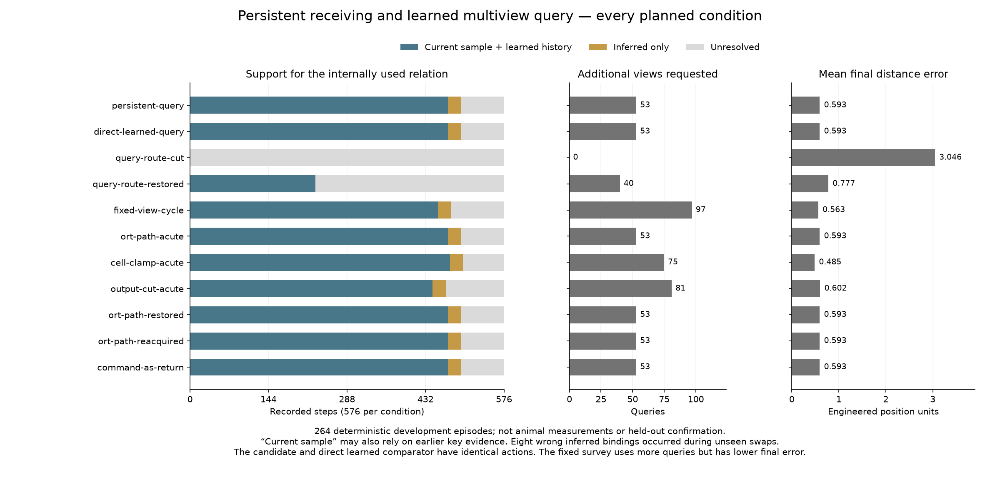

*Figure 13.* All eleven planned conditions are retained. Current-sample support may include previously learned and previously observed content. Position units and input rates are engineered. The direct comparator's equality, the fixed survey's lower final error and the apparently favorable clamp outcome are visible rather than removed. These deterministic development cases do not support animal-level confidence intervals or independent experimental replication.

Additional causal controls test more than disabling a branch. Swapping only learned associations for the unobserved views changes the chosen query while preserving the current-view prototypes and receiving decoder. Restoring those associations restores the query without training. A pair of worlds with different hidden keys produces identical first observations, states and queries; returned evidence separates their subsequent relations and actions. Twelve private-label/order permutation pairs preserve internal states and actions. These are same-agent software interventions, not independent reviews or evidence of phenomenal experience.

M13 explains an important limit of the receiving construction. In the linear discrete model,

\[
x_{n+1}=T^4x_n+Gq_n,\qquad
q_n=(CG)^{-1}\bigl[Cx_{n+1}-CT^4x_n\bigr],
\tag{9}
\]

when C selects the four outputs and CG is invertible. The learned readout is given those current outputs and the previous internal state. The teaching matrix has numerical rank ten; the analytic inverse reproduces the calibration inputs within 5.00×10⁻¹⁶, and the ridge-trained readout within 1.43×10⁻¹⁰. The inverse and the finite-catalog query-risk bound are elementary conditional statements, not newly discovered general mathematics. They explain why a successful learned receiver can retain no unique task-relevant information unavailable to a direct comparator.

The intact discrete receiving map has induced infinity norm 0.975 per substep and damped complex modes. Its stability does not imply absence of transient oscillation. Conversely, those mathematical modes do not identify an empirical fly frequency or a self-sustained tonic reference. The frozen plan's shorthand “not an oscillator” is qualified by the recorded mode audit, without changing the model or its results. A physical receiving account must identify available state, timing and intervention consequences; equivalent coordinates are not themselves a disqualification.

A separate scalar implementation recomputes every saved receiving, readout, candidate, query, movement and actual-return operation. Eight deliberate corruptions are rejected, and 42 additional control checks pass. Each main case takes 0.423–0.520 seconds at verified below-normal priority on one numerical thread. These checks establish the declared software operations and source/result identities, not all of SAN's proposed joining. The analytic inventory now has thirteen result families; only the previously reported seven M7a/M8 supporting lemmas are Lean-compiled.

### 9.13 Observable receiving without direct physical latent-state access

M13 exposed a limitation in the previous construction: the readout had the physical receiver's own prior internal state. The new extension separates a runner-owned physical frontend from an output-only decision controller. The latter receives four current terminal outputs, instrument address, presence, actual view, signed range and public task. It receives neither the engineered drive nor the physical pooled state. It owns its own estimate, learned cross-view prototypes, candidate relation, query and action-return state. Actual drive and latent state are saved only in evaluator traces for checking reconstruction error.

*Figure 14.* This software diagram covers the four output-only conditions, not the two privileged references. The output-history decoder does not own a physical receiving or world instance. Its known coefficients and continuous noiseless terminal outputs remain assumptions. Selected actions change the next input, and measured return updates the relation and actuator calibration. The diagram is not a physiological circuit or a complete SAN rendering.

The six-condition plan was frozen before execution. Two reference conditions reproduce the earlier learned-prior-state and direct-learned controllers. A current-only linear readout uses four current outputs and a constant, trained on the same 512 public calibration transitions. The output-history observer instead uses the declared engineered coefficients and its own previous output and scalar estimate. Both acquire prototypes from the same 36 public cued presentations. Two further observer cases keep those prototypes frozen: actual latent initialization is changed to +0.25 without informing the observer, or its assumed pooled time constant is increased by 50% while the physical receiver is unchanged. These conditions distinguish unknown initialization from a wrong internal model; neither is post-intervention retraining.

Six scenarios, four seeds and 24 steps yield 144 deterministic development episodes and 3,456 saved steps. The matched observer reproduces all 576 reference actions, with maximum reconstructed-input error below 4×10⁻¹⁶. It retains 473 current/history-supported, 24 inferred and 79 unresolved steps, using 53 queries with mean final standoff error 0.593333. Its eight wrong inferred bindings during unseen position exchanges remain present. Matching the references does not make all task outcomes correct.

The current-only readout has 388 supported, 24 inferred and 164 unresolved steps, uses 160 queries and differs from the prior-state reference on 406 actions. It selects the wrong target on 194 supported and 12 inferred steps, with mean final standoff error 3.029167. Thus the program's `observed` label is evidence-source status, not an external truth guarantee. This readout is a deliberately narrower temporal-access ablation. Its failure does not establish an advantage over a conventional equally informed observer, much less over all alternative theories.

Unknown initial latent state changes 36 actions, uses 58 queries and has input RMSE 0.0406113. Its mean final error is lower, 0.551667, despite early reconstruction error; that outcome is retained without interpreting the offset as generally beneficial. The time-constant mismatch has nonzero input RMSE 0.00266593 but no changed actions. The task's coarse decisions do not identify that kinetic parameter in this grid. This is a bounded example of parameter nonidentification, not a universal equivalence of different dynamics.

*Figure 15.* Status, actual wrong-target counts and final error are separate measures. Unknown initialization's lower final-position score and the mismatched observer's unchanged actions are retained. All units are engineered. These are development simulations, not noisy animal trials, held-out tests or independent replications.

For the M13 extension, partition the four-substep map as \(p_{n+1}=F_{pp}p_n+F_{pd}d_n+Hq_n\) and \(d_{n+1}=F_{dp}p_n+F_{dd}d_n+Jq_n\). An invertible \(H\) permits

\[
\hat q_n=H^{-1}(p_{n+1}-F_{pp}p_n-F_{pd}\hat d_n),\qquad
\epsilon_{n+1}=(F_{dd}-JH^{-1}F_{pd})\epsilon_n,
\tag{10}
\]

where \(\hat d\) is updated using the same map and reconstructed drive, and \(\epsilon=\hat d-d\). The result follows by subtraction and induction under exact coefficients and outputs. Known initialization gives exact reconstruction; unknown initialization converges only if the scalar error multiplier has magnitude below one. Here it is 0.7430473 per observation. An initial error magnitude 0.25 falls to 0.000200602 after 24 observations. These are engineered sample-index quantities, not measured biological adaptation rates. The supplement also derives the output-noise terms; 32 algebra checks are not noisy behavioral experiments. This extends M13 rather than adding another result family or compiled theorem.

A separate scalar checker recomputes all 2,304 output-only events. The 1,152 reference events are exactly equal to their preserved accepted counterparts. A separate replay presents only the permitted packets and actual body returns, in reversed sample order, and reproduces all output-only states and actions. Eight corrupted records and eleven forbidden/malformed packets are rejected; a repeated clock is also rejected. These are same-agent software checks, not a security sandbox, independent review or additional biological observations. Every main case runs sequentially in 0.405–0.523 seconds at verified below-normal priority on one numerical thread.

The useful result is specific: this model can implement the learned relation–selected view–actual return operation without reading physical latent state directly. Known dynamics, accessible continuous outputs and an invertible input map remain substantive assumptions. The ordinary observer also explains why the improvement is not SAN-specific. Full PWD throughout NAPOT, native observation kinetics, learned regulation of the receiver, wider multimodal content and the experience question still require their own construction and evidence.

### 9.14 Publisher anatomy, label history and an explicit identity boundary

Draft 14 recovered the exact supplementary PDF and the small recurrent-connectivity CSV through the public BioStudies article record [23]. Both lengths and MD5 checksums agree with the article XML. At that revision, only 1,207,496 and 387 bytes were downloaded, respectively; large recording archives remained untouched. All sixteen PDF page texts were read, and anatomical pages 2–15 were visually inspected. A Pypdf parser and a separate PDFMiner/pdfplumber implementation compare Tables 1–22 against the twenty-two original repository CSVs.

All 538 detailed rows agree numerically, including their separate count compartments, and the two seed summaries agree in the compared fields. There are 94 raw type-label differences, one consisting only of trailing whitespace, and one differing partner identifier. The label differences include both more specific published names and distinct type assignments; no universal alias dictionary or biological correction follows. These are differences between source representations, not ninety-five new neurons or experimental discrepancies.

Table 17's first row describes an output from Tm5b 720575940627282584. The PDF reports Sm40 partner **720575940625550823**, whereas the pinned repository reports Mti_M6 partner **720575940628230417**. Both give 22 medulla and zero lobula sites. Extended Data Fig. 5's caption independently within the same publication names its Sm40 skeleton as 720575940625550823. This strengthens the published-source identification but does not establish a materialization mapping between the two IDs. Both reports remain preserved; neither is silently substituted into prior results.

The two alternate partners are outside the ten modeled seeds. All 23 within-seed observations retain their exact direction, identifiers and counts, giving the same fifteen directed routes as the earlier application register. This checks a specific source projection; it is not a new trajectory run or evidence that a broader population aggregation would be unaffected. The earlier cross-view count differences, detail-versus-summary differences and article-versus-summary questions remain unresolved in the newly accessible publication too.

The 387-byte file supplies Extended Data Fig. 5's Sm31, Sm40 and Mi3 connectivity summaries, not the fitted twelve-population matrix. Blank entries are not asserted zeros. Its caption distinguishes reconstructed routes and putative transmitter assignments. Neither these summaries nor the larger anatomical table provide the missing optimized weights, fitted parameters, native temporal reference or a SAN-specific physiological mechanism. They do supply an auditable anatomical basis for subsequent construction.

The separate check passes 3,582 assertions and rejects four deliberate corruptions covering partner substitution, erased label disagreement, changed count and merged unidentified endpoints. The comparison and check run in 0.645 and 1.888 seconds at verified below-normal priority. These are same-agent software checks, not independent scientific review. That anatomical revision counted no new application episode, animal-data reanalysis, mathematical result family or compiled lemma. Its contribution is a verified publisher-to-repository bridge with its exact limits visible.

### 9.15 Publisher traces and an executable observation contract

The publisher's Figure 3 source-data archive is now acquired through the same public article record [24]. A small initial ZIP-directory read identified one member, rather than assuming a filename described a complete dataset. The full archive's MD5 matches the article XML; the extracted 124,714,328-byte Parquet table matches the separately read member CRC and size. A time-limited first transfer remains explicitly unaccepted. The accepted retry does not overwrite it or confer scientific status on the partial file.

The table has 1,322,829 rows, six LED-named input fields, SNR, 100 columns labeled at 25 ms intervals from -500 to 1975 ms, eight cell-type labels and an anonymous integer index. This is an event-aligned published-data representation, not raw imaging movies or a verified unprocessed acquisition stream. It contains Tm20, Tm5a, Tm5b, Tm5c, pR7, pR8, yR7 and yR8; it does not supply the Dm8 and mutant conditions also present in the smaller combined export. Named subject, recording, ROI and trial identifiers are absent. An anonymous index, a repeated SNR or a row count is not assigned one of those identities.

The newly read `processing.py` and package settings, together with a complete read of the pinned `analysis.py`, clarify the measured endpoint [16]. The processing path smooths fluorescence-change traces, interpolates event-relative samples, and defines on-amplitude as the mean at 350–500 ms minus the baseline mean at -350 through -100 ms. Both masks include their endpoints, giving seven and eleven samples. Later code normalizes per-ROI responses and forms grouped means before the model's row-level cross-validation. The reviewed source path explains these operations; it does not identify the exact export-generation call or justify applying them twice to already processed data.

I therefore applied only the declared two-window functional to the supplied samples, without new smoothing, interpolation, clipping or rescaling. Every required value had to be finite. Exactly **115,356 rows** meet that requirement; **1,207,473** have incomplete windows. Missing entries remain missing rather than becoming zero responses. This sparsity can reflect unobserved stimulus/ROI combinations, but the exact generating reshape is not recovered. It is neither a million independent experiments nor evidence that the publication intended such an interpretation. All exported SNR values already exceed two, so the two declared policies—complete windows, with or without that SNR requirement—give the same result.

The complete windows yield **4,137 distinct cell-type/LED-value groups**. An SQL calculation and a separate bounded-batch NumPy calculation agree on their counts and derived fields, with a maximum absolute difference of **5.684341886080802 × 10⁻¹⁴**. The separate check accounts for all source rows and rejects altered counts, amplitudes, baselines and duplicated group identities. These are implementation and data-integrity checks, not independent scientific review. The table supplies no saved amplitude column, so agreement between the two implementations is not described as parity against a native saved endpoint or reproduction of the upstream fluorescence pipeline.

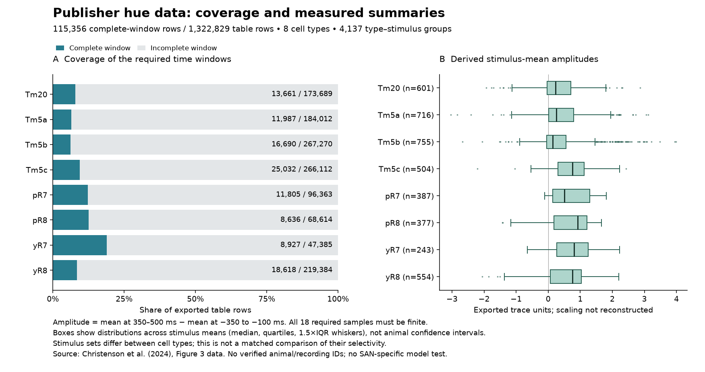

*Figure 16.* Measured source-table coverage and distributions of derived stimulus-mean amplitudes. Left: complete windows relative to all exported rows. Right: medians, quartiles and 1.5×IQR whiskers across type-specific stimulus means; these are not animal confidence intervals. Stimulus sets differ across types and the export scaling is not independently reconstructed, so this is not a matched comparison of neuronal selectivity. No SAN-specific model is fitted in this figure.

At the close of Draft 15, this recovered source improved access to observed time courses but left the small export's signed receptor-coordinate transform unjoined to the six LED-named fields. Section 9.16 advances that particular boundary. The samples remain distinct from direct fast-phase measurements, and their biological grouping remains unavailable. Neither data table supplies the optimized twelve-population circuit checkpoint. A useful fitted comparison still requires the input/output, selection and parameter contract; it is not another observer variant chosen to compensate for missing biology. No new mathematical result or simulated episode was counted by the Draft 15 readback.

### 9.16 Calibrated inputs, reproduced amplitudes and selection limits

The next analysis was specified before comparing receptor coordinates or fitting any response [7,16,24]. It uses two source-named sensitivity sets, the published LED spectra, the article's rounded background illumination and a separately defined integer-grid reconstruction. The six LED fields are interpreted conditionally through the source's contrast formula. Testing all integer backgrounds from 1 through 1,000 nE gives the minimum compatible vector **[10,61,102,255,327,245] nE** in duv, uv, violet, rblue, lime and orange order. Multiple integer backgrounds can satisfy the grid; a common scale cancels in relative capture. These numbers are an inferred reconstruction, not recovered recording metadata.

With spectral overlap M from LED l to opsin j, I calculate relative capture as `q_j = Σ_l(c_l+1)b_l M_lj / Σ_l b_l M_lj` and apply `X_j = log((q_j+0.001)/1.001)` once. The wavelength grid, sensitivity curves and opsin order are fixed from the source. No affine alignment, response-based selection or second logarithm is introduced. The signed compiled coordinates are legitimate log-coordinate candidates, not negative physical captures. The numerical integration convention is explicit; the unpinned library environment prevents claiming a complete historical package replay.

Of the four declared combinations, only the source-keyed **govardoskii** sensitivity set with the minimum integer-grid background reproduces the compiled inputs. All **3,961/3,961** rows for the eight cell types present in Figure 3 match at the fixed 1e-6 coordinate tolerance. A separate scalar reconstruction reduces the largest actual same-type difference to **1.5987211554602254 × 10⁻¹⁴**. Each has exactly one qualifying same-type LED group. The three other combinations yield no tolerance matches and remain reported. Ignoring cell type gives 4,680 matches among all 6,205 compiled rows, but that cross-type count is not substituted for a biological join. Four mutant and two Dm8 labels have no same-type source in Figure 3; their 2,244 rows remain explicitly unavailable for this response comparison.

A second frozen plan then compares the already-derived complete-window response means with the compiled amplitudes, without any fitted multiplier or offset. Exactly **2,167/3,961** amplitudes agree, with maximum absolute difference **1.9984014443252818 × 10⁻¹⁵**. Their contributing counts also agree. The remaining **1,794** amplitudes differ, by as much as **2.831232372051946** in the supplied response units. Every disagreement has a larger observation count in the Figure 3 aggregate, and no comparison has a smaller one. Agreement of amplitudes and counts selects exactly the same subset. This pattern identifies an observation-selection boundary, not permission to select a favorable subset or declare one export erroneous.

At the close of Draft 16, the source supplied a relevant route: `AllRegression.make` selects PLS-assigned groups before calculating mean responses and counts. The exact group/ROI selector used for the compiled export and a referenced excitation-transform definition were unresolved. The uncalibrated difference was retained instead of manufacturing a matching fit. Section 9.17 now recovers the archived transformation and tests the grouping route; neither numerical pairing nor a matching anonymous count establishes independent-animal identity.

*Figure 17.* All shared-type input coordinates match under the specified source-shaped reconstruction. Left: response/count agreement and disagreement for every comparable row, with agreeing/total labels. Right: saved compiled responses versus the unchanged source Figure 3 complete-window means; the dashed line is equality, not a fitted regression. All 1,794 disagreements remain visible. The figure compares two representations of published data, not independent experiments, animal confidence intervals or a SAN-specific causal model.

The score contract also matters. The earlier diagnostic retains ordinary weighted R². The source's `nan_r2er_score` is a sign-preserving uncentered squared-cosine score with small-value floors, not a noise-corrected statistic by itself. `r2er_n2m` requires a separate noise-variance estimate. The recurrent circuit's training loss is the negative sum of uncentered weighted cosines. Seven explicitly synthetic unit cases and 14 source-versus-scalar comparisons distinguish these operations without claiming biological fit scores. The recovered equation-7 TeX/XML additionally places a square differently from the pinned code: its literal zero-noise expression gives 0.68 for identical `[1,2]` vectors, while the code gives 1.0. That specific representation discrepancy is preserved; the original fitting call and PDF typography are not newly verified by the test.

The input checker passes 219 interface/numerical assertions, recomputes all 49,640 global and 31,688 available same-type row comparisons across the four cases and two coordinate domains, and rejects six corruptions. The separate response checker accounts for all 6,205 exported rows and rejects five further corruptions. These are separate same-agent implementations, not independent scientific review. No new physiological time constant, full recurrent parameter fit, sealed-session result, mathematical theorem or simulated episode is counted. The useful advance is an exact sensory-input bridge and a directly reproduced response subset, with the remaining selection problem made testable rather than hidden.

### 9.17 Anonymous matrix recovery and a mixed observation-selection result

Before inspecting new response-group outcomes, I tested two declared array layouts using only the six LED fields, anonymous index, cell type and SNR. Every one of the 1,322,829 indices is unique and covered within its type. The stimulus-major arrangement preserves constant LED values within each stimulus row and constant SNR within each proposed column for all eight types; the column-major alternative fails those consistency tests in every type. This establishes eight anonymous rectangular arrangements totaling 2,450 columns, not the original identities of 2,450 cells or independent animals. Repeated SNR is not used as an identity key. The amplitude step additionally verifies that each observation has either all 18 required samples or none: there are no partially present windows under this endpoint.

The current `transform.py` calls `excitation_contrast` without defining it. Its bounded file history contains only the initial commit. However, the same pinned repository tracks a Python 3.8 cache containing the absent function. I inspect that 5,633-byte artifact as inert data against the official Python format, without importing or executing it. Its named instructions specify `excitation(X,n)=X^n/(X^n+1)` and `excitation_contrast=excitation-0.5`, with default exponent one. The already reviewed `AllRegression.make` multiplies the latter by two. The cache embeds an October 2, 2023 source timestamp and a 3,896-byte source size, different from the present plain source. An embedded timestamp is neither independent public-custody proof nor proof of the runtime used for the article. This is recovery of an archived definition, not silent restoration of the entire historical environment.

I then freeze a separate grouping plan. Its inputs are the five source-shaped relative captures in rh1/rh3/rh4/rh5/rh6 order, using the previously declared conditional background and source curves. Its response matrix contains the unchanged baseline-subtracted endpoint, with missing entries converted to zero only in the PLS fitting copy, as in the reviewed code. The locally implemented two-component NIPALS procedure uses no centering or scaling, regression deflation, tolerance 1e-6 and at most 500 iterations. NumPy supplies SVD and pseudoinversion; parity with an installed historical SciPy/dreye environment is not asserted. The archived excitation definition removes one guessed dependency, but does not recover the original dataset key, normalization history or export choice.

Grouping follows the parameter rather than its misleading inline comment: `BINSIZE=pi/2` specifies **90-degree**, not 45-degree, intervals. Two-dimensional factor angles are measured by the declared `atan2` convention. The first largest bin in a 24-bin histogram sets the modal center; four wrapped half-open bins produce the labels. Group zero, centered on that mode, is the primary selector declared before the compiled-response comparison. Every type's primary group exceeds the source's 10% minimum fraction. All four groups are saved; none is chosen later because it fits the exported answers. The source retains multiple groups, and its exact compiled-export choice is still unknown.

The result is informative but not a native reproduction. **2,508/3,961** shared-type rows match both the compiled amplitude and count under fixed tolerances (1e-10 for amplitude and exact counts). Count agreement alone occurs in 2,569 rows; therefore a matching count does not by itself identify the same observations or amplitude. Relative to the preserved all-column calculation, **1,901** rows agree in both procedures, **607** newly agree, **266** lose a prior agreement, and **1,187** disagree in both. Thus **1,453** rows remain unmatched, including **34** with no finite observation left in the primary group. The largest finite absolute amplitude difference is **1.415857448371419** in the supplied response units. The 2,244 mutant/Dm8 rows without same-type Figure 3 data remain outside this comparison.

| Type | Comparable rows | All-column joint matches | Primary-group joint matches | Prior matches lost |
|---|---:|---:|---:|---:|
| Tm20 | 575 | 195 | 261 | 64 |
| Tm5a | 646 | 354 | 363 | 84 |
| Tm5b | 733 | 367 | 419 | 7 |
| Tm5c | 490 | 213 | 252 | 31 |
| pR7 | 373 | 190 | 298 | 0 |
| pR8 | 367 | 276 | 276 | 0 |
| yR7 | 241 | 174 | 196 | 0 |
| yR8 | 536 | 398 | 443 | 80 |
| **Total** | **3,961** | **2,167** | **2,508** | **266** |

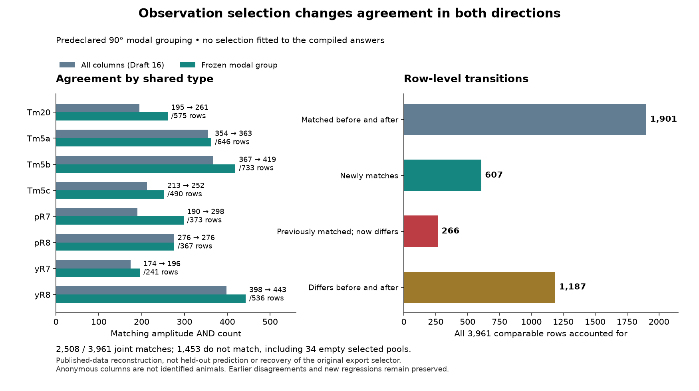

*Figure 18.* The left panel compares matching amplitude/count totals; the right accounts for every row's transition. Net improvement does not erase 266 losses, and empty selected pools remain among the unmatched rows. These are comparisons of processed representations from one published-data source, not independent replications, confidence intervals, held-out predictions or evidence of a SAN-specific effect.

Separate checks recalculate every one of the 115,356 complete response windows directly from the published table using scalar sums (maximum difference 7.11 × 10⁻¹⁵). The reviewed source's isolated power-iteration function agrees with the local reconstruction across eight synthetic cases and all 16 actual component fits; the largest actual weight difference is 2.22 × 10⁻¹⁶. Another calculation checks all 2,450 angles and 23,630 group-count/finite-mean fields. Three sign-reflection checks per type preserve primary membership; the nearest actual group boundary is 0.000306 radians away. Corruption tests detect altered counts, altered means and erasure of adverse transitions. These implementation checks share an analyst and data source. They are not independent scientific review.

The mixed outcome is a reason to retain the exact selection/export gate. It is not permission to search exponents, sensitivity sets or subsets until every row matches. The biological model's original observation contract must be recovered independently of desired responses before this branch can support a claimed native fit or a calibrated SAN extension. The full history-shaped receiving, PWD/NAPOT, multimodal reconstruction and action-return problem remains the research object; an auditable preprocessing result supports that construction without replacing it.

### 9.18 Versioned observation contracts and a necessary-condition test

The source utility that assembles response tables takes an explicit `group_id` and an optional suffix selecting the output estimator. It can also return original recording/ROI metadata that our Figure 3 table does not contain. Reading this utility identifies an interface, not the particular call that created the compiled artifact [16,24]. I therefore keep the anonymous matrices distinct from recovered biological identities and the tested modal group distinct from a known final export choice.

Two further tracked caches make the version boundary important. The archived analysis, carrying an embedded October 11, 2023 source timestamp, contains a branch that interpolates responses over a common stimulus hull, samples 1,000 locations with seed 11, and divides each resulting output by its mean square before PLS. This is not the current plain source's direct observed-row, zero-filled fitting copy used in section 9.17. The archived method also stores two separate summaries: `mean_outputs` comes through `correlated_mean`, while `mean_outputs_hard` comes through unweighted `nanmean`. The current plain method uses the latter arithmetic operation for `mean_outputs`. The cached mean-square division is reported as written, not silently changed into RMS normalization. No archived code or database is executed.

An older model loader, carrying an embedded March 8, 2023 source timestamp, names a default morning/1000/Salcedo/group-zero/saline-gamut-all key. Its cell list contains eleven populations, with a single Tm20 class. The final article's circuit contains twelve, including pTm20 and yTm20 [7]. Thus the older defaults cannot simply be substituted for the final model/export configuration. The embedded dates do not establish which versions ran together, and archived parameter bounds are not final fitted parameters. Both archived and current grouping retain the same 90-degree bin parameter. The article's response normalization, response-space RBF interpolation and movie-denoising kernel PCA remain distinct operations; their presence does not identify the original grouping/export call.

I next test a question that does not require guessing any labels. Let a_1 <= ... <= a_n be the finite observations for one matched type/stimulus, and let k be the compiled count. Every unweighted mean of exactly k observations must lie between

    L_k = (a_1 + ... + a_k)/k
    U_k = (a_(n-k+1) + ... + a_n)/k.

Both extrema are attainable. M14 proves this by ordering the selected indices and bounding the jth selected observation between a_j and a_(n-k+j). It also gives a measurement-error extension. This is elementary conditional mathematics, not a novel selection theorem or a biological proof. Intermediate values need not be attainable: observations [0,2] with count one admit means zero or two, not one. Furthermore, separately attainable row targets need not share one consistent column selector. The computation tests a necessary condition, not subset recovery.

The result is **3,961/3,961 within the envelopes** at the predeclared absolute tolerance 1e-10. No reported count exceeds its available pool. In **2,167** rows the count uses the whole pool; **1,794** allow a smaller subset. The maximum interval width is **5.662464744103893** in the supplied response units. A strict zero-tolerance comparison flags 1,553 rows, but the largest outside distance is only **1.9984014443252818e-15**, below the declared tolerance. All strict and tolerance-aware values remain in the ledger. The **2,244** rows lacking same-type source observations remain unevaluated.

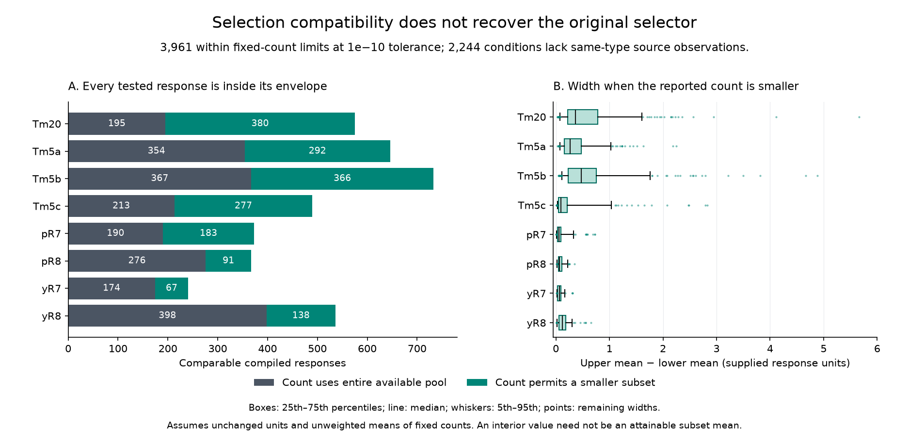

*Figure 19.* Left: comparable responses partitioned by whether the count uses the whole available pool. Right: envelope-width distributions for rows permitting a smaller subset; boxes show the interquartile range, lines the median, whiskers the 5th–95th percentiles, and points the remaining widths. These are descriptive distributions of a computed support interval, not biological confidence intervals. Containment does not identify the original selector or validate a SAN mechanism.

A separate calculation reconstructs all 115,356 complete observation windows directly from the source table and recomputes extrema using heaps rather than the producer's sort. The maximum source-window difference is 7.11e-15 and the maximum envelope-endpoint difference is 3.55e-15. It checks all 6,205 row records, twenty-one small cardinality cases against 183 exhaustively enumerated subsets, five invalid inputs and four deliberate ledger mutations. These checks share an analyst; independent scientific review remains open. M14 brings the analytic result-family inventory to fourteen; the compiled inventory remains the previous seven supporting lemmas.

The new test does not rule out selection alone, but it does not repair the particular selector's 1,453 mismatches or erase its 266 lost agreements. It is conditional on the same pool, count meaning, stimulus join, normalization and unweighted averaging. Correlated estimation or changed normalization would require a different contract. Consequently a residual must not be attributed to a missing SAN mechanism before those observation choices are resolved; conversely, broad interval compatibility is not confirmation of the mechanism. The full history-shaped reception, tonic/PWD throughout NAPOT, multimodal relation, action/actual return and learning construction retains its separate obligations.

### 9.19 Selective receiving through a visual-memory projection

The full construction needs a route from ongoing sensory processing into memory-bearing relations, not a convenient concatenation of unrelated modules. Ganguly and colleagues map direct visual projection neurons and indirect inputs through local interneurons to visual Kenyon cells [25]. Their work supplies an anatomical constraint on that route while leaving the construction of coherent visual-object representations open. I use its preserved export for a restricted receiving test, not as proof of the full SAN mechanism.

Source versions matter here too. The article describes 74 inputs to 147 left KCγ-d cells. The archived matrix contains 79 source rows and 147 target columns; its CSV and NPY agree at all 11,613 entries [26]. Its 528 nonzero entries total 11,489 contacts. The separate KC ID list differs, and only 69 source rows match the accompanying table's dated October 2023 ID field. The notebook updates IDs and queries live connectivity before saving, so the export is not silently labeled as the exact v630 article population. KCγ-d is a cell-class name, not a gamma-frequency assignment.

I preserve three predeclared representations: the count export; an all-column binary >=5 version; and the notebook's literal first-column removal and >5 rule. The last gives 146 targets and 495 edges. Its numerical input has no identifier column to remove. The source audit also retains the published covariance-trace-squared participation-ratio formula and the notebook's unsquared expression separately. Neither convenient preprocessing nor a numerical resemblance to the paper's 9.1 is treated as reproduction of its final analysis. Connectivity covariance is not measured activity or conscious content.

For the executable model, W is the transpose of each matrix, normalized by the receiving row sum. This is nonnegative mixing, not measured synaptic sign or strength. The historical source patterns were constructed around a unit baseline using one numerical weakest-singular-direction representative per projection. In the notebook case the kernel is four-dimensional, so fixing the vector's sign does not identify a unique experiment across valid singular bases. Reproduction must therefore use the exact frozen 79-element contrasts, not rerun SVD and assume it returns the same input. The new witness packet records all three vectors as hexadecimal binary64 values and SHA-256 hashes of little-endian float64 bytes, with the original source and model hashes. Paired noiseless response lessons supply the controller's repertoire. This generous familiarization is an installed prototype memory, not the native recurrent plasticity model. The controller receives only actual response, acknowledged receiving state and clock. It uses its stored alternatives to select a query, waits for the actual response, then either chooses an action or abstains. Actual movement updates retained actuator gain and subsequent commands.

Each selective state doubles one incoming contribution before mixing and rescales the resulting operator to match W's Frobenius norm. Common gain after mixing cannot reveal a null contrast; component-selective receiving can. Equal norm controls one linear amplification statistic, not metabolism or firing. The location and biological implementation of these channel-specific changes remain hypotheses. No unverified four-channel-to-79-port map, oscillator frequency or molecular mechanism is inserted.

An exact source witness makes the distinction unusually concrete. Two input rows, `720575940645104840` and `720575940610053827`, each have five retained contacts to the same sole target, `720575940605829297`. Their difference is exactly invisible to the fixed count/binary projection. The dated metadata predicts GABA for both LT43 sources but reports zero left KC contacts in its different version; this mismatch is retained, not interpreted as a physiological intervention. Integer dependencies and finite-field lower bounds certify ranks 78, 78 and 75 for the three projections. These are not merely SVD estimates.

There are 96 historical constructed episodes: three representations, four cases, four fixed disturbance levels and two signs. The delivered-query condition resolves **16/24** and abstains in eight. The condition named `ordinary_observer` uses the same learner, paired lessons, query rule and actuator update, replacing Euclidean distances by their squares and the nonnegative threshold by its square. Squaring preserves both membership and maximizing comparisons in exact arithmetic; stable ties use the same state order. Its identical choices and commands are therefore an algebraic-equivalence/implementation check, not the result of an independently specified active-sensing policy. The new diagnostic checks all 24 stored paired decisions and commands. This clarification does not identify the separately specified output-history observer in earlier sections with this implementation. Fixed receiving and requested-but-undelivered changes each abstain in **24/24**. No wrong choices occur in the historical grid. This is not an animal error rate or evidence of SAN-specific superiority. Each representation has its own frozen constructed contrast; their different success counts are not a matched-stimulus anatomical comparison.

The count-export state separates the historical chosen pair by 0.01941632 model units. Disturbance balls of radius 0.01 still overlap, explaining the unresolved cases. The historical binary and notebook representatives have separations 0.03998748 and 0.02418095; all fail to separate at radius 0.05. M15 proves the two-ball boundary, the inability of common post-mixing gain to undo information loss, and the intersection-of-kernels condition across actual receiving states. Three routes removed by the notebook preprocessing cannot be restored by any such gain change. These are elementary conditional results, not new general mathematics, a new Lean compilation or a proof of the complete biological architecture.

The successor diagnostic additionally fixes exact algebraic witnesses in the hash-pinned source ordering. The contrast e22−e23 is invisible initially but recoverable under selective receiving in count and all-column >=5 projections, resolving 4/8 and 6/8 constructed trials. In the notebook projection e28−e32 is a recoverable equal-route contrast, with maximum separation **0.06661089** and 6/8 resolved trials. In contrast e22, e23 and e37 are individually supported on zero routes and each resolves **0/8**, remaining invisible in all 80 receiving states. All six baselines and undelivered queries abstain. These results explain why a minimum-singular direction is not a unique experimental input or a representative success rate: distinct directions in the same kernel have different receiving consequences. The new notebook separation is not substituted for the historical 0.02418095 result.

A fixed sensitivity grid applies four exact contrasts to counts, all-column >=5, all-column >5, first-column-removed >=5 and first-column-removed >5 representations. The strict threshold removes the three zero routes regardless of first-column deletion, while the e28−e32 equality requires the combined notebook operations in this grid. A second fixed grid inserts hypothetical weights 0, 10^-6, 10^-3 and 1 at an identified original five-contact location for each lost port. Any positive replacement removes exact invisibility, but a very small exposed distinction may remain below a nonzero disturbance bound. This is a model sensitivity, not reconstruction of missing anatomy or estimation of native conductance. Exact kernel claims remain specific to the declared export and preprocessing.

A separate historical scalar implementation checks all 70,400 paired receiving values with maximum discrepancy 4.45 × 10^-16, every episode and actual return, exact rank brackets, six deliberately corrupted records and seven malformed packet cases. The preserved measured figure displays the algebraically equivalent observer's equality and every unresolved condition. Its first overlapping layout is preserved but rejected. The new witness diagnostic reproduces all 96 original episode decisions without reselecting contrasts and separately checks exact integer dependencies, binary64 vector round trips, actual-return conditions, all fixed sensitivity cases and normalization. Scalar versus matrix responses for its baseline/chosen states differ by at most 2.22 × 10^-16; Frobenius mismatch is at most 1.78 × 10^-15. These are same-agent software checks, not independent physiology. Original third-party source files containing authentication strings were not executed or used and are excluded from a future public bundle.

This extension makes a selective-receiving operation and its evidence-dependent consequence explicit. It is still not tonic/PWD operation throughout NAPOT, broad multimodal reconstruction or learned biological regulation. The native hue and memory models are not yet physiologically joined. Those requirements remain the object of the next construction, rather than being replaced by this narrower test.

*Figure 20.* Preserved historical results for all three versioned projection representations. Delivered queries resolve 16 of 24 constructed cases. The plotted ordinary observer is an algebraically equivalent squared-distance implementation of the same learner, so the tie checks implementation rather than independent comparative performance. Fixed receiving or an undelivered query does not resolve the cases. The right panel shows model-unit disturbance bounds, not a measured biological noise distribution. Different now explicitly frozen contrasts underlie the three representations; the new exact-witness diagnostic is reported separately and does not relabel this historical figure.

### 9.20 Local inhibitory physiology constrains the receiving operation

The independent channel changes in §9.19 require a biological implementation; anatomical contacts alone do not provide one. Amin and colleagues' local APL experiments [27] and Prisco and colleagues' calyx study [28] identify relevant but different sites of inhibitory regulation. The former measures spatial consequences along the mushroom body; the latter locates a normalization operation in olfactory microglomeruli before KC integration. Neither establishes independently commanded control of the visual-memory export's arbitrary input ports.

I performed a descriptive secondary analysis of [27]'s unaltered Figure 7 source workbook. The exact-cell plan was fixed after reading the schema but before calculating these summaries. The primary comparison uses each exported vertical-branch profile's responses at 200 and 260 micrometers along the standardized backbone. A2 measures KC response to horizontal-lobe APL stimulation without odor; A4 measures its normalized inhibitory effect during odor. Ten paired records per condition are retained, with no clipping or exclusions. Their respective source scales are preserved; the article's additional plotted-curve maximum normalization is not reconstructed.

For `d = response(260) - response(200)`, A2 has nine positive contrasts and one negative contrast, with mean 0.395047 and median 0.433796. A4 has ten positive contrasts, mean 0.353374 and median 0.254592. The A2 exception, -0.021885, remains in all summaries and the measured figure. These findings agree descriptively with the paper's reported spatial pattern; they are not a new animal experiment or an independent replication.

The article reports ten neurons from nine flies per condition, but the export does not identify the shared fly. I therefore enumerate all 45 possible two-record-fly assignments, average each candidate fly's pair first, and then weight nine flies equally. The resulting mean ranges are 0.364528–0.437357 for A2 and 0.305050–0.379009 for A4. They remain positive under every candidate pairing. These are assignment-sensitivity ranges, not confidence intervals. I do not treat twenty records across the two conditions as an independent sample, reconstruct animal identities, or claim to reproduce the published inferential statistics.

Two elementary identities make the limits explicit. For two observations a,b, the least-squares spatially equal prediction is `(a+b)/2`, with residual `(a-b)^2/2`. Its summed residuals here are 1.066305 and 0.982254 in distinct squared source scales. A saturated two-value description fits exactly by construction; this is not held-out model selection. In particular, unequal observed responses do not reject every common-gain circuit: unequal baselines and calcium measurements can produce such differences under shared gain. For contrasts with total S and a shared-fly pair i,j, the equal-fly mean is `(S-(d_i+d_j)/2)/9`. These identities explain the descriptive comparison and enumeration; they are not a new named theorem family or Lean compilation.

A separately written decimal checker verifies 124 scalar quantities, recomputes the 90 condition-specific cluster assignments and rejects five deliberately incorrect result packets. Maximum decimal-to-floating discrepancy is below 1.05 × 10^-16. It checks the schema and finiteness of all 280 selected source cells, not a replay of raw imaging preprocessing. The two implementations and figure inspection are mine, not independent scientific review. [All pairs, results, checks and the measured figure](../application/apl-receiving-data-v0/README.md) remain available.

The physiological interpretation is deliberately specific. Calcium-response locality supports investigating local regulation; it supplies neither a signed conductance matrix nor a native oscillation clock. Experimentally expressed P2X2 is an intervention instrument, not the fly's native ATP-gated controller. Prisco's olfactory pre-integration circuit is a candidate mechanism, not the same population as the visual KC-gamma-d export. The four selected Prisco/Dryad source files [29] were acquired on 22 September and verified against the repository's sizes and SHA-256 values. The earlier browser-security stall is historical acquisition context, not the present file status.

The selected Figure 5C workbook contains five plane-level PA/MP means (3.20, 2.39, 2.03, 1.79, 1.69) and FA/MP means (1.42, 1.31, 1.24, 1.13, 1.04), each accompanied by SEM and a displayed `n=8` for every plane. An ordinary least-squares line through these **five summary points** has slopes -0.362 and -0.094 per plane. Those numbers redraw the descriptive direction reported by Prisco and colleagues; they are not the paper's animal-level regression, its p-value, or a new test of SAN. The Figure 4B/4D workbook contains ten nonempty rows of four Mean/SD/N condition blocks. Each of the supplement's twenty APL ON/OFF inter-odour delta cells equals the same-row **Oct minus Mch** Figure 4 mean to floating-point tolerance. Its `Mch-Oct` headers therefore conflict with the numeric sign; neither the supplement nor this calculation adds an independent sample, reconstructs the published ANOVA, or identifies an animal-level unit. The other supplement series has one value absent, and its record relation to the Figure 4 rows was not established. The selected README identifies additional primary figure data and processing code, not native phase-resolved traces in these four files. [The exact source hashes, readback, code and figure](../application/prisco-summary-v0/README.md) and [the Figure 4 dependency and sign audit](../reviews/FIGURE-4B-4D-SUPPLEMENT-DEPENDENCY-AUDIT-20260922.md) are preserved.

The eLife Version of Record's Figure 5C caption reports `n=7`, whereas the official selected Dryad workbook displays `n=8` in both series. With no animal IDs or individual imaging traces in this workbook, I cannot determine whether the numbers reflect different inclusion sets, count definitions or a source discrepancy. I therefore do not recompute the article's inferential statistic or assign independent biological replicates from the five planes. This count boundary must remain visible in any figure caption and later review. The source table is useful for verifying a reported local-response pattern, but not for establishing arbitrary controllable receiving ports, PWD phase, or a full multimodal fly reconstruction.

The next connected test must distinguish contact-specific receiving modulation, cell-level threshold/gain change and feedback-coupled inhibition under matched evidence. Local activity cannot silently become an independent task-controlled diagonal matrix. This reanalysis strengthens the biological component specification while preserving the open visual-to-memory identity map, native timing, learned regulation and whole-loop PWD/NAPOT requirements. The [source audit and receiving contract](../research/APL-LOCAL-INHIBITION-AND-RECEIVING-CONTRACT-20260920.md) makes those dependencies explicit.

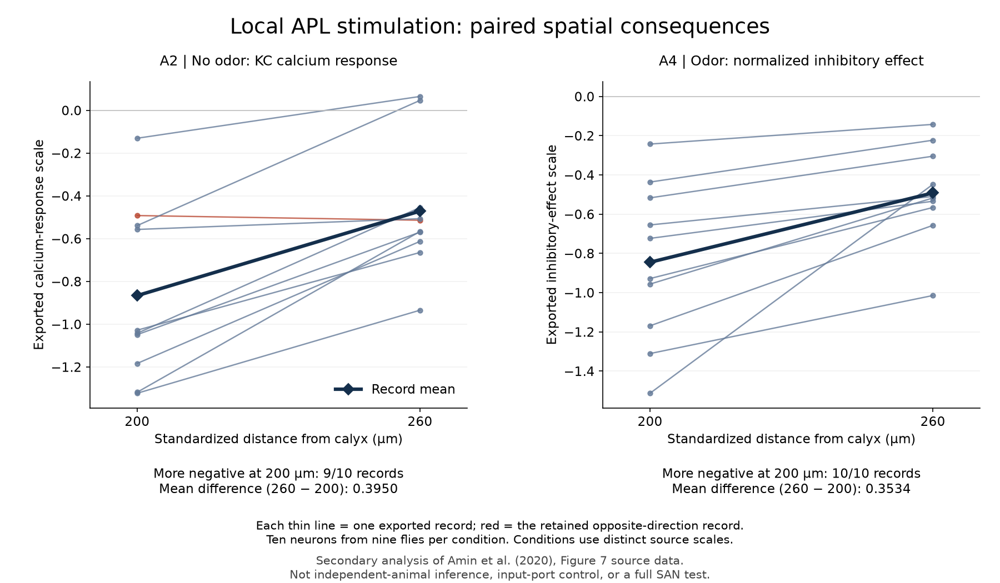

*Figure 21.* All ten exported records per condition remain visible, including the A2 opposite-direction pair in red. The left and right response scales differ. These within-record profiles are a secondary analysis of Amin et al. source data, not ten independently identified flies, a new experiment or proof of input-port controllability.

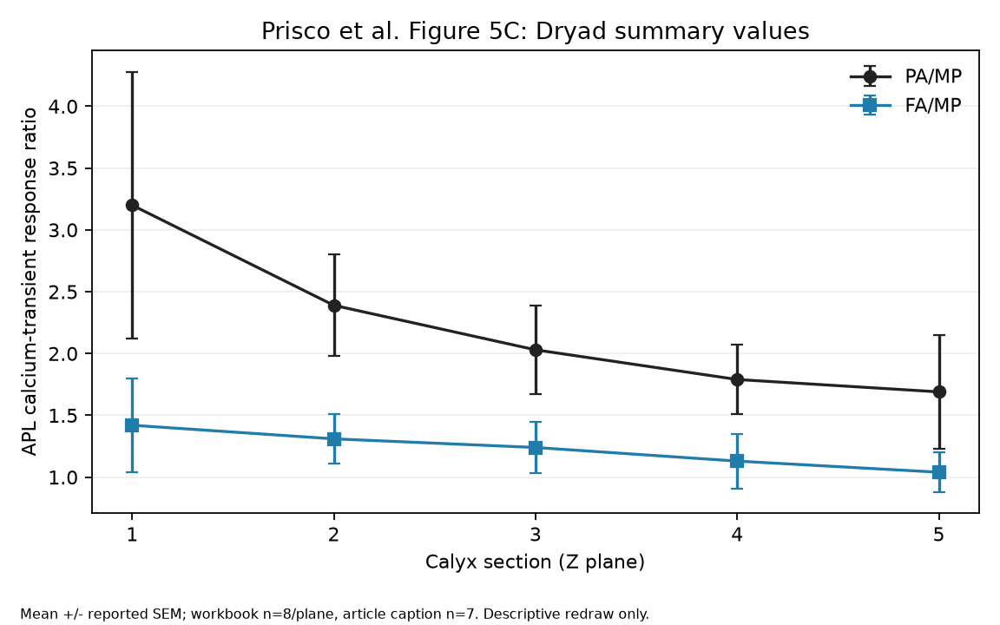

*Figure 22.* The five plane-level means and reported SEMs are redrawn without estimating animal-level covariance or a new p-value. The deposited workbook displays `n=8` per plane; the published caption reports `n=7`. The discrepancy is unresolved, and the five planes must not be counted as independent animals.

### 9.21 Scope of this preprint

This preprint preserves persistent receiving, learned cross-view relations, causal selection of further evidence, the bounded output-only observer, the historical visual-memory receiving test and all hue-export findings. It preserves the secondary analysis of Amin and colleagues' local inhibitory responses and official Prisco/Dryad table intake, descriptive Figure 5C readback and Figure 4 source-dependency audit. It adds exact-input receiving witnesses, preprocessing sensitivity and the prospective intervention below, while correcting the interpretation of one equivalent-observer control. The inventory remains fifteen analytic result families and seven earlier compiled supporting lemmas; none of these diagnostic corrections is counted as a new theorem family. The 22 preserved figures distinguish source data, saved-model outputs, synthetic applications and system-context diagrams rather than conflating them.

The present contribution is a **source-bound construction and intervention-test program**, not the finished fly brain. Section 10 now states a concrete rejection outcome for one proposed receiving operation; failure to finish the full construction is not itself falsification. There is no complete connectome, independently reproduced hue-parameter optimization, joined native-timed SAN simulation, raw-imaging preprocessing replay, comparative SAN advantage or phenomenal-experience result. The original hue export configuration, native timing, final recurrent parameters, visual-memory mapping and independent receiving-port controllability remain open. A subsequent empirical implementation must retain PWD throughout NAPOT and join broader multimodal content, plasticity and actual action-return. The selected Dryad files are acquired, but attention-recording access and the Figure 5C replicate-count reconciliation remain incomplete; neither a guessed clock nor inferred animal grouping fills those gaps. The Figure 4 supplement's header-versus-value sign conflict and derived-data dependency remain explicit. Wider source/nonduplication review, held-out evaluation, calibrated uncertainty, independent fly-neuroscience review, verified release rights and author readback are later gates, not accomplishments implied by a draft label.

Reproduction packets: [hue diagnostic](../application/hue-component-v0/README.md), [hue source audit](../research/HUE-COMPONENT-SOURCE-AUDIT-20260919.md), [coordinate-invariance proof](../MATHEMATICAL-SUPPLEMENT-02.md), [memory component and results](../application/memory-component-v0/README.md), [memory source audit](../research/MEMORY-COMPONENT-SOURCE-AUDIT-20260919.md), [finite-settling proof](../MATHEMATICAL-SUPPLEMENT-03.md), [native output comparison](../application/memory-native-reference-v1/README.md), and [exact SAN source bridge](../research/EARLY-SAN-SOURCE-BRIDGE-20260919.md).

Connected-reference evidence: [application, complete results and limitations](../application/embodied-reference-v0/README.md), [architecture and input/state interfaces](../application/embodied-reference-v0/ARCHITECTURE-AND-INTERFACES.md), and [closed-loop observational-equivalence proof](../MATHEMATICAL-SUPPLEMENT-04.md).

Formal/interface evidence: [compiled proof and full evidence map](../formal/observation-memory-v01/README.md), [reset definitions and limitations](../MATHEMATICAL-SUPPLEMENT-05.md), and [exact application-to-theorem mapping](../formal/observation-memory-v01/APPLICATION-INTERFACE-MAP.md).

Anatomical evidence: [register, all source observations and separate checks](../application/anatomical-register-v0/README.md), [source discrepancies and exact model boundary](../research/HUE-ANATOMY-AND-MODEL-BOUNDARY-20260919.md), and [machine-readable reproduction contract](../application/anatomical-register-v0/CIRCUIT-REPRODUCTION-CONTRACT.json).

Timing evidence: [executable component, all cases and numerical limits](../application/flight-timing-component-v0/README.md), [primary-source and equation audit](../research/FLIGHT-TIMING-SOURCE-AND-REPRODUCTION-20260919.md), and [hue archive/identity boundaries](../research/HUE-ARCHIVE-ACCESS-AND-IDENTITY-20260919.md).

Connected exploratory evidence: [all nine cases, controls and limitations](../application/phase-receiver-bridge-v0/README.md), [complete architecture and assumptions](../application/phase-receiver-bridge-v0/ARCHITECTURE-AND-ASSUMPTIONS.md), and [bounded-reception and identification-limit proofs](../MATHEMATICAL-SUPPLEMENT-06.md).

Source-shaped sensory evidence: [application and all five cases](../application/spectral-receiver-bridge-v0/README.md), [physiological source and transfer boundary](../research/PHOTORECEPTOR-SOURCE-AND-TRANSFER-BOUNDARY-20260919.md), [receiver-relative source clarification](../research/RECEIVER-RELATIVE-INVARIANCE-AND-SOURCE-CONTEXT-20260919.md), and [spectral mixing and observation proofs](../MATHEMATICAL-SUPPLEMENT-07.md).

Source-context and intervention evidence: [exact book editions, pages and mechanism map](../research/BOOK-EDITION-AND-MECHANISM-READBACK-20260919.md), [Dm9 primary methods and receiving contract](../research/DM9-RECEIVING-AND-MEASUREMENT-CONTRACT-20260919.md), [all intervention trajectories and reproducibility entry point](../application/receiver-intervention-contract-v0/README.md), and [M12 derivation](../MATHEMATICAL-SUPPLEMENT-08.md).

Learned-query evidence: [complete application, all results and executable entry point](../application/multiview-query-v0/README.md), [architecture and exact assumptions](../application/multiview-query-v0/ARCHITECTURE-AND-ASSUMPTIONS.md), [M13 derivation and boundaries](../MATHEMATICAL-SUPPLEMENT-09.md), and [source requirement versus prior active-sensing research](../research/MULTIVIEW-QUERY-SOURCE-AND-COMPARISON-BOUNDARY-20260919.md).

Observable-receiver evidence: [complete application and all six outcomes](../application/observable-receiver-v0/README.md), [exact output and learning assumptions](../application/observable-receiver-v0/ARCHITECTURE-AND-ASSUMPTIONS.md), [M13 observer and noise extension](../MATHEMATICAL-SUPPLEMENT-10.md), and [recovered earlier primary methods and temporal limits](../research/HEATH-PRIMARY-RECOVERY-AND-TEMPORAL-BOUNDARY-20260919.md).

Publisher-source evidence: [complete anatomical recovery and implications](../research/HUE-PUBLISHER-SUPPLEMENT-AND-IDENTITY-20260919.md), [all source differences and seed-route comparison](../research/hue-supplement-readback-01/checks-01/PROJECTION-AND-DIFFERENCES.json), and [visual readback](../research/hue-supplement-readback-01/VISUAL-READBACK.md).

Publisher-trace evidence: [complete data readback, plan, all outcomes and measured figure](../application/hue-recording-readback-v0/README.md), [processing-source and observation contract](../research/HUE-RECORDING-PROCESSING-AND-OBSERVATION-CONTRACT-20260919.md), and [separate full-row recalculation](../application/hue-recording-readback-v0/checks-01/CHECKS.json).

Input/response bridge: [all plans, source identities, four cases, row-level comparisons and checks](../application/hue-input-contract-v0/README.md), [calibration, selection and score audit](../research/HUE-INPUT-RECONSTRUCTION-AND-SCORE-CONTRACT-20260919.md), and [complete response-comparison ledger](../application/hue-input-contract-v0/response-01/ROW-COMPARISONS.csv).

Observation-selection evidence: [plans, frozen groups, all results and checks](../application/hue-observation-selection-v0/README.md), [archived-source and selection audit](../research/HUE-ARCHIVED-TRANSFORM-AND-GROUPING-AUDIT-20260919.md), and [all 6,205 comparison rows, including the unavailable conditions](../application/hue-observation-selection-v0/comparison-01/ROW-COMPARISONS.csv).

Observation-contract evidence: [source versions, all envelopes and checks](../application/hue-export-contract-v0/README.md), [complete source audit and inference boundary](../research/HUE-EXPORT-VERSIONS-AND-OBSERVATION-ENVELOPES-20260919.md), and [M14: extrema proof and limits of containment](../MATHEMATICAL-SUPPLEMENT-11.md).

Selective-receiving evidence: [all constructed trials and limitations](../application/visual-memory-route-v0/README.md), [source-version and mechanism audit](../research/VISUAL-MEMORY-RECEIVING-AND-VERSION-BOUNDARY-20260919.md), and [M15 exact ranks, kernels and noise boundary](../MATHEMATICAL-SUPPLEMENT-12.md).

Astra successor evidence: [exact historical contrasts, basis-independent witnesses and sensitivity](../application/visual-memory-witness-v1/README.md), [fixed diagnostic protocol](../application/visual-memory-witness-v1/PROTOCOL.md), [complete source-hashed results](../application/visual-memory-witness-v1/results-v1/RESULTS.json), and [specific receiving-intervention and rejection contract](../research/SELECTIVE-RECEIVING-INTERVENTION-CONTRACT-ASTRA-20260923.md).

### 9.22 A distinct observer comparison joined to action and return

The [new frozen protocol](../application/receiving-action-v01/PROTOCOL.md) uses the same hash-pinned 79-by-147 export without an SVD-selected stimulus. It fixes the count-export contrast \(e_{22}-e_{23}\), the notebook contrast \(e_{28}-e_{32}\), and the notebook's zero-route \(e_{22}\). Patterns are a unit baseline plus or minus 0.2 times the chosen contrast. Selective receiving doubles its first nonzero source coordinate before mixing and then matches the baseline operator's Frobenius norm. Fixed receiving, cell-wide post-mixing doubling and an honestly acknowledged undelivered request are separate controls. The assumed controllable diagonal port is still not a measured APL intervention.

Two observers receive identical installed prototype pairs and two actual acknowledged observations. The conservative observer intersects labels compatible with the finite disturbance support and acts only when one remains. The genuinely different Bayesian observer multiplies the supplied likelihood weights and minimizes declared expected loss: a wrong sign costs 1, abstention costs 0.25 and a correct sign costs zero. The probability law is available to both programs, but the conservative rule deliberately uses only its support. This differs from the historical norm-versus-squared-norm equality. It compares statistical decision rules and their objectives, not a SAN mechanism against an uninformed opponent.

Disturbance offsets are the five integers from -2 through 2, with masses \(1,2,4,2,1\) divided by 10, along the calibrated response-contrast direction. Their scale is half the selective separation, fixed across conditions for each witness. The zero-route case uses scale 0.001 on one receiving coordinate. These are an invented finite noise model and noiseless calibration, not fitted fly activity. Every hidden sign and pair of disturbances is enumerated with exact probabilities. Consequently the following numbers are exact model expectations, not an animal error rate or a confidence interval.

For either recoverable contrast under selective receiving, the conservative observer is correct with probability 0.51, wrong with probability zero, and abstains with probability 0.49. The Bayesian observer is correct with probability 0.83, **wrong with probability 0.05**, and abstains with probability 0.12. Expected losses under the declared cost are 0.1225 and 0.08. More actions and lower expected loss therefore come with a nonzero error rate; improved coverage is not an unconditional safety improvement. The identical rates for the two recoverable witnesses arise from their matched *relative* noise scale and are not evidence that the source projections are equally robust anatomically.

Both observers always abstain under fixed receiving, post-mixing gain and denied requests, as they do for the permanently invisible witness even with selective receiving. The matrix facts constrain these outcomes: common gain cannot recover a contrast already in the kernel, and a zero incoming route remains zero under a diagonal multiplier. The finite probabilities supplement these conditional structural facts rather than replacing them with a claim about biological gain control.

The chosen sign next drives a simple actuator of actual gain 0.8 or 1.2. Starting estimated gain is one. Returned movement divided by the nonzero command updates that estimate halfway toward the observed gain, and the second command compensates using the new estimate. Movement magnitudes change from 0.8 and 1.2 to 0.888889 and 1.090909—closer to the **chosen** unit target. For positive gain \(g\), this update gives second-movement magnitude \(2g/(1+g)\), with chosen-target error \(|g-1|/(1+g)\), smaller than the original \(|g-1|\). A wrong sensory decision remains a wrong target: motor calibration does not correct its sign. Cases reset separately, so this is temporary body-state adaptation rather than retained synaptic learning.

The [complete results and readback](../application/receiving-action-v01/README.md) preserve 1,200 observer-case records, 3,639 implementation assertions and byte-identical replay. They join a declared receiving intervention to actual evidence, a non-equivalent decision rule, action and returned motor state. They do not train a query policy or recover native timings, synaptic signs, learned port control, full PWD/NAPOT dynamics or a fly's body. The physically relevant next test remains the independently targeted intervention in Section 10. These bounded improvements must not be mistaken for completion of the whole construction proposed by this paper.

## 10. Conclusion and discriminating next test

A connectome makes candidate routes explicit but does not determine the state, sign, timing or meaning of each arrival. The current paper supplies a traceable chain of constraints: anatomical identity and version boundaries; cellular and local-inhibitory observations; source-shaped sensory input; a reproduced motor-timing component; retained memory and selective receiving in software; actual action-return; and mathematical statements about what the declared observers can and cannot identify. These contributions can be inspected and challenged separately. They cannot be concatenated into a claim that an intact fly now implements the complete SAN proposal.

The decisive next empirical construction is not another score on the existing development world. It is one versioned, physiologically timed circuit in which the same declared sensory and body-return histories flow through identified receiving routes, stateful inhibition, memory-bearing changes and multimodal reconstruction to a measured action. A candidate PWD requires a measured reference, typed departure, receiving state and downstream consequence. A NAPOT claim requires a reconstruction operation across declared arrays, not merely a new label on a decoder. The test should freeze fitting and model selection before held-out animals or episodes, compare an independently specified state-space observer with equal evidence and action opportunities, and perturb receiving and feedback routes while separately measuring source state, intermediate response and chosen behavior. The squared-distance twin in Figure 20 is not that independent comparator.

A bounded first intervention can be made more precise without pretending the entire circuit already exists. In a prospectively registered *olfactory* PN–APL–KC preparation, independently calibrate the effective slopes b1(q),b2(q) from two monitored input routes into an early KC receiving-current measure U at fixed measured inhibitory state q. This takes Prisco's pre-integration location as a candidate and Amin's locality as supporting context [27,28]; neither source establishes the proposed independent control or identifies these routes with the visual export. The protocol defines U as mean current in a planned 10–50 ms post-input window and requires validated recording/localization before confirmatory collection. The window is an experimental choice, not a recovered PWD clock. Spatial calcium alone is not treated as a current measurement.

At baseline q0, choose the calibrated contrast v=(b2(q0),−b1(q0))/max(|b1(q0)|,|b2(q0)|) and two inputs x±=x0±av inside the measured locally linear regime. This makes their predicted baseline receiving currents equal. Separately calibrated local intervention q1 predicts signed separation Delta_pred=2a[b1(q1)v1+b2(q1)v2]. Freeze the vector, slopes, perturbation, noise/curvature bounds and fitting choices before paired-mixture trials. Measure the upstream drives, local APL/claw state, early integrated U and subsequent output Y separately. A common gain or threshold applied only after identical U, with the same complete state, cannot manufacture this missing distinction. A changed feedback state may itself carry the distinction; therefore interruption/restoration with measured q held matched is a separate condition, not silently folded into independent port control.

The [prospective contract](../research/SELECTIVE-RECEIVING-INTERVENTION-CONTRACT-ASTRA-20260923.md) fixes a noise/model-error margin delta from calibration and requires |Delta_pred|>2delta before the test is informative. If verified intervention and measurement controls pass but the animal-level 95% confidence interval for the held-out Delta_U lies within [−delta,+delta], the predicted receiving separation is rejected in that regime. A confidence interval for Delta_U−Delta_pred wholly outside [−delta,+delta] likewise rejects the stated quantitative local-linear prediction. Independent animals are the replication units; precision and sample size are frozen from calibration rather than selected after results. Failed route control or inadequate precision leaves the experiment unresolved. Equal fit by two implementations is underidentification, not proof that one physical mechanism is absent. The existing summary workbooks cannot execute this intervention contract because they do not provide these joint measurements.

Even that test would address one functional joining before the full construction or phenomenal experience. The present paper therefore ends where its data end: it gives future investigators explicit conditions for a stronger fly-brain claim, distinguishes the earlier output-history comparison from the guaranteed squared-distance equality, preserves every historical outcome and source discrepancy, and refuses to promote a component, a proof leaf or a descriptive workbook slope into whole-system confirmation. Unresolved mechanism questions and independent specialist review remain open. Author-authorized preprint release does not supply that scientific validation.

## References

1. Shiu et al. (2024). A Drosophila computational brain model reveals sensorimotor processing. *Nature*. https://doi.org/10.1038/s41586-024-07763-9
2. Lappalainen et al. (2024). Connectome-constrained networks predict neural activity across the fly visual system. *Nature* 634, 1132–1140. https://doi.org/10.1038/s41586-024-07939-3
3. Frankweb33. FlyBrain Robot Bridge. Repository README inspected 19 September 2026; mutable source, code not executed here. https://github.com/Frankweb33/flybrain-robot-bridge
4. Ishida et al. (2026; online 2025). Neuronal calcium spikes enable vector inversion in the Drosophila brain. *Cell*. https://doi.org/10.1016/j.cell.2025.11.040
5. Grabowska et al. (2020). Oscillations in the central brain of Drosophila are phase locked to attended visual features. *PNAS*. https://doi.org/10.1073/pnas.2010749117
6. Hürkey et al. (2023). Gap junctions desynchronize a neural circuit to stabilize insect flight. *Nature* 618, 118–125. https://doi.org/10.1038/s41586-023-06099-0
7. Christenson et al. (2024). Hue selectivity from recurrent circuitry in Drosophila. *Nature Neuroscience* 27, 1137–1147. https://doi.org/10.1038/s41593-024-01640-4
8. Christenson et al. (2024). Hue selectivity from recurrent circuitry in Drosophila Dataset. https://doi.org/10.5281/zenodo.10720630
9. Schnaitmann et al. (2024). Horizontal-cell like Dm9 neurons in Drosophila modulate photoreceptor output to supply multiple functions in early visual processing. *Frontiers in Molecular Neuroscience* 17, 1347540. https://doi.org/10.3389/fnmol.2024.1347540
10. Huang, Luo et al. (2024). Dopamine-mediated interactions between short- and long-term memory dynamics. *Nature*. https://doi.org/10.1038/s41586-024-07819-w
11. Huang, Luo et al. (2024). Associated voltage-imaging and behavioral data. https://doi.org/10.5281/zenodo.10998457
12. Perks et al. (2026). Connectome analysis of a cerebellum-like circuit for sensory prediction. *Nature*. https://doi.org/10.1038/s41586-026-10690-6
13. Luo, J., Huang, C. and Schnitzer, M. J. (2024). Source code, fitted parameters and response summaries for the recurrent mushroom-body model. Commit `5d7c08a9a88f923169a0c3008aca68af421e9a7f`, inspected 19 September 2026. https://github.com/schnitzer-lab/Luo_Huang_2024_MB_model/tree/5d7c08a9a88f923169a0c3008aca68af421e9a7f
14. Blumberg, M. “Quantum Physics & LTD.” SAN note a0132z. Exact local repository version `9911b61b401aeb9aab74cd765a18e7b7019eff5e`, carrying author/committer date 22 August 2022; especially lines 16–26 and 59–70. [Preserved source](../../access/5efb4f9293341a38.md). Public-fixation date not independently verified in this study.
15. Blumberg, M. “Shardless architecture?” SAN note a0107z. Exact local repository version `fb48d2ba891368eb0d30ad09a92fafb40aeb4dc9`, carrying author/committer date 10 June 2022; especially lines 5, 23 and 64–89. [Preserved source](../../access/e185cfe5b5825fe2.md). Engineering source, not a biological result; public-fixation date not independently verified here.
16. Christenson et al. Source code and anatomical tables for *Hue selectivity from recurrent circuitry in Drosophila*. `chreyesees`, commit `91cf92581d2abaea72b96a994d69ed6d83ae05f9`, inspected 19 September 2026. This work uses the two seed summaries and twenty named input/output CSVs, preserving differences from the article text. https://gitlab.com/rbehnialab/chreyesees/-/tree/91cf92581d2abaea72b96a994d69ed6d83ae05f9
17. Hürkey et al. (2023). Code and model-output archive associated with *Gap junctions desynchronize a neural circuit to stabilize insect flight*, version 1.0.0. Exact selected members, CRC checks and SHA-256 receipts preserved locally; whole archive checksum and code redistribution license not established by this intake. https://zenodo.org/records/7740678
18. Sharkey, C. R., Blanco, J., Leibowitz, M. M., Pinto-Benito, D. and Wardill, T. J. (2020). The spectral sensitivity of Drosophila photoreceptors. *Scientific Reports* 10, 18242. Published processed summaries from Supplementary Data 1, separate statistics workbook and Supplementary Information preserved with exact source hashes. https://doi.org/10.1038/s41598-020-74742-1
19. Blumberg, M. *Bridging Molecular Mechanisms and Neural Oscillatory Dynamics*. Author-held review copy, 302 PDF pages; exact edition inspected 19 September 2026. Selected one-based PDF pages and full hash are recorded in the [book-source readback](../research/BOOK-EDITION-AND-MECHANISM-READBACK-20260919.md). The [public launch route](https://www.svgn.io/p/a-new-book-out-today-bridging-molecular) displays 30 October 2024 but has a later-modified body; it does not date every sentence of this review copy.
20. Blumberg, M. *Self Aware Networks, Book 2*. T14 author-review edition, 12 September 2026, 1,112 PDF pages. Especially PDF pp. 171–173, 369, 404–406, 483–485, 719–728, 844–846 and 880–882. Exact source hashes, extracted pages, source-role limits and selected visual readback are in the [book-source record](../../access/3d5b01d25ba92a11.md). Local theoretical source, not independent empirical validation or an earlier public-custody claim.
21. Horan, M., Daddaoua, N. and Gottlieb, J. (2019). Parietal neurons encode information sampling based on decision uncertainty. *Nature Neuroscience* 22, 1327–1335. https://doi.org/10.1038/s41593-019-0440-1
22. Heath, S. L. et al. (2020). Circuit mechanisms underlying chromatic encoding in Drosophila photoreceptors. *Current Biology* 30, 264–275.e8. Main text, methods, figure legends and model equations FD12–FD15 recovered through official NIH BioC/JATS routes; supplementary weights and raw/model data not acquired. https://doi.org/10.1016/j.cub.2019.11.075

23. Christenson et al. (2024). Supplementary Tables 1–23 and Source Data Extended Data Fig. 5 for *Hue selectivity from recurrent circuitry in Drosophila*. Exact PDF and CSV recovered from the BioStudies article record on 19 September 2026, with sizes and MD5s verified against the article XML. https://www.ebi.ac.uk/biostudies/studies/S-EPMC11537989

24. Christenson et al. (2024). Source Data Figure 3, `41593_2024_1640_MOESM5_ESM.zip`, for *Hue selectivity from recurrent circuitry in Drosophila*. Archive MD5 `1cafffdcbdbc86c1511376847661e781`; sole member `Figure 3.parquet`, SHA-256 `7971711b5283e674f7007c47246b542b6e4f62425c718baa38f7992088eacaf9`. Recovered and checked 19 September 2026, Phoenix local date. https://www.ebi.ac.uk/biostudies/files/S-EPMC11537989/41593_2024_1640_MOESM5_ESM.zip

25. Ganguly, I., Heckman, E. L., Litwin-Kumar, A., Clowney, E. J. and Behnia, R. (2024). Diversity of visual inputs to Kenyon cells of the Drosophila mushroom body. *Nature Communications* 15, 5698. Final version of record, 7 July 2024. https://doi.org/10.1038/s41467-024-49616-z
26. Ganguly and colleagues. Code and selected connectivity exports associated with [25], commit `f4e95eebfc08d03ebad913ee0eb19bcd9788fa04`, inspected 19 September 2026. Exact source version, matrix/ID differences and notebook processing are preserved locally; live author queries and credentials were not executed. https://github.com/ishanigan/visual-inputs-to-mushroom-body/tree/f4e95eebfc08d03ebad913ee0eb19bcd9788fa04

27. Amin, H., Apostolopoulou, A. A., Suárez-Grimalt, R., Vrontou, E. and Lin, A. C. (2020). Localized inhibition in the Drosophila mushroom body. *eLife* 9:e56954. https://doi.org/10.7554/eLife.56954
28. Prisco, L., Deimel, S. H., Yeliseyeva, H., Fiala, A. and Tavosanis, G. (2021). The anterior paired lateral neuron normalizes odour-evoked activity in the Drosophila mushroom body calyx. *eLife* 10:e74172. https://doi.org/10.7554/eLife.74172
29. Prisco and colleagues. APL synapse distributions and primary data associated with [28]. Dryad, version 7, published 26 January 2022; selected metadata inspected 20 September 2026 and four selected numerical/readme files acquired and hash-verified 22 September 2026. Summary-level rows do not identify animal grouping or native phase timing. https://doi.org/10.5061/dryad.bk3j9kdd1
30. Wang-Chen, S. et al. (2024). NeuroMechFly v2: simulating embodied sensorimotor control in adult Drosophila. *Nature Methods* 21, 2353–2362. https://doi.org/10.1038/s41592-024-02497-y
31. Vaxenburg, R. et al. (2025). Whole-body physics simulation of fruit fly locomotion. *Nature* 643, 1312–1320. https://doi.org/10.1038/s41586-025-09029-4
32. Bates, A. S. et al. (2026). Distributed control circuits across a brain-and-cord connectome. *Nature* 656, 957–970. https://doi.org/10.1038/s41586-026-10735-w

Author-source record: the supplied *SAN Fly Brain Research Prospectus v0.1*, *SAN_fly.txt*, selective-dissipation concept and BTSP protocol are preserved with hashes in the private source manifest. Two earlier repository sources are additionally preserved with exact Git-byte comparisons and explicit date types. The two book editions and the declared 42-page set are now verified locally; other book passages, wider genealogy, earliest public fixation and source-to-paper nonduplication remain explicitly unfinished. No book was edited, and no unavailable primary method or supplement is claimed as read.
