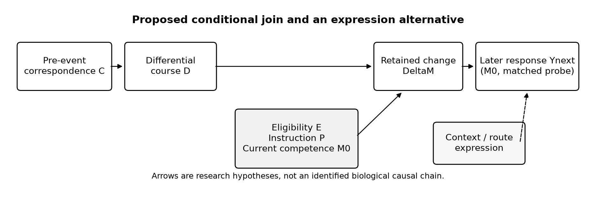
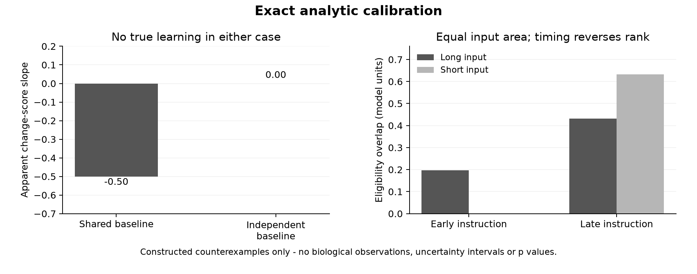

# Selective Dissipation and Gated Plasticity in a History-Shaped Neural Canvas

Micah Blumberg  
Self Aware Networks Research Institute  
23 September 2026. **Paper 112 · Preprint version 1.0 · Not peer reviewed.** Theory and methods, including a bounded source-field recheck and an exact causal-identification stress test. Earlier drafts and recorded results remain preserved. The public companion excludes third-party raw files whose redistribution license has not been established.

## Abstract

A learned neural network can resolve an incoming event without necessarily changing its retained structure. In Self-Aware Networks (SAN), I have proposed that a receiver-relative difference may persist or resolve against an ongoing history-shaped context; under suitable conditions, that activity could affect later plasticity and reception. I separate this proposed conjunction into three tests: independently established correspondence to a measured differential time course; that time course's contribution to plasticity *conditional on eligibility, instruction and receiving competence*; and retained change to a later response. BTSP, local inhibition, current synaptic state, assembly spike timing, compartment-specific learning rules and delayed molecular signaling constrain the proposal but do not establish it. Exact counterexamples show that a shared baseline can create an apparent change-score slope with no true learning, that equal-area inputs can reverse their eligibility-overlap ordering as instruction time changes, and that the same later response can arise either from a stored change or changed expression of a fixed repertoire. A synthetic calibration checks the first two safeguards. A further exact countermodel shows that even independent measurements and identical observational prediction can leave the differential course's causal contribution unidentified. A pinned public BTSP raw-data pair supplies a one-cell field-feasibility audit: position, stimulation-current and before/after ramp columns are present for first and second inductions, but the pair does not identify the separately required SAN correspondence, phase-qualified differential or later matched receiving-competence probe. The paper specifies animal-grouped held-out estimation, expression controls and crossed interventions against strong state-dependent alternatives. It reports a falsifiable theory and analysis protocol, **not** empirical confirmation of the complete SAN mechanism.

**Keywords:** behavioral-timescale synaptic plasticity; dendritic state; eligibility; inhibitory gating; receiver-relative difference; Self-Aware Networks.

## 1. The additive question

A receiving structure is changed by learning, recent activity and currently available pathways. A SAN Phase Wave Differential (PWD) is a difference relative to a specified ongoing reference and receiver, not a synonym for every transient. My narrower question is whether a pre-established learned relation changes the *course* of such a differential, whether that course changes the opportunity for retained learning under appropriate gates, and whether the retained state changes the next reception. These links might coexist, but evidence for one cannot be assigned to the entire chain. The incremental contribution proposed here is this *conditional join and its identification protocol*, not a claim that SAN discovered eligibility, inhibition, BTSP, or history-dependent dendritic excitability.

BTSP is not a SAN discovery. Bittner et al. demonstrated rapid place-field learning over behavioral timescales [1]. Rolotti et al. showed local feedback inhibition constraining place-field induction [2]. Milstein et al. showed bidirectional BTSP dependent on current synaptic state in their preparation [3]. Jain et al. measured delayed dendritic CaMKII participation [4]. The 2025 author correction to Jain et al. adds and revises cell-culture transfection-method details; its authors state that the correction does not affect their results or conclusions. It supplies no new evidence for the SAN join. O'Dell's hippocampal slice study reports a non-monotonic, inverted-U dependence of second-pathway potentiation on prior stimulation duration, with beta-adrenergic modulation [5]. Park et al. additionally measured a history-dependent distal dendritic-spike window and, under combined synaptic and optogenetic drive in CA1 slices, plateau-generating interactions [7]. That is a concrete channel-availability and input-conjunction comparator, not a demonstrated SAN differential. Spivak et al. found that spike timing across a converging CA1 assembly shaped effective transmission to a common PV interneuron [8]; timing among an assembly's members is therefore a serious alternative to a scalar event-persistence explanation. Wright et al. found distinct apical and basal synaptic plasticity rules within layer 2/3 mouse motor-cortex neurons during learning [9]; a single unqualified gate for all dendritic compartments would be an inadequate biological model. Vaidya et al. found increasing stability of CA1 place-cell representations across days with signs of BTSP on formation and retrieval [10]; a stable response cannot simply be equated with one permanently frozen synaptic trace. Heald et al.'s human motor-learning account distinguishes stored-memory updating from context-dependent expression of already available memories [11]. Its human motor preparation is not a direct CA1 assay, but the identification problem is general. The SAN conjunction must prospectively explain something beyond these timing, state, instruction, assembly, compartment and expression mechanisms; it cannot be reduced to “longer activity always learns more.”

Two additional studies positively motivate this conditional join. Dorian et al. [12] observed rapid odor representations in mouse CA1 following large somatic calcium events, including optogenetically induced events. Medial entorhinal inhibition reduced event frequency, whereas lateral entorhinal inhibition reduced formation efficiency. This separates event generation from successful learning and extends the comparison beyond spatial fields. The authors call the events BTSP-like; calcium measurements do not establish the proposed phase-qualified differential or independently identify synaptic storage. Jordan and Keller [13] found that cortical locus-coeruleus axon activity tracked unsigned visuomotor mismatch and that stimulating those axons facilitated learned, stimulus-specific visual-response suppression. This is relevant evidence for mismatch-associated plasticity gating, not direct evidence that differential dissipation is the causal mediator. Their gain-of-function experiment does not by itself establish necessity. These supportive results help specify the SAN experiment rather than being counted as confirmation of its complete conjunction.

The September 14, 2026 author protocol explicitly extends existing SAN Book 1 BTSP/PWD discussion in Cycles 34–35 and NDCA in Cycle 19. Its [checksum-verified ZIP audit](../../access/17ab56da2f55a209.md) found no raw biological recording analysis. Source continuity is not empirical validation.

## 2. States, clocks and measurements

For measured activity x(t), local eligibility e_i(t), instructive event p(t), retained state m_i(t), and declared input/context u,c, a candidate decomposition is

\[
\begin{aligned}
\dot{x}(t)&=F(x,m,u,c),\\
\dot{e}_i(t)&=-e_i/\tau_i+\phi_i(u,x),\\
\dot{m}_i(t)&=G_i(m_i,e_i,p,c).
\end{aligned}\tag{1}
\]

Equation (1) is a model family, not a fitted biological law. Electrical activation, local eligibility, plateau/instruction, delayed molecular signaling and eventual retention need not share a clock. A calcium transient is not automatically an oscillatory phase measurement; a seconds-long association window is not the lifespan of a retained change.

Define learned *correspondence* C from an independently estimated pre-event receiving map. An input is judged to match only if that map, frozen before the target episode, predicts a held-out receiver transformation or response. Post-hoc alignment cannot establish that the system “already knew” the relation. Specify the receiving cell, branch or population and how its tonic reference is measured. A differential r(t) is then a declared departure under that map. Ordinary prediction error may be a useful proxy but is not automatically the whole SAN construct.

Predeclare total response, such as integrated absolute differential over a fixed window, separately from normalized shape/persistence. A decay constant is valid only if its model fits. Normalized persistence is unstable near a zero initial response; its threshold and exclusions must be frozen. A lower peak with unchanged normalized profile is attenuation, not faster dissipation. Sensor kinetics, movement, stimulus duration, intervening events and baseline drift must be measured or bounded.

## 3. Conditional causal join

Let D be the declared differential course, E eligible state, P instructive event, M0 pre-event receiving competence, DeltaM retained change, and Ynext the response to a later matched probe. The proposal is **not** a serial arrow D -> E -> P -> M. Its intended structure is

\[
C\longrightarrow D,\qquad
(D,E,P,M_0)\longrightarrow\Delta M,\qquad
(M_0+\Delta M,\mathrm{probe})\longrightarrow Y_{\mathrm{next}}.
\tag{2}
\]

Eligibility and instruction can originate partly independently, while current receiving competence alters their effects. A persistent residual need not produce a write without instruction. A short event can be effective near the right instruction time. A longer event can recruit inhibition or competition and suppress change. Equation (2) is a hypothesized structure with common causes still to measure or intervene upon—not a causal effect identified from observational data.

The diagram keeps eligibility and instruction distinct from the differential. It also shows why the later matched response does not uniquely read out retained change: contextual routing can alter expression of a fixed repertoire. This is an explanatory architecture figure, not a circuit diagram or measured effect.

Repeated matched probes after different activity histories can estimate a directional response kernel K_R(tau;c), testing changed receiving competence more directly than a changed spontaneous mean. A phase-specific SAN interpretation requires phase-qualified measurement relative to a declared reference and an otherwise matched phase-independent comparator. Calcium time courses alone cannot be retroactively called gamma-phase evidence.

## 4. Exact safeguards

**Shared-baseline artifact.** Let unchanged true strength \(U\) be measured before and after as \(B=U+\epsilon_0\) and \(P=U+\epsilon_1\). Assume finite second moments; the zero-mean errors are independent of one another and of \(U\); and \(\operatorname{Var}(B)>0\) for the regression slope. Setting \(\Delta=P-B\) yields

\[
\operatorname{Cov}(B,\Delta)=-\operatorname{Var}(\epsilon_0),
\qquad
\operatorname{slope}(\Delta\mid B)
=-\frac{\sigma_0^2}{\sigma_U^2+\sigma_0^2}.
\tag{3}
\]

Expansion and independence prove both identities. A negative change-score slope can therefore occur with *zero true plasticity*. Independent baseline trials or explicit measurement-error models are necessary for a secondary change-score analysis. This is a safeguard on our interpretation, not an allegation against Milstein et al.'s experimental interpretation.

**Equal area does not order learning opportunity.** Let \(\dot e=-e/\tau+u(t)\), \(e(0)=0\), with \(A>0\), \(T>0\) and \(\tau>0\). Deliver total input area \(A\) either as \(u_L=A/T\) throughout \([0,T]\) or as \(u_S=2A/T\) through \([T/2,T]\), with zero input outside the stated intervals. At instruction time \(T/4\), \(e_L>e_S=0\). At instruction time \(T\),

\[
\begin{aligned}
e_L(T)&=\frac{A\tau}{T}\left(1-e^{-T/\tau}\right),\\
e_S(T)&=\frac{2A\tau}{T}\left(1-e^{-T/(2\tau)}\right)>e_L(T).
\end{aligned}\tag{4}
\]

Writing \(q=\exp(-T/(2\tau))\in(0,1)\), the inequality becomes \(2(1-q)>1-q^2\), equivalent to \((1-q)^2>0\). The ordering reverses with instruction time despite equal input area. The [application](../application/calibration.py) checks Eq. (3) and this exact overlap result through 12 deterministic tests. The source ZIP's additional synthetic output and arithmetic on attributed O'Dell group summaries are *not* animal-level reanalysis or an estimate of SAN correspondence.

Figure 2 plots only the recorded analytic calibration values. The left panel is an artifact possible under *no true learning*; the right panel is a timing counterexample. Neither panel estimates an animal effect, an uncertainty interval, a phase-specific PWD, or the probability of actual BTSP induction. The [figure-source and visual receipt](../reviews/DRAFT-05-FIGURE-SOURCE-AND-VISUAL-READBACK-20260922.md) records the pinned input and a corrected architectural arrow.

## 5. Prospective observation and intervention

An eligible dataset needs animal, session, cell/assembly, episode and within-episode time IDs; explicit stimulus and behavior; putative instruction timing; a pre-event correspondence map; measured activity course; and a later matched probe. Animal/session grouping matters: many bins from one cell are not independent animals. The pooled Milstein `t, initial_ramp, delta_ramp` CSV is an input-state/plasticity surface, not event-decay traces with these identifiers. The newly acquired Prisco/Dryad workbooks concern fly-brain measurements, not this BTSP target.

A narrower and more informative public-data route is now directly inspected. Two raw files in the Milstein/Magee repository are paired as cell 7's first and second inductions by both source legends and the pinned processing YAML [6]. The first table has 14,210 rows and 23 columns at a configured 1 kHz; the second has 294,318 rows and 14 columns at 20 kHz. In each, five configured position/current lap pairs have matching populated lengths, and the configured before and after ramp columns each contain 100 values. The [exact-source and field-contract audit](../reviews/BTSP-CELL7-RAW-PAIR-ACQUISITION-AND-FIELD-AUDIT-20260922.md) records provider Git blob identities, SHA-256 hashes, an 11/11 read-only check and a byte-identical replay. These are one selected cell's records, not an independent-animal sample, a normalized decay measurement or a SAN phase reference. The first file also contains extra lap/current fields outside the selected YAML route; the source mapping is declared rather than retrospectively treating every column as a test observation.

The pair can inform a frozen preprocessing and feasibility protocol. In particular, the *before-second-induction* ramp is a candidate later observation of this cell's first learned place-field state. A [reproducible same-cell comparison](../reviews/BTSP-CELL7-RAW-RAMP-CONTINUITY-READBACK-20260922.md) found a 0.94409 raw same-index profile correlation between the *after-first* and *before-second* ramps, with a 1.11378 mV root-mean-square bin difference. Reimplementing the source-specified smoothing and low-decile baseline rule gives a 0.98036 profile correlation and 0.88883 mV RMS difference. These are preprocessing-sensitive descriptive numbers from **one cell**, not independent-animal inference or a SAN-specific result. The source authors' position alignment and full signal processing remain to be reconstructed; the 100 bins are not 100 independent biological replicates. Even a retained or changed ramp would establish neither the proposed phase-qualified differential nor a separately designed, input-matched probe of receiving competence. The pair cannot demonstrate the conditional join by relabeling a ramp as an independently frozen learned-correspondence map, an induction-current trace as dendritic eligibility, or induction 2 itself as the later probe. Its twentyfold sampling-rate difference also requires explicit resampling and time-alignment rules before any cross-induction temporal comparison. This raw-file availability changes the feasibility assessment, not the biological verdict.

Freeze the correspondence map in a discovery set, then use held-out animals for the primary contrast. Estimate total response and normalized shape separately. Report the observational association of pre-event C with D under measured context, not a randomized effect. Compare later DeltaM against eligibility, instruction and prior-state models with animal-aware uncertainty, sensor-response controls and prespecified censoring of windows interrupted by new events. Reserve a separate probe for the M -> Ynext link. The null may hold at any one of the three links.

A crossed intervention should vary a route affecting correspondence, eligible input and instruction where a specified preparation permits it, while matching sensory drive and disclosing unmatched differences. If it also changes peak activity, spike count, calcium area or recruitment, report a total effect. A narrower duration-mediated claim requires a separately justified design, not post-hoc adjustment that removes the mediator. Perturb-and-rescue of the claimed route is more informative than correlation, but still does not establish whole-network rendering or experience.

Strong alternatives include activity-only, ordinary eligibility, current-weight-dependent BTSP, assembly-wide spike timing, compartment-specific rules, inhibition/competition, latent context and memory-expression routing, raw-input and flexible state-space accounts at matched information and capacity. Add a pre-event correspondence term one at a time. The O'Dell non-monotonic pattern prevents a universal positive persistence-to-plasticity slope from being passed off as a scientific prediction.

### 5.1 A concrete first measurement contract

A prospective CA1 pyramidal-cell preparation with separately identified input pathways and a recorded plateau provides a bounded first target. This is a proposed study, not an experiment performed here. Before any induction outcome is inspected, fit and freeze a pathway-specific input-to-voltage response map using repeated low-intensity probes under recorded membrane state and inhibition. Use a separate pre-induction validation block to measure how reliably each candidate learned input relation predicts the receiver's response. That held-out agreement is the declared *correspondence proxy* C; it is not a direct measurement of semantic recognition, and it must not be estimated from the induction trace it will later predict. Independent baseline trials are required for the baseline and change-score endpoints.

For the induction episode, define D from the voltage departure from this frozen map after accounting for the recorded input. Report signed residual, absolute area, peak and a normalized post-input persistence statistic in a fixed window chosen from an independent feasibility set. Analyze above a frozen signal-to-noise threshold; a near-zero response is not assigned an artificially rapid decay. Match or report input charge and duration, somatic firing, plateau amplitude/duration and sensor filtering. A calcium-only version is a slower proxy experiment, not a phase measurement. A phase-specific extension additionally requires a measured ongoing reference, a phase estimator specified before the target event, and temporally resolved voltage evidence.

Record P from the actual plateau, not merely from the command to evoke it. Fit an eligibility kernel to separate calibration episodes and freeze it; unless a molecular eligibility signal is independently observed, label E as a model-derived predictor. Randomize eligible-input timing and plateau timing in a crossed design, with matched input-only, instruction-only and sham conditions. Independently assigned prior input histories test the correspondence proxy; they do not guarantee that correspondence changes without other receiver-state changes. All induced changes and failed target engagement remain visible.

The primary retention endpoint is the change in the low-intensity probe response curve, estimated in fresh post-induction trials with the same declared input range and checked membrane/context conditions. This estimates altered receiving competence, not necessarily a particular molecular write. Follow-up probes at separately declared delays test persistence; a claim of synaptic storage needs an independently justified synaptic assay. Compare an ordinary eligibility/current-state/plateau model with the same model augmented by frozen C and D, using held-out animals, not held-out bins from the same cell. Report predictive score differences and uncertainty before interpreting an interaction. Matched outcome prediction does not identify which physical route produced it.

The differential-course claim requires more than that predictive comparison. A perturbation must alter the proposed course while its effects on eligibility, instruction, inhibition and input are measured; otherwise it identifies only a total intervention effect. A predeclared minimum effect and precision target should be chosen from independent measurement reliability and scientific relevance before confirmatory collection. Excluding that effect with verified target engagement can reject the specified implementation. Insufficient precision, a failed correspondence proxy or unmatched interventions leave the proposed link unresolved. No sample-size adequacy or causal mediation has been demonstrated by the present one-cell feasibility audit.

### 5.2 Why independent measurement still does not establish mediation

The additional pass rechecked the two selected cell-7 file hashes and their raw headers against the existing source receipt. Both match. No new field was found that supplies the independently calibrated correspondence \(C\), observed eligibility, or a reference-qualified differential course required by Section 5.1. This is a finding about the selected packet, not a complete negative search of the source repository. Its position/current laps and ramp summaries retain their legitimate roles. No extra smoothing, alignment or correlational calculation can by itself create the missing independent measurement.

There is a further identification problem even if a future study measures the declared variables well. The [new frozen diagnostic](../application/causal-identification-v01/PROTOCOL.md) constructs two causal models. Let \(U\) be a latent receiver state, \(N\) an output disturbance and \(g=EP\) the eligibility/instruction gate. Use the deliberately illustrative equations

\[
D=C+U,\quad
Y_A=g(0.3C+0.7D)+N,\quad
Y_B=g(C+0.7U)+N. \tag{5}
\]

Here \(Y\) is a later measured outcome, not a molecular storage variable. In Model A, the event-course variable \(D\) has a direct effect on \(Y\). In Model B, \(U\) affects both \(D\) and \(Y\), with no \(D\)-to-\(Y\) arrow. **Substitution proves \(Y_A=Y_B\) for every unperturbed observation.** Yet an ideal intervention that adds \(\delta\) to \(D\) while holding \(C,U,E,P\) fixed changes \(Y_A\) by \(0.7EP\delta\) and leaves \(Y_B\) unchanged. Thus their observational equality does not identify the differential-course effect. These linear coefficients illustrate the logic; none is estimated from a neuron.

The [exact rational application and field readback](../application/causal-identification-v01/README.md) enumerate 108 declared states. All observational outputs agree. With \(\delta=1/4\), the ideal intervention differs by \(7/40\) in 27 gate-open states and by zero in the remaining 81. The run and replay are byte-identical; 326 checks cover the two source hashes and exact identities. There is no animal effect estimate, test of statistical power or inferred physiological slope in those counts.

The distinction matters for the proposed study. A well-measured association or superior held-out prediction is not yet a causal mediator. Randomizing an intervention can estimate its total effect, but if the intervention also changes \(U\), eligibility, instruction or recruitment, its total effect is not automatically the isolated effect of \(D\). A command designed to alter only the course is not proof of selective target engagement. The experiment must measure relevant alternatives and justify the additional causal assumptions, or report the narrower total effect.

The original conditional SAN proposal remains intact: receiving history may shape the course of a differential and its consequences under learning gates. This countermodel strengthens the requirement for a discriminating experiment rather than turning a missing measurement into a negative biological result. G01 remains an acquisition and identification problem, not something resolved by relabeling the available ramp data.

## 6. Stored change is not identified by later response alone

Let a later matched response be a function of both stored competence and which existing route is expressed. A simple counterexample uses two possible responses M0 and M1 and a routing weight q: Y=(1-q)M0+qM1. A first model holds q=1 and changes M1 from 0 to 1; a second model holds the repertoire (M0,M1)=(0,1) fixed and changes q from 0 to 1. Both produce the same pre/post observation Y: 0 then 1. Even a correctly measured later improvement therefore does **not** identify a structural write unless the route/expression alternative is constrained. This algebra is an identification counterexample, not a physiological claim that CA1 literally interpolates between two scalar memories.

In the proposed experiment, separate a later activity/readout change from durable altered receiving competence. Match or measure sensory input, context, behavior, arousal and route recruitment at the subsequent probe. Where feasible, directly measure the relevant synaptic/branch or population transformation and perturb the candidate retained route while holding an appropriate comparison route available. Repeated same-probe responses under independently checked state matching are stronger than a single behavioral change, but no one probe alone proves which subcellular variable stored the difference. The biological question is whether a prior correspondence-conditioned differential contributes *incremental* prediction after current-state BTSP, assembly timing, compartment, instruction and expression controls.

The separate artificial [frozen-expert application](https://github.com/v5ma/v5ma.github.io/tree/master/papers/companions/five-papers-20260923/ai/paper/reviews/FROZEN-ROUTING-EXPRESSION-CONTROL-20260922.md) gives a computational instance of changed behavior with no expert-parameter write. Its preloaded correct experts are deliberately generous; it is a logical control, not biological replication. The September conversation-derived [source crosswalk](../../access/28760c8b97c734a7.md) records the route from the user-named D: discussion files to the checked primary studies without backdating assistant synthesis as Micah's original wording.

## 7. Falsification and status

An adequately measured, independently specified link can lose support if its predeclared contrast is excluded with adequate precision and target engagement. Equal prediction by a conventional eligibility, state or inhibition model instead establishes a lack of demonstrated incremental predictive value or unresolved mechanism identity; it does not establish that the proposed physical route is absent. Success at one link is reported only at that link. A hippocampal slice or place-field result alone cannot prove PWD-based multimodal rendering, NAPOT or experience.

This theory-and-methods preprint includes the conditional model, four exact safeguards, two synthetic checks, two figures, a verified *one-cell field contract* and a prospective animal-aware test. Automated review motivated the explicit measurement contract, restored supporting studies and clarified proof assumptions. It contains **no grouped event-resolved evidence or independent expert review**. The audited source repository has no declared redistribution license; its raw bytes are not redistributed in this release. The companion separates the reproducible mathematical construction from the external-data field check and supplies source-access metadata. Independent scientific and statistical review remains outstanding. Author-authorized public release is not empirical confirmation.

## References

1. Bittner KC et al. Behavioral time scale synaptic plasticity underlies CA1 place fields. *Science* 357 (2017):1033–1036. https://doi.org/10.1126/science.aan3846
2. Rolotti SV et al. Local feedback inhibition tightly controls rapid formation of hippocampal place fields. *Neuron* 110 (2022):783–794.e6. https://doi.org/10.1016/j.neuron.2021.12.003
3. Milstein AD et al. Bidirectional synaptic plasticity rapidly modifies hippocampal representations. *eLife* 10:e73046 (2021; version of record 2022). https://elifesciences.org/articles/73046
4. Jain A et al. Dendritic, delayed, stochastic CaMKII activation in behavioural time scale plasticity. *Nature* 635 (2024):151–159. https://doi.org/10.1038/s41586-024-08021-8 ; author correction https://doi.org/10.1038/s41586-025-09295-2
5. O'Dell TJ. Beta-Adrenergic Receptor Activation Modulates the Induction of Complex Spike-Dependent LTP by Regulating Multiple Forms of Heterosynaptic Plasticity. *Hippocampus* 35 (2025):e70043. https://doi.org/10.1002/hipo.70043
6. Milstein AD and collaborators. *BTSP: code and data for the bidirectional behavioral-timescale synaptic plasticity study*. Public repository, exact audited commit `90bfae6e87da602ec3b28afe4c5a2fd0c71acec3`. https://github.com/neurosutras/BTSP/tree/90bfae6e87da602ec3b28afe4c5a2fd0c71acec3
7. Park P et al. Dendritic excitations govern back-propagation via a spike-rate accelerometer. *Nature Communications* 16:1333 (2025). https://doi.org/10.1038/s41467-025-55819-9
8. Spivak L et al. Wired together, change together: Spike timing modifies transmission in converging assemblies. *Science Advances* 10:eadj4411 (2024). https://doi.org/10.1126/sciadv.adj4411
9. Wright WJ, Hedrick NG, Komiyama T. Distinct synaptic plasticity rules operate across dendritic compartments in vivo during learning. *Science* 388 (2025):322–328. https://doi.org/10.1126/science.ads4706
10. Vaidya SP et al. Formation of an expanding memory representation in the hippocampus. *Nature Neuroscience* 28 (2025):1510–1518. https://doi.org/10.1038/s41593-025-01986-3
11. Heald JB, Lengyel M, Wolpert DM. Contextual inference underlies the learning of sensorimotor repertoires. *Nature* 600 (2021):489–493. https://doi.org/10.1038/s41586-021-04129-3
12. Dorian CC, Taxidis J, Arac A, Golshani P. Rapid formation of non-spatial hippocampal representations consistent with behavioral timescale synaptic plasticity is modulated by entorhinal input. *Nature Communications* 17:5098 (2026). https://doi.org/10.1038/s41467-026-71503-y
13. Jordan R, Keller GB. The locus coeruleus broadcasts prediction errors across the cortex to promote sensorimotor plasticity. *eLife* 12:RP85111 (2023). https://doi.org/10.7554/eLife.85111.3
