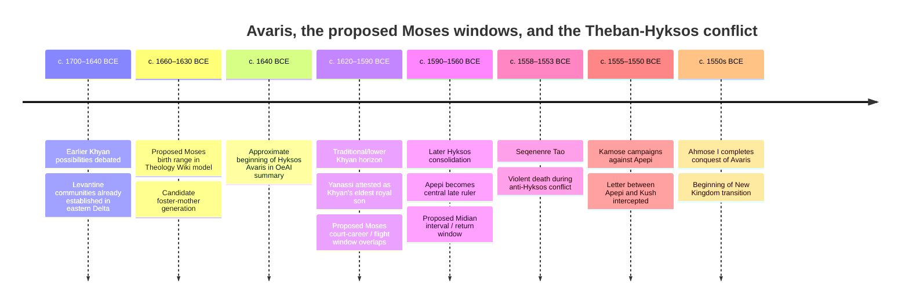

# Hyksos Avaris and the Moses Prosopography: A Second Intermediate Period Investigation

## Executive summary

The deep-research result is simultaneously **more supportive of the Theology Wiki's Avaris setting and less supportive of any currently named individual as Moses**.

The strongest finding is archaeological. Tell el-Dabʿa is securely identified as Avaris, capital of the Fifteenth-Dynasty Hyksos in the eastern Nile Delta, positioned at the terminus of the route through northern Sinai toward Palestine and functioning as a major Mediterranean and inland port. The settlement had a long pre-Hyksos history in which substantial numbers of people from outside the Delta entered the city; by the Hyksos period, people of Near Eastern cultural origin had not merely gained access to Egyptian institutions but had become the ruling elite. citeturn12search5turn14view0

That distinction is crucial. The evidence does **not** presently allow us to identify these people archaeologically as Israelites. It does, however, make the narrower historical premise required by the Wiki hypothesis quite plausible: **a large Levantine/Canaanite-derived population lived in the eastern Delta for generations, became deeply integrated with Egyptian culture, included high-status families, and eventually supplied the dynasty ruling from Avaris.** The 2020 strontium study of 75 individuals found 53% had spent childhood outside the northeastern Delta; migration was actually greater before Hyksos rule than during it. The authors conclude that the Hyksos rise is more compatible with an internal takeover by a pre-existing foreign-origin elite than with Manetho's later story of a sudden invading horde. citeturn14view0

That gives the Moses hypothesis a much better social setting than a conventional picture in which an isolated Hebrew infant somehow penetrates an ethnically closed native-Egyptian royal household. In Avaris, Egyptian and Levantine identities were already intertwined. The archaeology includes Syrian-Palestinian and Egyptian temples in the same sacred precinct, Levantine and Egyptian funerary elements, Near Eastern donkey burials, imported Levantine and Cypriot goods, Near Eastern seals, Egyptian royal titulary borne by Hyksos rulers, and elite cemeteries containing large numbers of non-local women. citeturn12search16turn12search13turn14view0

A second strong finding concerns **elite integration and marriage networks**. The isotope researchers caution that the excavated cemetery population is disproportionately elite; among the sampled women, 77% were non-local. They explicitly raise marriage alliances with powerful families outside the Delta as one possible explanation. This is not evidence of Moses's adoption, but it shows that high-status households at Avaris were cosmopolitan and that foreign-born women could enter elite social networks. citeturn14view0

The chronology is the largest unresolved problem and also the most interesting one. Forty AMS radiocarbon determinations from short-lived Tell el-Dabʿa plant samples produced an approximately **120-year discrepancy** with the site's traditional archaeological/historical chronology. Meanwhile, Khyan sealings discovered in a secure Tell Edfu context contributed to arguments that Khyan may have lived substantially earlier than the conventional Tell el-Dabʿa chronology had placed him. There is still no universally accepted resolution. citeturn22search0turn19search3

That debate directly controls whether **Yanassi**, Khyan's eldest royal son, is chronologically interesting for the Wiki's Moses window. On the traditional lower chronology, Khyan's Avaris horizon sits remarkably close to the Wiki's provisional Moses first-forty-years/flight window around the early seventeenth to very early sixteenth century BCE. An earlier Khyan chronology can move Yanassi too early to be Moses himself, although it may make Khyan's generation more relevant to Moses's hypothetical foster family. Yanassi therefore deserves serious investigation but currently rates **low as an identification**: his single surviving contemporary monument calls him Khyan's *eldest king's son*, whereas the biblical Moses is an adopted child of a royal woman; nothing connects Yanassi with Midian, Levites, an Egyptian killing, a return to Egypt, or the Exodus. citeturn19search48turn22search0

Among the royal women, **Tati is chronologically the most interesting named woman**, because her exact placement in the Fourteenth/Fifteenth-Dynasty transition remains unsettled and could conceivably overlap the required foster-mother generation. But she is attested as a **King's Wife**, not a King's Daughter, and there is no adoption evidence. **Tani and Ziwat**, sisters of Apepi, and especially **Herit**, apparently Apepi's King's Daughter, demonstrate that named Hyksos royal women existed; Herit's title is structurally the closest parallel to “Pharaoh's daughter.” Yet under a Seqenenre-era Exodus and an age-80 Moses, Apepi's daughter is almost certainly too late to have rescued Moses as an infant. Herit's object is securely preserved at the Metropolitan Museum, although it was recovered in a later Theban context. citeturn15search0

The most historically plausible foster mother may therefore be **an unattested daughter of an early Hyksos/Avaris king**, rather than one of the handful of women whose names survive. That is not positive evidence for Moses; it is a preservation argument. The royal family is incompletely documented, and no Hyksos royal tomb has yet been identified archaeologically. citeturn14view0

The proposed identification of **Seqenenre Tao as the ruler killed during the departure** encounters an unusually interesting but double-edged piece of physical evidence. His mummy shows catastrophic craniofacial injuries. CT analysis suggests he died in his forties, probably with his hands constrained, from attacks involving weapon types comparable to Middle Bronze weapons found at Avaris; decomposition before embalming may indicate death away from the royal mortuary workshop, plausibly on campaign. This strongly supports a violent death in the Hyksos conflict. It does **not** support simple drowning: Seqenenre clearly suffered lethal weapon trauma, and his body was recovered and mummified. A Wiki reconstruction connecting him to a Sea-of-Reeds episode would therefore need a **battle in a marsh/water setting**, not a straightforward “pharaoh sank and was never recovered” scenario. citeturn13view1

The most defensible conclusion is consequently tiered:

| Proposition | Assessment |
|---|---|
| A large Levantine-derived population lived at Avaris | **High** |
| Levantine-origin people reached elite/ruling status there | **High** |
| Egyptian and Levantine cultures were deeply blended | **High** |
| A Levantine child could plausibly have grown up in an elite Avaris household | **Medium** as contextual plausibility |
| A royal woman of the required generation existed but is now unattested | **Medium** as a preservation inference |
| Yanassi was Moses | **Low** |
| Tati/Tani/Ziwat/Herit was Moses's foster mother | **Low individually** |
| Seqenenre died in the anti-Hyksos struggle | **High** |
| Seqenenre was the Exodus pursuer | **Low**, though historically testable |
| Avaris/Hyksos collapse preserves a historical setting behind some Exodus traditions | **Medium as a research hypothesis** |
| The archaeology presently demonstrates Israelites or Moses at Avaris | **Low / not demonstrated** |

The key result is therefore not “we found Moses.” It is more consequential methodologically: **the end-of-Hyksos Moses model has a real archaeological social world in which its opening conditions are possible, but its individual identifications remain unproven.**

## Chronology and the political landscape

### The chronology the hypothesis actually requires

If the Wiki provisionally places the initiating Exodus conflict around Seqenenre Tao's violent death, approximately the mid-1550s BCE, Exodus 7:7 makes Moses about eighty when he confronts Pharaoh. That produces a hypothetical birth near **1635 BCE**. The familiar additional forty-year division—forty years before his flight and another forty outside Egypt—comes not from Exodus itself but from Stephen's retrospective chronology in Acts 7:23 and 7:30. On that model, the flight would lie near **1595 BCE**. citeturn20search3turn20search6

That textual distinction deserves to be encoded explicitly in the Theology Wiki:

> **Age 80 at confrontation:** Pentateuchal datum, Exodus 7:7.  
> **Age 40 at first departure + 40 years outside Egypt:** New Testament chronological interpretation, Acts 7:23, 30. citeturn20search3

The resulting historical target is therefore approximately:

| Hypothetical Wiki event | Working window | Basis |
|---|---:|---|
| Moses born | c. 1660–1630 BCE | Allows the Wiki's several end-Hyksos Exodus variants |
| Fostered/raised at court | c. 1655–1610 BCE | Derived prosopographical window |
| Flight from Egypt | c. 1620–1590 BCE | Acts 7 forty-year model applied to alternative Exodus dates |
| Midian/Kenite period | c. 1620/1590–1580/1550 BCE | Hypothesis, not Egyptian chronology |
| Return / confrontation | c. 1580–1550 BCE | Broad late-Hyksos range |
| Seqenenre conflict variant | c. 1558–1553 BCE | Historical reign/death horizon citeturn13view1 |
| Kamose war | c. 1555–1550 BCE | Digital Karnak dating citeturn22search6 |
| Ahmose reconquest | immediately thereafter | Egyptian anti-Hyksos sequence citeturn13view1 |

Those dates make Senenmut chronologically irrelevant to this model. The appropriate court is **Second Intermediate Period Avaris**, not the eighteenth-dynasty court of Hatshepsut.

### Avaris chronology is not settled to the decade

The Austrian Archaeological Institute currently summarizes Avaris as the Hyksos capital approximately **1640–1530 BCE**. Tell el-Dabʿa has a much longer occupation sequence beginning before Hyksos rule, however, and its excavated stratigraphy spans centuries. citeturn12search5turn14view0

The site's chronology has a serious scientific tension. Kutschera, Bietak, Bronk Ramsey and colleagues measured 40 short-lived botanical samples across fourteen archaeological phases, covering approximately 2000–1400 BCE. Their radiocarbon sequence differed from the chronology built through Egyptian and eastern-Mediterranean archaeological synchronisms by about **120 years**. They described the discrepancy as unresolved rather than selecting one chronology and declaring the other invalid. citeturn22search0turn22search3

This matters enormously for Moses prosopography. A 50–120-year displacement is larger than an entire biblical forty-year life stage.

Tell Edfu introduced a second complication. Excavators recovered a substantial group of sealings naming Khyan in a secure archaeological context, prompting a re-examination of whether Khyan belongs as late as older reconstructions placed him. Nadine Moeller and Gregory Marouard emphasize that the find implies northern-southern economic or diplomatic relationships and creates substantial chronological questions for the early Second Intermediate Period. citeturn19search3turn19search8

Consequently, there are two useful Khyan models for the Wiki rather than one falsely precise reign:

**Lower/traditional Tell el-Dabʿa model:** Khyan lies relatively near c. 1620–1590 BCE. This is excellent chronological territory for a Moses who is a young adult and leaves Egypt around c. 1600.

**Earlier Khyan model:** the Edfu synchronism and high radiocarbon chronology move Khyan materially earlier. This weakens Yanassi-as-Moses but potentially strengthens Khyan's generation as the generation of Moses's hypothetical foster family. Felix Höflmayer's contribution to the 2018 Khyan workshop volume explicitly argues an early date; the volume as a whole documents the continuing range of scholarly positions rather than a consensus solution. citeturn19search1turn19search5

The correct research method is therefore **not** to choose whichever Khyan date best fits Moses. The correct method is to carry both chronologies through the candidate test and see which identifications survive both.

### Political sequence relevant to the hypothesis

The historical portions of this diagram are based on the OeAI Avaris chronology, Seqenenre CT study, and Kamose stela; the Moses dates are **internal hypothesis windows generated from the Wiki's end-Hyksos model**, not independently dated Egyptian events. citeturn12search5turn13view1turn22search6

That distinction should remain visible everywhere in the Wiki.

## Avaris archaeology and the Levantine elite

### What the archaeology actually establishes

Avaris was almost ideally positioned for sustained interaction between Egypt and Canaan. The city stood on the Pelusiac Nile branch, had access to the Mediterranean, and lay at the Egyptian end of the Horus Road across northern Sinai toward Palestine. The Austrian excavators describe it as a major port and trade hub. At its Fifteenth-Dynasty height it covered more than 260 hectares; OeAI's harbour project estimates roughly 28,800–34,600 inhabitants. citeturn12search5turn12search13

The Levantine presence was not confined to imported pots. The excavation record includes architecture, weapons, religious buildings, burial practices and human mobility.

The strongest individual findings for the Wiki hypothesis are:

| Archaeological evidence | What was actually found | Relevance to the hypothesis |
|---|---|---|
| **Human isotope study** | 75 individuals tested; 40/75, or 53%, had non-local childhood strontium signatures; immigration was greater before Hyksos rule than during it | Strong evidence for substantial migration into Avaris before political takeover; cannot identify “Israelites” specifically. citeturn14view0 |
| **Elite female mobility** | 77% of sexed females in the isotope study were non-local; excavated cemeteries may disproportionately represent elites | Compatible with high-status marriage networks integrating outsiders into powerful households. citeturn14view0 |
| **Mixed sacred precinct A/II** | Two Syrian-Palestinian temples, two Egyptian temples, and a building for cultic meals | Direct architectural evidence of coexistence/hybridization rather than impermeable Egyptian versus Asiatic communities. citeturn12search16 |
| **Near Eastern funerary customs** | Donkey deposits occur in funerary/sacrificial contexts and are identified by excavators as deriving from Near Eastern practice | Shows cultural practices brought from the Levant persisted inside the Delta community. citeturn12search11 |
| **Hybrid burial culture** | PLOS describes Tell el-Dabʿa burial culture as blending Egyptian and Near Eastern features | Supports an acculturated rather than segregated population. citeturn14view0 |
| **Elite F/I cemetery** | Distinctive burial structures and Near Eastern domestic, ceramic, burial and metalwork features occur in F/I | Particularly relevant because these are high-status contexts rather than only poor migrant quarters. citeturn14view0 |
| **Port imports** | Large quantities of Levantine and Cypriot pottery entered Avaris; the harbour connected river and maritime commerce | Demonstrates continuous eastern-Mediterranean connectivity. citeturn12search13 |
| **Khyan palace deposit L81** | Tens of thousands of sherds and almost 2,000 reconstructable vessels from ceremonial feasting in a Hyksos palace | Gives a substantial sealed palace assemblage for chronological and social investigation. citeturn12search14 |
| **Hyksos-period Asian weapons** | Daggers, spearhead and battle axe excavated at Tell el-Dabʿa; five were directly compared with Seqenenre's wounds | Material connection between Avaris's military culture and the Theban-Hyksos war. citeturn13view1 |
| **Khyan/Yanassi monument** | A damaged Avaris stela names Khyan and “eldest king's son” Yanassi | Direct evidence for a Hyksos royal prince within Avaris. citeturn19search48 |

The PLOS article includes especially useful open-access visuals: [Figure 2 is a site plan of Tell el-Dabʿa, ʿEzbet Helmi and ʿEzbet Rushdi](https://journals.plos.org/plosone/article?id=10.1371/journal.pone.0235414), while [the Austrian Archaeological Institute's Avaris page](https://www.oeaw.ac.at/en/oeai/institute/branches/cairo/excavations-projects/tell-el-dab%CA%BFa) provides the excavation's current topographical synthesis. citeturn14view0turn12search5

### Why “Levantine elite” is stronger than “Israelite elite”

The archaeology supports Near Eastern or Levantine cultural origins. It cannot presently discriminate a biblical Israelite population from other populations of Canaan, coastal Syria, or the broader Middle Bronze Levant. Indeed, the PLOS investigators deliberately caution against treating “Hyksos” as the name of an entire ethnicity: properly speaking it denotes the ruling dynasty, while the population from which the dynasty emerged was more varied. citeturn14view0

That actually improves the Wiki methodology. The hypothesis need not start by insisting:

> “Archaeologists found Israelites at Avaris.”

It can make the narrower and demonstrable statement:

> **A substantial, multigenerational population with Levantine cultural roots lived at Avaris; members of this population entered elite networks and a foreign-origin dynasty eventually ruled Egypt from that city.**

The proposed identification of some subset of that population with the ancestors behind Israel's Egyptian traditions is a **second-stage hypothesis**.

### Funerary evidence is particularly revealing

Avaris burials combine Egyptian and Near Eastern forms. Area F/I includes non-local domestic architecture, pottery, burial customs and metalwork. Other areas preserve donkey burials, a practice the excavation project traces to the Near East. Yet the material becomes progressively hybridized and, in later phases, some previously distinctive burial structures disappear as burial practice becomes more homogeneous across the site. citeturn14view0turn12search11

This is exactly the archaeological pattern one would expect from immigrants who had lived in Egypt for generations: not “pure Canaanites” living unchanged inside Egypt, but descendants capable of being culturally Egyptian and Levantine at the same time.

That observation is highly relevant to Moses. A Moses raised in such an environment would not need to make a modern binary transition from “Hebrew culture” to “Egyptian culture.” The eastern Delta itself was a contact zone in which language, religion, material culture and elite political identity could overlap.

Another useful negative datum is that **no excavated tomb has been securely identified as that of a Hyksos king**. Consequently, the absence of a known tomb for a hypothetical royal-connected figure is much less diagnostic here than it would be in the richly documented New Kingdom. citeturn14view0

## Prosopography: who actually fits?

The following ratings answer a very narrow question: **How useful is this person for the specific Moses prosopography favored by the Wiki?** They are my analytical ratings, not claims made by the Egyptological sources.

The working Moses criteria are:

**chronology; Avaris/eastern-Delta connection; Levantine context; access to the royal household; possible royal-woman relationship; military/administrative potential; disappearance or interrupted succession around the proposed flight; lack of a secure conflicting biography/burial; and compatibility with an eastern exile and later return.**

### Hyksos and Theban rulers and princes

| Person | Attestation and approximate position | Office/title | Pros for the Moses reconstruction | Major problems | Primary evidence / assessment |
|---|---|---|---|---|---|
| **Khyan** | Hyksos ruler securely associated with Avaris; absolute date disputed, with traditional and substantially earlier models | King / *heqa khasut* | His court may overlap the required childhood/young-adult window under the lower chronology; provides exactly the kind of Levantine-origin Egyptian royal household required | He cannot be Moses; question is whether his household is Moses's hypothetical court | Palace assemblages, sealings, Khyan/Yanassi stela; chronology debated. **Context value: High.** citeturn12search14turn19search1 |
| **Yanassi** | Contemporary stela at Avaris; son of Khyan; possible but disputed later king | “Eldest King's Son” | Royal prince at Avaris; poorly documented subsequent history; potentially excellent chronological overlap under lower Khyan chronology | Explicitly represented as Khyan's son rather than adopted daughter's child; no Midian, Hebrew, flight or return evidence; early Khyan chronology may make him too early | Cairo TD-8422; Bietak's publication of the stela. **Moses: Low, but highest-value named male to investigate.** citeturn19search48 |
| **Apepi/Apophis** | Major late Hyksos ruler; contemporary enemy of late Theban kings | King | Belongs to political environment into which an elderly Moses could return; direct protagonist in Theban-Hyksos war | Too late to be foster-household ruler for a Moses born c. 1640; firmly a king, not Moses | Kamose stela and later Egyptian narratives. **Moses: Very low; context: High.** citeturn22search6turn13view1 |
| **Seqenenre Tao** | c. 1558–1553 BCE in CT study; mummy survives | Theban king | Exactly the military horizon required by the Wiki's pursuer hypothesis; demonstrably violent death involving weapons comparable to Avaris types | Not drowned; wounds suggest captured/constrained battlefield death; no evidence of Hebrews or Moses | Mummy JE 26209(b)/CG 61051 and CT study. **Pursuing-pharaoh hypothesis: Low, but testable.** citeturn13view1 |
| **Kamose** | c. 1555–1550 BCE; victory stela at Karnak | Theban king | Documents actual north-south war, Apepi, communications with Kush and elite military administration | Chronologically belongs around proposed Exodus, not Moses's upbringing | Second Kamose Stela. **Moses: Essentially excluded; political context: High.** citeturn22search6 |
| **Ahmose I** | Successor who ultimately defeats Avaris and pursues Hyksos into southern Canaan | King, founder of New Kingdom | Shows what follows the collapse; fits Wiki sequence as generation after proposed initiating conflict | Much too late to have raised Moses; in user's model he comes after the initial departure | Contemporary early New Kingdom war tradition and Ahmose son of Ibana. **Moses: Excluded; aftermath: High.** citeturn13view1 |

The key figure remains Yanassi—not because the evidence is strong enough to identify him with Moses, but because he is the **right kind of person in the right place**.

His usefulness is almost diagnostic. If a historical Moses had high status in an Avaris court, the documentary footprint might resemble Yanassi's: one damaged monument, a royal title and substantial uncertainty about subsequent career.

Yet Yanassi simultaneously demonstrates why structural resemblance is insufficient. His one surviving monument tells us something quite specific that cuts against the biblical profile: he is presented as the king's eldest son. The current evidence gives us no right to transform that into “adopted Levantine grandson.”

### The royal women

This is the portion of the search that changed most after fixing the chronology.

| Royal woman | Surviving status | Chronological value | Match to “Pharaoh's daughter” | Problems | Assessment |
|---|---|---|---|---|---|
| **Tati** | “King's Wife,” known predominantly from scarab seals; exact Fourteenth/Fifteenth-Dynasty placement debated | **Potentially excellent** because she may belong near the required early Avaris generation | Weak: queen, not attested King's Daughter | Husband/absolute chronology uncertain; no adoption story; no secure Moses connection | **Low–Medium as foster-household context; Low as identification** |
| **Tani** | “King's Sister,” associated with Apepi's royal family; attested in Avaris material and offering equipment | Late | Moderate royal-family access, wrong explicit title | Probably a generation or more too late for infant Moses in c. 1640 model | **Low** |
| **Ziwat** | “King's Sister,” very sparsely attested | Late | Same structural possibility as Tani | Extremely thin biography; likely too late | **Low** |
| **Herit/Herti** | Explicit “King's Daughter,” apparently linked with Apepi; survives on stone vessel fragment | Late Hyksos | **Excellent titular parallel** | Almost certainly too young/late to rescue a Moses born c. 1640; no adoption evidence | **Low despite strongest title match** citeturn15search0 |
| **Unnamed earlier Avaris royal daughter** | Not an identified individual; inferred possibility from incompleteness of royal genealogy | Potentially exact | Could fit exactly | Not positive evidence; cannot be converted into a named historical person without discovery | **Medium contextual possibility, zero identification evidence** |

Herit's vessel deserves special attention because it illustrates both promise and danger. The fragment now at the Metropolitan Museum was found at Dra Abu el-Naga in a later Dynasty-18 context and names Apophis and Herti/Herit. The object is real; its later deposition cannot by itself tell us that Herit lived at Thebes or married a Theban ruler, much less that she adopted a child. citeturn15search0

[The Metropolitan Museum's catalogue includes a public-domain image of the Apophis–Herti fragment](https://www.metmuseum.org/art/collection/search/560936). citeturn15search0

The most important result is negative: **among the named women currently recovered, none is a good foster-mother identification.**

But that is very different from showing that no appropriate royal daughter existed.

The Fifteenth-Dynasty family tree is too incomplete for that inference. Yanassi proves Khyan had at least one royal son; Apepi's family shows sisters and a daughter; it would be extraordinary to suppose that every royal daughter of the earlier dynasty must therefore be preserved in our surviving inscriptions. The correct Wiki entry should consequently list an “unidentified early Hyksos King's Daughter” as a **predicted person**, not as a discovered person.

### Officials as controls

The officials named in our earlier discussion are especially valuable as **negative controls**. A good historical-identification method should be able to reject impressive superficial parallels.

| Official | Attestation / office | Why interesting | Why not Moses | Plausibility |
|---|---|---|---|---|
| **Hery** | TT12; “overseer of the double granary of the royal wife and mother of the king Ahhotep,” c. 1520 BCE | High official directly attached to an unusually powerful royal woman | Roughly a century too late for Moses's upbringing in this model; early Dynasty 18 | **Very low**. Proyecto Djehuty provides the primary archaeological context. citeturn21search1 |
| **Kenres** | Stela CG 34004; herald and senior steward of a King's Mother, probably Ahhotep | Shows a male administrator closely attached to the Queen Mother's establishment | Same chronological problem as Hery; securely Theban rather than early Avaris | **Very low**. citeturn21search5 |
| **Iuef / Iuf** | Ahhotep-connected official in later textual reconstructions | Potential example of royal-property administration | Accessible object-level evidence is presently too poorly verified for this report; late Ahhotep context in any case | **Very low; source dossier should be rebuilt before Wiki use** |
| **Sobeknakht II** | Governor/nomarch at Elkab; decorated Tomb 66/T10; inscription describes Kushite attack | Excellent broad-period military administrator; Nubian connection makes him superficially attractive given later Moses-in-Ethiopia traditions | Known Upper Egyptian lineage, office, wives/children, tomb and local career; no Avaris/adoption/Midian connection | **Low**. citeturn21search33 |
| **Ahmose son of Ibana** | Elkab military officer; autobiographical tomb inscription; fights at Avaris and continues through later reigns | First-person witness to the end of Hyksos power; ideal chronological control | Loyal anti-Hyksos Egyptian serviceman with a long documented career after Avaris; cannot disappear into Midian forty years earlier | **Effectively excluded** |
| **Neshy** | Overseer of courtiers and chief treasurer on Kamose's victory stela | Demonstrates senior court administration during the final war | Explicit Kamose official; belongs to the proposed Exodus horizon, not Moses's youth | **Excluded as Moses; useful institutional comparator.** citeturn22search6 |

Sobeknakht II is particularly instructive. His tomb contains an extraordinary late addition describing Kushite military aggression into Egypt, and his life lies in the turbulent Second Intermediate Period. But because his family, governorship and tomb are recoverable, the very richness of his dossier makes him a poor Moses candidate. citeturn21search33

Hery makes the same methodological point. He sounds enticing if one searches only for “high official + powerful royal woman + early Dynasty 18,” but Proyecto Djehuty places him around 1520 BCE under Ahmose/Amenhotep I. Once the Wiki's own chronology is respected, he is simply too late. citeturn21search1

That is exactly why **Senenmut must now be treated as a structural parallel rather than an identity candidate**.

## Texts, synchronisms and what the sources can actually bear

### Contemporary Egyptian evidence is strongest

The contemporary or near-contemporary evidence produces a coherent political story without Moses.

Avaris contained a foreign-origin dynasty rooted in a population established in the eastern Delta for generations. Khyan ruled from that world; his son Yanassi appears on a local monument. Later Apepi ruled in Avaris while the Theban dynasty expanded northward. Seqenenre died violently. Kamose's victory stela records conflict with Apepi and an intercepted communication from Apepi seeking Kushite support. Ahmose I ultimately completed the reconquest. citeturn14view0turn19search48turn13view1turn22search6

That sequence is historical.

Adding Moses to it is the hypothesis.

This distinction should be maintained sentence by sentence in the Wiki.

### Seqenenre is a remarkable constraint on the Sea-of-Reeds theory

The CT evidence is unusually specific. Seqenenre's wounds include multiple craniofacial fractures; the researchers matched injury shapes against five Middle Bronze/“Asian” weapon types excavated at Tell el-Dabʿa. The mummy's hands are deformed in a manner the authors interpret as compatible with restraint, and the position of the desiccated brain suggests the body lay on one side long enough for decomposition to begin before embalming. They infer death away from the normal mortuary environment, plausibly on campaign. citeturn13view1

This is fascinating for the Wiki because Seqenenre genuinely did die in the historical war central to the reconstruction.

But it also falsifies one easy version of the hypothesis.

He did not simply vanish under water.

Any reconstruction connecting his death with a Sea-of-Reeds tradition would need something like:

**battle during a pursuit in the marshy eastern-Delta theatre → catastrophic defeat/disruption → Seqenenre captured or incapacitated and killed with weapons → body recovered → delayed transport to Thebes → royal embalming.**

Nothing presently demonstrates that sequence. It is merely the kind of sequence that would reconcile the proposed association with the mummy rather than contradicting the mummy.

A reconstruction in which the king himself literally drowns untouched should be rejected on present evidence.

### Manetho and Josephus preserve an extraordinary late memory—but a late memory

This is where the hypothesis becomes genuinely intriguing.

Manetho's Hyksos account survives not in an original third-century-BCE manuscript but through later authors, most importantly Josephus. Josephus quotes a story in which foreign “shepherd” rulers control Egypt from Avaris, enter a prolonged war with Theban rulers, are confined to Avaris, and finally depart Egypt with families and possessions through the wilderness toward Syria. Josephus then explicitly argues that these people were his own ancestors. citeturn22search2turn22search9

Structurally, that is strikingly close to several components of the Exodus constellation:

**Avaris → Asiatic population → conflict with Egyptian rulers → mass departure → wilderness → Levant.**

But this source cannot be moved backward and treated as a contemporary Hyksos inscription. The PLOS study emphasizes that Manetho wrote roughly twelve centuries after the Hyksos period, that his work survives through later quotations, and that the archaeological evidence contradicts the simplest version of his sudden foreign-invasion narrative. citeturn14view0

Josephus has an explicit apologetic interest in claiming antiquity for the Jewish people and in identifying Manetho's foreigners with Jewish ancestors. His testimony is therefore significant evidence that **an ancient Jewish author already perceived a Hyksos–Israel connection**, not independent proof that the Hyksos were Israelites. citeturn22search8turn22search9

Even more interestingly, the Manethonian material preserved by Josephus later introduces a different hostile story concerning Avaris and a priest called Osarsiph who supposedly becomes Moses. That is not a clean preservation of Exodus either; it is an Egyptian polemical tradition that has evidently accumulated and rearranged memories. citeturn22search9

For the Wiki's methodology this is exactly the kind of source that should be treated as **possible cultural memory requiring decomposition**, not accepted or dismissed wholesale.

### The biblical chronology introduces a real cost

The end-Hyksos model obtains Moses's age eighty directly from Exodus 7:7. The forty-year palace period and forty-year Midian period are supplied explicitly by Acts 7, not by the Exodus narrative itself. citeturn20search3turn20search6

That is useful because it tells us where the prosopographical precision comes from. A historical reconstruction need not assume that Acts's three-forties chronology is an archival Egyptian datum. It can test both:

**strict 40 + 40 model:** look for a court disappearance approximately forty years before the final conflict.

**looser Exodus-only model:** require only that Moses be around eighty at confrontation, allowing the earlier career and Midian residence to have different lengths.

The latter dramatically broadens the candidate window.

But an end-of-Hyksos Exodus encounters another familiar biblical chronological obstacle: 1 Kings 6:1 places Solomon's temple construction 480 years after the Exodus. On conventional dates for Solomon's reign, a strictly literal 480-year interval leads to a fifteenth-century BCE Exodus rather than a c. 1550 BCE Exodus. A Hyksos model therefore has to argue that 480 is schematic, that one of the anchor dates is wrong, or that a different textual/chronological tradition should control. That is a real cost and should not be hidden. citeturn20search48

The hypothesis gains something unusual in return: the archaeology of the eastern Delta in the earlier period fits several **social premises** of Exodus better than a simplistic New Kingdom model does—an established Levantine population, strong connections to Canaan, Asiatic political elites, a royal court at Avaris, and an actual war culminating in the destruction of Hyksos power. citeturn12search5turn14view0

Neither side of that tradeoff should be suppressed.

## Assessment and research program

### Candidate matrix against the Moses profile

A compact comparison makes the current state of the hypothesis clearer.

| Candidate | Chronology | Avaris/Delta | Royal access | Levantine context | Disappearance/rupture | Eastern exile | No conflicting biography | Overall |
|---|---|---|---|---|---|---|---|---|
| **Yanassi** | ◐ chronology-dependent | ● | ● | ● | ◐ poorly known | ? | ◐ | **Low, highest-priority named male** |
| **Unnamed early Hyksos prince/courtier** | ● by definition | ● | ● | ● | ? | ? | ? | **Medium as predicted profile; not an identification** |
| **Sobeknakht II** | ●/◐ | ○ | ◐ | ○ | ○ | ○ | ○ | **Low** |
| **Ahmose son of Ibana** | ○ | ◐ battle only | ○ | ○ | ○ | ○ | ○ | **Very low** |
| **Hery** | ○ too late | ○ | ● | ○ | ○ | ○ | ○ | **Very low** |
| **Kenres** | ○ too late | ○ | ● | ○ | ○ | ○ | ○ | **Very low** |
| **Senenmut** | ○ far too late | ○ | ● | ○ | ◐ | ○ | — | **Excluded by Wiki chronology** |

Here ● means a reasonably strong contextual match, ◐ means partial/uncertain, ○ means mismatch, and ? means no evidence. These are analytical judgments based on the dossiers above, not archaeological classifications.

For a **foster mother**, the matrix is even clearer:

| Woman | Right generation | Hyksos/Avaris royal house | King's Daughter title | Evidence for child/adoption | Overall |
|---|---|---|---|---|---|
| **Tati** | ◐ potentially | ●/◐ | ○ King's Wife | ○ | **Low–Medium context** |
| **Tani** | ○/◐ probably late | ● | ○ King's Sister | ○ | **Low** |
| **Ziwat** | ○/◐ probably late | ● | ○ King's Sister | ○ | **Low** |
| **Herit** | ○ too late under strict model | ● | ● | ○ | **Low, despite exact title type** |
| **Unattested early royal daughter** | ● predicted | ● predicted | ● predicted | ? | **Medium possibility, but no direct evidence** |

The paradox is useful: **Herit is typologically the best match but chronologically the worst; Tati is chronologically more promising but titulary worse.**

That is exactly what an honest prosopographical analysis ought to reveal.

### Overall evaluation

The **Hyksos-Avaris historical-context hypothesis** deserves a **Medium** rating overall.

Its strongest element is not Moses. It is Avaris.

Archaeology now makes four propositions difficult to dispute: Avaris contained a major Levantine-derived population; the population had lived there well before the Hyksos political takeover; its material culture became deeply entangled with Egyptian culture; and people of Near Eastern ancestry ultimately occupied the royal apex of an Egyptian polity. citeturn14view0turn12search16

Therefore the general scenario:

> **“A Levantine-origin population in the eastern Delta includes people with extraordinary access to an Egyptian royal court during the Second Intermediate Period”**

is not speculative in its broad form. That is approximately what the Hyksos evidence demonstrates. citeturn14view0

The much narrower scenario:

> **“One such royal-connected Levantine was the historical Moses, raised by a king's daughter, fled east, encountered a Midianite/Kenite Yahweh cult, returned, led an escaping population during the Theban-Hyksos war, and was pursued by Seqenenre”**

remains **Low** because none of those identifying links has yet been recovered in contemporary evidence.

That difference is the central conclusion of this report.

### The six highest-value next investigations

| Research action | Concrete target | Why it matters |
|---|---|---|
| **Reconstruct the early Hyksos royal family from objects, not secondary family trees** | Tell el-Dabʿa excavation archive/OeAI “Puzzle in 4D”; Khyan and early Fifteenth-Dynasty sealings; royal-female titles in unpublished or fragmentary inscriptions | The predicted foster mother belongs here. The key question is whether an early *s3t-nsw* (“King's Daughter”) has been overlooked or remains unpublished. OeAI is actively digitizing decades of excavation drawings, photographs and field documentation. citeturn12search6 |
| **Re-examine the Yanassi monument at object level** | Cairo TD-8422: high-resolution photography, joins, palaeography, exact titulary, reconstruction of missing text, archaeological context | Yanassi is the best named male target. We need to know exactly what the monument says—not what later candidate theories hope it says. citeturn19search48 |
| **Build a verified royal-women object catalogue** | Met Apophis–Herti fragment; Berlin 22487 associated with Tani; the Ziwat vessel from Spain; every Tati scarab with provenance and typology | This could separate women who are merely genealogically associated with Apepi from women genuinely early enough for a c. 1660–1630 birth window. Herit's Met object already provides the model for this source-first approach. citeturn15search0 |
| **Target the chronology problem with new short-lived samples** | Sealed contexts immediately before, within and after Khyan's palace horizon—especially L81 and E/2–E/1 contexts—modeled jointly with Tell Edfu synchronisms | A shift of even 50 years changes the Yanassi test. The old c.120-year radiocarbon/archaeological discrepancy is too large to leave as a footnote. citeturn22search0turn12search14 |
| **Expand bioarchaeology specifically around elite kinship** | Isotopic reanalysis of high-status F/I and A/II burials, oxygen + strontium, sex/age, burial architecture, and where preservation permits genomic kinship testing | The existing isotope data already indicate exceptional female mobility and possible elite marriage alliances. Kinship structures could reveal how “foreign” and local elites actually intermarried. citeturn14view0 |
| **Commission a source-critical Second Intermediate Period prosopography** | Prioritize the Tell el-Dabʿa publication series; Forstner-Müller & Moeller's *Khyan* volume; Kutschera et al. 2012; Stantis et al. 2020; Moeller/Marouard on Edfu; Bietak's Yanassi stela; Schiestl's cemetery studies; Kamose and Ahmose inscriptions | This would replace personality-first searches (“Who looks like Moses?”) with a complete database of every attested prince, royal woman, high official and military administrator between roughly 1680 and 1540 BCE. citeturn19search5turn22search0turn14view0 |

The specialists most directly relevant to such a program include Irene Forstner-Müller and the OeAI Tell el-Dabʿa team for Avaris stratigraphy; Felix Höflmayer and David Aston for competing chronological arguments; Nadine Moeller and Gregory Marouard for the Tell Edfu/Khyan synchronism; Chris Stantis and colleagues for mobility bioarchaeology; and researchers publishing the Second Intermediate Period cemeteries and royal sealings. Their disagreements are useful rather than inconvenient because the Moses hypothesis is highly sensitive to exactly the chronological problems on which they disagree. citeturn19search1turn19search3turn14view0

The most important research priority is **not** another famous-person identification. It is a machine-readable prosopographical catalogue with columns for title, sex, dynasty, stratigraphic phase, absolute-date alternatives, findspot, ethnic/cultural indicators, royal-household connection, family relations, last attestation and burial.

Then the Moses profile can be run against the whole population.

That approach may reveal that Yanassi remains unusually close. It may reveal a much better candidate. Or it may show that the required person is simply absent from the surviving record.

All three outcomes would be more informative than forcing Senenmut—or any other famous Egyptian—into the wrong century.

The most defensible present synthesis for the Theology Wiki is therefore:

> **Avaris provides unusually strong archaeological support for the existence of a long-established Levantine population that became integrated into elite Egyptian society and ultimately produced a royal dynasty. This makes the social premise of a Levantine-associated Moses with royal access historically possible in the Second Intermediate Period. The current evidence does not identify that population specifically as Israelite, does not identify a known Hyksos prince as Moses, and does not identify a surviving royal woman as his foster mother. Yanassi and the early Hyksos royal household are the highest-value prosopographical targets; Seqenenre's violent death provides an independently real historical event against which the Wiki's proposed Exodus-conflict model can be tested rather than assumed.** citeturn14view0turn13view1turn19search48